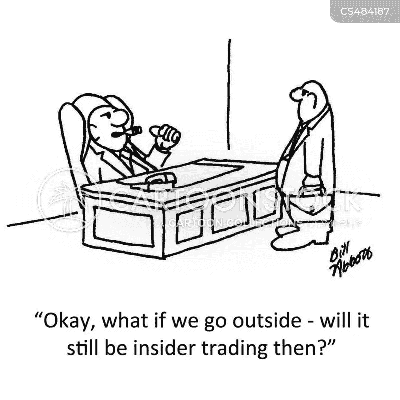

# 共同基金投资组合模型——圣杯第二部分

> 原文：<https://medium.com/coinmonks/model-mutual-fund-portfolio-holy-grail-part-ii-589197325167?source=collection_archive---------7----------------------->

亲爱的朋友们，圣诞快乐，一如既往地兴奋于将我们关于共同基金的讨论推向实际实施……..今天让我们来讨论一下第二类投资者。在上一篇文章中，我们讨论了一些实用而又很酷的建议，适用于我们这一代人，他们雄心勃勃，但可能没有一笔钱或一份固定的有薪工作来开始小酌一杯。对他们来说，一个突出的选择是投资交易所交易基金(ETF)和指数基金，因为它们灵活，易于投资，最重要的是最低资本要求。我确信，我们的许多年轻读者会利用这个选项来开始他们在这个领域的旅程，并且至少会有更多的人更深入地探索这个主题。

伙计们，现在是时候看看最大的投资群体、**了，他们年龄在 30 至 60 岁之间，大多已婚，有或没有孩子和/或年迈的父母，收入稳定，但必须为未来的雨天以及计划支出(如子女的高等教育和婚姻、建造房子等)储蓄，同时为退休后的生活储蓄一些**。在我们开始讨论这个群体的投资选择之前，让我们先了解一下……这个群体最常见的特征是什么

1.这一群体中的大多数人会考虑他们的工作和职业生涯，并会努力工作，延长工作时间，以推进成功的阶梯。这几乎不会让他们有时间进行投资研究。

2.就年龄而言，你越年轻……很有可能，要么你想买一辆你梦想中的自行车…..汽车…..笔记本电脑或想和朋友一起去异国度假。简而言之，你更有可能花掉这笔钱，而不是存起来。可能只有储蓄是因为所得税负债。

3.处于这个年龄段中间的人是最认真的投资者。因为他们可能已经意识到，他们需要为未来的需要而储蓄，如医疗费用、子女的婚姻/教育或退休后的需求。

4.这一类别中的大多数人将为消费贷款、房屋贷款等支付 EMIs(相当于每月分期付款),这通常会超过 SIP 金额或储蓄部分。

5.几乎所有人都将向 PPFs(公共公积金)或养老基金缴款，对许多人来说，这笔钱以及第 80C 节的其他工具(节税工具)将是他们唯一的储蓄。

6.总之…..所有这类人**都有固定的月收入** ……。**计划支出** …..**渴望消费品提升生活品质……一些计划的或**附带的投资**主要作为 PPF 或养老基金的一部分……**渴望**或**担忧储蓄**用于未来大额支出，如买房、子女教育或结婚等。**

这或多或少地总结了你每月的财务报表、原因以及你可能有兴趣存钱的原因..请增减您的具体细节。这肯定会有帮助…..如果你能创建一个 Excel 表格……或者简单地把它们记在一张纸上，保存好以备将来参考。

这个练习的目的是计算出你的潜在收入、平均支出和计划投资的能力。除非你们中的一个人赢得彩票或遗产，否则一次性投资的机会很小，因此，我们将更多地关注定期投资，而不是一次性投资。

**免责声明**——不像许多其他人认为**保险**、**养老基金、PPFs 或节税**是储蓄的一部分，我更愿意将它们视为**支出的一部分，**因为它们实际上减少了手头的钱**。一个恰当的例子是…你有没有把减税看作是你对国家建设的贡献，从而自愿把钱交给政府？？？？？如果不是，那么按照同样的逻辑……保险、PPF 和养老基金将被视为保障你的老年需求，因此，你应该认为在你退休或超过挣钱年龄之前，你无法获得它们。虽然我也想在这门课上加入节税工具…..这可能会给很多人留下很少的空间，而且无论如何……..强制锁定期(最少 3 年)过后，钱就是你的了，你想怎么做就怎么做。**

好了……圣杯现在……让我们一步一步开始

**在养老基金/PPF 上投资多少** —第一步是现实地决定你需要多少养老金，并相应地加入政府国民养老金计划或其他养老金计划。计算你未来可能支出的最简单的方法是用医疗费用代替孩子教育的列标题，并去掉正在支付的租金或老人护理费用。请慷慨地增加或删除你能想象的任何其他费用。不要在这上面浪费太多时间，因为无论如何，这只是一个估计。你得出的数字就是你退休时需要的钱，如果它没有贬值的话。因此，现在加上每年 6%的复合折旧，为你的退休做准备。例如，如果我计算的数字是 10，000 卢比/并且我计划在 10 年后退休……考虑到 6%的复合通货膨胀……10 年后，我需要 17908 卢比来支付我的所有费用。如果这对你来说太复杂了……..干脆 10 年钱翻倍…..15 年 3 次，以此类推……

现在，相应地选择养老金计划，并将缴费金额添加到支出中。请为 PPF 做一个类似的练习。目标数字至少是退休时每月支出数字的 10 倍(如上计算)。

**保险**——这是一个有争议的话题……同样，与普遍的看法相反……..我会说，严格地把这看作是一项支出，那也是…**应该尽量减少的开支**。我不是说有争议吗……哈……哈……..哈。但是，严肃地说……这是一门学科，它需要成熟和领域知识。我只想说……无论你心目中的保险金额是多少……**购买定期存款，不要购买养老或退款保单**。对于一个亿的人寿保险，定期计划保费可以低至 4000 卢比。不是吗？其余指定用于保险的钱是你的投资。或许，在这个系列之后，我也会讨论这个话题…..更详细地说。

随着有尊严生活的未来得到保障，并购买了“Life ke saath bhi and Life ke baad bhi”保险……是时候为那辆车梦想了。自行车…房子还是梦想中的假期。也许还有一个关于孩子教育和婚姻的计划……

但是，钱在哪里？？？？？？？？还有剩下的吗？？？？？？……哈……哈……哈，这些是我从年轻人到即将退休的人听到的最常见的问题。经济上富裕…或者刚开始挣钱的人。因此，现在，纪律和明智投资的力量来了。

因为我没有固定的收入，也没有承担任何经济责任，依赖于我的父母，所以我遵循这样的原则，无论何时…..进入我的账户—需要根据资金规模进行投资。对于成年人来说，我建议，无论你的账户在月底还有多少余额，都应该在你拿到工资的那一天进行投资。即使数额不大，也要遵守这条规则。此后，每个季度都要对这些小额投资进行审核……如果有必要，会转向更好、更安全的选择。

**我应该存多少钱**——这个问题没有直接的答案，因为这取决于你的工资等级和年龄/家庭规模。但是根据经验法则……扣除保险、PPF 和养老基金……..你应该努力把手头工资或收入的至少 10%存起来。不要烦恼…..如果你不能满足这条线……只要专注、自律，最重要的是意识到需求和机会。我经常听我父亲说……他一年前勉强存下的钱……现在他一个月就能存下。关键是，在满足日常生活中所有必要的开支后，尽可能多地投资。现在过上幸福和满足的生活和将来过上富足的生活同样重要。那么，你想用什么样的数字来构建你未来的梦想呢？？？？？请考虑一下，请…请……请……先过一遍基本财务规划的步骤，承诺任何数字，因为这些步骤将为你的财务迪拜塔奠定基石。

伙计们，我真诚地希望你们喜欢这个，就像我喜欢写下来一样。如果你喜欢这些内容，请点击左下角的“鼓掌”按钮来表达你的感谢，如果你是新访客，也不要忘记点击页面右上角的“关注”按钮来订阅。请随意与你所爱的人分享这篇文章，谁知道…你可能是某人获得财务自由以追求他们生活梦想的催化剂。

这就是这篇文章的全部内容。我将在下周日回来，通过查看资产类别之间的推荐分配，平衡风险与回报，以及最重要的是管理投资组合中的一些流动性以度过计划外支出和紧急情况，来进一步讨论这一主题。伙计们。请继续关注更多……..

> 加入 Coinmonks [电报频道](https://t.me/coincodecap)和 [Youtube 频道](https://www.youtube.com/c/coinmonks/videos)了解加密交易和投资

## 也阅读

 [## 杠杆代币[多头代币]终极指南

### 杠杆化令牌是具有杠杆化风险敞口的 ERC20 令牌，不考虑保证金、要求、管理…

medium.com](/coinmonks/leveraged-token-3f5257808b22)  [## 最佳加密交易所| 2021 年十大加密货币交易所

### 编辑描述

blog.coincodecap.com](https://blog.coincodecap.com/crypto-exchange)  [## 2021 年最佳加密交换平台| CoinCodeCap

### 编辑描述

blog.coincodecap.com](https://blog.coincodecap.com/best-swap-platforms)  [## 2021 年最佳加密借贷平台| 6 大比特币借贷平台

### 获得比特币和其他加密货币的最佳贷款利率

medium.com](/coinmonks/top-5-crypto-lending-platforms-in-2020-that-you-need-to-know-a1b675cec3fa)  [## 2021 年 6 大最佳硬件钱包|顶级加密硬件钱包[更新]

### 最好的加密货币硬件钱包是绝对必要的。我们将在 NGRAVE、Ledger Nano X 和…

medium.com](/coinmonks/the-best-cryptocurrency-hardware-wallets-of-2020-e28b1c124069)  [## 2021 年最佳免费加密交易机器人

### 2021 年币安、比特币基地、库币和其他密码交易所的最佳密码交易机器人。四进制，位间隙…

medium.com](/coinmonks/crypto-trading-bot-c2ffce8acb2a)