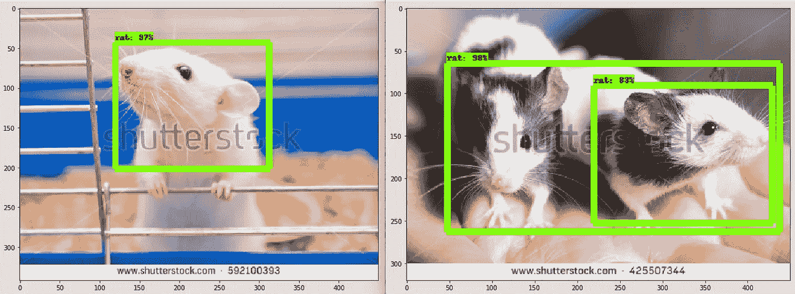

# 第 2 部分，共 3 部分:建模—在 Mac 上使用 tensorflow 的对象检测模型进行迁移学习

> 原文：<https://medium.com/coinmonks/modelling-transfer-learning-using-tensorflows-object-detection-model-on-mac-692c8609be40?source=collection_archive---------1----------------------->

## 使用 GCloud 机器学习引擎



本教程是这里描述的对象检测项目[的延续](/coinmonks/part-1-2-step-by-step-guide-to-data-preparation-for-transfer-learning-using-tensorflows-object-ac45a6035b7a)，我试图创建一个对象检测器来识别老鼠。

## 先决条件

*   训练记录和测试记录([链接](/@viviennediegoencarnacion/part-1-2-step-by-step-guide-to-data-preparation-for-transfer-learning-using-tensorflows-object-ac45a6035b7a))
*   工作 tensorflow 环境([链接](/@viviennediegoencarnacion/how-to-setup-tensorflow-object-detection-on-mac-a0b72fbf470a)
*   GCP 帐户、存储桶、GPU 分配和 gsutil ( [链接](/@viviennediegoencarnacion/step-by-step-guide-to-get-started-with-google-cloud-platform-for-data-scientists-76e0f5834650))

# 第一步。上传 GCP 桶的 tfrecord 数据

## 创建主文件夹

在 GCP 仓库创建一个`bucket`。这个文件夹将包含我们的机器学习项目所需的所有文件。图 1 显示
`gs://vivienne-artifacts/object_detection_rat/`
是这个机器学习练习的主目录。如果您对上述说明感到困惑，请检查此处的。


Figure 1\. Main folder for machine learning project

## 上传 TFRecord 文件

在`gs://vivienne-artifacts/bject_detectection_rat/`下，我创建了一个`data/`子文件夹。这将包含培训所需的所有数据。现在，让我们只上传`train.record`和`test.record`文件([链接](/coinmonks/part-1-2-step-by-step-guide-to-data-preparation-for-transfer-learning-using-tensorflows-object-ac45a6035b7a))。


Figure 2\. tfrecord files: train.record, and test.record

# 第二步。在 GCP 铲斗上上传模型数据

从[这里](https://github.com/tensorflow/models/blob/master/research/object_detection/g3doc/detection_model_zoo.md)阅读关于预训练的模型，然后选择一个，下载选择的模型，然后解压下载的文件。确保您的决定将计算时间、硬件要求、准确性等因素考虑在内。

## 可可模特

从 [COCO 数据集](http://cocodataset.org/)中训练模型。COCO 代表上下文中的常见对象。


Figure 2\. COCO models

## 基蒂模型

从 [Kitti 数据集](http://www.cvlibs.net/datasets/kitti/)中训练模型。数据集是卡尔斯鲁厄理工学院和芝加哥丰田理工学院的项目


Figure 3\. KITTI models

## 打开图像模型

从[开放图像数据集](https://storage.googleapis.com/openimages/web/index.html)中训练模型。


Figure 4\. Open Images models

## AVA v2.1 车型

我没有足够的关于 AVA 模型的细节，但是为了完整起见，我把它放在这里。


Figure 5\. AVA v2.1 models

## 将训练好的模型上传到 GCP 铲斗

对于一个简单的项目，如**老鼠探测器**，我选择了`ssd_mobilenet_v1_coco`。如果你有更多的类来达到(可能)更好的结果，我推荐你使用更复杂的。从`ssd_mobilenet_v1_coco_11_06_2017.tgz`中提取的文件有:

```
graph.pbtxt                    # 22.3 MB
model.ckpt.data-00000-of-00001 # 109.2 MB
frozen_inference_graph.pb      # 29.2 MB
model.ckpt.meta                # 10.4MB
model.ckpt.index               # 27 KB
```

上传
`gs://vivienne-artifacts/bject_detectection_rat/data`中的所有`model.ckpt.*`文件。此时，我们的`data`文件夹应该包含以下文件:


Figure 6\. Uploaded model files

# 第三步。在 GCP 桶上上传标签地图

## 创建标签地图

标签映射是您的类与其相应的标识号(id)的映射。请注意，您的身份证号码应该以 1 开头。图 6 显示了 rat object detector 练习的相应标签图。您可以使用任何文件名保存标签映射文件，只要扩展名为`.pbtxt`。如果你需要更多的标签地图的例子，看看[这个](https://github.com/tensorflow/models/tree/master/research/object_detection/data)吧。


Figure 7\. Contents of labelmap.pbtxt

将标签地图上传到 GCP 桶的`data`文件夹中。


Figure 8\. Uploaded label map on GCP

# 第四步。配置有效的对象检测管道

## 下载对象检测管道(配置文件)

每个模型都有相应的对象检测管道，可以在这里[下载，或者在
下载，假设你克隆了](https://github.com/tensorflow/models/tree/master/research/object_detection/samples/configs) [tensorflow 模型库](https://github.com/tensorflow/models)。

由于我选择了`ssd_mobilenet_v1_coco`，我将使用`ssd_mobilenet_v1_coco.config`。


Figure 9\. All config files

[tensor flow 模型的本](https://github.com/tensorflow/models/blob/master/research/object_detection/g3doc/configuring_jobs.md)文档对配置文件有更详细的解释。配置文件的简要说明是，通过它你可以改变`model`、`train_config`、`eval_config`、`train_input_config`和`eval_input_config`的配置。

## 编辑模型{ }部分

在`model`配置下编辑`num_classes`零件。对于鼠检测器练习，这应该是`num_classes: 1`。

```
# Sample `model`model {
  ssd {
    num_classes: 1
    box_coder {
      faster_rcnn_box_coder {
        y_scale: 10.0
        x_scale: 10.0
        height_scale: 5.0
        width_scale: 5.0
      }
    }
    matcher {
      argmax_matcher {
        matched_threshold: 0.5
        unmatched_threshold: 0.5
        ignore_thresholds: false
        negatives_lower_than_unmatched: true
        force_match_for_each_row: true
      }
    }
    similarity_calculator {
      iou_similarity {
      }
    }
    anchor_generator {
      ssd_anchor_generator {
        num_layers: 6
        min_scale: 0.2
        max_scale: 0.95
        aspect_ratios: 1.0
        aspect_ratios: 2.0
        aspect_ratios: 0.5
        aspect_ratios: 3.0
        aspect_ratios: 0.3333
      }
    }
    image_resizer {
      fixed_shape_resizer {
        height: 300
        width: 300
      }
    }
    box_predictor {
      convolutional_box_predictor {
        min_depth: 0
        max_depth: 0
        num_layers_before_predictor: 0
        use_dropout: false
        dropout_keep_probability: 0.8
        kernel_size: 1
        box_code_size: 4
        apply_sigmoid_to_scores: false
        conv_hyperparams {
          activation: RELU_6,
          regularizer {
            l2_regularizer {
              weight: 0.00004
            }
          }
          initializer {
            truncated_normal_initializer {
              stddev: 0.03
              mean: 0.0
            }
          }
          batch_norm {
            train: true,
            scale: true,
            center: true,
            decay: 0.9997,
            epsilon: 0.001,
          }
        }
      }
    }
    feature_extractor {
      type: 'ssd_mobilenet_v1'
      min_depth: 16
      depth_multiplier: 1.0
      conv_hyperparams {
        activation: RELU_6,
        regularizer {
          l2_regularizer {
            weight: 0.00004
          }
        }
        initializer {
          truncated_normal_initializer {
            stddev: 0.03
            mean: 0.0
          }
        }
        batch_norm {
          train: true,
          scale: true,
          center: true,
          decay: 0.9997,
          epsilon: 0.001,
        }
      }
    }
    loss {
      classification_loss {
        weighted_sigmoid {
        }
      }
      localization_loss {
        weighted_smooth_l1 {
        }
      }
      hard_example_miner {
        num_hard_examples: 3000
        iou_threshold: 0.99
        loss_type: CLASSIFICATION
        max_negatives_per_positive: 3
        min_negatives_per_image: 0
      }
      classification_weight: 1.0
      localization_weight: 1.0
    }
    normalize_loss_by_num_matches: true
    post_processing {
      batch_non_max_suppression {
        score_threshold: 1e-8
        iou_threshold: 0.6
        max_detections_per_class: 100
        max_total_detections: 100
      }
      score_converter: SIGMOID
    }
  }
}
```

## 编辑列车配置{ 0 }部分

寻找带有`PATH_TO_BE_CONFIGURED/`的零件，并对其进行相应的编辑。对于`train_config{}`部分，我也编辑了`num_steps`。

```
# Sample `train_config`train_config: {
  batch_size: 24
  optimizer {
    rms_prop_optimizer: {
      learning_rate: {
        exponential_decay_learning_rate {
          initial_learning_rate: 0.004
          decay_steps: 800720
          decay_factor: 0.95
        }
      }
      momentum_optimizer_value: 0.9
      decay: 0.9
      epsilon: 1.0
    }
  }
  fine_tune_checkpoint: "gs://vivienne-artifacts/object_detection_rat/data/model.ckpt"
  from_detection_checkpoint: true
  # Note: The below line limits the training process to 200K steps, which we
  # empirically found to be sufficient enough to train the pets dataset. This
  # effectively bypasses the learning rate schedule (the learning rate will
  # never decay). Remove the below line to train indefinitely.
  num_steps: 20000
  data_augmentation_options {
    random_horizontal_flip {
    }
  }
  data_augmentation_options {
    ssd_random_crop {
    }
  }
}
```

## 编辑火车 _ 输入 _ 阅读器{ }部分

寻找带有`PATH_TO_BE_CONFIGURED/`的零件，并对其进行相应的编辑。

```
# Sample `train_input_reader`train_input_reader: {
  tf_record_input_reader {
    input_path: "gs://vivienne-artifacts/object_detection_rat/data/train.record"
  }
  label_map_path: "gs://vivienne-artifacts/object_detection_rat/data/labelmap.pbtxt"
}
```

## 编辑 eval_config 部分

我将`num_examples`编辑为等于 test.record 项目的总数。

```
# Sample `eval_config` eval_config: {
  # num_examples: 8000
  num_examples: 68
  metrics_set: "coco_detection_metrics"
  # Note: The below line limits the evaluation process to 10 evaluations.
  # Remove the below line to evaluate indefinitely.
  max_evals: 10
}
```

## 编辑评估输入阅读器{}部分

寻找带有`PATH_TO_BE_CONFIGURED/`的零件，并对其进行相应的编辑。

```
# Sample eval_input_readereval_input_reader: {
  tf_record_input_reader {
    input_path: "gs://vivienne-artifacts/object_detection_rat/data/test.record"
  }
  label_map_path: "gs://vivienne-artifacts/object_detection_rat/data/labelmap.pbtxt"
  shuffle: false
  num_readers: 1
}
```

## 上传 GCP 铲斗上的配置文件

为避免混淆，将文件另存为`ssd_mobilenet_v1_coco.config`并上传至 GCP 桶。

# 第五步。准备云配置文件(cloud.yaml)

在这一点上，你应该有 GCP 的 GPU 分配。如果你对此不熟悉，或者还没有分配，这里的是一个循序渐进的教程来帮助你。图 16 显示我在 us-west1 上有 8 个 NVIDIA K80 GPUs 分配。


Figure 10\. GPU allocation on GCP

现在我们准备编辑我们的`cloud.yaml`文件。图 17 显示了我将在 rat 对象检测器练习中使用的云配置文件。`workerType`和`parameterServerCount`的总和至少应该与您拥有的 GPU 分配相等。查看[此处](https://cloud.google.com/ml-engine/reference/rest/v1/projects.jobs)了解更多参数。

```
# Sample cloud.yamltrainingInput:
  runtimeVersion: "1.8"
  scaleTier: CUSTOM
  masterType: standard_gpu
  workerCount: 2
  workerType: standard_gpu
  parameterServerCount: 1
  parameterServerType: standard
```

*可选:将此上传到 google bucket 以备将来参考*

记住`cloud.yaml`的本地文件路径，因为我们稍后会用到它。出于本教程的目的，让我们假设我的`cloud.yaml`文件的本地路径在`/PATH/TO/cloud.yaml`中。

# 第六步。安装 COCO API

*请注意，这一部分经过编辑，以适应我在此过程中遇到的错误。* [巨大的感谢*这个*](https://github.com/tensorflow/models/issues/2739) *的来源。*

通过运行
`git clone https://github.com/cocodataset/cocoapi.git`在你的机器上克隆`cocoapi`项目


Figure 11\. cocoapi repository

复制`/PATH/TO/cocoapi/PythonAPI/`中的`/PATH/TO/cocoapi/common`文件夹。


Figure 12\. PythonAPI file directory

编辑`/PATH/TO/cocoapi/PythonAPI/setup.py`以包含下面的代码。

```
from setuptools import setup, Extension
import numpy as np# To compile and install locally run "python setup.py build_ext --inplace"
# To install library to Python site-packages run "python setup.py build_ext install"ext_modules = [
    Extension(
        'pycocotools._mask',
        sources=['common/maskApi.c', 'pycocotools/_mask.pyx'],
        include_dirs = [np.get_include(), 'common'],
        extra_compile_args=['-Wno-cpp', '-Wno-unused-function', '-std=c99'],
    )
]setup(
    name='pycocotools',
    packages=['pycocotools'],
    package_dir = {'pycocotools': 'pycocotools'},
    install_requires=[
        'setuptools>=18.0',
        'cython>=0.27.3',
        'matplotlib>=2.1.0'
    ],
    version='2.0',
    ext_modules= ext_modules
)
```

编译`PythonAPI`

```
cd /PATH/TO/cocoapi/PythonAPI
make
```

创建一个`/PATH/TO/cocoapi/PythonAPI`的`tar.gz`压缩文件，命名为`pycocotools-2.0.tar.gz`对于 macOS，需要运行

```
tar -zcvf pycocotools-2.0.tar.gz /PATH/TO/cocoapi/PythonAPI
```

创建文件夹`/PATH/TO/tensorflow/models/research/cocoapi/`并将新压缩的`pycocotools-2.0.tar.gz`放入其中。

# 第七步。编译 Protobuf

在端子上，`brew install protobuf`。对于我的机器，这个下载了**proto buf-3 . 6 . 0 . high _ Sierra . bottle . tar . gz**。从`tensorflow/models/research/`目录运行以下程序

```
# From tensorflow/models/research/
protoc object_detection/protos/*.proto --python_out=.
```

如果没有错误和消息，说明 protobuf 编译正确。

# 第八步。包装物体检测

打包 tensorflow 对象检测 API 及其 TF-Slim 依赖项，以便在 GCP 的 Cloud ML 上运行。这里假设我们在本地机器上有一个工作的 tensorflow 环境。[这里的](/@viviennediegoencarnacion/how-to-setup-tensorflow-object-detection-on-mac-a0b72fbf470a)是对它的一个很好的引导。为此，请转到克隆的 tensorflow 模型存储库，并执行以下命令:

```
# From tensorflow/models/research/
python setup.py sdist
(cd slim && python setup.py sdist)
```

# 第九步。向 GCP 提交培训和评估工作

## 用于培训的数据

概括地说，我们的 GCP 存储桶包含以下文件:

```
# from gs://vivienne-artifacts/object_detection_rat/datalabelmap.pbtxt
model.ckpt.data-00000-of-00001
model.ckpt.index
model.ckpt.meta
ssd_mobilenet_v1_coco.config
test.record
train.record
```

我们在`/PATH/TO/cloud.yaml`本地保存了`cloud.yaml`文件。

## 提交作业

为了提交机器学习**培训作业**，你需要运行一个`gcloud ml-engine job submit`代码。下面是一个例子:

```
# From tensorflow/models/research
gcloud ml-engine jobs submit training object_detection_`date +%s` \
    --runtime-version 1.8 \
    --job-dir=gs://vivienne-artifacts/object_detection_rat/train \
    --packages dist/object_detection-0.1.tar.gz,slim/dist/slim-0.1.tar.gz,cocoapi/pycocotools-2.0.tar.gz \
    --module-name object_detection.train \
    --region us-east1 \
    --config /Users/vivi/Documents/Github/rat_object_detection/cloud.yaml \
    -- \
    --train_dir=gs://vivienne-artifacts/object_detection_rat/train \
    --pipeline_config_path=gs://vivienne-artifacts/object_detection_rat/data/ssd_mobilenet_v1_coco.config
```

为了提交机器学习**评估作业**，你需要运行一个`gcloud ml-engine job submit`代码。下面是一个例子:

```
gcloud ml-engine jobs submit training object_detection_eval_`date +%s` \
    --runtime-version=1.8 \
    --job-dir=gs://vivienne-artifacts/object_detection_rat/train \
    --packages dist/object_detection-0.1.tar.gz,slim/dist/slim-0.1.tar.gz,cocoapi/pycocotools-2.0.tar.gz \
    --module-name object_detection.eval \
    --region us-east1 \
    -- \
    --checkpoint_dir=gs://vivienne-artifacts/object_detection_rat/train \
    --eval_dir=gs://vivienne-artifacts/object_detection_rat/eval \
    --pipeline_config_path=gs://vivienne-artifacts/object_detection_rat/data/ssd_mobilenet_v1_coco.config
```

你可以去`GCP Console > ML Engine > Jobs`查看你的进度和/或日志。等到培训和评估完成。


Figure 13\. Successful training, and evaluation jobs

谢谢！

# 来源

*   [https://medium . com/@ viviennediegoencarnacion/part-1-2-step-by-step-guide-to-data-preparation-for-transfer-learning-using-tensor flows-object-ac45a 6035 b7a](/@viviennediegoencarnacion/part-1-2-step-by-step-guide-to-data-preparation-for-transfer-learning-using-tensorflows-object-ac45a6035b7a)
*   [https://medium . com/@ viviennediegoencarnacion/how-to-setup-tensor flow-object-detection-on-MAC-a 0 b 72 fbf 470 a](/@viviennediegoencarnacion/how-to-setup-tensorflow-object-detection-on-mac-a0b72fbf470a)
*   [https://medium . com/@ viviennediegoencarnacion/step-by-step-step-guide-to-started-with-Google-cloud-platform-for-data-scientists-76e0f 5834650](/@viviennediegoencarnacion/step-by-step-guide-to-get-started-with-google-cloud-platform-for-data-scientists-76e0f5834650)
*   [https://github . com/tensor flow/models/blob/master/research/object _ detection/g3doc/detection _ model _ zoo . MD](https://github.com/tensorflow/models/blob/master/research/object_detection/g3doc/detection_model_zoo.md)
*   [https://github . com/tensor flow/models/blob/master/research/object _ detection/g3doc/configuring _ jobs . MD](https://github.com/tensorflow/models/blob/master/research/object_detection/g3doc/configuring_jobs.md)
*   [https://github.com/tensorflow/models/issues/1844](https://github.com/tensorflow/models/issues/1844)
*   [https://cloud . Google . com/ml-engine/reference/rest/v1/projects . jobs](https://cloud.google.com/ml-engine/reference/rest/v1/projects.jobs)
*   [https://github . com/tensor flow/models/blob/master/research/object _ detection/g3doc/running _ on _ cloud . MD](https://github.com/tensorflow/models/blob/master/research/object_detection/g3doc/running_on_cloud.md)
*   [https://github . com/tensor flow/models/tree/master/research/object _ detection/samples/configs](https://github.com/tensorflow/models/tree/master/research/object_detection/samples/configs)
*   [https://github.com/tensorflow/models](https://github.com/tensorflow/models)
*   [https://super user . com/questions/46512/create-a-tar-file-for-compressing-files-and-directory-on-MAC-OS-x](https://superuser.com/questions/46512/create-a-tar-file-for-compressing-files-and-directories-on-mac-os-x)

> 加入 Coinmonks [电报频道](https://t.me/coincodecap)和 [Youtube 频道](https://www.youtube.com/c/coinmonks/videos)获取每日[加密新闻](http://coincodecap.com/)

## 另外，阅读

*   [复制交易](/coinmonks/top-10-crypto-copy-trading-platforms-for-beginners-d0c37c7d698c) | [加密税务软件](/coinmonks/crypto-tax-software-ed4b4810e338)
*   [网格交易](https://coincodecap.com/grid-trading) | [加密硬件钱包](/coinmonks/the-best-cryptocurrency-hardware-wallets-of-2020-e28b1c124069)
*   [密码电报信号](http://Top 4 Telegram Channels for Crypto Traders) | [密码交易机器人](/coinmonks/crypto-trading-bot-c2ffce8acb2a)
*   [最佳加密交易所](/coinmonks/crypto-exchange-dd2f9d6f3769) | [最佳加密交易所](/coinmonks/bitcoin-exchange-in-india-7f1fe79715c9)
*   开发人员的最佳加密 API
*   最佳[密码借贷平台](/coinmonks/top-5-crypto-lending-platforms-in-2020-that-you-need-to-know-a1b675cec3fa)
*   [SmithBot 评论](https://coincodecap.com/smithbot-review) | [4 款最佳免费开源交易机器人](https://coincodecap.com/free-open-source-trading-bots)
*   [比特币基地僵尸程序](/coinmonks/coinbase-bots-ac6359e897f3) | [AscendEX 审查](/coinmonks/ascendex-review-53e829cf75fa) | [OKEx 交易僵尸程序](/coinmonks/okex-trading-bots-234920f61e60)
*   [如何在印度购买比特币？](/coinmonks/buy-bitcoin-in-india-feb50ddfef94) | [WazirX 评论](/coinmonks/wazirx-review-5c811b074f5b)
*   [加密交易机器人](/coinmonks/crypto-trading-bot-c2ffce8acb2a) | [Probit 审查](https://coincodecap.com/probit-review)
*   [隐翅虫替代品](/coinmonks/cryptohopper-alternatives-d67287b16d27) | [HitBTC 审查](/coinmonks/hitbtc-review-c5143c5d53c2)
*   [CBET 点评](https://coincodecap.com/cbet-casino-review) | [库币 vs 比特币基地](https://coincodecap.com/kucoin-vs-coinbase)
*   [折叠 App 回顾](https://coincodecap.com/fold-app-review) | [Kucoin 交易机器人](/coinmonks/kucoin-trading-bot-automate-your-trades-8cf0ca2138e0)
*   [免费加密信号](/coinmonks/free-crypto-signals-48b25e61a8da) | [加密交易机器人](/coinmonks/crypto-trading-bot-c2ffce8acb2a)
*   杠杆代币的终极指南