# 使用 Hyperledger Fabric 2.0 实现智能合同的现代方法

> 原文：<https://medium.com/coinmonks/modern-approach-to-smart-contracts-with-hyperledger-fabric-2-0-664b0b0d8592?source=collection_archive---------1----------------------->

Hyperledger fabric 已经成为企业构建区块链解决方案的首选之一，并且通过自身的发展已经走过了漫长的道路，以构建强大而智能的系统

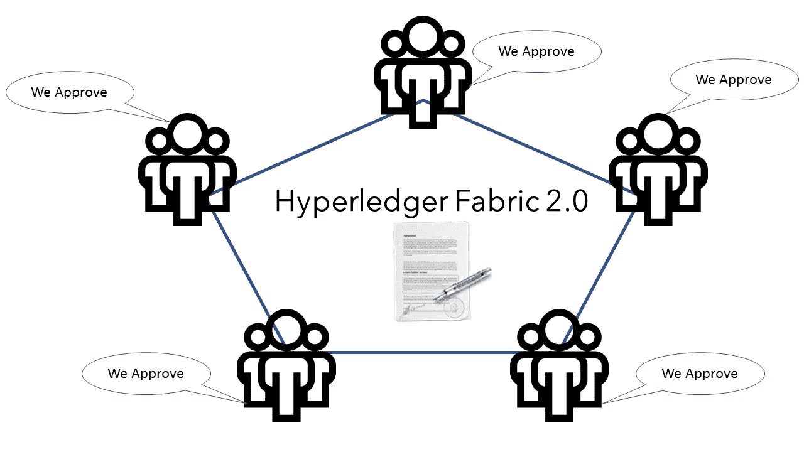

随着最近 2.0 版本的发布，Hyperledger fabric 再次提高了[区块链](https://blog.coincodecap.com/tag/blockchain/)系统的标准，因为它为用户和运营商提供了重要的新功能和变化。

Fabric v2.0 包括对新应用和隐私模式的支持，围绕[智能合同](https://decentraland.org/whitepaper.pdf)的增强治理，以及操作节点的新选项。使用基于 Alpine 的 docker 映像，fabric 映像变得更小，提供了更快的下载和启动时间，并在主机系统上占用更少的磁盘空间

这次改变的主要修改和令人兴奋的特性之一是**链码生命周期**。Fabric v2.0 为[智能契约](https://decentraland.org/whitepaper.pdf)引入了去中心化治理，通过一个新的流程在您的对等体上安装链码，并在一个通道上启动它

在 Fabric 的早期 1.x 版本中，一个组织可以在实例化链码时为所有其他渠道成员设置链码的参数(例如认可策略),而其他组织只能选择拒绝安装链码，因此不能参与调用链码的事务。新的结构链码生命周期是一个允许多个组织在链码可用于渠道之前就其操作方式达成一致的过程。它更加灵活，因为它既支持集中式信任模型(如前一生命周期模型)，也支持分散式模型，后者要求足够数量的组织在链码在渠道上激活之前就认可策略和其他细节达成一致。

因此，今天在本文中，我们将探讨在 Hyperledger 结构网络上部署链码的新方法

首先，我已经在运营一个 **byfn** 网络，频道和主播同行已经就位

因此，在本文中，我们将从在我们的网络上安装和定义链码的步骤开始

借助新的链码部署方法，渠道成员需要就建立链码监管的链码定义达成一致，为此，我们需要在链码安装到我们的同行之前对其进行打包。对于我们创建的每个包，您需要提供一个链码包标签作为链码的描述

**步骤 1** : **打包**，在打包 Golang 链码之前，需要出售 Go 依赖项，我们将进入链码文件夹

```
**cd */****opt****/****gopath****/****src****/****github****.****com****/****hyperledger****/****fabric****-****samples****/****chaincode****/****abstore****/****go*
```

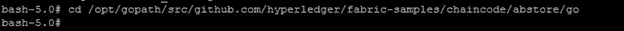

```
*GO111MODULE****=****on go mod vendor*
```

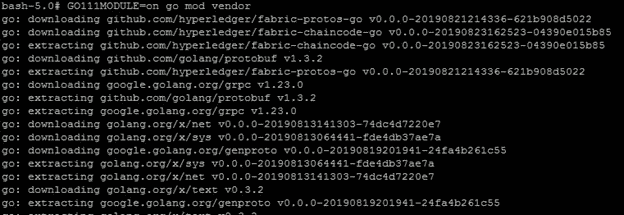

GO111MODULE 将处理我们的链代码的所有打包和依赖性

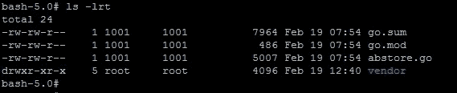

现在让我们用“cd -”返回到之前的目录，并运行下面的命令

```
peer lifecycle chaincode package mycc**.**tar**.**gz **--**path github**.**com**/**hyperledger**/**fabric**-**samples**/**chaincode**/**abstore**/**go**/** **--**lang golang **--**label mycc_1
```

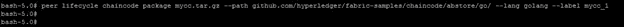

这将打包我们的 Golang 链码，并将创建一个名为 mycc.tar.gz**的链码包，我们可以用它在我们的对等体上安装链码**

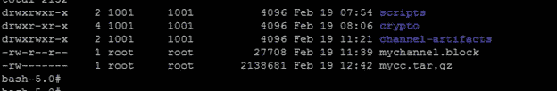

**步骤 2** : **安装 chaincode** ，接下来我们将在 Org1 的 peer0 上安装 chaincode，因为它的环境变量在我们的 cli 中被设置为默认值

```
“peer lifecycle chaincode install mycc**.**tar**.**gz”
```

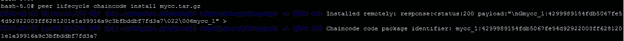

回应:

```
 2020-02-19 12:43:18.379 UTC [cli.lifecycle.chaincode] submitInstallProposal -> INFO 001 Installed remotely: response:<status:200 payload:"\nGmycc_1:4299989154fdb5067fe54d92922003ff6281201e1a39916a9c3bfbddbf7fd3a7\022\006mycc_1" >2020-02-19 12:43:18.379 UTC [cli.lifecycle.chaincode] submitInstallProposal -> INFO 002 Chaincode code package identifier: ***mycc_1:4299989154fdb5067fe54d92922003ff6281201e1a39916a9c3bfbddbf7fd3a7***
```

在一个对等体上安装链码会用我们已安装的链码的包标识符来回应，万一错过了，你也可以用下面的命令检索包标识符

```
peer lifecycle chaincode queryinstalled
```

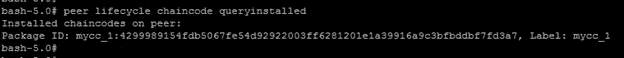

"**mycc _ 1:4299989154 fdb 5067 Fe 54d 92922003 ff 6281201 E1 a 39916 a9 C3 bfbddbf 7 FD 3a 7**"是为我的 chaincode 生成的包 id，对于您来说，该值可能会有所不同，因此请记下它

接下来，我们将在接下来的步骤中需要这个包 ID，所以让我们使用命令将它存储在一个环境变量中:

```
CC_PACKAGE_ID=mycc_1:4299989154fdb5067fe54d92922003ff6281201e1a39916a9c3bfbddbf7fd3a7
```

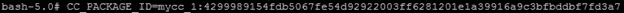

现在让我们在其他对等体上安装 chaincode，我们将为 Org2 的 peer0 设置 peer 环境变量

```
CORE_PEER_MSPCONFIGPATH**=/**opt**/**gopath**/**src**/**github**.**com**/**hyperledger**/**fabric**/**peer**/**crypto**/**peerOrganizations**/**org2**.**example**.**com**/**users**/**Admin@org2**.**example**.**com**/**mspCORE_PEER_ADDRESS**=**peer0**.**org2**.**example**.**com:9051CORE_PEER_LOCALMSPID**=**"Org2MSP"CORE_PEER_TLS_ROOTCERT_FILE**=/**opt**/**gopath**/**src**/**github**.**com**/**hyperledger**/**fabric**/**peer**/**crypto**/**peerOrganizations**/**org2**.**example**.**com**/**peers**/**peer0**.**org2**.**example**.**com**/**tls**/**ca**.**crt
```

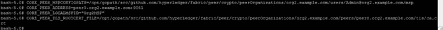

然后重复相同的命令来安装 chaincode

命令:

```
peer lifecycle chaincode install mycc**.**tar**.**gz
```

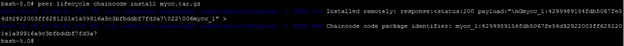

回应:

```
bash-5.0# peer lifecycle chaincode install mycc.tar.gz2020-02-19 12:56:41.970 UTC [cli.lifecycle.chaincode] submitInstallProposal -> INFO 001 Installed remotely: response:<status:200 payload:"\nGmycc_1:4299989154fdb5067fe54d92922003ff6281201e1a39916a9c3bfbddbf7fd3a7\022\006mycc_1" >2020-02-19 12:56:41.970 UTC [cli.lifecycle.chaincode] submitInstallProposal -> INFO 002 Chaincode code package identifier: **mycc_1:4299989154fdb5067fe54d92922003ff6281201e1a39916a9c3bfbddbf7fd3a7**
```

请注意，此命令后返回的包标识符与在 Org1 的 peer0 上安装 chaincode 时获得的包标识符相同

**第三步** : **批准链码**，在我们安装软件包后，各个组织需要批准链码定义，其中包括链码治理的重要参数，如认可政策、链码名称、版本。

我们将对 Org1 的 peer0 和 Org2 的 peer0 执行以下命令，所有组织都需要在使用链码之前就定义达成一致

```
peer lifecycle chaincode approveformyorg --channelID $CHANNEL_NAME --name mycc --version 1.0 --init-required --package-id $CC_PACKAGE_ID --sequence 1 --tls true --cafile /opt/gopath/src/github.com/hyperledger/fabric/peer/crypto/ordererOrganizations/example.com/orderers/orderer.example.com/msp/tlscacerts/tlsca.example.com-cert.pem
```

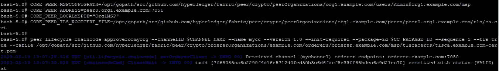

批准被分发给每个组织内的对等方，因此该命令不需要针对组织内的每个对等方。

**步骤 4** : **提交链码**，要继续在 Hyperledger fabric 2.0 的通道上启用链码，而不是实例化链码，我们必须提交链码，这就是区别所在

如果有足够数量的渠道成员批准了链码定义，我们只能将链码提交给渠道，之后任何一个成员都可以将定义提交给渠道。默认情况下，在提交定义之前，大多数渠道成员需要批准该定义。我们还可以通过发出以下查询来检查链码的批准状态:

```
peer lifecycle chaincode checkcommitreadiness --channelID $CHANNEL_NAME --name mycc --version 1.0 --init-required --sequence 1 --tls true --cafile /opt/gopath/src/github.com/hyperledger/fabric/peer/crypto/ordererOrganizations/example.com/orderers/orderer.example.com/msp/tlscacerts/tlsca.example.com-cert.pem --output json
```

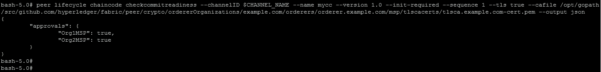

如我们所见，两个渠道成员都批准了链码，我们可以继续在渠道上提交链码，这也是一个一次性流程，因此我们可以从 Org1 或 Org2 对等方进行提交

```
peer lifecycle chaincode commit -o orderer.example.com:7050 --channelID $CHANNEL_NAME --name mycc --version 1.0 --sequence 1 --init-required --tls true --cafile /opt/gopath/src/github.com/hyperledger/fabric/peer/crypto/ordererOrganizations/example.com/orderers/orderer.example.com/msp/tlscacerts/tlsca.example.com-cert.pem --peerAddresses peer0.org1.example.com:7051 --tlsRootCertFiles /opt/gopath/src/github.com/hyperledger/fabric/peer/crypto/peerOrganizations/org1.example.com/peers/peer0.org1.example.com/tls/ca.crt --peerAddresses peer0.org2.example.com:9051 --tlsRootCertFiles /opt/gopath/src/github.com/hyperledger/fabric/peer/crypto/peerOrganizations/org2.example.com/peers/peer0.org2.example.com/tls/ca.crt
```

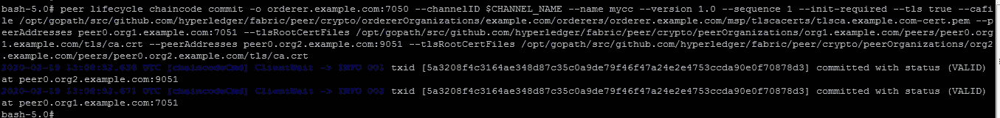

当我们看到提交成功时，让我们尝试与链代码交互

**第五步**:调用链码

```
peer chaincode invoke -o orderer.example.com:7050 --isInit --tls true --cafile /opt/gopath/src/github.com/hyperledger/fabric/peer/crypto/ordererOrganizations/example.com/orderers/orderer.example.com/msp/tlscacerts/tlsca.example.com-cert.pem -C $CHANNEL_NAME -n mycc --peerAddresses peer0.org1.example.com:7051 --tlsRootCertFiles /opt/gopath/src/github.com/hyperledger/fabric/peer/crypto/peerOrganizations/org1.example.com/peers/peer0.org1.example.com/tls/ca.crt --peerAddresses peer0.org2.example.com:9051 --tlsRootCertFiles /opt/gopath/src/github.com/hyperledger/fabric/peer/crypto/peerOrganizations/org2.example.com/peers/peer0.org2.example.com/tls/ca.crt -c '{"Args":["Init","a","100","b","100"]}' --waitForEvent
```

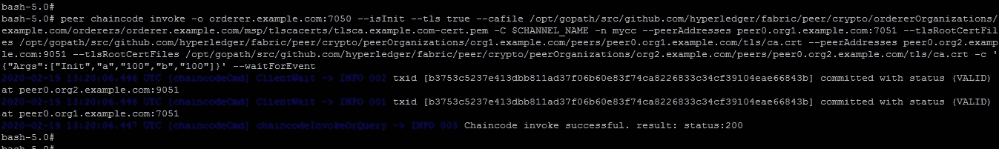

这个命令将启动链码容器

现在我们将查询 chaincode 以确保容器正确启动并且状态数据库被填充。查询的语法如下:

```
peer chaincode query -C $CHANNEL_NAME -n mycc -c '{"Args":["query","a"]}'
```

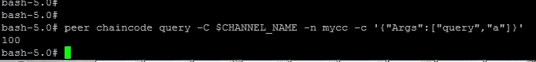

现在让我们用下面的命令将 10 从 a 移动到 b

```
peer chaincode invoke -o orderer.example.com:7050 --tls true --cafile /opt/gopath/src/github.com/hyperledger/fabric/peer/crypto/ordererOrganizations/example.com/orderers/orderer.example.com/msp/tlscacerts/tlsca.example.com-cert.pem -C $CHANNEL_NAME -n mycc --peerAddresses peer0.org1.example.com:7051 --tlsRootCertFiles /opt/gopath/src/github.com/hyperledger/fabric/peer/crypto/peerOrganizations/org1.example.com/peers/peer0.org1.example.com/tls/ca.crt --peerAddresses peer0.org2.example.com:9051 --tlsRootCertFiles /opt/gopath/src/github.com/hyperledger/fabric/peer/crypto/peerOrganizations/org2.example.com/peers/peer0.org2.example.com/tls/ca.crt -c '{"Args":["invoke","a","b","10"]}' --waitForEvent
```


让我们确认一下我们之前的调用是否正确执行。我们用值 100 初始化键 a，并在前面的调用中删除了 10。因此，对 a 的查询应该返回 90。查询的语法如下。

#确保正确设置-C 和-n 标志

```
peer chaincode query -C $CHANNEL_NAME -n mycc -c '{"Args":["query","a"]}'
```

我们应该看到以下内容:

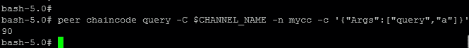

这就是 Hyperledger Fabric 2.0 如何改变了我们在[区块链](https://blog.coincodecap.com/tag/blockchain/)网络上设置链码/智能合同的方式，通过改进审批和托管链码的方法，它增加了一层额外的透明度和信任。加上这种不断的改进和设置区块链系统的详细过程，Hyperledger fabric 真的为数字时代树立了一个标志

感谢阅读:)

> [在您的收件箱中直接获得最佳软件交易](https://coincodecap.com/?utm_source=coinmonks)

[](https://coincodecap.com/?utm_source=coinmonks)