# 在 Hyperledger Fabric v2.2 中修改批量大小

> 原文：<https://medium.com/coinmonks/modifying-the-batch-size-in-hyperledger-fabric-v2-2-3ec2dd779e2b?source=collection_archive---------2----------------------->

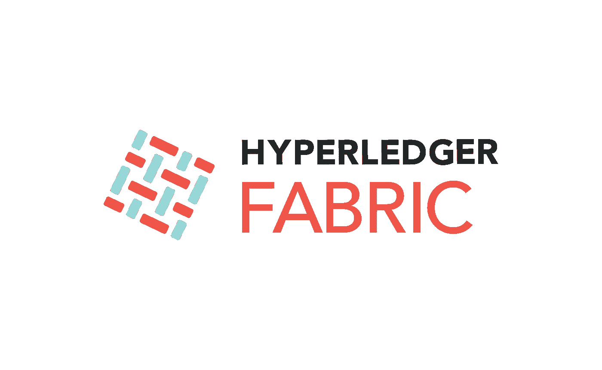

Modifying the Batch Size in Hyperledger Fabric

# 1.概观

批量大小和批量时间是超格织物获得高产量的重要因素之一。这些因素决定了区块链网络的每秒交易量(TPS)。还有一个重要的方面是有效地设计网络。已经观察到，使用 LevelDB 世界状态数据库可以在小批量的情况下实现更高的吞吐量和更低的延迟，尽管在大批量的情况下会失去这种优势。还有其他因素对 TPS 有影响。但是这篇文章更倾向于**我们如何更新运行中的 Hyperleder fabric 网络**的批量大小。我使用 test-network v2.2 来实现。

> ***查看我的*** [***课程在 Hyperledger Fabric 上的部署***](http://bit.ly/hlf-multihost-deployment)

**注意:**更新批量超时的步骤完全相同。

# 2.术语

*   **批量大小-** 定义一个块中交易的**大小**。任何块都不会比`absolute_max_bytes`大，也不会有超过`max_message_count`个事务出现在块内。如果有可能在`preferred_max_bytes`下构造一个块，那么一个块会被过早的切割，大于这个大小的事务会出现在自己的块中。
*   **批量超时**。第一个事务到达后，在切割块之前等待其他事务的时间。减小该值将会改善延迟，但是减小太多可能会降低吞吐量，因为它不允许块填满其最大容量。
*   **最大消息数**:一批允许的最大消息数

# 3.了解渠道更新流程

1.  从 mychannel 获取配置块
2.  将其转换成 JSON 并提取配置部分。
3.  找到您需要修改的配置，在我的例子中，批量大小为 10 = >比如 20。
4.  将两个文件转换为 2 PB 文件，并计算增量。
5.  再次解码 PB 文件，添加信封，再次编码。
6.  使用 ordererOrg Admin 对(5)的结果进行签名。

> **这不同于添加 org3 教程，因为需要 ordererAdmin 来签署此更新。**

# 4.网络:设置

对于这个演示，我使用示例中提供的`[test-network](https://bit.ly/hlf-advance)`。我已经添加了几个 shell 脚本并删除了未使用的代码，可以使用这个 [**库**](https://bit.ly/hlf-advance) 。

我们将以`mychannel`开始网络，我使用标签为 2.2 的 docker 图像

```
cd fabric-samples-advance-topics/test-network
./network.sh up createChannel -c mychannel -i 2.2
```

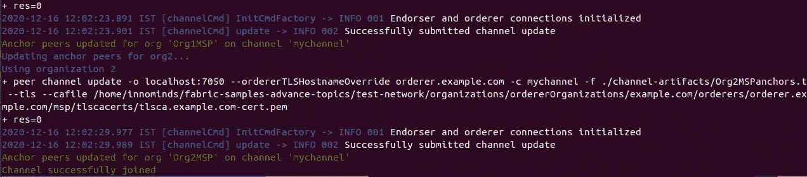

**Network: Setup**-Modifying the Batch Size in Hyperledger Fabric

一旦网络启动并运行，我们将启动 *cli* 容器与网络进行交互。

```
docker-compose -f docker/docker-compose-cli.yaml up -d
```

> **阅读** [**在运行 Hyperledger Fabric v2.2 网络中添加新的订购者**](/coinmonks/adding-a-new-orderer-in-running-hyperledger-fabric-v2-2-network-4c90c8315ae1)

# 5.频道更新

这是非常重要的一步，我们将更新我的频道，并将*批次大小*从 **10 改为 20。**最初，批量大小为 10，但我们会将其更新为 20，我们可以在`configtx/configtx.yaml.`
**处看到*批量大小*的步骤就是我们在*第 3 节中讨论的步骤。***

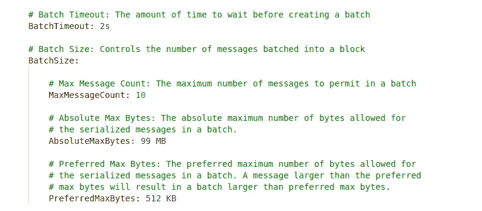

1.  **获取最新配置** 我们将以 protobuf 格式获取通道配置，创建一个名为`config_block.pb`的文件。

```
docker exec -e CHANNEL_NAME=mychannel cli sh -c ‘peer channel fetch config config_block.pb -o orderer.example.com:7050 -c $CHANNEL_NAME — tls — cafile $ORDERER_CA’
```

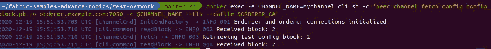

**Fetch the latest configuration-**Modifying the Batch Size in Hyperledger Fabric

**2。将配置转换为 JSON** 我们将转换最新的块`config_block.pb`，它是我们从上一步进入 JSON 的，并将所需的部分修剪到`config.json`文件中

```
docker exec cli sh -c ‘configtxlator proto_decode — input config_block.pb — type common.Block | jq .data.data[0].payload.data.config > config.json’
```

我们可以使用
和`docker exec cli sh -c ‘ls -lh’`进行检查

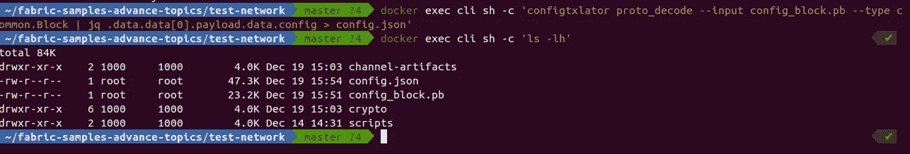

**Convert the Configuration to JSON-**Modifying the Batch Size in Hyperledger Fabric

**3。检查当前值** 我们将找到 blocksize 的当前值，并将它与更新后的值进行比较。我们必须导出 MAXBATCHSIZEPATH，以便可以读取它并更改值

```
MAXBATCHSIZEPATH=”.channel_group.groups.Orderer.values.BatchSize.value.max_message_count”docker exec -e MAXBATCHSIZEPATH=$MAXBATCHSIZEPATH cli sh -c ‘jq “$MAXBATCHSIZEPATH” config.json’
```

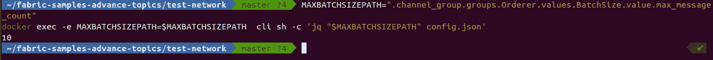

**Check the current value-**Modifying the Batch Size in Hyperledger Fabric

**4。更新值**
现在我们将把值从 10 更新到 20，并将它存储在临时文件`modified_config.json`中。

```
docker exec -e MAXBATCHSIZEPATH=$MAXBATCHSIZEPATH cli sh -c ‘jq “$MAXBATCHSIZEPATH = 20” config.json > modified_config.json’
```

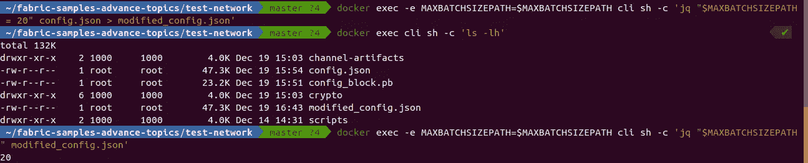

**Updating the value-**Modifying the Batch Size in Hyperledger Fabric

我们可以用更新后的值检查`modified_config.json`的内容。


**5。** **将 JSON 转换为 ProtoBuf**

在这一步，我们将初始的`config.json`和`modifed_config.json`(带有更新的值)转换成 ProtoBuf (PB)格式。

```
docker exec cli sh -c 'configtxlator proto_encode --input config.json --type common.Config --output config.pb'docker exec cli sh -c 'configtxlator proto_encode --input modified_config.json --type common.Config --output modified_config.pb'
```

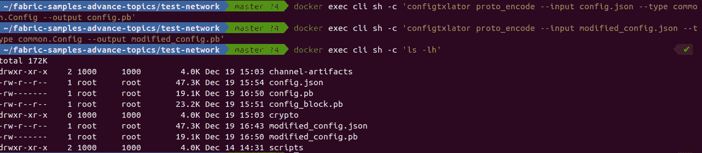

**Converting JSON to ProtoBuf-**Modifying the Batch Size in Hyperledger Fabric

**6。Delta 计算** 现在，我们要计算两者之间的 delta。我们刚刚生成的 pb 文件。

```
docker exec -e CHANNEL_NAME=mychannel cli sh -c 'configtxlator compute_update --channel_id $CHANNEL_NAME --original config.pb --updated modified_config.pb --output final_update.pb'
```

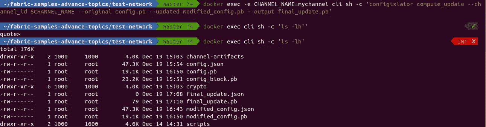

**Delta Calculation-**Modifying the Batch Size in Hyperledger Fabric

**7。将更新添加到信封** 现在我们必须计算新旧配置之间的差异，我们可以将更改应用到配置

```
docker exec  cli sh -c 'configtxlator proto_decode --input final_update.pb --type common.ConfigUpdate | jq . > final_update.json'docker exec  cli sh -c 'echo "{\"payload\":{\"header\":{\"channel_header\":{\"channel_id\":\"mychannel\", \"type\":2}},\"data\":{\"config_update\":"$(cat final_update.json)"}}}" | jq . >  header_in_envolope.json'docker exec cli sh -c 'configtxlator proto_encode --input header_in_envolope.json --type common.Envelope --output final_update_in_envelope.pb'
```

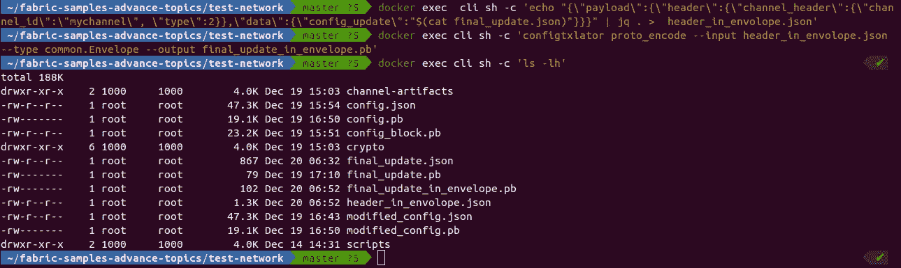

**Adding the update to the envelope-**Modifying the Batch Size in Hyperledger Fabric

**8。签署更新** 现在我们必须作为订购者签署这个更新协议。记住，我们导出了必要的环境变量来进行操作

```
docker exec cli sh -c 'peer channel signconfigtx -f final_update_in_envelope.pb'
```

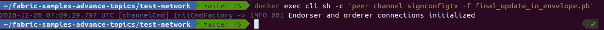

**Signing the update-**Modifying the Batch Size in Hyperledger Fabric

**9。启动更新命令** 现在更新过程已经通过 orderer 完成，为此，我们必须设置一些指向`OrdererAdmin`的环境变量。

```
CORE_PEER_TLS_ROOTCERT_FILE=/opt/gopath/src/github.com/hyperledger/fabric/peer/crypto/ordererOrganizations/example.com/orderers/orderer.example.com/tls/ca.crtCORE_PEER_MSPCONFIGPATH=/opt/gopath/src/github.com/hyperledger/fabric/peer/crypto/ordererOrganizations/example.com/users/Admin@example.com/mspCORE_PEER_ADDRESS=orderer.example.com:7050
```

更新通道，我们的配置更新事务表示原始配置和修改后的配置之间的差异，但订购服务会将其转换为完整的通道配置。

```
docker exec -e CORE_PEER_LOCALMSPID=$CORE_PEER_LOCALMSPID -e CORE_PEER_TLS_ROOTCERT_FILE=$CORE_PEER_TLS_ROOTCERT_FILE -e CORE_PEER_MSPCONFIGPATH=$CORE_PEER_MSPCONFIGPATH -e CORE_PEER_ADDRESS=$CORE_PEER_ADDRESS -e CHANNEL_NAME=mychannel cli sh -c ‘peer channel update -f final_update_in_envelope.pb -c $CHANNEL_NAME -o orderer.example.com:7050 — tls — cafile $ORDERER_CA’
```

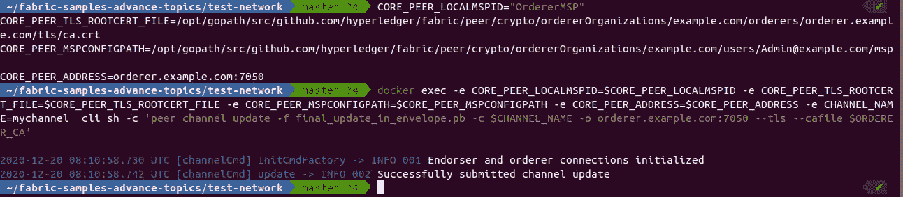

**Initiate the Update command-**Modifying the Batch Size in Hyperledger Fabric

**10。验证** 现在，我们的批量大小已从 10 更新为 20，我们可以通过重新运行这些命令来检查块大小的更新，从而进行验证

```
docker exec cli sh -c 'configtxlator proto_decode --input config_block.pb --type common.Block | jq .data.data[0].payload.data.config > config.json'docker exec -e MAXBATCHSIZEPATH=$MAXBATCHSIZEPATH cli sh -c 'jq "$MAXBATCHSIZEPATH" config.json'
```

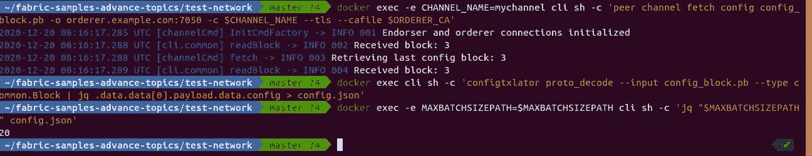

**Verification-**Modifying the Batch Size in Hyperledger Fabric

# 6.摘要

在本文中，我们看到了如何更新正在运行的 Hyperledger Fabric 网络的*批处理大小*或*批处理超时*，我知道这是一个有点繁琐的任务，但在一些 shell 脚本的帮助下，我们可以在几分钟内完成。我添加了一个脚本`updateBatchSize.sh`，它可以完成我们在上面学到的所有工作。你可以在这里找到脚本。

如果你觉得这篇文章很有帮助，请点击拍手按钮，并跟随我阅读更多这样的信息丰富的文章。

你可以在 [Linkedin](https://linkedin.com/in/adityajoshi12) 上找到我或者在 [GitHub](https://github.com/adityajoshi12) 上跟踪我？如果这对你来说太社交化了，如果你想和我讨论技术，就给 adityaprakashjoshi1@gmail.com 发封邮件。


> ***另外，查看我的*** [***课程关于 Hyperledger Fabric 的部署关于多主机***](http://bit.ly/hlf-multihost-deployment)