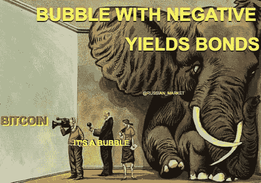
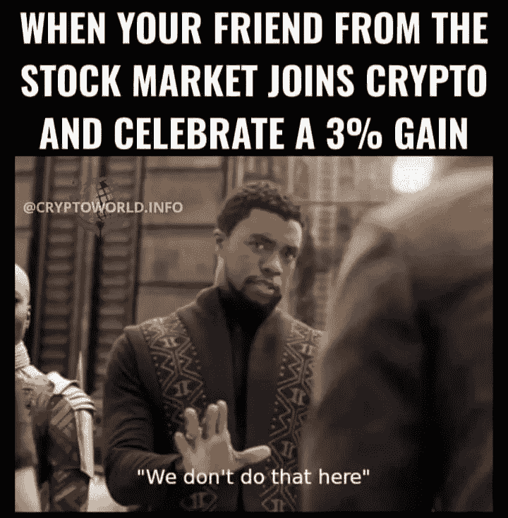
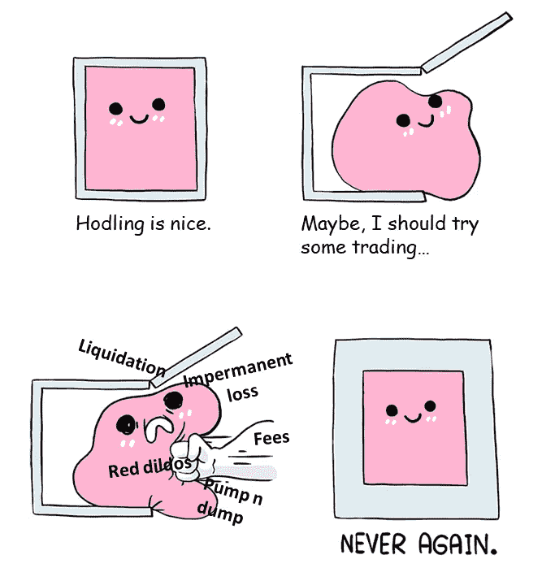
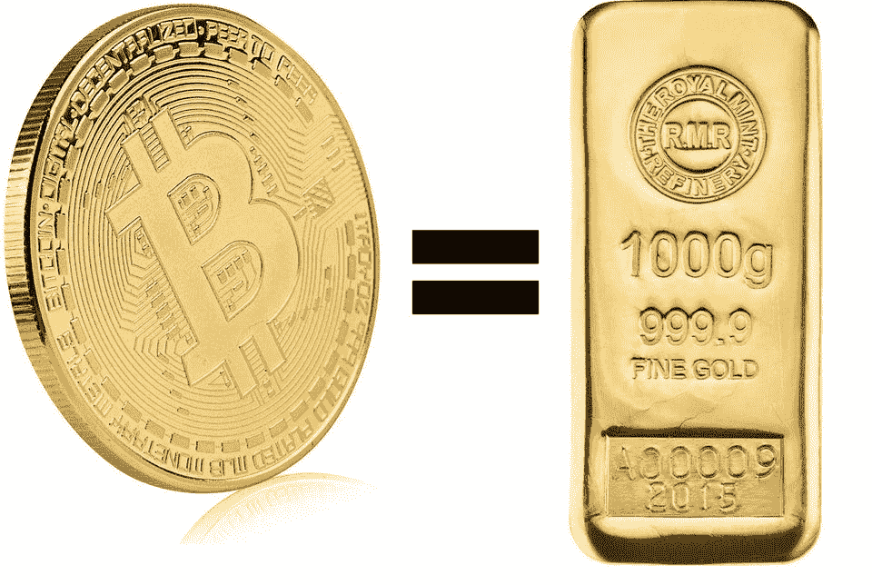

# 周一血战| OKCoin 暂停 BCH BSV | Cryptopia 再次被黑

> 原文：<https://medium.com/coinmonks/monday-bloodbath-okcoin-suspends-bsv-bch-cryptopia-hacked-again-3c87c33e99df?source=collection_archive---------3----------------------->

## 北京新的数字人民币测试功能自动柜员机将数字货币转换为现金|英伟达推出以太坊 ASIC 挖掘

*   周一上午的[市场下跌引发了](https://www.theblockcrypto.com/linked/95678/monday-market-defi-liquidations)该生态系统历史上第二高的 DeFi 相关清算金额。
*   韩国金融监管机构确认隐私硬币退市
*   OKCoin 宣布 T2 暂停了 BSV 和 BCH 的交易，以及其他一些加密资产。
*   据报道，Cryptopia exchange 再次遭到黑客攻击，尽管它在之前窃取了 2400 万新西兰元(1550 万美元)的违规行为后正在清算。

> 试试 [Youhodler](https://blog.coincodecap.com/go/youhodler) ，赚取你的密码利息，并有机会**赢得一辆特斯拉**

## [Pionex](http://blog.coincodecap.com/go/pionex)

试试专业的加密交易所 Pionex，它有免费的加密交易机器人，可以让你的交易自动化。阅读我们的 [Pionex 评论](/coinmonks/pionex-review-exchange-with-crypto-trading-bot-1e459d0191ea)并查看我们的 [**加密交易机器人**](/coinmonks/crypto-trading-bot-c2ffce8acb2a) 列表。

## 最新消息📰

*   印度将对加密交易和收益征税
*   韩国金融监管机构[确认隐私币](https://news.bitcoin.com/south-korean-financial-regulator-confirms-privacy-coin-delistings-adds-new-guidelines-to-report-unusual-transactions)退市
*   北京的新数字人民币测试的特点是自动取款机将数字货币转换成现金
*   美国监管机构指控 Coinseed 运营非法加密交易平台
*   Cryptopia Exchange 目前处于清算阶段，再次遭到黑客攻击
*   比特币基地[市值超过 1000 亿美元](https://www.axios.com/coinbase-valued-100-billion-direct-listing-9b43e316-7ff7-4f6a-a1db-4dc2481a93ee.html)，即将直接上市
*   [保护比特币](https://blog.okcoin.com/2021/02/19/protecting-bitcoin-why-were-removing-bch-and-bsv-from-okcoin/)——为什么我们要将 BCH 和 BSV 从 OKCoin 中移除
*   图形基金会[增加了对另外四个区块链的支持](https://thegraph.com/blog/multiblockchain-support):波尔卡多、尼尔、索拉纳、塞洛
*   宇宙[升级](https://www.coindesk.com/cosmos-upgrades-to-stargate-another-2017-ico-very-nearly-completes-its-vision)到星际之门
*   Nvidia [推出](https://blogs.nvidia.com/blog/2021/02/18/geforce-cmp/)以太坊 ASIC 挖掘
*   瑞士楚格州现在接受比特币和以太支付税款
*   罗宾汉将[启用加密](https://twitter.com/RobinhoodApp/status/1362143073510121472)存款和取款
*   迪拜自由区成为首个接受比特币的阿联酋政府实体

> *报税季即将来临，使用最好的* [***加密报税软件***](/coinmonks/best-crypto-tax-tool-for-my-money-72d4b430816b) *来申报你的加密报税吧。*

[source](https://www.reddit.com/r/CryptoCurrency/comments/lnw7x3/we_are_past_that_here/)

> BlockFi 首次推出加密奖励信用卡。在日常购物中获得 1.5%的比特币奖励。现在加入等候名单。

## 好的读物📑

*   菲亚特[特权](https://allenfarrington.medium.com/fiat-privilege-3f5afae50083)
*   [探索比特币的历史](/coinmonks/exploring-bitcoins-history-ecbf1c59952c)
*   比特币是[威尼斯](https://allenfarrington.medium.com/bitcoin-is-venice-8414dda42070)
*   一个[引导](https://www.one37pm.com/grind/money/guide-to-nfts)到 NFTs
*   [走开](https://cryptohayes.medium.com/walkaway-e11829025627)
*   [元素](/@nic__carter/elemental-bitcoin-is-money-2126b1c99ced)比特币是货币
*   Crypto:反弹还是拐点？
*   [在密码市场寻求收益](/coinmonks/seeking-yield-in-the-crypto-market-858ec3455d11)
*   波尔卡多特对战[宇宙](/coinmonks/polkadot-vs-cosmos-vs-ethereum-2-0-for-real-idiots-3b6f0e0cfb2f)对战以太坊 2.0
*   [系绳交易](/coinmonks/impact-of-tether-trading-on-the-bitcoin-price-f915e26c2c44)对比特币价格的影响
*   迈克尔·伯里警告魏玛恶性通货膨胀即将到来
*   密码艺术的世界正在爆炸
*   AMM 流动性池[利润最大化和风险识别](https://defiprime.com/amm-liquidity-pools)的分析方法
*   [毛茸茸的丽莎](https://scottbelsky.medium.com/the-furry-lisa-cryptoart-the-new-economy-of-digital-creativity-6cb2300ea081)，CryptoArt，&数字创意的新经济
*   产量到底是从哪里来的？
*   NFTs 让互联网[成为自己的](https://variant.mirror.xyz/T8kdtZRIgy_srXB5B06L8vBqFHYlEBcv6ae2zR6Y_eo)
*   [量化 MEV](/flashbots/quantifying-mev-introducing-mev-explore-v0-5ccbee0f6d02) :介绍 MEV-探索 v0
*   比特币现在价值 50，000 美元，而且它正在以前所未有的速度毁灭这个星球
*   为什么[我离开了谷歌](https://paygo.media/p/25171)或者说，为什么我呆了这么久？
*   早期比特币投资者的[心理框架](/coinmonks/the-mental-framework-of-an-early-bitcoin-investor-74e4d7408dee)
*   预测市场:来自选举的故事

> *买一个* [***硬件钱包***](/coinmonks/the-best-cryptocurrency-hardware-wallets-of-2020-e28b1c124069) *和* [*保护你的加密货币*](/coinmonks/how-to-prevent-cryptocurrency-hacking-and-theft-from-your-wallet-65c8ff767766) *。*

[Source](https://www.reddit.com/r/Bitcoin/comments/kmof53/the_8_laws_of_bitcoin_updated/)

> Eth2 核心团队在线[研讨会](https://hackmd.io/@hww/workshop_feb_2021)，2021 年 2 月

## 开发商

*   创建您的第一个[区块链图 QL](https://bitquery.io/blog/blockchain-graphql-query) 查询
*   Eth2 上的秘密共享[验证器](/coinmonks/eth2-secret-shared-validators-85824df8cbc0)
*   现代[软叉](https://lists.linuxfoundation.org/pipermail/bitcoin-dev/2020-January/017547.html)激活
*   值得删除的潜在 EVM 功能列表
*   [拥塞控制](https://barnabe.substack.com/p/congestion-control-and-eip1559)和 eip1559
*   对宇宙、波尔卡多特和近地天体的深入分析
*   如何用 ethers.js 对待定事务进行[流式处理](https://www.quiknode.io/guides/defi/how-to-stream-pending-transactions-with-ethers-js)
*   当一个[解决方案就在](https://rauljordan.com/2021/02/18/when-a-solution-is-right-in-front-of-your-eyes.html)面前的时候？
*   智能合同[安全性](https://secureum.substack.com/p/smart-contract-security-101-secureum) 101
*   为什么你应该使用 [ITX，而不是建立](https://blog.infura.io/why-you-should-use-infura-transactions-instead-of-building-your-own-in-house-relayer/)你自己的内部继电器
*   通过 Tor 网络运行[比特币&闪电](https://stopanddecrypt.medium.com/running-bitcoin-lightning-nodes-over-the-tor-network-2021-edition-489180297d5)节点
*   [上菜](https://blog.trailofbits.com/2021/02/19/serving-up-zero-knowledge-proofs/)零知识证明
*   就异步分布式密钥生成达成[共识](https://arxiv.org/abs/2102.09041)

> 想成为一名以太网和 **Web3 开发者**？[从这里开始](http://blog.coincodecap.com/go/learn)。

## 多方面的

*   [每个人的比特币](https://learn.saylor.org/course/PRDV151)
*   安全帽[狠](https://twitter.com/HardhatHQ/status/1362866790695641094) NPM 包
*   [LavaMoat](https://github.com/lavamoat/lavamoat) —一套保护 JavaScript 项目的工具

## 事件

*   [zkSessions](https://hopin.com/events/zksessions-defi-and-privacy) : DeFi +隐私

## 播客和视频💽

*   比特币[硬件钱包](https://stephanlivera.com/episode/252/) vs 气隙电脑
*   [思考](http://podcast.banklesshq.com/50-2020-reflections-on-crypto-and-beyond-vitalik-buterin)关于加密和超越|维塔利克·布特林

[Source](https://www.reddit.com/r/Bitcoin/comments/lpr1dm/never_again/)

## 加密交易和折扣🔖

*   注册参加[**by bit**](/coinmonks/bybit-exchange-review-dbd570019b71)exchange，赢取高达 625 美元的奖金。
*   在 [**Bityard**](https://blog.coincodecap.com/go/bityard) 获得 258 美元的交易费折扣

## 产品评论和其他加密软件📙

*   [Phemex 评论](https://blog.coincodecap.com/phemex-review) |零费用，无 KYC
*   [免费赚取比特币](https://blog.coincodecap.com/earn-bitcoin)
*   6 2021 年最好的[比特币储蓄账户](https://blog.coincodecap.com/bitcoin-savings-account)
*   [印度最好的比特币交易所](https://blog.coincodecap.com/bitcoin-exchange-in-india)
*   在印度购买比特币的最佳应用
*   2021 年，[获得加密利益的最佳平台](/coinmonks/earn-crypto-interest-b10b810fdda3)
*   杠杆令牌的终极指南
*   [最佳加密交易所](https://blog.coincodecap.com/crypto-exchange)

想让我们展示你的产品吗？请通过 Twitter @coinmonks 联系我们

[Source](https://www.reddit.com/r/Bitcoin/comments/loa56l/1btc_1kg_of_gold/)

## 乔布斯👷

*   现金正在寻找一个技术内容作家，邮件:你好
*   附近正在找一个 [EVM 互通工程师](https://boards.greenhouse.io/near/jobs/4844647002)
*   MetaMask 正在招聘工程师。在这里应用。
*   [开发工程师](https://remoteok.io/remote-jobs/100451-remote-devops-engineer-district0x)，0x 区，远程
*   NFT 社交网络 Showtime 正在招聘一名创始工程师
*   小道消息位正在寻找一名[技术编辑/撰稿人](https://jobs.lever.co/trailofbits/8bf936ff-b86c-462e-80b2-4d58004bc68d) & [安全工程师](https://jobs.lever.co/trailofbits/4f459855-3299-462f-9e73-299a840d5baf)
*   Reddit: [高级后端/以太坊工程师](https://boards.greenhouse.io/reddit/jobs/2419120)
*   [动作设计师](https://cryptocurrencyjobs.co/design/kraken-digital-asset-exchange-motion-designer/) —北海巨妖
*   全栈工程师 —扎珀
*   高级前端工程师 — UMA
*   SigmaPrime，[区块链安全工程师](https://blog.sigmaprime.io/blockchain-security-engineer.html)
*   小道消息位是找[技术编辑/撰稿人](https://jobs.lever.co/trailofbits/8bf936ff-b86c-462e-80b2-4d58004bc68d) & [安全工程师](https://jobs.lever.co/trailofbits/4f459855-3299-462f-9e73-299a840d5baf)
*   Nexus Mutual: [在欧洲时区经历了稳健发展](https://angel.co/company/nexus-mutual-1/jobs/967538-smart-contract-engineer)

## 在 Coinmonks 上发布

如果你喜欢在 crypto/区块链空间上写教育文章，并且想在 Coinmonks 出版物上发表。只需在***【gaurav@coincodecap.com】****或者 DM 我**[***推特***](https://twitter.com/coinmonks)*