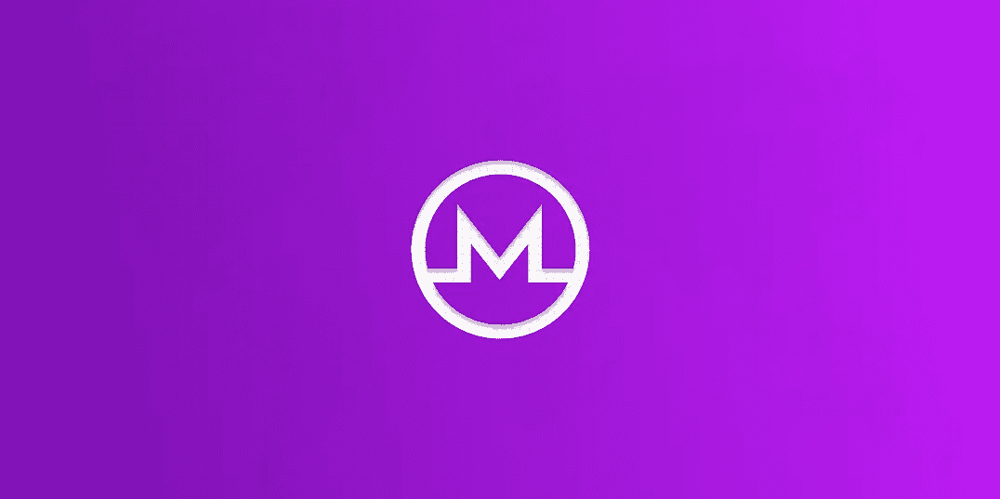

# Monero:如何检查平衡

> 原文：<https://medium.com/coinmonks/monero-how-to-check-balance-53eb0d45cf7d?source=collection_archive---------2----------------------->



Monero 是一种隐私设计的加密货币，使用 CryptoNote 协议制成。这个协议是由 Nicolas van Saberhagen 开发的，他是一个匿名的作者，我们对他一无所知。

**Monero 的顶级视图**

为了保持以隐私为中心，Monero 使用了各种密码原语:环签名、秘密地址、Pedersen 承诺等等。通过合作，他们为该协议提供了两个独特的功能:

*不可追踪性*:对于每一笔进来的交易，所有可能的发送者的可能性都是一样的。

*不可链接*:对于任何两笔传出交易，都无法证明它们是发给同一个人的。

实际上，这意味着两件事:交易方保持匿名，交易细节和钱包余额对公众隐藏。作为加密货币领域的一个突出特点，它带来了一些困难。其中之一与 Monero Block Explorer 的想法有关，因为任何人在 Monero 地址上查看 Block Explorer 时，交易细节都是隐藏的。

**两套钥匙**

问题是 Monero 有两套键:查看键和消费键。

*   公共视图和公共支出键

这些密钥在每个 Monero 公共地址中生成。它们被公开要求在 Monero 网络上发送和接收 XMR。

*   私人视图和私人消费键

私人消费密钥与加密货币中的任何其他私人密钥一样，不应与任何人共享。这些钥匙可以控制你的资金，应该尽可能小心使用。

准确地说，私有视图键提供了一个额外的功能。Monero 的区块链是私人设计的，但可以选择透明。这就是私有视图键发挥作用的地方，因为与您的地址一起共享它可以显示该地址的所有传入交易。与其他方共享私有视图密钥是安全的——这类似于发送公共比特币密钥。

**用 NOWNodes 检查余额**

这是一个一步一步的指南，可以马上在 Postman 中使用。

**首先**，需要执行[**xmr.nownodes.io/xmr/account**](https://xmr.nownodes.io/xmr/account)

请求正文是:

```
{
"API_key": "your_API_key",
  "address": "your_address"
}
```

使用 ZwmbBjvevr4JeRgeATb7Y3Ad as API 作为 API 密钥(下文中)，您会得到:

```
{
    "id": "5efe03e5d56367002093e1a2",
    "address": "your_address",
    "isCreated": false,
    "isResynced": false,
    "createdAt": 1593705445,
    "resyncedAt": 0
}
```

二、做一次再同步[**xmr.nownodes.io/xmr/resync**](https://xmr.nownodes.io/xmr/resync)

如果您使用旧地址，此端点有助于查看最后 10，000 个块。

```
{
  "API_key": "your_API_key",
  "address": "your_address",
  "viewKey": "your_viewkey"
}
```

你会得到:

```
{
    "request_fulfilled": true,
    "status": "Updating account with for importing recent txs successeful."
}
```

第三，检查你的余额[xmr.nownodes.io/xmr/balanceT21](https://xmr.nownodes.io/xmr/balance)

```
{
  "API_key": "your API key",
  "address": "your address",
  "viewKey": "your view key"
}
```

你会得到:

```
{
    "blockchain_height": 2133546,
    "locked_funds": "0",
    "new_address": false,
    "scanned_block_height": 2133546,
    "scanned_block_timestamp": 1593700334,
    "scanned_height": 0,
    "spent_outputs": [],
    "start_height": 2133543,
    "status": "success",
    "total_received": "0",
    "total_sent": "0"
}
```

所以你在这里。

NOWNodes 是 ChangeNOW 的创造者提供的一个现代用户友好平台，它提供对各种加密货币(包括 Monero)的完整节点的安全访问。此外，我们提供对包括 Monero explorer 在内的 block explorers 的访问，并为每天多达 20，000 个请求提供免费计划，这使我们成为独一无二的值得信赖的合作伙伴。让我们一起努力吧——给我们写封短信吧。

NOWNodes —资源管理器和节点 API。

访问[我们的网站](http://nownodes.io/)，并在 1 天内访问您的节点。

> 加入 Coinmonks [电报频道](https://t.me/coincodecap)和 [Youtube 频道](https://www.youtube.com/c/coinmonks/videos)获取每日[加密新闻](http://coincodecap.com/)

## 另外，阅读

*   [复制交易](/coinmonks/top-10-crypto-copy-trading-platforms-for-beginners-d0c37c7d698c) | [加密税务软件](/coinmonks/crypto-tax-software-ed4b4810e338)
*   [网格交易](https://coincodecap.com/grid-trading) | [加密硬件钱包](/coinmonks/the-best-cryptocurrency-hardware-wallets-of-2020-e28b1c124069)
*   [密码电报信号](http://Top 4 Telegram Channels for Crypto Traders) | [密码交易机器人](/coinmonks/crypto-trading-bot-c2ffce8acb2a)
*   [最佳加密交易所](/coinmonks/crypto-exchange-dd2f9d6f3769) | [印度最佳加密交易所](/coinmonks/bitcoin-exchange-in-india-7f1fe79715c9)
*   开发人员的最佳加密 API
*   [最佳期货交易信号](https://coincodecap.com/futures-trading-signals) | [流动性交易所评论](https://coincodecap.com/liquid-exchange-review)
*   [用于 Huobi 的加密交易信号](https://coincodecap.com/huobi-crypto-trading-signals) | [Swapzone 审查](/coinmonks/swapzone-review-crypto-exchange-data-aggregator-e0ad78e55ed7)
*   [最佳加密交易机器人](/coinmonks/crypto-trading-bot-c2ffce8acb2a) | [购买索拉纳](https://coincodecap.com/buy-solana) | [矩阵导出评论](https://coincodecap.com/matrixport-review)
*   [Coldcard 评论](https://coincodecap.com/coldcard-review) | [BOXtradEX 评论](https://coincodecap.com/boxtradex-review)|[uni swap 指南](https://coincodecap.com/uniswap)
*   [比特币基地评论](/coinmonks/coinbase-review-6ef4e0f56064) | [德里比特评论](/coinmonks/deribit-review-options-fees-apis-and-testnet-2ca16c4bbdb2) | [FTX 评论](/coinmonks/ftx-crypto-exchange-review-53664ac1198f)
*   [Coinmetro 评论](https://coincodecap.com/coinmetro-review) | [VirgoCX 评论](https://coincodecap.com/virgocx-review)
*   最佳[密码借贷平台](/coinmonks/top-5-crypto-lending-platforms-in-2020-that-you-need-to-know-a1b675cec3fa)
*   [免费加密信号](/coinmonks/free-crypto-signals-48b25e61a8da) |加密交易机器人
*   杠杆代币的终极指南