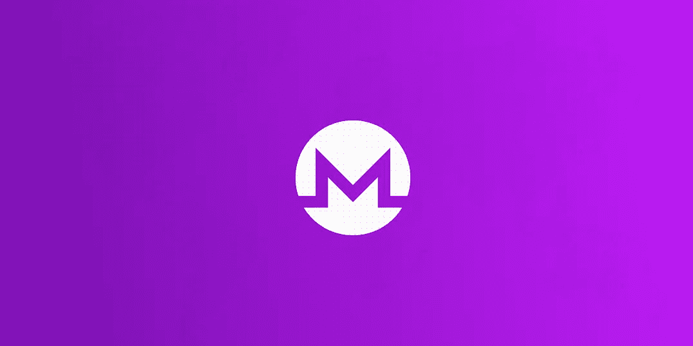

# Monero:最近的分叉和未来

> 原文：<https://medium.com/coinmonks/monero-recent-fork-and-beyond-265713e9ff8b?source=collection_archive---------3----------------------->

## 最初发表于 [NOWNodes 博客](https://nownodes.io/blog/recent-monero-fork-and-further-development-all-that-you-need-to-know)。

Monero 在 2020 年 10 月 17 日经历了它的最新分叉。分叉，或硬分叉，因为它是在这种情况下，意味着一个隐私硬币的重大网络升级。在 Monero，这些硬分叉或网络升级改进了基础协议，并且没有争议。这意味着不会有分裂，也不会有新的硬币产生。

更具体地说，在这个分支中，Monero 旨在引入一些新功能，如新的环签名结构 CLSAG。这个特性对 Monero 社区的未来有什么帮助，我们将在以后讨论。但是，在此之前，让我们看看这个硬分叉在平台的使用和功能级别上对用户意味着什么。

# 这对最终用户意味着什么？

*   对于最终用户来说，硬分叉没有什么可担心的。这是一个简单的软件更新。任何在 10 月 17 日之后使用该应用的用户都必须更新他们的软件。
*   该公司贴出了如何进行更新的详细说明。对于钱包或节点的持有者来说，这个过程只是简单地用新版本替换以前版本的软件，无论是 *Monerod、Monero-wallet-cli 还是 Monero-wallet-gui* 。
*   对于把硬币放在纸质钱包上的用户来说，这没什么不同。每当用户决定移动他/她的硬币时，他/她将不得不使用软件的更新版本。就是这样。
*   对于采矿社区来说，硬分叉并不意味着任何改变。PoW 建立共识机制在更新中没有受到任何影响。因此，矿工们即使不更新软件也能继续工作。

# 硬叉子想达到的目的是什么？

如前所述，Monero fork 的目的是引入一个新功能，称为新的环形签名结构 CLSAG。我们将在下一部分讨论这一点。

**从 MLSAG 到 CLSAG**

*   Monero 使用签名者不明确的交易协议。它包括许多加密组件。其中一个组件是 MLSAG，它是一种环签名结构。每当 Monero 用户发起交易时，系统生成一个或多个 MLSAG 签名以混淆签名者和交易中涉及的金额。
*   最新推出的 CLSAG 旨在取代 MLSAG。其目的是提高效率。Monero 研究实验室使用了一些更简单但有效的算法，凭借这些算法，CLSAG 签名可以实现与 MLSAG 相同的功能。但是，CLSAG 领先于其前身的地方是，它可以以更小的规模更快地做到这一点。为了提高速度，研究实验室优化了底层加密技术。

**增强的安全性**

从 MLSAG 过渡到 CLSAG 也改善了 Monero 的安全。这个转换是用好的密码结构预先准备好的。这种构造是在牢记正式安全模型的情况下完成的。

这里需要提到的是，安全模型对于保护系统免受黑客和攻击者的攻击非常重要。安全模型设想假想的攻击者。之后，它将这些黑客或攻击者的能力形式化。一旦形式化完成，就证明了这些攻击者不能侵入网络的特定安全协议。

在实现 CLSAG 时，开发人员创建了一个场景，假设攻击者可以引诱诚实的平台用户获取他们的密钥。他们还假设能够说服用户进行他们希望的交易。事实证明，针对这种情况，安全增强是有效的。

**人数上的提高**

10 月 17 日的分叉将签名协议从 MLSAG 更改为 CLSAG。然而，用户只需要更新他们的软件。对于硬件钱包的用户来说，分叉意味着他们固件的更新，可以支持更新的最新固件。

由于从 MLSAG 到 CLSAG 的过渡意味着交易规模的提高，所以让我们来看看交易规模在 Monero 中意味着什么。

Monero 的交易规模取决于两个因素。第一个是一个人花费的先前交易输出的数量。第二个是用户生成的新交易的数量。平均而言，大多数交易花费两个先前的产出，并且还生成两个新的产出。有了 MLSAG，这些事务在区块链上占用了大约 2.5 千字节的空间。随着 CLSAG 的实现，它下降到 1.9 千字节。与 MLSAG 标准相比，这是 25%的显著提高。

每当有新交易发生时，Monero 软件都会验证这些交易的签名。标准协议是验证交易是否有效。对于单个交易，验证签名所需的时间几乎可以忽略不计。通常是几十毫秒。然而，用户通常必须等待确认，直到包括该交易的整个块被验证。这需要时间。虽然时间是计算机效率的一个函数，但在 CLSAG 下所花的时间要比在 MLSAG 下少得多。

根据 CLSAG 协议进行的测试表明，验证签名所用的时间缩短了近 20%。交易方面的总体改善为 10%。

# 第三方审计

在部署该守则之前，Monero 已委托对拟议的修改进行审计。审计调查了 CLSAG 加密技术的两个方面和实现代码的准确性。CLSAG 密码学方面包括算法、安全模型和证明。

为了这次审计，Monero 雇佣了两位密码专家:JP Aumasson 和 Antony Vennard。在支持和协调方面，有 Monero 审计工作组和开源技术改进基金。来自 Monero 社区的捐款支付了这项活动的费用。

审查过程分为两个部分。第一部分的考试关注了 CLSAG 的安全性。审查人员在算法中找不到任何问题。然而，他们提出了改进安全性证明的重要建议。在上线之前，该网络对修改进行了调整，达到了审查者的满意程度。除了安全方面，审查人员还建议采取一些行动来改善预印本。这些建议已经落实。

审查人员发现实现代码写得很好。他们还认为实现是安全的。根据他们的说法，该代码是为 CLSAG 设计的算法的正确实现。虽然该委员会提出了一些与守则有关的建议，但没有一项涉及任何安全方面。

# 摘要

审查的成功证明，劳动和社会保障部向劳动和社会保障部的过渡卓有成效。像软件升级一样，区块链也需要经常进行性能改进。区块链是一项新兴技术，每天都有新的人加入这一潮流，这转化为更多的关注和机会。但是，这些变化也带来了拥堵和效率降低的可能性，以及黑客和攻击的增加。

Monero fork 提高了速度，降低了每笔交易的空间需求，表明该平台在与不断改进的技术相匹配方面处于领先地位。此外，它还证明了该平台不会以牺牲安全性为代价来提高性能。

## 另外，阅读

*   最好的[密码交易机器人](/coinmonks/crypto-trading-bot-c2ffce8acb2a)
*   [密码本交易平台](/coinmonks/top-10-crypto-copy-trading-platforms-for-beginners-d0c37c7d698c)
*   最好的[加密税务软件](/coinmonks/best-crypto-tax-tool-for-my-money-72d4b430816b)
*   [最佳加密交易平台](/coinmonks/the-best-crypto-trading-platforms-in-2020-the-definitive-guide-updated-c72f8b874555)
*   最佳[加密贷款平台](/coinmonks/top-5-crypto-lending-platforms-in-2020-that-you-need-to-know-a1b675cec3fa)
*   [最佳区块链分析工具](https://bitquery.io/blog/best-blockchain-analysis-tools-and-software)
*   [加密套利](/coinmonks/crypto-arbitrage-guide-how-to-make-money-as-a-beginner-62bfe5c868f6)指南:新手如何赚钱
*   最佳[加密制图工具](/coinmonks/what-are-the-best-charting-platforms-for-cryptocurrency-trading-85aade584d80)
*   [莱杰 vs 特雷佐](/coinmonks/ledger-vs-trezor-best-hardware-wallet-to-secure-cryptocurrency-22c7a3fd391e)
*   了解比特币的[最佳书籍有哪些？](/coinmonks/what-are-the-best-books-to-learn-bitcoin-409aeb9aff4b)
*   [3 商业评论](/coinmonks/3commas-review-an-excellent-crypto-trading-bot-2020-1313a58bec92)
*   [AAX 交易所评论](/coinmonks/aax-exchange-review-2021-67c5ea09330c) |推荐代码、交易费用、利弊
*   [Deribit 审查](/coinmonks/deribit-review-options-fees-apis-and-testnet-2ca16c4bbdb2) |选项、费用、API 和 Testnet
*   [FTX 密码交易所评论](/coinmonks/ftx-crypto-exchange-review-53664ac1198f)
*   [n 零审核](/coinmonks/ngrave-zero-review-c465cf8307fc)
*   [Bybit 交换审查](/coinmonks/bybit-exchange-review-dbd570019b71)
*   [3Commas vs Cryptohopper](/coinmonks/cryptohopper-vs-3commas-vs-shrimpy-a2c16095b8fe)
*   最好的比特币[硬件钱包](/coinmonks/the-best-cryptocurrency-hardware-wallets-of-2020-e28b1c124069?source=friends_link&sk=324dd9ff8556ab578d71e7ad7658ad7c)
*   最佳 [monero 钱包](https://blog.coincodecap.com/best-monero-wallets)
*   [莱杰纳米 s vs x](https://blog.coincodecap.com/ledger-nano-s-vs-x)
*   [bits gap vs 3 commas vs quad ency](https://blog.coincodecap.com/bitsgap-3commas-quadency)
*   [莱杰纳米 S vs 特雷佐 one vs 特雷佐 T vs 莱杰纳米 X](https://blog.coincodecap.com/ledger-nano-s-vs-trezor-one-ledger-nano-x-trezor-t)
*   [block fi vs Celsius](/coinmonks/blockfi-vs-celsius-vs-hodlnaut-8a1cc8c26630)vs Hodlnaut
*   Bitsgap 评论——一个轻松赚钱的加密交易机器人
*   为专业人士设计的加密交易机器人
*   [PrimeXBT 审查](/coinmonks/primexbt-review-88e0815be858) |杠杆交易、费用和交易
*   [埃利帕尔泰坦评论](/coinmonks/ellipal-titan-review-85e9071dd029)
*   [赛克斯·斯通评论](https://blog.coincodecap.com/secux-stone-hardware-wallet-review)
*   [区块链评论](/coinmonks/blockfi-review-53096053c097) |从您的密码中赚取高达 8.6%的利息