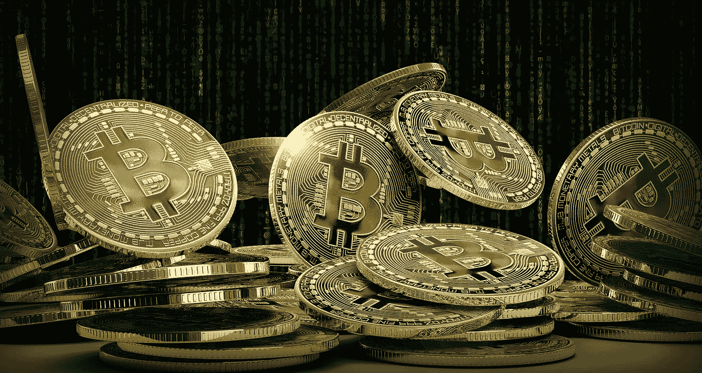
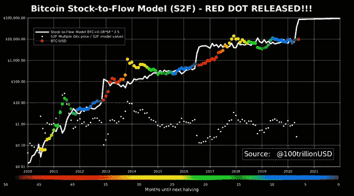

# 货币能源、货币和比特币

> 原文：<https://medium.com/coinmonks/monetary-energy-money-bitcoin-5d084a47832f?source=collection_archive---------0----------------------->

TLDR:货币能量向货币资产的流动决定了其总价值。传统货币不是储存和转移货币能量的可靠方式，因为它不符合健全货币所需的基本原则。比特币修复了这些问题，这使得它擅长存储和转移货币能量。这也是为什么货币能量会不断流入比特币网络中固定数量的比特币，增加每个比特币的价值。

*免责声明:本文不构成专业/财务建议。这是我个人的观点，应该如此看待。请做好自己的尽职调查和研究。*

我看了一段视频，视频中 MicroStrategy 的首席执行官迈克尔·塞勒(Michael Saylor)正在接受基思·麦卡洛(Keith Mccullough)的采访，谈及比特币的长期前景。他说，“比特币是世界历史上第一个可以拉动货币能量的软件网络……(货币能量)可以像电池一样坐在那里，每年不会流失 2-4%，我可以把它放在我的手掌里，在几分钟内花几美元在世界各地移动。”

这让我思考了很多关于货币能量的概念，并将货币视为传递这种能量的管道。通过思考，我意识到，如果我们从能量的角度来看待金钱，那么理解金钱、比特币的价值，进而理解它在我们未来货币体系中的位置，就会容易得多。

# **货币能量**

当我们生产一种商品或服务时，如果有另一方从所创造的东西中获得价值，我们就在创造价值。这种创造出来的价值与能量有着非常相似的属性，所以我们称之为货币能量。

在货币发明之前，人们必须在创造货币后立即消耗货币能量。例如，如果一个人要卖一只山羊，他必须把它换成同等价值的东西，这种东西可能不能长期保存，必须马上消耗掉。他不可能储存这种能量。

所以，人类创造了一个电池来储存这种货币能量，我们称之为货币。这种货币不仅成为价值储存手段，而且成为交易媒介。

# **金钱史**

金钱的第一次迭代是非常基本和直观的。首先，它必须是很难创造的东西。如果很容易创造，那么进入系统的新货币的**流量**(记住流量这个术语，这在后面会很重要)将远远大于创造的新货币能量。

在能源方面，想象一下，如果你有一个太阳能发电场，有固定数量的电池板(能量以恒定的速度产生)，但你不断向系统中添加更多的电池来收集这些能量。每块电池的平均能量会随着时间的推移而减少。因此，每个电池的能量值降低。如果你增加电池的数量太快，很快你所有的电池将会只有很少的能量，并且几乎毫无价值。

有许多早期的货币形式，如贝壳、玻璃珠和 rai 石头。Rai 石头最类似于比特币，但那本身就是另一个话题了。你可以在这里了解更多信息[。](https://www.sciencealert.com/the-original-bitcoin-still-exists-as-giant-stone-money-on-a-tiny-pacific-island)

所有早期形式的货币都有一些共同点。它们最初很难创造，但随着技术的进步变得容易创造，这使得这些形式的货币作为货币能量的储存或交换媒介随着时间的推移变得毫无价值。

随着早期货币的失败，人类偶然发现了贵金属。这些是极其罕见和难以开采的，即使几个世纪以来技术不断进步，由于其稀缺性，仍然不容易制造。最后，我们为**音钱**创造了第一个基础。

# **音钱属性**

1.缺乏的

2.难以创造/伪造

3.容易从一个人转移到另一个人

4.耐用(不会随着时间的推移而贬值)

5.可替换的(可互换的。也就是说，来自人 A 的 1 克黄金与来自人 b 的 1 克黄金是一样的，不像珠子，珠子的美丽和价值是主观的。)

6.可分的

贵金属具有这些属性中的大部分，但程度不同。例如，它在地球上是稀缺和有限的，需要大量的工作来创造更多的。然而，它可能不会永远完全稀缺，因为人类最终可能能够从太空中的小行星上开采黄金。

从一个人身上转移到另一个人身上也没那么容易。用黄金来支付像你的房子这样的东西是沉重和不切实际的。

尽管从技术上讲，它可以被分成任何可以想象的部分，但要做到这一点并不容易。例如，如果一个人想买一个回形针，他需要熔化他的金条，创造一点黄金来支付卖家。

那时，人类有了一个绝妙的主意，使用黄金支持的纸张，这实际上是黄金的欠条。这使得它很容易转移，并很容易划分成标准的测量单位。

然而，由于货币系统是中央控制的，出于政治原因/人类的贪婪，货币通常会以某种方式贬值。

## **例 1:罗马**

在罗马，每一个法定货币都有一定比例的贵金属。金葡币是金币，银币是银币，铜币是银币。

随着罗马帝国的扩张，他们需要更多的钱来支付士兵、农民和其他工人的工资。他们意识到解决方案相当简单。只需收集所有现有的硬币，将其熔化，并发行含金量更低的新硬币。如果他们将一枚硬币中的黄金数量从 100%减少到 90%，他们突然一夜之间增加了 10%的国库，而不必生产任何东西。这是第一次货币贬值。多年来，他们一直重复这样做，直到每枚硬币的含金量低于 10%。

就货币能量而言，从技术上讲，每枚硬币失去了 90%的货币能量。这就像一个太阳能农场，电池数量增加了十倍，但产生的能量却是一样的。每块电池的能量更少，价值也更低。

一些历史学家认为这是罗马帝国衰落的关键原因之一。

## **例 2:美国和从** [**金本位制**](https://www.investopedia.com/ask/answers/09/gold-standard.asp#:~:text=1%EF%BB%BF2%EF%BB%BF%20The,Nigeria%2C%20it%20is%20the%20naira.).) **向法定货币**的转变

> “我们有黄金，因为我们不能信任政府”
> 
> ——赫伯特·胡佛总统致富兰克林·罗斯福。

1973 年之前，美元是金本位制。也就是说，每一美元都有相当于黄金价值的支持。

第二次世界大战后，他们说服了所有的盟友将黄金储备送给他们，以换取他们可以用来作为储备的美元。由于每一美元都可以兑换成黄金，其他国家对此并不以为然。

然而，在 1973 年，美国偏离了金本位制，这实质上意味着美元不再能够兑换黄金。这就是美国如何成为世界上最大的黄金持有国，以及货币如何变得不健全，失去上述大部分资产的原因。政府现在可以印更多的钱，而不需要任何黄金或贵金属的支持。

超过 61%的外国银行储备是以美元计价的，如果美元不稳定，那么其他受美元支持的货币又会怎样呢？

金钱不再稀缺、持久或难以创造。

# **比特币**

比特币的产生是为了通过实现健全货币的原则来取代我们当前的货币体系。作为货币的最佳形式，货币能量将被引入网络，因为人们开始意识到这是储存货币能量的最佳场所。

1.稀缺——比特币具有可编程的稀缺性，只有 2100 万枚硬币会被创造出来。要改变比特币的硬性上限，或者在宇宙的其他地方发现更多的比特币，几乎是不可能的。

2.难以创建/伪造——编程到代码中的是一个称为工作证明的模型。为了挖掘比特币，计算机需要解决一个极其复杂的数学难题，并且可以挖掘的比特币数量是有上限的——截至 2020 年 10 月，每天约 900 个比特币。如果更多的人试图挖掘它，这个难题就变得更加难以解决，增加了解决它所需的计算能力和电力(物理能量)的数量。从逻辑上讲，开采一个比特币的价格与比特币本身的价格高度相关，可以用来发现市场底部。也就是说，如果开采一枚比特币的成本高于购买它的价格，矿工只会购买它而不是开采它，这将增加购买压力。

3.容易从一个人转移到另一个人——比特币可以极其容易地从世界上任何人转移到任何人，没有汇率，也不需要中间人。任何人都可以创建一个比特币钱包，你所需要的只是在交易所购买一些比特币，将其发送到你的钱包，然后你可以将你的比特币发送到任何钱包地址。没有交易费，没有中间人。记录的最大交易是 115 亿美元的移动，交易的网络费用仅为 3.58 美元。随着[第二层解决方案](https://academy.binance.com/en/glossary/layer-2)如为比特币建造的闪电网络，交易速度只会增加，网络费用将随着时间的推移而降低。

4.持久(不会随着时间推移而贬值)——作为一种新的资产类别，比特币的波动性非常大，将会出现巨大的涨跌，但如果你缩小范围，看看长期趋势，[波动性一直在下降](https://en.longhash.com/news/data-shows-bitcoins-price-volatility-has-been-declining-over-its-10-year-history)。最终，在世界上大部分货币能量储存在比特币的网络上之后，比特币将稳定在一个特定的值，价格波动很小。

5.可替代的(相互可互换)——一些人可能会认为比特币不完全可替代，因为用于洗钱和非法活动的比特币可能会“被污染”，其价值低于另一个比特币的价值。然而，有两个反对的理由。一个是在这种情况下它没有那么重要，因为只有一小部分比特币是有污点的，如果没有人想购买有污点的比特币，它将减少流通比特币的供应，这将增加所有其他比特币的价值(或存储在所有其他比特币上的货币能量)。其次，一个开源的开发者社区正在不断改进比特币，有一天他们可能会解决可替代性问题。

6.可分——比特币可以分成 8 位小数(称为 1 satoshi)。即 1 比特币= 1 亿聪。因此，如果 1 个比特币变得值 100 万美元，一个 Satoshi 将值 1 美分。

还有许多其他让比特币变得伟大的特性我没有介绍，但也许我会在另一篇文章中介绍。

在历史上，人类从未创造出一种货币形式，能够在世界任何地方几乎立即储存和转移货币能量，而无需任何中间人或中央权力机构控制其供应、创造和分配。

## **库存流量比**

早些时候，我提到了新货币“流入”系统如何影响每单位货币所储存的货币能量。如果创造的新货币流量高于流入系统的净货币能量，每货币单位的价值就会下降。如果创造的新货币流量低于流入系统的净货币能量，每货币单位的价值就会增加。

就像我的电池例子一样，想象一下，我们给我们的太阳能农场增加更多的太阳能电池板，我们增加更多电池的速度比我们增加太阳能电池板的速度慢。随着时间的推移，储存在电池中的能量会增加。

存量对流量是决定新资金流入系统速度的方法之一，对于决定稀缺资产的价值非常重要。本质上，它是现有库存数量翻倍所需的时间长度。黄金的存量与流量之比约为 66，这意味着需要 66 年才能使全球已开采的黄金数量翻一番。白银的是 22，这也是白银远不如黄金值钱的原因之一。

比特币的存量与流量比率目前为 25，但它也是独特的，因为新比特币的流量每 4 年自动减半，俗称减半。这意味着在减半之日的一夜之间，挖掘一个比特币的难度是前一天的两倍，股票与流量的比率也增加了。最终，一旦开采的比特币总数达到 2100 万枚，比特币将达到完全不再流动的地步。

想象一下，随着时间的推移，流动或新供应**减少**，但随着采用率的增加，转移到比特币网络**的货币能量随着时间的推移而增加**。

比特币的价值和价格波动在很大程度上可以通过其存量与流量的比率来模拟。一位名叫 B 计划的分析师和投资者提出了比特币的股票到流量模型，你可以看到它在很大程度上与预期相关。

Plan B’s Stock-to-flow model charted against Bitcoin’s price

无论比特币的价格是上涨还是下跌，股票到流量的模型都像一块磁铁，可以显示比特币在任何时间点的内在价值。在泡沫中，你可以看到它超过了内在价值，并在修正或“崩溃”中被拉低。基于这个模型，每个比特币的内在价值在最后减半时被建模为 10 万美元。我们目前正被这块磁铁拉起，我们很可能在下一个泡沫中超过 100，000 美元的估值，因为人类通常会由于人类的心理因素而超过 100，000 美元，例如当价格开始飙升时，害怕错过。然后，随着早期投资者将他们获得的额外货币能量转移到房地产、股票和其他投资等其他资产中，我们可能会看到另一场崩盘。这些市场周期只是比特币早期应用的一部分，随着时间的推移，我们可能会看到价格更加稳定。

# **大规模采用**

更多的人开始了解比特币，包括普通人、百万富翁、亿万富翁、小公司和上市公司。在过去的几个月里，我们已经看到许多大型公司，如 MicroStrategy、Square、Mode，以及像保罗·都铎·琼斯这样的亿万富翁开始将他们的一部分储备(他们储存的货币能量)转移到比特币。

随着货币印刷在美国和世界各地继续进行，预测数百家，如果不是数千家公司也将开始这样做并不牵强。

[PayPal 也宣布](https://www.bbc.com/news/technology-54630283#:~:text=PayPal%20has%20entered%20the%20cryptocurrency,which%20accept%20PayPal%2C%20it%20said.)他们将允许客户通过 PayPal 购买比特币，商家接受比特币支付。星展银行最近也宣布了其[数字资产交易所](https://www.businesstimes.com.sg/companies-markets/dbs-creates-buzz-with-its-plans-for-crypto-currency-exchange)(等待监管机构批准)，允许机构投资者通过该银行购买和存储比特币和其他加密货币。

所有这些都将进一步增加货币能量，使其流入这个永远无法人为扩大的有限数量的货币单位。

比特币是一艘火箭船，不仅仅是去月球，而是去另一个星系，货币能量是燃料。

经济学家 Saifedean Ammous 提出的比特币标准，许多分享的想法都来自于此。我只是增加了一个额外的货币能量的类比，并将其应用到他的许多例子中。如果你对深入研究比特币感兴趣，请阅读他的书 *。*

## 另外，阅读

*   最好的[密码交易机器人](/coinmonks/crypto-trading-bot-c2ffce8acb2a)
*   [密码本交易平台](/coinmonks/top-10-crypto-copy-trading-platforms-for-beginners-d0c37c7d698c)
*   最好的[加密税务软件](/coinmonks/best-crypto-tax-tool-for-my-money-72d4b430816b)
*   [最佳加密交易平台](/coinmonks/the-best-crypto-trading-platforms-in-2020-the-definitive-guide-updated-c72f8b874555)
*   最佳[加密借贷平台](/coinmonks/top-5-crypto-lending-platforms-in-2020-that-you-need-to-know-a1b675cec3fa)
*   [最佳区块链分析工具](https://bitquery.io/blog/best-blockchain-analysis-tools-and-software)
*   加密套利指南:新手如何赚钱
*   最佳[加密制图工具](/coinmonks/what-are-the-best-charting-platforms-for-cryptocurrency-trading-85aade584d80)
*   [莱杰 vs 特雷佐](/coinmonks/ledger-vs-trezor-best-hardware-wallet-to-secure-cryptocurrency-22c7a3fd391e)
*   了解比特币的[最佳书籍有哪些？](/coinmonks/what-are-the-best-books-to-learn-bitcoin-409aeb9aff4b)
*   [3 商业评论](/coinmonks/3commas-review-an-excellent-crypto-trading-bot-2020-1313a58bec92)
*   [AAX 交易所评论](/coinmonks/aax-exchange-review-2021-67c5ea09330c) |推荐代码、交易费用、利弊
*   [Deribit 审查](/coinmonks/deribit-review-options-fees-apis-and-testnet-2ca16c4bbdb2) |选项、费用、API 和 Testnet
*   [FTX 密码交易所评论](/coinmonks/ftx-crypto-exchange-review-53664ac1198f)
*   [n 零审核](/coinmonks/ngrave-zero-review-c465cf8307fc)
*   [Bybit 交换审查](/coinmonks/bybit-exchange-review-dbd570019b71)
*   [3Commas vs Cryptohopper](/coinmonks/cryptohopper-vs-3commas-vs-shrimpy-a2c16095b8fe)
*   最好的比特币[硬件钱包](/coinmonks/the-best-cryptocurrency-hardware-wallets-of-2020-e28b1c124069?source=friends_link&sk=324dd9ff8556ab578d71e7ad7658ad7c)
*   最佳 [monero 钱包](https://blog.coincodecap.com/best-monero-wallets)
*   [莱杰 nano s vs x](https://blog.coincodecap.com/ledger-nano-s-vs-x)
*   [Bitsgap vs 3 commas vs quad ency](https://blog.coincodecap.com/bitsgap-3commas-quadency)
*   [莱杰 Nano S vs 特雷佐 one vs 特雷佐 T vs 莱杰 Nano X](https://blog.coincodecap.com/ledger-nano-s-vs-trezor-one-ledger-nano-x-trezor-t)
*   [block fi vs Celsius](/coinmonks/blockfi-vs-celsius-vs-hodlnaut-8a1cc8c26630)vs Hodlnaut
*   [bits gap review](/coinmonks/bitsgap-review-a-crypto-trading-bot-that-makes-easy-money-a5d88a336df2)——一个轻松赚钱的加密交易机器人
*   为专业人士设计的加密交易机器人
*   [PrimeXBT 审查](/coinmonks/primexbt-review-88e0815be858) |杠杆交易、费用和交易
*   [埃利帕尔泰坦评论](/coinmonks/ellipal-titan-review-85e9071dd029)
*   [赛克斯·斯通评论](https://blog.coincodecap.com/secux-stone-hardware-wallet-review)
*   [BlockFi 评论](/coinmonks/blockfi-review-53096053c097) |赚取高达 8.6%的加密利息