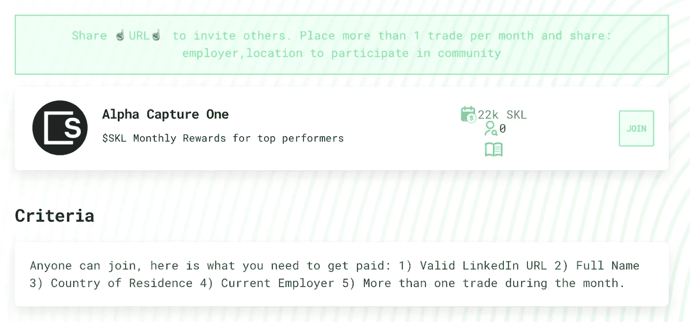
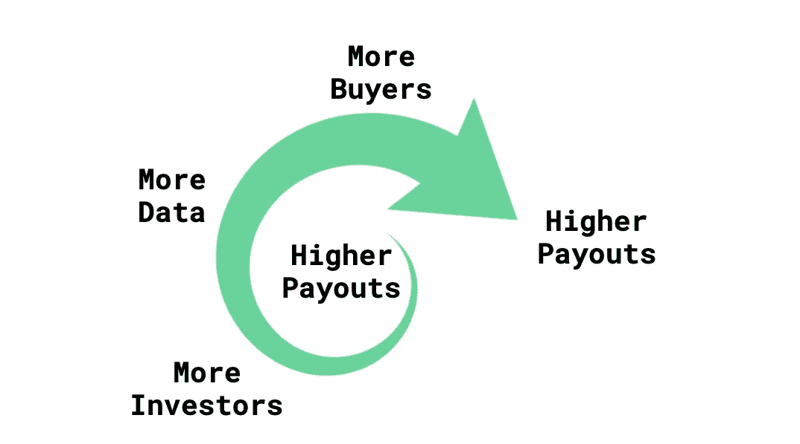

# 将你的投资想法货币化🚀

> 原文：<https://medium.com/coinmonks/monetize-your-investment-ideas-1bedd71249e8?source=collection_archive---------5----------------------->

## 分享关于 Covey 和 Earn 的想法

在一个被称为阿尔法捕获的自动化过程中，投资银行和经纪公司垄断了向投资公司提供创意的报酬。精英政治现已向所有人开放。从今天起，任何对市场感兴趣的人都可以建立并监控自己的模拟/虚拟投资组合。使用 Alpha Capture One 平台，那些拥有最强跟踪记录的人可以因为他们的想法而获得奖励。拥有最佳业绩记录的分析师被鼓励在 Covey 申请工作，加入基于业绩的投资世界。

## 柯维是什么？

Covey 是在寻找最好的投资者。我们给投资者一个模拟投资组合来跟踪和分享他们的投资想法。投资者被组织成社区(大学、前雇主、兴趣..)在那里他们学习并与他人竞争。我们的目标是让最好的投资者通过工作和直接支付(也叫阿尔法捕捉)来获得回报。

柯维认为，像 Alpha Capture 这样的精英制度应该对所有人开放，所以我们正在用 Alpha Capture One 向散户开放这个行业！

# 投资者会赚多少？

在我们的第**个月，即 2021 年 9 月**，Covey 将支付大约**8000 美元**。随着社区价值的增长，我们希望每个月都能增加支出。我们使用一种算法，根据参与度、创意质量、总回报和波动性向投资者支付报酬。AC1 的前 10-20%的投资者将获得报酬，预计第一名将获得 2000-3000 美元。排行榜和支付将是透明的，我们要求你通过我们创造精英统治的行动来评判我们。

# 如何参与？

前往阿尔法捕捉一(【covey.io/ac1】)并点击右上角的“加入”。你需要分享一个有效的 LinkedIn 网址、姓氏和名字、居住国、雇主和一套投资理念。

# 如何获得报酬？

Covey 希望世界上任何地方的任何人都能加入，不管他们的背景如何。我们还希望对创造一个真正的精英管理负责，因此我们所有的支付都是公开的，任何人都可以使用以太坊区块链看到。第一轮奖励将在月底后的三到五天内以 SKALE 代币的形式发放。截至 2021 年 9 月 8 日，我们的第一个月将支付 22，500 枚价值 0.35 美元的 SKALE 代币(价值 8000 美元)。为了兑现，投资者只需要一个交易所账户(即比特币基地或币安)，他们可以将奖励存入以太坊地址。别担心，柯维会拿着你的奖励，等你准备好了再帮你套现。

# 为什么用 SKALE 代币支付？

Covey 是在寻找最好的投资者。搜索对任何人都是公开透明的。除了我们所有的支付都是透明的之外，我们还将所有投资者的想法记录在一个不可变的账本中，因此任何人都可以访问这些数据。

我们需要一个快速、不变、开放的区块链来做到这一点，所以我们与 Skale 合作来发布我们的交易并帮助结算我们的奖励。为了庆祝我们与 Skale 的合作，我们的第一轮奖励将以$SKL 代币支付。

# 接下来是工作

优秀的投资者会因为他们的想法而获得报酬，我们希望最好的投资者能够根据他们的业绩记录找到工作。

# 每月 8000 美元是一个开始，我们希望更多

越多的大型基金看到了散户投资者想法数据的价值，我们分配给投资者的奖励就越高。加入 AC1，建立一个高质量想法的社区。

> 加入 Coinmonks [电报频道](https://t.me/coincodecap)和 [Youtube 频道](https://www.youtube.com/channel/UCbyDhTbOiKh2iUMKBi4-4Zg)了解加密交易和投资

## 另外，阅读

*   [尤霍德勒 vs 科恩洛安 vs 霍德诺特](/coinmonks/youhodler-vs-coinloan-vs-hodlnaut-b1050acde55a) | [Cryptohopper vs 哈斯博特](https://blog.coincodecap.com/cryptohopper-vs-haasbot)
*   [麻雀交换评论](https://blog.coincodecap.com/sparrow-exchange-review) | [纳什交换评论](https://blog.coincodecap.com/nash-exchange-review)
*   [加密货币储蓄账户](/coinmonks/cryptocurrency-savings-accounts-be3bc0feffbf) | [赌注加密](https://blog.coincodecap.com/staking-crypto) | [加密交易机器人](https://blog.coincodecap.com/best-crypto-trading-bots)
*   [BigONE 交易所评论](/coinmonks/bigone-exchange-review-64705d85a1d4) | [CEX。IO 审查](https://blog.coincodecap.com/cex-io-review) | [Swapzone 审查](/coinmonks/swapzone-review-crypto-exchange-data-aggregator-e0ad78e55ed7)
*   [最佳比特币保证金交易](/coinmonks/bitcoin-margin-trading-exchange-bcbfcbf7b8e3) | [比特币保证金交易](https://blog.coincodecap.com/bityard-margin-trading)
*   [加密保证金交易交易所](/coinmonks/crypto-margin-trading-exchanges-428b1f7ad108) | [赚取比特币](/coinmonks/earn-bitcoin-6e8bd3c592d9) | [Mudrex 投资](https://blog.coincodecap.com/mudrex-invest-review-the-best-way-to-invest-in-crypto)
*   [WazirX vs coin dcx vs bit bns](/coinmonks/wazirx-vs-coindcx-vs-bitbns-149f4f19a2f1)|[block fi vs coin loan vs Nexo](/coinmonks/blockfi-vs-coinloan-vs-nexo-cb624635230d)
*   [BlockFi 信用卡](https://blog.coincodecap.com/blockfi-credit-card) | [如何在币安购买比特币](https://blog.coincodecap.com/buy-bitcoin-binance)
*   [火币交易机器人](https://blog.coincodecap.com/huobi-trading-bot) | [如何购买 ADA](https://blog.coincodecap.com/buy-ada-cardano) | [Geco。一次审查](https://blog.coincodecap.com/geco-one-review)
*   [加密副本交易平台](/coinmonks/top-10-crypto-copy-trading-platforms-for-beginners-d0c37c7d698c) | [五大 BlockFi 替代方案](https://blog.coincodecap.com/blockfi-alternatives)
*   [CoinLoan 点评](https://blog.coincodecap.com/coinloan-review)|[Crypto.com 点评](/coinmonks/crypto-com-review-f143dca1f74c) | [火币保证金交易](/coinmonks/huobi-margin-trading-b3b06cdc1519)
*   [Bybit vs 币安](https://blog.coincodecap.com/bybit-binance-moonxbt)|[stealth x 回顾](/coinmonks/stealthex-review-396c67309988) | [Probit 回顾](https://blog.coincodecap.com/probit-review)
*   [顶级付费加密货币和区块链课程](https://blog.coincodecap.com/blockchain-courses)
*   [OKEx vs KuCoin](https://blog.coincodecap.com/okex-kucoin) | [摄氏替代品](https://blog.coincodecap.com/celsius-alternatives) | [如何购买 VeChain](https://blog.coincodecap.com/buy-vechain)
*   [币安期货交易](https://blog.coincodecap.com/binance-futures-trading)|[3 commas vs Mudrex vs eToro](https://blog.coincodecap.com/mudrex-3commas-etoro)
*   [如何购买 Monero](https://blog.coincodecap.com/buy-monero) | [IDEX 评论](https://blog.coincodecap.com/idex-review) | [BitKan 交易机器人](https://blog.coincodecap.com/bitkan-trading-bot)
*   [币安 vs 比特邮票](https://blog.coincodecap.com/binance-vs-bitstamp) | [比特熊猫 vs 比特币基地 vs Coinsbit](https://blog.coincodecap.com/bitpanda-coinbase-coinsbit)
*   [如何购买 Ripple (XRP)](https://blog.coincodecap.com/buy-ripple-india) | [非洲最好的加密交易所](https://blog.coincodecap.com/crypto-exchange-africa)
*   [非洲最佳加密交易所](https://blog.coincodecap.com/crypto-exchange-africa) | [胡交易所评论](https://blog.coincodecap.com/hoo-exchange-review)
*   [eToro vs robin hood](https://blog.coincodecap.com/etoro-robinhood)|[MoonXBT vs Bybit vs Bityard](https://blog.coincodecap.com/bybit-bityard-moonxbt)
*   [Stormgain 回顾](https://blog.coincodecap.com/stormgain-review) | [Bexplus 回顾](https://blog.coincodecap.com/bexplus-review) | [币安 vs Bittrex](https://blog.coincodecap.com/binance-vs-bittrex)
*   [Bookmap 评论](https://blog.coincodecap.com/bookmap-review-2021-best-trading-software) | [美国 5 大最佳加密交易所](https://blog.coincodecap.com/crypto-exchange-usa)
*   [如何在 FTX 交易所交易期货](https://blog.coincodecap.com/ftx-futures-trading) | [OKEx vs 币安](https://blog.coincodecap.com/okex-vs-binance)
*   [如何在势不可挡的域名上购买域名？](https://blog.coincodecap.com/buy-domain-on-unstoppable-domains)
*   [印度的秘密税](https://blog.coincodecap.com/crypto-tax-india) | [altFINS 审查](https://blog.coincodecap.com/altfins-review) | [Prokey 审查](/coinmonks/prokey-review-26611173c13c)
*   [区块链 vs 比特币基地](https://blog.coincodecap.com/blockfi-vs-coinbase) | [比特坎评论](https://blog.coincodecap.com/bitkan-review) | [币安评论](/coinmonks/binance-review-ee10d3bf3b6e)
*   [Coldcard 评论](https://blog.coincodecap.com/coldcard-review) | [BOXtradEX 评论](https://blog.coincodecap.com/boxtradex-review)|[uni swap 指南](https://blog.coincodecap.com/uniswap)
*   [阿联酋 5 大最佳加密交易所](https://blog.coincodecap.com/best-crypto-exchanges-in-uae) | [SimpleSwap 评论](https://blog.coincodecap.com/simpleswap-review)
*   购买 Dogecoin 的 7 种最佳方式
*   [最佳期货交易信号](https://blog.coincodecap.com/futures-trading-signals) | [流动性交易所评论](https://blog.coincodecap.com/liquid-exchange-review)