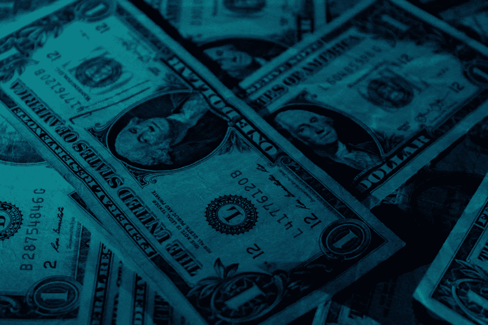

# 金钱、货币和价值

> 原文：<https://medium.com/coinmonks/money-currency-and-value-ed255aebf7a4?source=collection_archive---------9----------------------->

(这篇作品于 2017 年 7 月首次发表在 projectUBU 的[博客](https://www.projectubu.com/blog/money-currency-and-value/)上)

Photo by [Aidan Bartos](https://unsplash.com/photos/v9rZ3Yz6fSg?utm_source=unsplash&utm_medium=referral&utm_content=creditCopyText) on [Unsplash](https://unsplash.com/search/photos/money?utm_source=unsplash&utm_medium=referral&utm_content=creditCopyText)

# “你回首看得越远，你就有可能看得更远”——温斯顿·丘吉尔

作为人类，我们在社会上习惯于很少被质疑的货币体系。假设你认识一个五岁的孩子，如果他们问你“钱从哪里来”，你会怎么回答？停下来想一想你会如何回答这个问题。

当我试图简化复杂事物时,“像我五岁一样解释给我听”测试是我的首选。这是一项具有智力挑战性的批判性思维练习。它迫使你去面对那些你一直认为理所当然的假设——那些你从未质疑过，却因为其他人都质疑过而无意识接受的事情。

在货币出现之前，我们根据需求交换商品，这是由供求关系决定的。你有一头奶牛和一桶多余的牛奶。我有鸡和一打备用鸡蛋。我们根据一种商品的过剩和另一种商品的短缺进行商品交易。随着贸易路线的扩展，交换实物商品的物流变得过于复杂，因此货币以多种形式出现，从贝壳到金银和纸币。货币成为标准化交换牛奶、鸡蛋、纺织品、建筑材料、劳动力、运输——即商品和服务——的复杂性的一种简单方式。

货币既是记账单位，也是交易媒介，具有四个特征:可携带性、可分割性、持久性和可替代性。货币也有这些特征，而且它与货币的区别在于它是价值的储存手段——价值来源于稀缺性。自从放弃金本位制以来，因为政府可以并且确实印刷货币，它们的价值在不断减少。自 1913 年美联储创立以来，所谓的金本位货币美元已经贬值了 95%，也就是说，美元丧失了 95%的购买力。因此，有人会说，货币有内在价值，而货币没有。

货币是建立在信任的基础上的，这种信任来源于对“系统”的信任——这是给予法定货币官方法令的权威。这种信任正在迅速减少，因为普通人发现他们只不过是系统中的工蚁。政治不稳定的背后是经济不平等。随着全球经济和货币如此紧密地交织在一起，这种信任丧失的规模和速度正在以指数级的速度加快。

一旦信任遭到破坏，基于信任的系统就很容易崩溃。战后德国、阿根廷、希腊、津巴布韦和委内瑞拉政治引发的恶性通胀就是明证。没有“大到不能倒”这种东西。2007/2008 年，世界见证了银行体系的系统性崩溃。未来纳税的几代人将为数万亿美元的纾困付出沉重代价，因为政府只是印了更多的货币，从而将危机推得更远。除了后代劳动的潜在价值之外，支撑这种 QE 骗局的没有其他价值。我们向我们的孩子借钱来维持现状。

## 乔治·华盛顿说过，“没有哪一代人有权利背负超过其自身生存期间所能偿还的债务。”

自从金本位制被废除后，这一原则被愉快地抛弃了。当政府让一种货币贬值时，投资者会蜂拥回到黄金等公认的价值储存手段。但是黄金本身并不能支撑世界上所有的货币。

那么，如果金钱是我们衡量价值的方式，那么价值是以什么标准来衡量的呢？这是一个无形的概念，因为它是相对的。你不能在不参考其他东西的情况下描述某样东西的价值——比如钱。人们通过他们愿意牺牲的其他东西的数量来表达他们对某样东西的价值，比如牛奶和鸡蛋的交换。一个项目的市场价格是在买家和卖家用其他东西来表达他们的价值时发现的。金钱应该是最无摩擦的资产，但因为大多数价值交换都是通过监管中介进行的，所以事实并非如此。由于信任度下降、对可持续性的担忧、摩擦、贬值和控制，金融体系正经历着从中央集权到分散网络的前所未有的挑战。区块链技术的出现使这成为可能。

我们认为有价值的东西是感性的，而不是理性的。观念首先是心理上的，然后是社会上的，最后是经济上的。这是黄金和钻石的故事。为什么黄金的实际应用如此有限，却被认为具有如此的内在价值？只有 12%的黄金用于工业目的，相比之下，白银的这一比例为 56%。稀缺性？白银的年供应量是黄金的 8 倍。地壳中总的银储量估计是金储量的 17 倍。这两种稀缺性指标都无法解释为什么只有五分之一有用的黄金价值却是 76 倍(以价格衡量)。这些金属的区别在于黄金是生产出来的，而不是消耗掉的。白银是工业商品，所以需要，但黄金是渴望的。

黄金和白银都具有货币的特性，但这并不决定它们的价值。基于供应指标的逻辑表明，黄金的价值应该是白银的 8 至 17 倍。黄金价值翻了 76 倍是因为有足够多的人相信它是如此。对于我们这个物种来说，如果有足够多的人相信某样东西，它就存在，这是不言而喻的。超自然的神是数十亿人的现实，尽管没有科学证据。智慧文明认为地球是平的，尽管有科学证据证明并非如此。人们接受周围其他人的假设，这样观念就变成了牢固的社会信念，反过来又被束缚在经济学中。一个很好的商业例子是德比尔斯 70 年前的著名主张“钻石是永恒的”，一家公司说服了数亿人，男人把钻石戴在求婚的女人的手指上是合适的。

区块链技术是一个大趋势，它允许其他宏观趋势安全地扩展、融合和结合。它迎来了网络的下一个阶段，3.0 或网络经济。它实现了更加分散和自主的基础设施，开启了以前不可能的经济模式。区块链技术代表了从集中式和人类中介系统到算法可信、去中心化和自治网络的根本转变。比特币的价格在不到一年的时间里从 1000 美元飙升至 19000 美元。许多人认为这是郁金香狂热，但这忽略了该单位的潜在采用。推动加密货币激增的是大规模采用。日本、新加坡、加拿大、韩国和澳大利亚政府已经或正在采取措施，不仅采用加密技术，而且开发加密技术。随着这些受到严格监管的市场放松，投资者正像公牛一样一头冲进一个金融言论自由的新时代——一个没有政府形式的机构政治影响、没有监管者和投机者、信任被让给由利益相关者组成的社区的时代。

当我出售我的第一套房子以适应后代的快速到来时，房地产经纪人给我上了一堂关于市场价值概念的宝贵课:“你的房子值某人准备支付的价格，”她附和道。有数十亿人可能愿意为加密货币支付要价，这正是因为，与菲亚特不同，对价值的感知与他们影响社区的能力密不可分。没有一种加密货币能充分满足货币或金钱的特征，但这种情况正在改变。可以说，对比特币等一些货币来说，它们唯一未被证实的特征是价值储存，因为 10 年的时间不足以提供足够的经验证据。如果你很早就投资了比特币或以太币，你肯定会说它不仅是一种通胀对冲工具，还是一颗创造财富的彗星。今天的投资很可能是你一生中最好的投资类别，前提是你对波动性有兴趣并做多。

cryptos 的另一个好处是，如果投资者不喜欢一个社区，他们可以选择其他社区。作为一种投资策略，大多数玩家在任何情况下都会有一个多元化的投资组合。加密货币有望成为政治民主国家未能提供的民主工具。有了这样的影响力，一个更加平等、更加繁荣的世界的前景将无限光明。