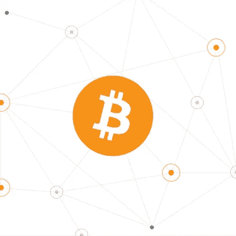

# 钱只是一张纸

> 原文：<https://medium.com/coinmonks/money-is-just-a-piece-of-paper-2bfb23c05354?source=collection_archive---------4----------------------->

## 从易货到法定货币再到加密货币。

有些人一生都在追逐金钱。

如果你真的仔细想想，硬币和钞票没有任何价值- **它们是符号**。

金钱没有任何 [**内在价值**](https://www.investopedia.com/terms/i/intrinsicvalue.asp#:~:text=Intrinsic%20value%20is%20a%20measure,market%20price%20of%20that%20asset.) ，它绝不直接提供热量、电力、卡路里等。

金钱仅仅是一种社会结构，它有价值的唯一原因是社会同意它有价值。

$n 不是一个固定的数额，今天值$n，但是明天可能值$ n-x %*(n 是美元价值，x 是通货膨胀)*。

考虑到这一点，有人可能会问，5 美元到底是多少？以某种可预测的速度减少的商品或服务的数量？

《华盛顿邮报》的克里斯托弗·英格拉哈姆描绘道，与它们的价值相比，我们创造的一些硬币的生产成本更高。

如果真的是这样，钱的真正价值在哪里？

看看这张图，**价值在哪里？**

真正的价值在于电工提供的服务的**质量**和馅饼的**味道**。货币本身不是价值，它仅仅是价值的象征。

## **钱是什么？**

很简单。金钱只是一种工具，用来:

*   传达产品或服务的价值(例如，它真的有多好？)
*   与他人交换价值(例如，我的时间值多少钱？或者我刚刚烤的馅饼值多少钱？)
*   **存储**价值(例如，我创造了多少价值？)

现在，一个有趣的思考方式是，如果金钱只是衡量一件东西有多值钱的一种方式，*一个电工在某人的房子里安装一盏油灯会值多少馅饼？*

把派当成一种支付方式有点奇怪，不是吗？

这是在金钱观念出现之前社会的运作方式。

# **金钱的历史**

回想一下公元前 9000 年。现金之前有**物物交换**。

以物易物在某种程度上是一种货币形式，只是没有流动性和高速度。它缺少的是一个可分割的、通用的交换媒介。

物物交换的概念是因为如果 Bob 有 Alice 想要的东西，她需要一种方法来说服 Bob 给她。

为了做到这一点，爱丽丝会和鲍勃交换价值相等的东西。

但是，如果你把它放大，你会发现这变得非常困难。我怎么知道我的电工在 5 分钟内修好一个灯泡应该得到多少馅饼？

或者当我不在家的时候，有一个交易的机会，但是我想交易的东西太大了，所以我不能带着它。我刚刚*失去了一个*得到我想要的东西的机会。

古代中国人认识到了这个问题，开始使用**贝壳**作为“钱”。与其失去机会，我还不如把这些贝壳给别人，而不是去做交易。

在这个时候，互联网和全球通信还不存在，所以这个想法是西方文明所不知道的

Gold Coins | Image Source: [blog.taxact.com](https://blog.taxact.com/buy-gold-coins-for-investments/)

在西方，人们慢慢停止使用不易腐烂的物品进行交易，最终开始使用黄金。但是，黄金太重了，不能一直带在身上，所以在公元 200 年，一种更小的硬币诞生了。这些硬币被称重并印上它们的价值，以保持对每枚硬币价值的共识。

这就是现代现金概念的来源(硬币不再与黄金挂钩)。

## **法定货币**

在当今世界，每个国家都有自己的货币，称为法定货币。

术语**法定货币**来源于拉丁语*法定*，意思是由权威决定*(在这种情况下，决定价值的权威是政府)。*

法定货币是政府发行的货币，没有像黄金这样的商品作为支持。货币由中央银行控制，这使得他们能够控制经济，因为他们可以决定实际印刷多少钱。

# **一项创新:比特币**

我相信每个人都听说过**加密货币**，但来到这里我们将进入更多的细节。

**比特币**是一种[数字货币](https://www.investopedia.com/terms/d/digital-money.asp)，它是由神秘的人或团体中本聪(没人知道是谁，也不知道这是什么……)**阅读* [*白皮书*](https://bitcoin.org/bitcoin.pdf) *了解更多**

网络货币是完全去中心化的，这意味着它不受 T2 公司或 T4 中央机构的控制(就像法定货币由政府控制一样)。

它由 [**区块链**](https://manroopkalsi.medium.com/blockchain-101-b51a75780567) 技术支持，该技术允许货币真正保持**去中心化**，允许用户以*低费用*和*更快的处理时间*完成交易。用户不会被迫信任单个对应方来参与网络。

比特币没有与之相关联的实物资产，它只有保存在公共账本(区块链)上的余额，保持完全透明——任何人都可以看到它，任何人都可以加入网络。尽管透明，用户的身份可能不会公开。比特币不是匿名的，但事实上它是匿名的

我还要指出的是，虽然任何人都可以看到网络上任何用户的账户活动，但这些个人的身份可能不会公开。虽然许多人错误地认为比特币是匿名的，但事实上它是假名。

截至 2021 年 1 月 17 日:1 比特币相当于 45659.39 加元。由于它的高受欢迎程度，各种开发者已经创造了上百种其他虚拟货币。这些货币被称为 [**代用币**](https://www.investopedia.com/terms/a/altcoin.asp) 。

如果你想完全理解比特币的工作原理，理解底层区块链技术的工作原理是必不可少的。

> 在这里阅读我关于[区块链](https://manroopkalsi.medium.com/blockchain-101-b51a75780567)技术的文章

比特币有什么意义？为什么与社会相关？

比特币提供了大量的优势，比如能够分散权力、省去中介、防篡改等等。

但是，我们今天将特别关注的优势是通货膨胀。

# 通货膨胀？那是什么？

**通货膨胀**是指当**购买力**下降时，随着货币*价值*下降。

简单来说，在任何给定的时间，市场上总有一定数量的货币在流通。当一个 [**国家负债**](https://www.investopedia.com/updates/usa-national-debt/#:~:text=That's%20because%20as%20a%20country's,them%20to%20issue%20more%20debt.) 时，这个国家需要更多的钱，政府倾向于开始*印刷更多的货币。*

当这种情况发生时，这种**减少了流通中货币的价值**,因为现有持有的美元变得“稀释”。

当某种东西*稀有*时，它的价值更高，但当它变得更丰富时(比如印了更多的钱)，它就会以*减少流通中的钱的价值*而告终。

随着时间的推移，这也会降低消费者的购买力(购买产品和服务的经济能力)。

例如，如果我一年有 1 美元，第二年我的 1 美元只能购买价值 98 美元的产品。

在任何给定的时间，都没有办法决定一个政府决定印多少钱。

考虑到这一点，当看法定货币时，永远不知道一个人的购买力会因为通货膨胀而下降多少。

比特币与法定货币的区别在于，它有一个固定的通胀率。

每次交易被验证时，**矿工**(验证交易的人)因验证该区块而获得奖励。除此之外，每 4 年，区块奖励将减半，目前为 6.25 ( *，预计 2024 年减半至 3.125*)。

在网络上，没有一个参与者可以为了个人利益而自私地改变软件，而是，人们可以向社区提出改变，只有当足够多的网络成员认为这是最有益的，这才有可能获得采纳——这允许真正可预测的通货膨胀时间表。相比之下，央行运行的“算法”对未来毫无透明度。

在任何时候，经济中的每个人都知道流通中的比特币总量。设定的**通货膨胀时间表**源于挖掘过程(验证区块链上的交易)。这有助于减轻消费者的通货膨胀风险。

## 货币的未来

纵观历史，从手机到笔记本电脑，以及更多的东西，都广泛地体现了技术的巨大变化。目前，许多人猜测**加密货币**有可能取代我们当前的*中央集权*金融系统。

这允许每个人对他们自己的数据拥有完全的权力，同时减轻银行所需的高额费用。

此时此地——这就是分散金融的兴起。

# 我们连线吧！

> *如果你喜欢阅读这篇文章或学习新的东西，我很乐意在* [*LinkedIn*](https://www.linkedin.com/in/manroop-kalsi/) *上联系。如果你想了解我的新文章或项目，你可以订阅我的每月简讯* [*这里*](https://landing.mailerlite.com/webforms/landing/l4f5k1) *！*

## 另外，阅读

*   谁创造了世界上所有的钱？