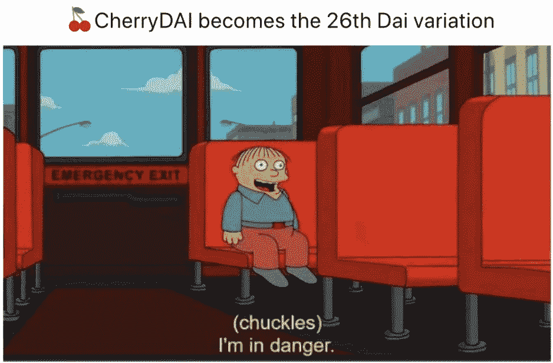
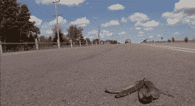
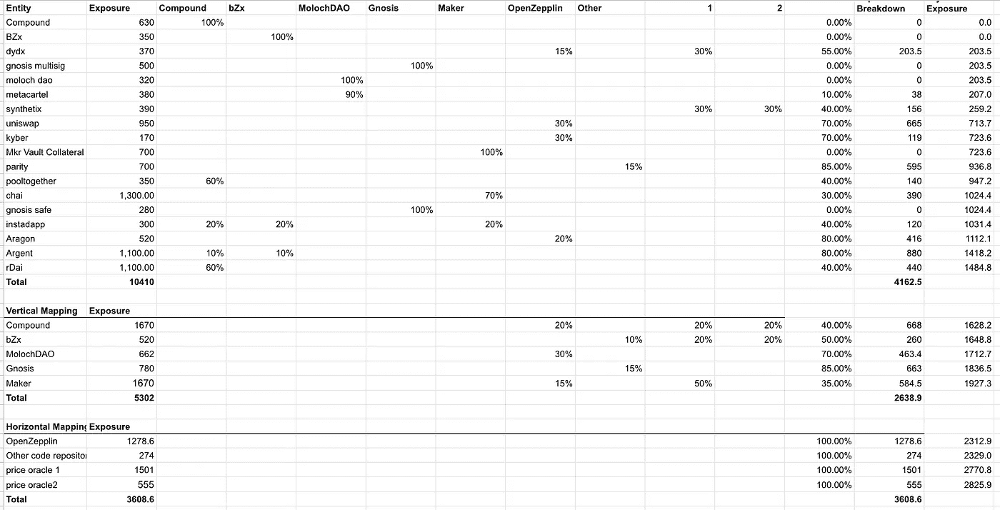

# 金钱叠衣服

> 原文：<https://medium.com/coinmonks/money-jenga-d0dd00182d16?source=collection_archive---------1----------------------->

我喜欢 DeFi，它所开启的设计空间让人无法完全理解，而且似乎每周都有一些新奇的产品或服务推出。其中只有一小部分会被主流采用或积累有意义的流动性，但这种通过成功和失败的迭代是找到令人信服的用例所必需的。我的想法是，这些产品正在做一些全新的事情，而不是那些重新构建传统金融市场结构的产品将会流行起来，但这不是本文的重点。

DeFi 被称为金钱乐高积木，所有不同产品的组合是整个空间的力量。一个新产品可以增强几十个现有产品，这是一个令人信服的正和领域。令人兴奋的是，尽管对 DeFi 各种产品给用户带来的真实风险有(正当的)担忧。大多数情况下，人们认为潜在的黑客攻击或漏洞会导致损失事件，往好了说会损害一些人的钱包，往坏了说会导致整个系统崩溃。

虽然特定损失事件的风险非常值得担心，但只有当风险的相关性很高时，任何一个事件才会成为对整个系统的系统性威胁。 [DeFi score](https://defiscore.io/) 正在做的工作非常有趣，对特定服务非常有用，但只是一个计算的输入，需要这个计算来了解整个空间面临的风险。

# 所以让我们做点什么吧

我在对冲基金工作了 11 年，从事交易、合规、分配、风险管理等工作。平台。那几年跨越了 08/09 年的金融危机，只有一件事是清楚的。这些基金不知道如何正确评估风险，监管者知道的就更少了。我不是说我愿意，但我愿意说我知道我不愿意，并从那里开始。在这个早期阶段，重要的是开始研究正在建立的新的分散化金融体系的选择。随着数据可用性和透明度大幅提高，我相信可以找到一个合理的解决方案。以下是我对一般风险拓扑开始的想法。

## 垂直相关

这款 app 还依赖哪些应用和服务？如果我为 [pooltogether](https://www.pooltogether.com/) 评估风险，潜在损失风险的很大一部分来自复利。因此可以说，任何一笔集体存款都有 60%的复合风险(在总的损失概率中，复合风险的可能性有多大)。这可以进行 n 层集成。

## 水平相关

一个应用程序与其他应用程序共享哪些输入？

1.  共享一个公共的开源库
2.  共享价格神谕

审计员可以在这里输入(也许他们有一个盲点或者使用了一个工具，最终发现遗漏了一些东西)，但是我不认为它足够重要到可以包括在内。

## 特制调味汁

所有的应用程序都有自身的风险。因此，虽然其他应用程序、价格预测等的曝光率。被分配了一定的比例来代表他们的特殊酱料。

## 只是捏造事实

这不是一个特别科学的评估。我认为最初这些百分比可以由一群知识渊博的人来设定。在未来，其中一些可以自动化，其余的留给炮轰游戏来众包结果。只要方向正确，任何误判的影响都是最小的。

# 然后呢？

出于我自己的目的，我正在研究一个风险转移协议，该协议将为用户购买他们正在使用的应用程序的损失保险提供选项。为了向资本提供者提供合理的溢价和有吸引力的回报，它必须是低抵押的，同时仍然灌输信心，即它将能够为所有有效的索赔服务。这需要多样化和真正的多样化。我正在为 DeFi 中的多样化调整曝光制作一个 excel 模型，但还是有点粗糙。如果你想看看草稿，并提供一些反馈，请不要犹豫。

veeeerrrrry rough 1st crack. If anyone wants to maintain a decentralized version, hit me up!

[推特:@tompkins.jon](https://twitter.com/Tompkins_Jon)

[TG:t.me/@jontom](https://t.me/@jontom)

> [在您的收件箱中直接获得最佳软件交易](https://coincodecap.com/?utm_source=coinmonks)

