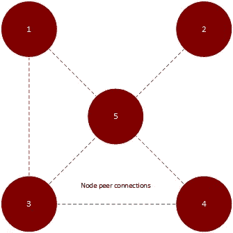
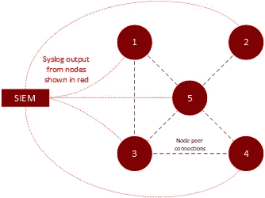
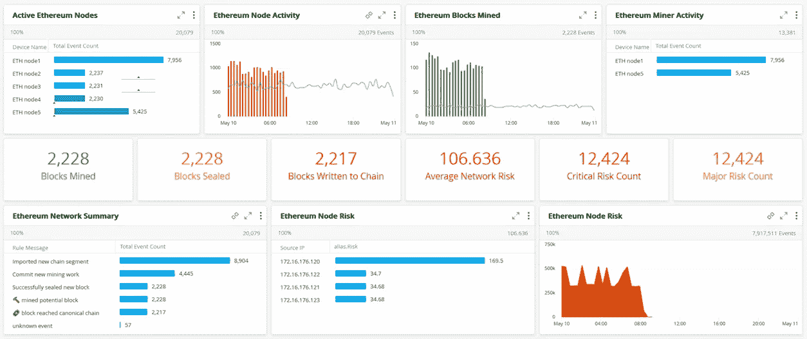
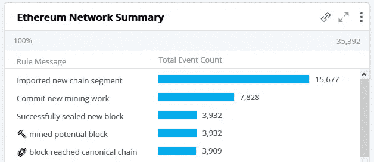
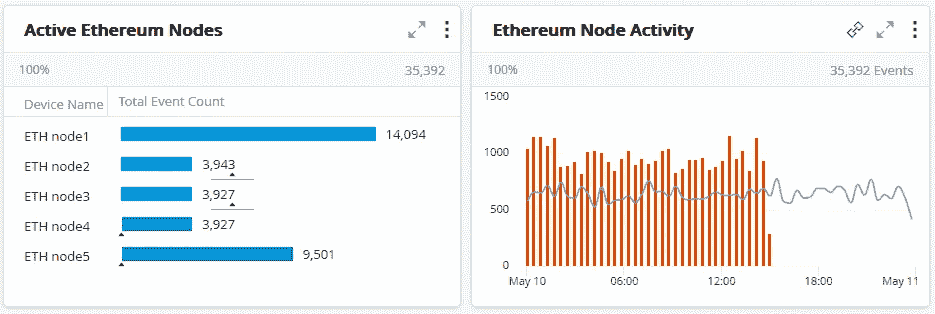
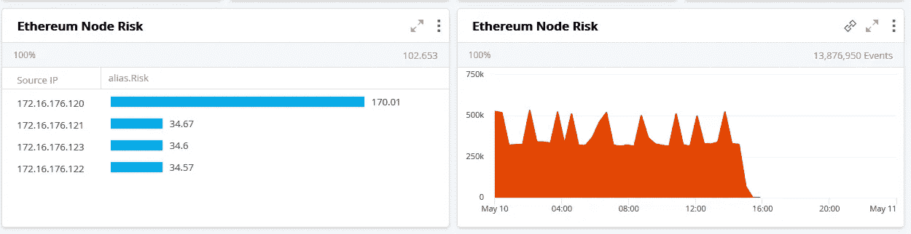
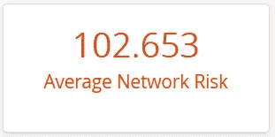
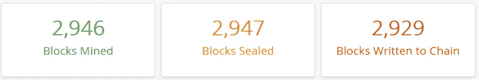

# 使用 SIEM 监控区块链

> 原文：<https://medium.com/coinmonks/monitoring-a-blockchain-with-a-siem-6a0a0adf6ac5?source=collection_archive---------1----------------------->

Photo by [Launchpresso](https://unsplash.com/@launchpresso?utm_source=unsplash&utm_medium=referral&utm_content=creditCopyText) on [Unsplash](https://unsplash.com/s/photos/blockchain?utm_source=unsplash&utm_medium=referral&utm_content=creditCopyText)

在本文中，我将探讨使用传统 SIEM 工具监控区块链网络的可能性。但首先，一些背景..

# **什么是区块链？**

冒着疏远非技术读者的风险，区块链是一种分布式数据结构，它存储具有加密完整性保证的记录。这意味着对手不可能在不被发现的情况下改变以前的记录。该数据结构然后在许多实体之间以没有单个实体保持控制或权限的方式共享。因此是*去中心化*。

Photo by [fabio](https://unsplash.com/@fabioha?utm_source=unsplash&utm_medium=referral&utm_content=creditCopyText) on [Unsplash](https://unsplash.com/s/photos/tech?utm_source=unsplash&utm_medium=referral&utm_content=creditCopyText)

围绕区块链技术的大肆宣传主要是由于各种加密货币的增长。这些都是由*的公共区块链网络*促成的，比如比特币和以太坊。*专用区块链网络*是由一个组织或一组参与组织(称为“财团”)[实施的网络，旨在促进更高效的业务运营。这些被称为*许可的*区块链。这些网络将已经在运营成员之间固有的信任基础上运行。然而，经营一家私人区块链仍有一定的风险。](https://www.tradefinanceglobal.com/posts/the-application-of-blockchain-in-trade-finance-opportunities-and-challenges/)

尽管存在风险，许多组织仍然希望利用私有区块链或**分布式账本技术(DLT)** [的优势来提高运营和业务绩效。](https://link.springer.com/article/10.1007/s12525-019-00386-3)

但是他们是如何被监控的呢？

# **什么是 SIEM？**

一个 **SIEM(安全信息和事件管理)** [是通过日志收集和分析](https://logrhythm.com/what-is-siem/)来执行威胁检测的工具。SIEM 工具已经存在了几十年。它们通常执行以下任务:集中日志收集和分析、仪表板可视化、日志关联和安全警报。SIEM 工具通常还捆绑了其他有用的东西，如分析和内置的威胁检测功能。我将探索这些特性，并评估它们在区块链网络中的应用。

# **为什么要监控一个区块链？**

由于其分散性，区块链网络呈现出很大的攻击面。在专用区块链网络的情况下，如果对手利用网络中的漏洞，则存在重大经济损失的风险。

除了软件、网络和协议漏洞，还有区块链治理的问题。监控私有区块链网络上的活动将有助于降低风险。这将使区块链成员专注于高效的业务运营。

对公共区块链网络的理论攻击已经进行了许多研究。许多攻击都是基于所谓的 **51%攻击**。在这种情况下，攻击者拥有网络的大部分散列能力，因此可能能够操纵或影响块的创建。

值得注意的是，51%的攻击只与利用**工作证明(PoW)** 共识机制的区块链网络有关。在专用区块链网络中，共识机制不可能是 PoW 方案。这意味着不存在比特币和以太坊网络中的“挖掘”概念。

然而，仍然存在这样的风险，即对手可能出于恶意企图操纵区块链节点的行为。为了降低这种风险，我们需要监控异常的网络活动，这就是我们现有的 SIEM 工具可以发挥作用的地方。

# **我们如何监控一个区块链？**

许多[工具已经存在来提供对区块链网络的监控](https://github.com/cubedro/eth-netstats)。然而，这些工具通常专注于提供与网络运行状况相关的特定指标。

SIEM 的内置威胁检测功能非常适合在区块链上提供威胁检测。

为了进一步探索这个想法，我建立了一个小而实用的私人区块链网络。专用网络是一个五节点以太网。每个节点都是一个 Ubuntu 虚拟机。每个节点都运行着一个名为 **geth** 的[以太坊基金会 go-ethereum 实现的实例。其中两个节点被指定用于挖掘数据块，而另外三个节点用于维护分布式区块链。](https://github.com/ethereum/go-ethereum/wiki/geth)

Private Ethereum network

事实证明，当涉及到节点活动时，geth 控制台日志记录可能会相当冗长。对于这个实验，我使用 geth 的默认日志详细度。对于这个实验，我只需要将 geth 日志接收到 SIEM 中。为此，我将 geth 主机配置为通过 syslog 将其日志记录输出发送到 SIEM:

Syslog output from Ethereum nodes

在 SIEM 上，我配置了定制的正则表达式来解析日志输出并反映 geth 事件类型的重要性。然后，我设置了一个自定义仪表板来显示结果。

在那之后，我以这个结束:

Monitoring an Ethereum network in a SIEM

让我再详细解释一下。我的测试网络中的所有以太坊节点日志活动都显示在一个条形图中:

Ethereum node activity

我们可以对这些数据进行分析，首先将其分解为单个节点活动:

Event counts per Ethereum node

并且还显示值得注意的数据点，例如提交给以太坊共识链的交易总数:

Count of transactions submitted

# SIEM 分析

虽然这看起来很有趣，但它仍然只是向我们展示了特定的网络指标和运行状况。然而，这些信息对 SIEM 仍然很重要，因为它提供了足够的数据来制定**基线**。基线允许我们表示节点的*正常*日志行为，从而提供任何偏离基线的迹象。

使用 SIEM，我们可以应用分析，如**偏差分析。**这是将平均值与滚动时间窗口内之前的平均值进行比较的时候。偏差分析将提醒我们注意节点行为偏离先前观察到的情况。这是检测节点的敌对操作的一种方法。

为了对我的数据进行进一步分析，我们可以利用 SIEM 的**风险评分**功能为每个节点分配风险评分。风险评分将允许我们根据分配给 geth 日志中包含的值的风险分值的加权平均值，为每个节点分配一个风险值。随着时间的推移，这些值会相加，并考虑到在没有感知到风险行为的情况下风险分值的衰减。

Ethereum node risk scoring

在左侧，我们可以看到分配给每个节点的风险分值。我们还可以定义一个风险阈值，超过该阈值，节点就达到了临界风险。在左侧，我们可以看到风险评分的分布，它向我们展示了风险如何随着时间的推移而增加和减少。超过临界阈值的风险水平的增加将保证进一步的调查。

最后，如下图所示的计数器可以作为有效的仪表板技术，为普通观察者提供他们对正常行为的感知:

Risk score for the Ethereum network

在专用区块链网络中，实际事务之外的网络操作应该保持一致。尤其是与比特币等区块链公共网络的狂野西部相比。SIEM 包含的分析功能在识别区块链网络的异常活动方面非常强大。

# **对区块链网络的威胁**

现在，让我们来看看区块链网络面临的一些具体威胁，并讨论 SIEM 如何应对这些威胁。

## **现有交易操作**

由于加密技术的魔力，区块链本质上拥有分类帐的仅追加属性。如果对手试图删除或更改现有的交易，它将影响所有后续的块，并且是显而易见和容易捕捉的。在这种情况下，如果区块链验证失败，节点可能会生成一个事件，为此我们可以在 SIEM 上配置一个警报。

## **双花攻击**

在加密货币的环境中，双重消费攻击是指攻击者试图连续两次消费同一个“硬币”。

这可能适用于另一个区块链网络，在该网络中，攻击者可能会尝试两次执行相同的事务。同样，区块链实现的本质天生就解决了这个问题，事实上这个问题是 T2·中本聪的比特币论文 T3 的基础。这也是比特币矿工激励背后的基本原理。

在比特币网络中，为了防止重复消费，接收者必须等待，以确保交易出现在共识区块链上，从而确定交易已被接受。

由于节点会向网络广播新的事务，如果我们可以将事务公告与写入区块链的相同事务相关联(通过读取实际的区块链本身)，SIEM 就可以检测到双重事务尝试。

显然，这不适用于公共的区块链网络，但是在一个*私有的*区块链网络中，我们理论上可以通过不等待交易确认被写入共识链来加速整体运营，因为我们知道 SIEM 会检测到重复花费的企图，并且会有另一种针对违规方的非技术形式的追索权。

## **分叉攻击**

分叉攻击是指节点将提出一个包含备用事务的块。这背后的想法是，攻击者试图通过“分叉”链来使现有的事务无效。

然而，要使这种攻击成功，分叉链必须超过当前最长的链。在比特币的背景下，这与前面提到的理论上的 51%攻击有关。攻击者需要拥有大部分哈希能力，才能在比特币网络上发起攻击。

虽然这种特定类型的攻击不适用于专用区块链网络，但原理是相同的。也就是说，对手可以试图通过分叉链来操纵区块链。

要使用 SIEM 检测这一点，我们可以跟踪链上新数据块的创建，并检测节点何时提出更早的数据块。这将提醒我们注意潜在的分叉攻击:

Tracking block creation

值得注意的是，在这种情况下，每个节点都需要正确的日志记录配置，以便输出到 SIEM。SIEM 监控也将以集中的方式运行。这在某种程度上违背了区块链网络以分散方式运行的理念。然而，我还要指出，在一个专用的区块链网络中，节点不会是匿名的。在专用区块链网络中，节点已经在信任的基础上运行。这意味着集中配置、监控和管理不是不可能的。

# 结论

在监控区块链网络时，通过少量定制，传统 SIEM 工具可以提供大量价值。

我们可以通过探索将基于机器学习的分析应用于区块链网络产生的数据的可能性来进一步扩展这一想法。

但这将是未来实验的基础！

## 另外，阅读

*   [印度比特币交易所](/coinmonks/bitcoin-exchange-in-india-7f1fe79715c9) | [比特币储蓄账户](/coinmonks/bitcoin-savings-account-e65b13f92451)
*   [CoinDCX 点评](/coinmonks/coindcx-review-8444db3621a2) | [加密保证金交易交易所](https://blog.coincodecap.com/crypto-margin-trading-exchanges)
*   [CoinLoan 评论](/coinmonks/coinloan-review-18128b9badc4) | [YouHodler 评论](/coinmonks/youhodler-4-easy-ways-to-make-money-98969b9689f2) | [BlockFi 评论](/coinmonks/blockfi-review-53096053c097)