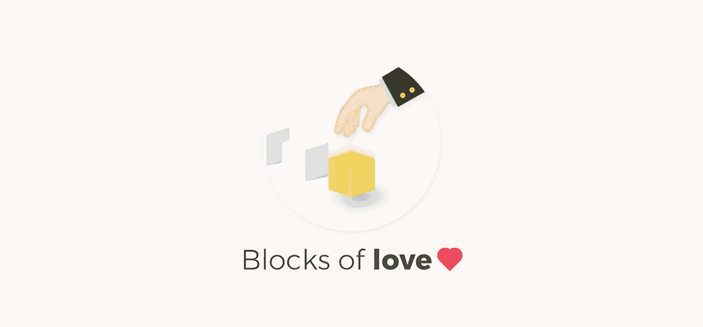

# 僧侣需要你的帮助

> 原文：<https://medium.com/coinmonks/monks-need-your-help-7440418d67ec?source=collection_archive---------7----------------------->

## 我们无缘无故地添加了一些禅宗语录😃

Image credit [Uttam Paswan](https://medium.com/u/6270ff4a645d?source=post_page-----7440418d67ec--------------------------------)

**我们的捐款地址-**

**BTC 地址**:**3 tpcjwicjwrphdfg 9598 xappctuhvpysn**

**ETH 地址**:**0x2c 82e 14352 e 98 c 931852d 9 bb 5 f 0760 e 36942 cc3c**

[**Gitcoin 授权**](https://gitcoin.co/grants/654/coinmonks)

## **我们是谁**

Coinmonks 是一个由其作者、读者和贡献者构建的社区。️我们在 coinmonks 是一个团队🐼，我负责编辑工作，Uttam Paswan 负责我们所有项目的设计。我在❤️建立社区(编码是我的全职工作)和乌坦❤️工作🍁 😉。

> “试图定义自己就像试图咬自己的牙齿。”艾伦·沃茨

## 我们在 Coinmonks 做的事情

我们发现有教育意义的区块链和秘密故事，与作家交谈，阅读故事，帮助作家把故事写得更好，[对它们进行分类，策划](/coinmonks/categorizing-coinmonks-content-for-better-curation-2e451477a1b4)并与世界分享。大约 1000 名作家贡献了超过 3300 篇关于 Coinmonks 的故事👏我们正在快速发展。我们❤️我们的作家和读者。

> 这是生活的真正秘密——全神贯注于此时此地你正在做的事情。不要称之为工作，要意识到这是一种娱乐。”——艾伦·沃茨

## 我们为什么要这么做

教育是我们的核心价值。我们所做的一切都是为了权力下放的❤️，以及它将把世界变好的想法，我们对此深信不疑。我们知道密码市场有很多 FUD 和错误信息😛我们希望通过 coinmonks 出版物提供教育内容来帮助教育社区。

> 你是什么样的人，就是你曾经是什么样的人。你将成为什么样的人就是你现在做什么。。-佛陀

## 我们需要什么

我们是一个非宣传性和非营利性的出版物，我们需要你的帮助来运行这个出版物，所以我们不必担心我们的财务状况，如果你喜欢阅读 Coinmonks，你可以捐赠我们。

> "意识是改变的最大动力。"艾克哈特·托尔

**我们的捐款地址-**

**BTC 地址**:**3 tpcjwicjwrphdfg 9598 xappctuhvpysn**

**ETH 地址**:**0x2c 82e 14352 e 98 c 931852d 9 bb 5 f 0760 e 36942 cc3c**

> 没有什么是完全独立存在的。一切都与其他一切相关。”

**其他平台**

我们在 [**twitter**](https://twitter.com/coinmonks) 上有社交活动，您可以在那里关注我们，了解最新的精彩故事。

*请在评论区告诉我们你对 Coinmonks 的看法，以及我们如何改进它，别忘了关注我们。*

