# Moolya ICO:燃烧的灰烬

> 原文：<https://medium.com/coinmonks/moolya-ico-burn-the-burnreturn-6a230a68b551?source=collection_archive---------1----------------------->

它始于一个谜。

各种加密影响者审查了 Moolya ICO，以换取免费的 Moolya 令牌。典型的有偿宣传安排。但是，当他们期望收到 50，000 个代币时，他们的以太坊钱包收到了一笔 833，333 MOOLYA 的[交易。按照 0.06 美元的 ICO 价格，这相当于 50，000 美元！](https://etherscan.io/tokentxns?a=0x778ecc4c865fa062ae7486fcad03cd342f811a1c)

神圣的穆利亚！

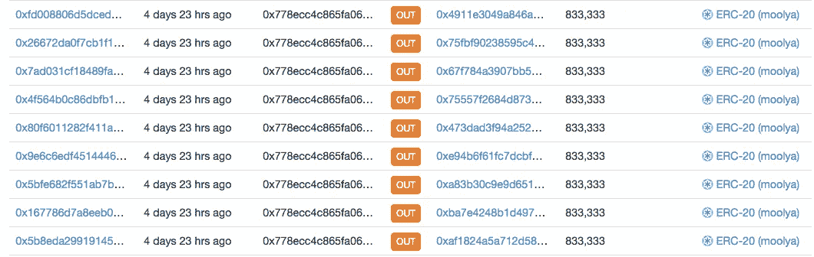

That there is a lot of MOOLYA

区块链的美妙之处在于你可以确认每一笔交易。[tx 回执状态:成功。大量的块确认](https://etherscan.io/tx/0x4f564b0c86dbfb12c99492a82b0804d849eaf66898f52ef76825d7fa0d9ace14)。不管是谁搞砸了这些发送，它现在已经被永久地刻在了以太坊区块链。太糟糕了，他们只是让那些有影响力的人变成了鲸鱼。

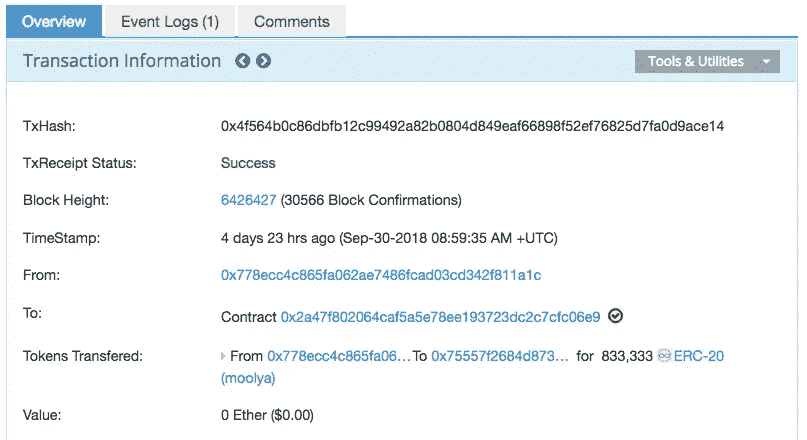

What is done cannot be undone

但是当一小时后查看时，他们的余额奇怪地显示为 50，000 穆利亚。一直以来的预期金额。等等，什么…？他们没有把他们的金钱财富送给任何人(他们也不可能；令牌被锁定，直到 ICO 结束，使它们不可转移)。

然而，我们知道 833，333 令牌转移确实发生了。交易就在那该死的区块链！

那些代币去哪里了？！

经过一番挖掘，他们意识到在他们的以太坊地址上有一笔新的交易。它给出了一半的解释:T4 额外转移了 5 万枚 MOOLYA 硬币。

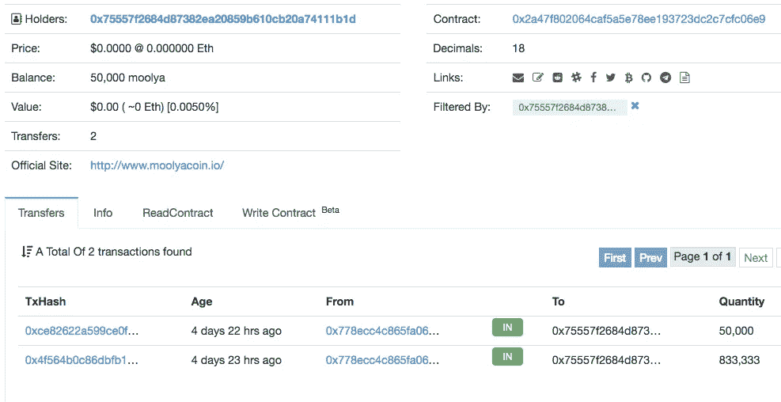

MOOLYA math: 833,333 + 50,000 = 50,000?

中的两个交易。没有交易。神秘。

当他们第一次告诉我这件事时，我以为他们只是误解了交易记录。但是不，这个不可能的矛盾的双方显然都是对的:是的，有两个交易。是的，总余额只有 50，000。

MOOLYA ERC-20 合同代码在 etherscan.io 上公开，所以我开始通读。

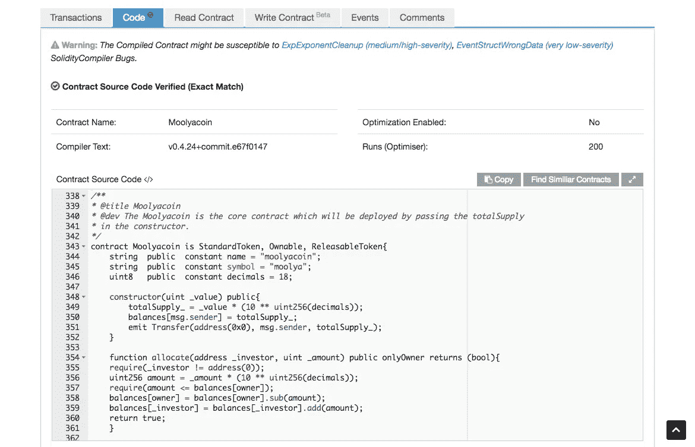

Solidity, anyone?

每个 ERC-20 合同代码的绝大部分实际上只是从 ERC-20 基础模板[复制粘贴而来。这使得浏览起来相当容易。这完全是通用的样板文件，只是建立了基本的令牌机制。](https://github.com/OpenZeppelin/openzeppelin-solidity/blob/master/contracts/token/ERC20/ERC20.sol)

但后来我终于在最后的自定义编码部分发现了一些有趣的东西:

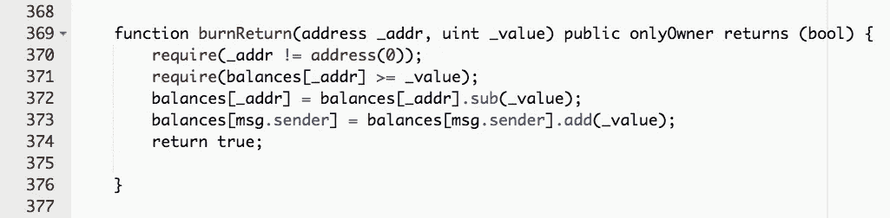

burnReturn: cool band name or bad STD situation?

这很简单，所以让我们一行一行地深入研究。该函数将以太坊地址`_addr`和整数`_value`作为输入。尽管这是一个`public`函数，但它有一个访问修饰符`onlyOwner`，正如它听起来的那样:只有合同所有者有权限执行这个函数。

第 370 行和第 371 行上的`require`调用只是检查以确保所提供的地址不是空地址(在空地址上做令牌操作是没有意义的),并且该地址至少有`_value`个 MOOLYA 令牌。

那些只是理智检查。现在我们进入有趣的部分！

第 372 行从提供的地址余额中减去`_value`个 MOOLYA 令牌。合同所有者实际上是在拿走`_addr`的代币。

那些代币去哪里了？在第 373 行，这些代币被添加到`msg.sender`的余额中。别人得到了`_addr`的 MOOLYA！谁是`msg.sender`？就是那个叫`burnReturn`的地址。唯一能调用该函数的人是合同所有者。

所以`burnReturn`不是一个“burn”函数——这是令牌被销毁时的术语。不，相反，它赋予合同所有者在任何时候取走任何人的 MOOLYA 代币并存入他/她自己的账户的权力。

这个功能使得合同所有者这个 ERC-20 的上帝。对谁拥有多少令牌进行单点全面控制。

但是等等，还有呢！正如 Josh Cotton 博士指出的那样(支持发现它！)，还有一个有问题的`mintable`函数:

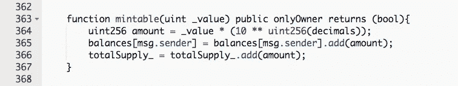

Oh for f*ck’s sake

这是另一个`onlyOwner`函数，现在你可能已经知道它是做什么的了。在第 365 行，它按照指定的`_value`增加了`msg.sender`的令牌余额。我们知道这意味着它属于合同所有者。这些新的代币随后被添加到`totalSupply`中，使得 MOOLYA 出现轻微的通货膨胀。他们可以随时为自己制造更多的硬币。

好悲伤。MOOLYA 不是分散的。一点也不。

仔细查看交易日志，一切终于有了意义:`burnReturn`被叫去[收回他们错误发出的 833，333 MOOLYA](https://etherscan.io/tx/0x0680fd160b8c567e45d4a0d4f579d7c9b152abe23d711c89fe3d2bef75f8d230) 。

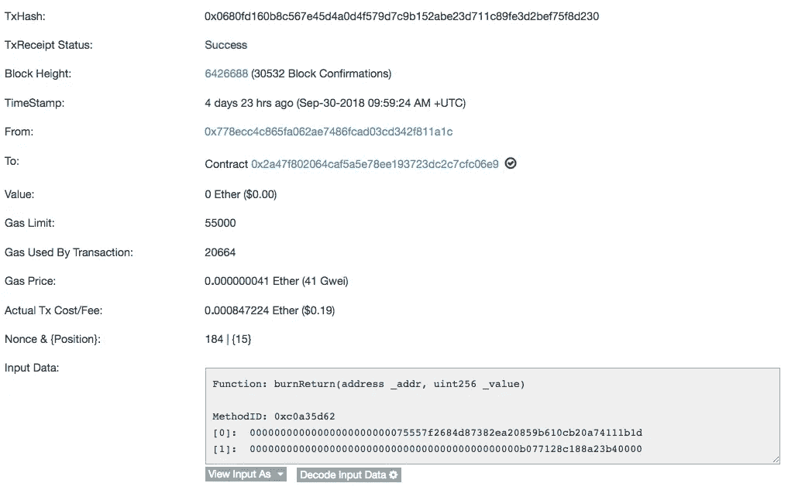

At least it cost them $0.19 to take away $50,000 USD

点击“解码输入数据”将功能参数转换为更友好的值:

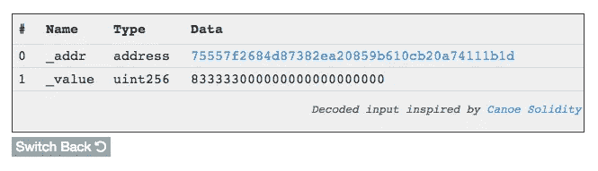

_value is denominated in wei; move the decimal 18 places left to get 833,333

因此，影响者意外获得了 833，333 MOOLYA，团队意识到他们的错误，并将这些代币退还给自己，然后发出了适当的 50，MOOLYA。谜团解开了。

在这种情况下，`burnReturn`给 Moolya 团队省了不少麻烦。

可悲的是，他们的交易历史似乎充满了其他令牌分配错误:

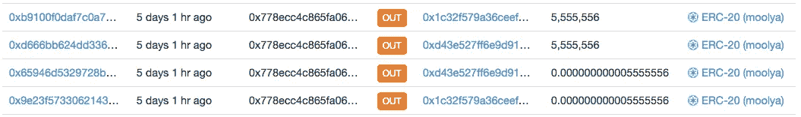

You’re MOOLYA dust! No, wait, you’re a MOOLYA whale

在他们第一次尝试发送 5，555，556 个代币时，他们忘记了以太坊合约是以魏(1 以太= 1x10 魏)为单位的。这两个地址预计价值 333，333 美元的 MOOLYA，但结果却是尘土飞扬。直到第二次交易，Moolya 团队正确地完成了 wei 转换。

愚蠢的错误。但至少他们从中吸取了教训。或者不是。

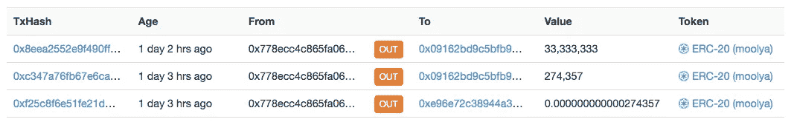

Oops, I did it again?!

同样的问题，但是，呃，等等，修复转移没有去同一个地址！0xe96 收到了灰尘，而两分钟后 0x091 收到了他们原本打算发送给 0xe96 的数据量。伙计，当 0x091 真好…当它大快朵颐时，它就倾泻而下！

开始明白`burnReturn`是干什么的了。这可能是也可能不是为了邪恶的令牌窃取目的。但显然有必要修复 Moolya 团队的许多失误。

我想回到 MOOLYA smart 合约来指出更多的问题。


第一个是第 375 行的空行。这是一个非常俗气的抱怨，但是为什么会有空行呢？程序员有某些格式规则(实际上更像是一种整洁的美学)，这些规则经常变得教条化(在“硅谷”事件中，使用空格而不是制表符是结束一段关系的理由，这确实是一件事)。空行不应该在那里。这让我很困扰。

更让我困扰的是*应该在那个空行中而不是:一个事件。将事件视为宣布智能合约中发生的重要事情的一种方式。例如，`Transfer`对于 ERC-20 来说是一个至关重要的事件，因为它会宣布一个用户将资金转移到另一个用户。[事件甚至在块管理器中获得自己的部分](https://etherscan.io/address/0x2a47f802064caf5a5e78ee193723dc2c7cfc06e9#events):*

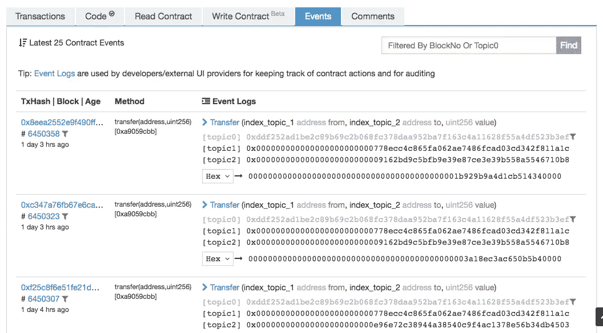

如果你浏览 MOOLYA 的事件，你会看到一连串的`Transfer`但是你知道你没有看到什么吗？没有`BurnReturn`事件。这是为什么呢？每隔一个令牌转移操作触发一个`Transfer`事件，但当合同所有者移动您的令牌时，不会触发这样的匹配事件？也不奇怪没有`TokensMinted`事件。

我们知道你不能在区块链隐藏你的踪迹，但是你可以让他们更难被发现。这是粗略的。

375 上的空白行应该有一个`Transfer`事件(也许它甚至在某个时间点发生过)。很琐碎。事实上，应该是这样的:

```
emit Transfer(_addr, msg.sender, _value);
```

好了，有那么难吗？

在自定义编码部分的其他地方，有一个不可原谅的格式冲突:

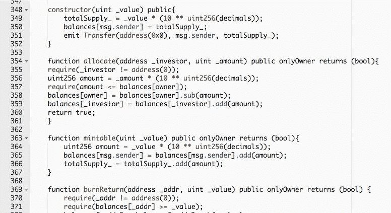

One of these things is not like the other…

你看到了吗？`allocate`的函数体没有缩进！在可靠性方面，这不会影响代码，但在 python 和 ruby 这样的语言中，这将是灾难性的。这根本做不到。

这是令人难以置信的草率的标志。特别是缩进问题证明了没有其他开发人员对代码进行审查(程序员足够聪明，不会简单地相信自己构建了正确的东西；真正的项目团队总是需要对每个开发人员的代码有一套单独的关注点)。

MOOLYA 的自定义编码部分只有 40 行代码。就是这样！剩下的就是复制粘贴了。在短短 40 行中发现这么多问题，令人深感不安。

那么这是骗局吗？

我不知道。但他们的意图并不重要。事实是合同有一个不可接受的后门。能修好吗？一旦 ICO 完成，合同所有者可以放弃合同的所有权，从而使`burnReturn`和`mintable`从此完全不可用。


Why Estonia? No clue

但是你应该相信他们会在你投资之后做正确的事情吗？对于运行这个项目的团队来说，代码的草率和不称职的令牌传输事故说明了什么？

Moolya 团队似乎完全是印度人，而 ICO 信息都指向爱沙尼亚。也许他们外包了他们的 ICO，只是选择了一个糟糕的合作伙伴？我不知道。但是对于一个希望筹集 300 万到 2500 万美元资金的 ICO 来说(在我写这篇文章的时候已经筹集了大约 700 万美元)，我希望所有的价值都被委托给比这些不稳定的 40 行代码更强大的东西。

在这一点上我只能说:

DYOR:自己做研究

不要相信，核实。

*基思·穆凯是一名 Python/DApp 开发者，也是*[*ethtweet . me*](https://ethtweet.me)*的创造者。他自己肯定犯了很多愚蠢的编码错误。你可以在推特*[*@ KeithMukai*](https://twitter.com/KeithMukai)*上找到他，他可能会后悔没有用假名。*

> [直接在您的收件箱中获得最佳软件交易](https://coincodecap.com/?utm_source=coinmonks)

[](https://coincodecap.com/?utm_source=coinmonks)