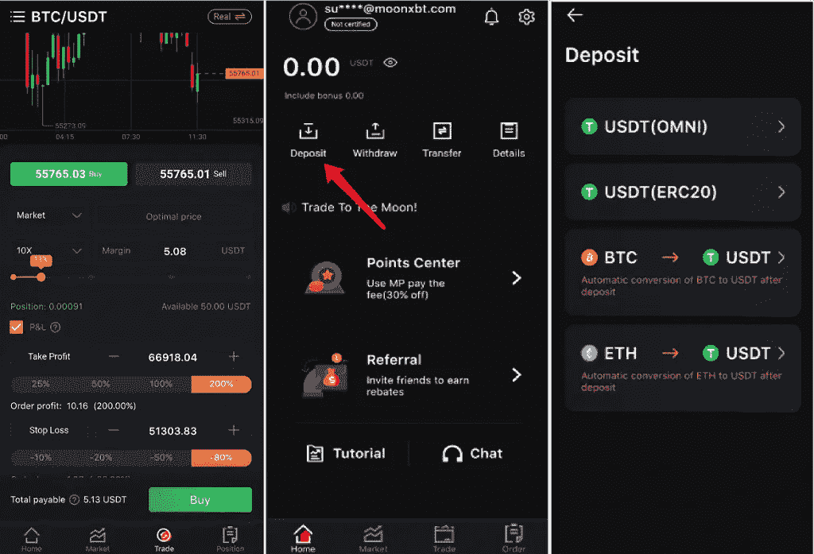

# MoonXBT 评论 2021:安全还是合法？[重要阅读]

> 原文：<https://medium.com/coinmonks/moonxbt-review-6e4ab26d037?source=collection_archive---------4----------------------->

今天我们就来回顾一下 [**MoonXBT**](https://blog.coincodecap.com/go/moonxbt) ，2021 年推出的一个年轻的密码交易平台。该平台保证你一个公平的价格，高杠杆，优秀的流动性，低费率。

> 因为这是一个新的平台，我们没有找到任何公司注册信息，因此谨慎交易。

# 总结(TL；博士)

*   150 倍杠杆，高流动性。
*   从 1 美元开始交易。
*   轻接触交易是可行的。
*   如果您使用 [MoonXBT](https://blog.coincodecap.com/go/moonxbt) 积分付款，还可以获得折扣。
*   没有强制性的 KYC 验证。
*   零存款手续费和 0.05%的交易手续费。
*   多签名钱包。
*   移动应用程序在 android 和 iOS 设备上可用。

# 什么是 MoonXBT？

[**MoonXBT**](https://blog.coincodecap.com/go/moonxbt)**是一个合约交易平台，拥有惊人的全球和网站可用性。 [MoonXBT](https://blog.coincodecap.com/go/moonxbt) 总部位于开曼群岛，在新加坡、马来西亚、越南、香港、韩国和日本设有办事处。**

**在使用 [MoonXBT](https://blog.coincodecap.com/go/moonxbt) 交易平台的同时，你会发现收费结构异常透明，结构合理。平台提供多屏交易视图，止盈止损设置；同时保持一个整洁和清晰的贸易环境。**

# **MoonXBT 移动应用**

**你可以在你的 [Android](https://play.google.com/store/apps/details?id=com.nano.moonxbt) 和 [iOS 设备](https://apps.apple.com/us/app/moonxbt/id1566536854)上使用 MoonXBT 移动应用进行无缝交易。他们的用户界面简单而现代。当交易资产时，你分析图表不会有困难，因为它们简洁而精确。界面引人入胜，易于理解。**

# **如何在 MoonXBT 上注册？**

****

## **KYC 在 MoonXBT 是强制的吗？**

**验证你的账户并不是 MoonXBT 的强制要求，但是平台还是建议这么做。他们说这样做不超过 2 分钟。你必须注意，MoonXBT 声明，如果你想退出，那么你必须首先完成 KYC 验证。**

# **如何入门 MoonXBT？**

**在 [MoonXBT](https://blog.coincodecap.com/go/moonxbt) 上交易并不复杂；一旦你注册了，你就可以开始存款和开仓。**

## **如何开仓？**

**您可以通过进入交易页面并选择您想要交易的货币来建立头寸。在那里，您可以选择设置参数，如订单方向、订单类型:市价订单或限价订单、保证金、杠杆、止盈和止损。设置好这些参数后，就可以点击买入或卖出开仓了。**

****

## **如何在 MoonXBT 上存款？**

1.  **进入 [MoonXBT 主页](https://blog.coincodecap.com/go/moonxbt)并选择“存款”**
2.  **选择您要存入的硬币。作为一个非常新的平台，目前可用的货币有 USDT、BTC 和瑞士法郎。它会将你的 BTC 和 ETH 转换成等量的 USDT。**
3.  **对于 USDT，他们支持 ERC20 和 OMNI。您可以点击“复制”来复制钱包地址或扫描二维码进行存款。**

**如果没有区块链拥堵，那么货币将在 2 小时内存入你的账户。**

****

# **MoonXBT 贸易评论:功能**

**MoonXBT 通过提供基本和高级特性来满足您的需求。**

*   **[MoonXBT](https://blog.coincodecap.com/go/moonxbt) 平台上的价格是公平的，MoonXBT 根据行业内[主要加密货币交易所](https://blog.coincodecap.com/crypto-exchange)的现货价格给你一个实时平均值。**
*   **它会给你提供一个透明的 k 线价格。**
*   **MoonXBT 交易引擎可以在 32 毫秒内处理订单，并保证您的高流动性。**
*   **你只需要 1 美元就可以开始交易和建仓。**
*   **目前 MoonXBT 不接受法定货币交易。但是他们将很快引入 OTC 服务。**
*   **取款少于 2000 USDT 将自动得到人工智能系统的批准。**
*   **[**MoonXBT**](https://blog.coincodecap.com/go/moonxbt)**为您提供在有限时间内免费开设模拟账户的机会。****
*   ****MoonXBT 有一个独特的[保证金模式](https://blog.coincodecap.com/margin-trading)，你可以提前锁定盈亏，无需实时跟踪。你可能面临的最大损失是保证金头寸，而不是任何其他资金。****
*   ****你可以通过用特定的密码增加钱包的重量来招致风险，但是 MoonXBT 风险控制系统将这种风险降到了最低。MoonXBT 保险基金会将立即补充超重部分。****
*   ****你可以使用 **150 倍杠杆**进行交易。你只需要关注保证金、杠杆和市场趋势。剩下的就交给 MoonXBT 了。****

********

*   ****万一你最终为一项资产支付了过多的费用，MoonXBT 会给你一个很高的回扣比例。****
*   ****MoonXBT 支持第三方图表工具，如水平、垂直、趋势、交叉、斐波那契、分叉、矩形、艾略特和圆形线分析。****
*   ****使用“显示多个图表”选项，您可以选择查看单个、两个或多个交易图表。****
*   ****MoonXBT 在多个现货交易所分享您的交易订单，以更好地了解市场深度和流动性。这一举措有助于将打滑的风险降至最低。当实际的交易价格与最初的报价不同时，就会出现滑点。它可能发生在动荡的市场中，很难避免，但 MoonXBT 可以将其最小化。****
*   ****该平台在新加坡的[亚马逊 AWS](https://aws.amazon.com/) 服务器上执行所有交易。****
*   ****你可以通过设置变动幅度来降低风险和杠杆。****

********

*   ****如果您使用 [MoonXBT](https://blog.coincodecap.com/go/moonxbt) 积分付款，还可以获得折扣。****
*   ****你可以通过决定一个特定的价格或比率来设置止盈和止损。但是，默认情况下，TP 设置为 500%，SL 设置为-90%。****
*   ****如果你推荐成功，你可以获得 60%的交易费用。****

# ****MoonXBT 审查:限制****

## ****取款限额是多少？****

****取款限额从 2 USDT 到 10000 USDT 不等。下表显示了不同硬币类型的取款限额。****

********

****最低存款额根据合同类型而变化。下表显示了同样的情况。****

********

## ****每笔交易的最低和最高投资额是多少？****

****您的一个帐户最多可以保存 30 个订单。总保证金可以是 30000 USDT。另一方面，单一保证金可以从 1 USDT 到 5000 USDT 不等。****

# ****MoonXBT 交易评论:轻合约交易****

## ****什么是轻合约交易？****

****合约交易是衍生品交易的衍生形式。你可以从预测动荡的全球数字金融市场的价格涨跌中获利。与其他合约交易产品不同，MoonXBT 轻型合约交易是可访问的，可理解的，快速的。 [MoonXBT](https://blog.coincodecap.com/go/moonxbt) 推出这款产品的宗旨是“人人都能懂，人人都能用。”****

****在当前高风险的市场中，合约交易是一种实用的工具。MoonXBT Light 合约有它的好处。****

## ****使用 MoonXBT 轻型合同的优势****

****高达 150 倍的杠杆可以让你的利润最大化。杠杆是你资本放大的倍数。利用杠杆，可以用更少的资金，最大化交易量。****

****例如，如果你使用 100 倍的杠杆，现货价格增加 1%，利润增加 100%。然而，如果价格下跌 1%，你将在 100 倍的杠杆上遭受 100%的损失。****

****你可以通过买涨或买跌来更好地把握市场波动。换句话说，如果你认为价格可能下跌，你可以卖空。但是，如果你认为它可能上涨，你可以长期购买。通过使用合同，你可以对冲投资风险。****

********

****你可以使用单一货币进行贸易。这样，你就不用在不同货币之间转换了，这使得交易更加顺利。****

# ****MoonXBT 费用****

****在 [MoonXBT](https://blog.coincodecap.com/go/moonxbt) 交易平台上佣金低至 **0.05%** 。使用 MoonXBT 积分还可以获得优惠。****

****MoonXBT 实行零押金收费。可以赚取返点，免费进行模拟交易。****

****MoonXBT 收取两种交易费用。****

1.  ****当你开仓或平仓时****
2.  ****对于隔夜融资****

****您只需在开仓时支付 **0.05%** 的交易费，平仓时无需支付任何其他费用。还可以使用 MoonXBT 积分减免 30%的手续费用。****

****如果您在新的交易日(0:00 UTC)开始前平仓，[**MoonXBT**](https://blog.coincodecap.com/go/moonxbt)**不会向您收取任何费用。每日隔夜结算时间为 0:00–0:05(UTC)。如果你希望持仓过夜，你需要支付一笔费用。******

******对于轻合约交易，没有交割或资本成本。虽然，你也要支付传播费。******

******价差是交易对手的买价和卖价之间的差额。当合约交易时，一个人必须支付差价费用，这样他们才能执行他们的头寸。******

************

## ******MoonXBT 提款费******

******[MoonXBT](https://blog.coincodecap.com/go/moonxbt) 的提现费用因不同的连锁类型和区块链拥堵程度而异。******

******OMNI 连锁取款费为 **28 USDT********

****ERC20 链条退出费为 **20 USDT******

****TRC20 拆链费为 **1 USDT******

****不同的合约交易品种适用不同的费用。您可以在下表中查看它们:-****

********

# ****MoonXBT 安全吗？****

****MoonXBT 通过将您的资金冷藏起来来照顾它们。为了进一步加强安全性，他们使用多重签名技术和 2FA。您还需要在提取资金之前完成 KYC 验证。****

****如果你碰巧犯了投资过多、承担更高风险的错误，那么 [**MoonXBT**](https://blog.coincodecap.com/go/moonxbt) 风控系统将帮助你将过度暴露甚至被处罚的风险降到最低。他们会马上用平台保险基金来弥补这个损失。****

# ****为什么选择 MoonXBT？****

****虽然 [MoonXBT](https://blog.coincodecap.com/go/moonxbt) 是一个非常新的平台，但是他们不仅有基本的，还有高级的交易功能。****

****首先，你可以创建一个免费的模拟账户，并在投资前检查其功能。此外，您还可以获得多屏交易视图功能。此外，您将不必担心您的资金，因为 MoonXBT 会将它们存储在冷库中。****

****MoonXBT 目前非常关注扩大其覆盖范围，因此更加积极主动。最好尝试在 [MoonXBT](https://blog.coincodecap.com/go/moonxbt) 平台进行交易，以获得舒适、安全、快速的交易体验。****

# ****支持的加密货币****

****[MoonXBT](https://blog.coincodecap.com/go/moonxbt) ，目前支持 17 个交易对，包括 BTC、BCH、ETH、LTC、EOS、XRP、TRX 等加密货币，DOGE、ADA、BSV、LINK、SXP、UNI、AAVE、FIL、DOT。该平台在全球约 200 个国家可用。****

# ****MoonXBT 评论:客户服务****

****MoonXBT 提供了大量的 FAQ 部分和有用的教程。他们有一个博客，提供关于所有功能和产品的最新更新和信息。这个名为 [MoonXBT Support](https://support.moonxbt.com/hc/en-us/profiles/361045655315-MoonXBT-Support) 的网站回答了所有类型的问题。如果你是初学者，用这个平台交易绝对没有问题。MoonXBT 向最复杂的图表精确地解释了基本的交易术语。****

****他们有一个活跃的 YouTube 频道、 [telegram 频道](https://t.me/MoonXBT)和 Reddit 社区。他们希望通过社交媒体账户与人们互动，扩大他们平台的覆盖范围。你可以在[脸书](https://www.facebook.com/MoonXBT)和[推特](https://twitter.com/MoonXBT_Global)上关注他们。你也可以通过电子邮件联系他们:[support@moonxbt.com](mailto:support@moonxbt.com)和[BD@moonxbt.com](mailto:BD@moonxbt.com)。****

# ****MoonXBT 评论:利弊****

********

# ****MoonXBT 审查:结论****

****由于[**MoonXBT**](https://blog.coincodecap.com/go/moonxbt)**交易平台推出时间不长，因此用户数量较少。但是他们提供给你的功能无疑是先进的，不复杂的。有了清淡的合约交易，你不必支付任何保证金，只需 1 美元就可以建仓。******

******除了有用的指南和教程，您还可以在 MoonXBT 上获得高限额和低费用的好处。他们已经开始扩大他们的全球影响力，并很快计划推出一个人工智能系统，帮助投资者做出更好的投资决策。******

******通过观察他们的特点、产品和服务，我们可以很容易地认为它确实提供了一个轻松、友好和轻松的交易环境。如果你有疑问，你可以很容易地创建一个免费的模拟账户，更好地了解精心制定的 [MoonXBT](https://blog.coincodecap.com/go/moonxbt) 平台。******

# ******常见问题******

********我可以用银行卡/银行转账/礼品卡存款吗？********

****目前，MoonXBT 不支持法定货币交易。他们声称很快会推出非处方药服务。****

******为什么我的止损单以不同的价格成交？******

****像这样的事件经常发生。首先，订单固定在你设定的价格上。完成的订单将被发送到市场，价格会受到市场趋势和波动的影响。因此，价格差异。****

******我可以在 MoonXBT 使用第三方工具进行制图吗，例如**[**trading view**](https://blog.coincodecap.com/go/tradingview)**？******

****是的， [**MoonXBT**](https://blog.coincodecap.com/go/moonxbt) 支持第三方辅助工具进行制图，如水平线、垂直线、趋势线、十字线、斐波那契线、分叉线、矩形、艾略特线、圆形线分析。****

****如何保护我的 MoonXBT 帐户？****

****虽然 [MoonXBT](https://blog.coincodecap.com/go/moonxbt) 确实将您的资金存储在冷库中，但您可以使用一个强大、独特的电子邮件和密码组合来进一步保护您的帐户。您还可以启用登录通知和 2FA(双因素身份验证)。****

*   ****最好的[加密交易机器人](/coinmonks/crypto-trading-bot-c2ffce8acb2a)****
*   ****[什么是融资融券交易？保证金交易是如何运作的？【2021】](https://blog.coincodecap.com/margin-trading)****
*   ****[DeFi(去中心化金融)终极指南](https://blog.coincodecap.com/the-ultimate-guide-to-defi-decentralized-finance)****
*   ****[CoinRabbit 评论|借 USDT 换你的比特币和以太坊](https://blog.coincodecap.com/coinrabbit-review)****
*   ****[5 家最佳比特币保证金交易交易所【2021】](https://blog.coincodecap.com/bitcoin-margin-trading-exchange)****
*   ****比特码保证金交易终极指南【2021】****

*******包括附属链接******

> ****加入 [Coinmonks 电报频道](https://t.me/coincodecap)，了解加密交易和投资****

## ****另外，阅读****

*   ****[加密交易机器人](/coinmonks/crypto-trading-bot-c2ffce8acb2a)****
*   ****什么是融资融券交易****
*   ****[3 commas Review](/coinmonks/3commas-review-an-excellent-crypto-trading-bot-2020-1313a58bec92)|[Pionex Review](/coinmonks/pionex-review-exchange-with-crypto-trading-bot-1e459d0191ea)|[coin rule Review](/coinmonks/coinrule-review-2021-a-beginner-friendly-crypto-trading-bot-daf0504848ba)****
*   ****[莱杰 vs Ngrave](/coinmonks/ledger-vs-ngrave-zero-7e40f0c1d694) | [莱杰 nano s vs x](/coinmonks/ledger-nano-s-vs-x-battery-hardware-price-storage-59a6663fe3b0) | [币安评论](/coinmonks/binance-review-ee10d3bf3b6e)****
*   ****[Bybit Exchange 审查](/coinmonks/bybit-exchange-review-dbd570019b71) | [Bityard 审查](/coinmonks/bityard-review-7d104239be35) | [CoinSpot 审查](https://blog.coincodecap.com/coinspot-review)****
*   ****[3 commas vs crypto hopper](/coinmonks/3commas-vs-pionex-vs-cryptohopper-best-crypto-bot-6a98d2baa203)|[赚取加密利息](/coinmonks/earn-crypto-interest-b10b810fdda3) | [网格交易机器人](https://blog.coincodecap.com/grid-trading)****
*   ****最好的比特币[硬件钱包](/coinmonks/the-best-cryptocurrency-hardware-wallets-of-2020-e28b1c124069?source=friends_link&sk=324dd9ff8556ab578d71e7ad7658ad7c) | [BitBox02 回顾](/coinmonks/bitbox02-review-your-swiss-bitcoin-hardware-wallet-c36c88fff29)****
*   ****[block fi vs Celsius](/coinmonks/blockfi-vs-celsius-vs-hodlnaut-8a1cc8c26630)|[Hodlnaut 评审](/coinmonks/hodlnaut-review-best-way-to-hodl-is-to-earn-interest-on-your-bitcoin-6658a8c19edf) | [KuCoin 评审](https://blog.coincodecap.com/kucoin-review)****
*   ****[Bitsgap 审查](/coinmonks/bitsgap-review-a-crypto-trading-bot-that-makes-easy-money-a5d88a336df2) | [Quadency 审查](/coinmonks/quadency-review-a-crypto-trading-automation-platform-3068eaa374e1) | [Bitbns 审查](/coinmonks/bitbns-review-38256a07e161)****
*   ****[密码本交易平台](/coinmonks/top-10-crypto-copy-trading-platforms-for-beginners-d0c37c7d698c) | [Coinmama 审核](/coinmonks/coinmama-review-ace5641bde6e)****
*   ****[印度比特币交易所](/coinmonks/bitcoin-exchange-in-india-7f1fe79715c9) | [比特币储蓄账户](/coinmonks/bitcoin-savings-account-e65b13f92451)****
*   ****[CoinDCX 评论](/coinmonks/coindcx-review-8444db3621a2) | [加密保证金交易交易所](https://blog.coincodecap.com/crypto-margin-trading-exchanges)****

*****原载于 2021 年 6 月 9 日*[*【https://blog.coincodecap.com】*](https://blog.coincodecap.com/moonxbt-review)*。*****