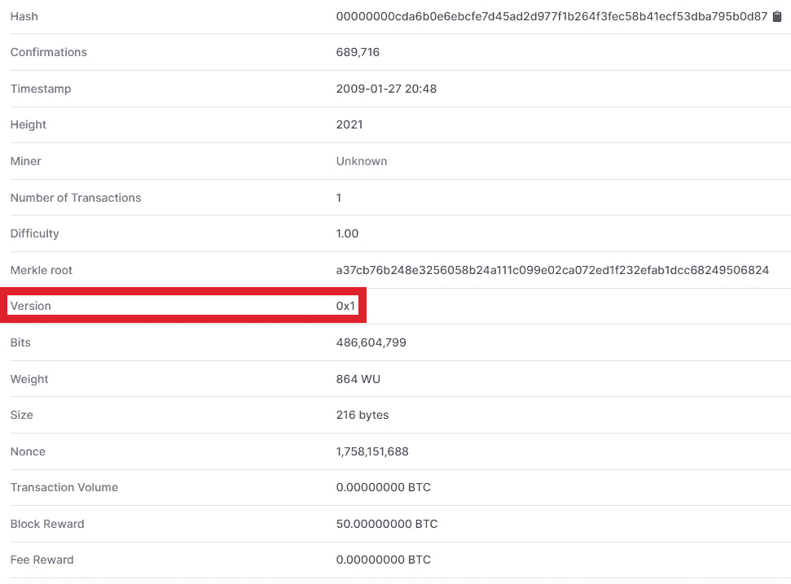
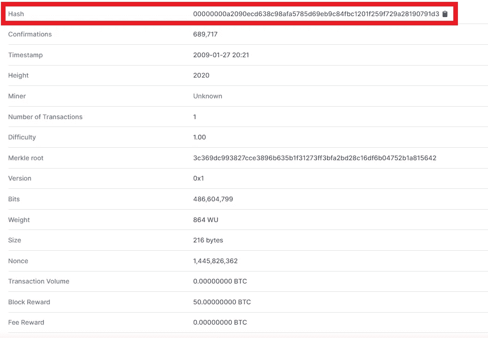
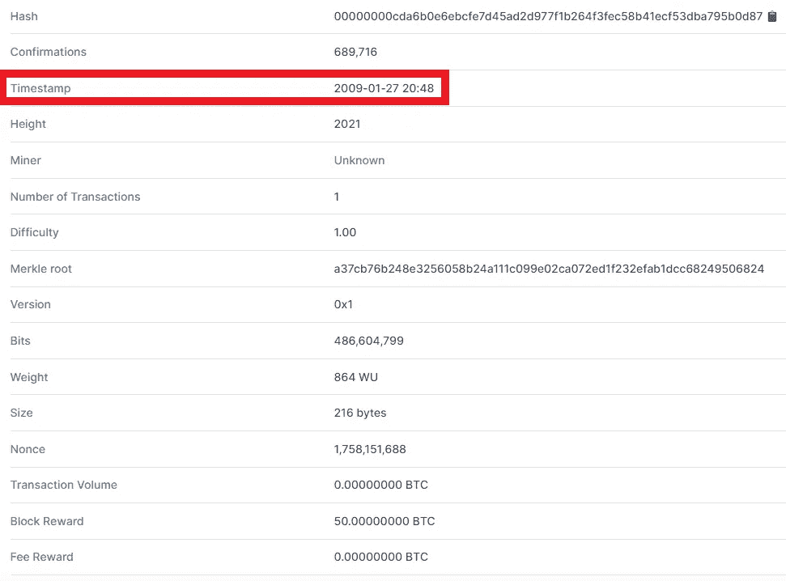
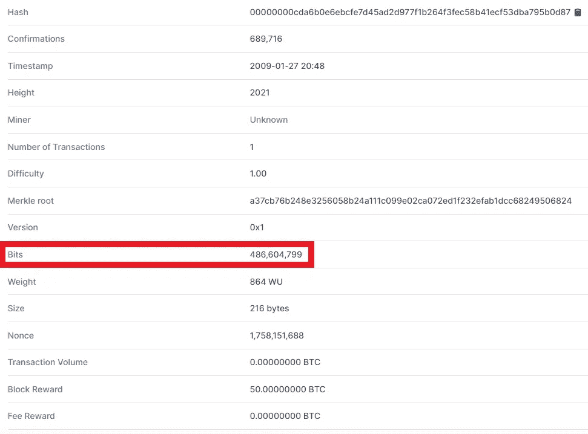

# 关于块散列的更多信息

> 原文：<https://medium.com/coinmonks/more-on-block-hash-a7a868748eed?source=collection_archive---------12----------------------->

Image taken from [here](https://www.itprotoday.com/sites/itprotoday.com/files/styles/article_featured_retina/public/Hexagons%20connected%20like%20a%20block%20chain.png?itok=2Q2yoP5D)

在我的上一篇博客中，我讨论了块头的概念，块头的需要，merkle 树的概念，块头和 nonce 中 merkle 根的需要。在这篇博客中，我将讨论上一篇博客中留下的其他头，我还将讨论如何从块头中确定块散列。

# 1.块标题

为了获得块散列，挖掘器必须组合块头以获得以一些零开始的特定散列。其实矿工不一定要结合，这一切都是挖矿软件的后端过程，不过这个你应该是知道的。以下是组合在一起以获得块哈希的块头:

1.  块版本
2.  前一个块哈希
3.  Merkle 根
4.  时间戳
5.  位
6.  目前

从上面的标题列表中，我在上一篇博客中讨论了 Merkle Root 和 Nonce。让我们深入研究比特币区块链的其他标题。

# 2.块版本

它只不过是区块链的版本，从创世纪板块创建时的版本 **0x1** 开始。创世纪板块是任何区块链的第一个板块。目前比特币区块链的版本是 **0x20000004** 。下面的快照显示了比特币区块 2021 的版本。

# 3.前一个块哈希

Previous blockhash 是正在计算其块哈希的块之前的块的哈希。这只是用来在块之间创建一个链接，这样如果有人在某个先前的块中做了任何更改，那么所有随后的块都会受到影响，并且我们很容易知道谁的内容被更改了。下面的截图显示的是 2020 块的哈希，这是比特币中 2021 块之前的哈希。

# 4.时间戳

时间戳只是为了记录不会发生重复花费(如前面的博客中所讨论的)，实际标记给块的时间是纪元时间，它是标准时间，也是 Linux 操作系统中使用的时间。但为了方便起见，在块中以 **yyyy-mm-dd hh:mm** 的格式显示。下面显示的快照显示了比特币中 2021 块的时间戳。

# 5.位

它是一个 4 字节的阈值，指定了难度级别，目标散列中的前导零取决于此。如何 4 字节？您需要将十进制位值转换为十六进制形式。那么它就是 4 字节格式。下面的快照显示了位的十进制值。

# 6.确认块哈希

比特币区块链的设计是这样的，寻找哈希很困难，在寻找给定范围内的哈希时，CPU 和 GPU 的负载很重(我在以前的博客中讨论了范围的概念)，这一切都取决于 nonce。你得到了一个特定的 nonce 值，你得到了你的目标 hash 值，从期望的零开始。**但是**一旦创建了块，就很容易确认。矿工通过使用相同的报头来确认块，报头中也有 nonce，在软件中检查找到的散列是否正确。我将借助我创建的 python 代码展示这种软件的工作原理。该程序用于比特币区块链的**区块 1** ，你可以运行并验证该程序显示的 hash 与[区块 1](https://www.blockchain.com/btc/block/1) 显示的 hash 相同。复制并粘贴到您的 python IDLE 中，并相应地更改您想要验证其块哈希的各个块的头。如果你的头是正确的，它将显示块散列。以下是关于块散列实际上是如何创建的解释。

这个算法非常简单，你需要所有头的小端格式。在 little endian 中，字符串的二进制格式从右向左转换。让我们看一个例子:

以下是十六进制格式的四个字节:
**0x17 14 96 24**

当它们被转换成小端时，那么它就变成:
**0x24 96 14 17**

正好相反，即 32 位二进制表示将从**00010111 000100100 100110 00100100**转换为**00100100 100110 000110 000100 00010111**。

看看二进制数字，**00010111 00010100 100110 00100100**即 **00010111** 中的第一个八位字节已经作为**00100100100 100110 00010111**中的最后一个八位字节到了末尾。类似地，其他转换也会发生，为此，我在程序中使用了函数 **littleEndian(val)** 和 **hex2Little(val)** ，它们的目的是以同样的方式转换为 littleEndian。

头被转换成小端格式，然后用 **SHA256** 算法散列两次。最后你得到的是这个块的散列。
**重要:**记住这不叫挖掘，你不是在计算块的 nonce 来得到 hash。事实上，您知道所有的头，您只是对那些头执行数学运算来验证头是正确的。

**重要提示:**请记住，组合稍后将使用 SHA256 算法散列的头的小端值的顺序将始终保持相同，即**版本+先前块散列+ merkle 根散列+时间+位+随机数**，如果您的顺序改变，那么即使您的头是正确的，您也会得到错误的散列。版本总是以十进制值给出，而不是十六进制值。
现在如果你知道一个块的头，你可以很容易地找到它各自的散列块。我的 GitHub repo 中有相同的代码:[https://GitHub . com/ansh vaid 4/Python/tree/master/BTC % 20 block chain](https://github.com/AnshVaid4/Python/tree/master/BTC%20blockchain)

在这篇博客中，我讨论了与块的散列相关的各种概念，我还讨论了可以轻松找到块的散列的程序，还讨论了我在上一篇博客中留下的块的其他头。概念上的实现可以在 CTF 挑战赛中找到**做第二件事**。如果你错过了 CTF，那么你可以在[https://medium . com/@ the _ harvester/does-a-second-matter-10f 5984 e 5061](/@the_harvester/does-a-second-matter-10f5984e5061)阅读这篇文章。在下一篇博客中，我将讨论比特币的加密技术是如何创建钱包地址的。

> 社交媒体链接:[LinkedIn](https://www.linkedin.com/in/ansh-vaid/)|[GitHub](https://github.com/AnshVaid4)|[insta gram](https://www.instagram.com/being_optimist/)|[Twitter](https://twitter.com/anshvaid4)
> 
> 访问我的网站:[https://cybergeeks.website/](https://cybergeeks.website/)
> 
> 【https://github.com】原载于**。**

> *加入 Coinmonks [电报频道](https://t.me/coincodecap)和 [Youtube 频道](https://www.youtube.com/c/coinmonks/videos)了解加密交易和投资*

## *也阅读*

* [## 最佳加密交易所| 2021 年十大加密货币交易所

### ICON _ PLACEHOLDEREstimated 预计阅读时间:28 分钟加密货币交易所的加密交易需要知识…

blog.coincodecap.com](https://blog.coincodecap.com/crypto-exchange)  [## 2021 年 10 大最佳加密贷款平台| CoinCodeCap

### 当谈到加密货币贷款时，大量因素等同于良好的收入状况。此外，借款的一部分…

blog.coincodecap.com](https://blog.coincodecap.com/crypto-lending)  [## 2021 年最佳免费加密交易机器人

### 2021 年币安、比特币基地、库币和其他密码交易所的最佳密码交易机器人。四进制，位间隙…

medium.com](/coinmonks/crypto-trading-bot-c2ffce8acb2a)  [## 最佳 4 个加密交易信号电报通道

### 这是乏味的找到正确的加密交易信号提供商。因此，在本文中，我们将讨论最好的…

medium.com](/coinmonks/best-crypto-signals-telegram-5785cdbc4b2b)  [## BlockFi 评论 2021:利弊和利率| CoinCodeCap

### 今天，我们提出了一个全面的 BlockFi 评论，这是一个成立于 2017 年的加密贷款平台，拥有其…

blog.coincodecap.com](https://blog.coincodecap.com/blockfi-review)  [## 如何在印度购买比特币？2021 年购买比特币的 7 款最佳应用[手机版]

### 如何使用移动应用程序购买比特币印度

medium.com](/coinmonks/buy-bitcoin-in-india-feb50ddfef94)  [## 加密税务软件——五大最佳比特币税务计算器[2021]

### 不管你是刚接触加密还是已经在这个领域呆了一段时间，你都需要交税。

medium.com](/coinmonks/best-crypto-tax-tool-for-my-money-72d4b430816b)  [## 存储比特币的最佳加密硬件钱包[2021] | CoinCodeCap

### 保管您的数字资产很容易，但找到正确的存储方式却是一项繁琐的任务。在线钱包有一个风险…

blog.coincodecap.com](https://blog.coincodecap.com/best-hardware-wallet-bitcoin)*