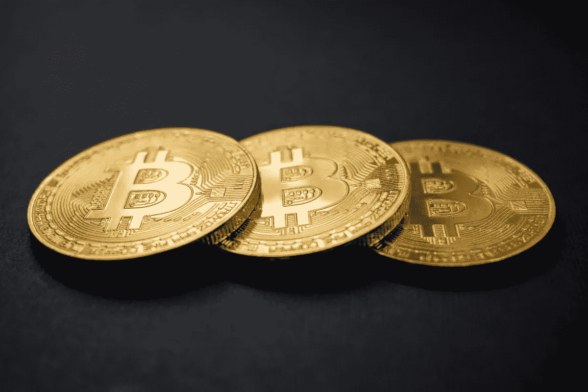
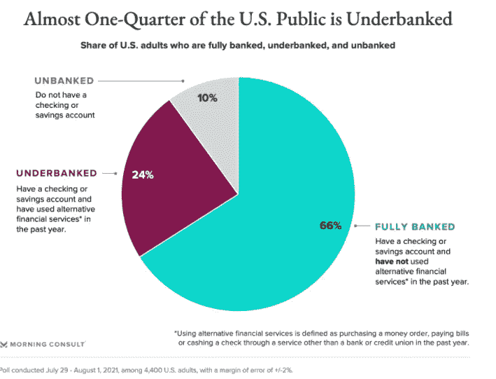

# 加密银行和分散金融(DeFi)，解释

> 原文：<https://medium.com/coinmonks/morning-ccrypto-banking-and-decentralized-finance-defi-explained-ac96e9cbc206?source=collection_archive---------10----------------------->

DeFi and Cryptocurrencies

大约十年前，中本聪发明了比特币。自那以后，它催生了一个平行的另类金融服务领域。它改变了金钱的定义。加密业务已经进入传统的银行业领域。

# 加密业务提供哪些替代服务？

最值得注意的是，他们提供贷款和借款。投资者可以通过在收益农业中提供流动性来终止对其持有资产的兴趣。他们可以从银行的现金存款中获得更多的利息，而且他们可以单独用加密技术从银行贷款。加密贷款通常不涉及信用检查，因为交易是由数字资产支持的。这是权力下放的好处之一。

随着权力下放，世界上任何地方的任何人都可以利用金融服务。

Unbanked and underbanked population chart

# 这个部门的人是谁？

企业和实体正在迅速涌入市场。采用率大幅提高。迈克尔·塞勒最近评论了比特币生态系统的令人印象深刻的增长。例如，BlockFi 就像典型的银行一样提供计息账户。北海巨妖获得了怀俄明州银行的许可，并希望将零售存款带到由计算机法庭代码控制、由用户通过代币分配结构管理的市场。还有最近做得很好的[大院](https://compound.finance/)。Compound 是一个分散的自动化做市商(AMM)。它现在赚取利息的资产已经超过了 10 亿美元。

# 什么是 stablecoins？

密码市场非常不稳定。因此，很难在实际意义上进行支付或贷款等交易。这就是稳定的硬币的来源。稳定币是与稳定资产挂钩的加密货币。你有美元，美元，BUSD 等。这些都是稳定的硬币。流通中的稳定硬币总量从 1 月份的 290 亿美元增加到 9 月份的 1170 亿美元。

为了保持政府发行货币的稳定性，中央银行管理货币的供给和需求，以确保充足的储备。一些专家认为，中央银行的数字货币将使稳定的硬币变得无关紧要。这仍有待观察，我们祈祷并继续关注这一事件。

# 什么是央行数字货币？

CBDC 是一种货币，理论上将提供加密的便利和由中央银行控制的货币的可靠性。许多国家正在考虑或已经在推出央行数字货币。有数字日元、数字欧元等等。虽然西方在数字货币计划方面落后，但欧洲最强大的经济体在推出其 CBD 方面取得了重大进展。此外，中国在很大程度上依赖于其数字日元计划。事实上，专家认为，中国禁止比特币矿工进入本国，是因为这与他们的数字日元计划相冲突。众所周知，中国政府喜欢掌控一切，在中国土地上采矿与他们的数字日元计划相冲突。一种观点认为，中国对加密货币的禁令与他们的数字日元计划不无关系。它会在未来的某个时候成为美联储的货币吗？只有时间能证明一切。

# 什么是 DeFi？

分散金融(DeFi)描述了一种替代性的金融生态系统，在这种系统中，消费者无需第三方参与交易。中本聪在比特币诞生之初的愿景是，需要有一种替代现有金融生态系统的方式。对比特币白皮书的一项研究显示，区块链有一个单一分类账的交易系统，个人可以在不需要第三方的情况下交换资金。

创新者认为加密货币增加了金融包容性。考虑一下世界上有大量无银行账户人口的地方的情况。例如，在发展中国家，汇款很困难。为了给他们在国外的家人汇钱，外国人会花掉他们想要的一大笔钱作为费用。有了比特币，他们可以通过闪电网络轻松地将资金转移给家人和爱人，收款人只需几秒钟就能收到。

最后，DeFi 发现了一个特殊的用例，为货币波动国家的客户提供金融稳定性。尽管分散融资有诸多好处，但我们目睹生态系统的崩溃也就不足为奇了。

> *加入* [*币僧电报频道*](https://t.me/coincodecap) *学习密码交易和投资*

## 另外，阅读

*   [比特币主根](https://blog.coincodecap.com/bitcoin-taproot) | [Bitso 回顾](https://blog.coincodecap.com/bitso-review) | [排名前 6 的比特币信用卡](/coinmonks/bitcoin-credit-card-bc8ab6f377c6)
*   [双子座 vs 比特币基地](https://blog.coincodecap.com/gemini-vs-coinbase) | [比特币基地 vs 北海巨妖](https://blog.coincodecap.com/kraken-vs-coinbase) | [硬币罐 vs 硬币点](https://blog.coincodecap.com/coinspot-vs-coinjar)
*   [印度加密交易所](/coinmonks/bitcoin-exchange-in-india-7f1fe79715c9) | [比特币储蓄账户](/coinmonks/bitcoin-savings-account-e65b13f92451) | [Paxful 审核](/coinmonks/paxful-review-4daf2354ab70)
*   [杠杆令牌](/coinmonks/leveraged-token-3f5257808b22) | [最佳加密交易所](/coinmonks/crypto-exchange-dd2f9d6f3769) | [AscendEX 评论](/coinmonks/ascendex-review-53e829cf75fa)
*   [Godex.io 审核](/coinmonks/godex-io-review-7366086519fb) | [邀请审核](/coinmonks/invity-review-70f3030c0502) | [BitForex 审核](https://blog.coincodecap.com/bitforex-review) | [HitBTC 审核](/coinmonks/hitbtc-review-c5143c5d53c2)
*   [Crypto.com 费用](/coinmonks/binance-fees-8588ec17965) | [僵尸密码审查](/coinmonks/botcrypto-review-2021-build-your-own-trading-bot-coincodecap-6b8332d736c7) | [替代品](https://blog.coincodecap.com/crypto-com-alternatives)
*   [有哪些交易信号？](https://blog.coincodecap.com/trading-signal) | [比特斯坦普 vs 比特币基地](https://blog.coincodecap.com/bitstamp-coinbase)
*   [CoinFLEX 评论](https://blog.coincodecap.com/coinflex-review) | [AEX 交易所评论](https://blog.coincodecap.com/aex-exchange-review) | [UPbit 评论](https://blog.coincodecap.com/upbit-review)
*   [AscendEx 保证金交易](https://blog.coincodecap.com/ascendex-margin-trading) | [Bitfinex 赌注](https://blog.coincodecap.com/bitfinex-staking) | [bitFlyer 点评](https://blog.coincodecap.com/bitflyer-review)
*   [麻雀交换评论](https://blog.coincodecap.com/sparrow-exchange-review) | [纳什交换评论](https://blog.coincodecap.com/nash-exchange-review)
*   [加密货币储蓄账户](/coinmonks/cryptocurrency-savings-accounts-be3bc0feffbf) | [赌注加密](https://blog.coincodecap.com/staking-crypto)
*   [BigONE 交易所评论](/coinmonks/bigone-exchange-review-64705d85a1d4) | [CEX。IO 审查](https://blog.coincodecap.com/cex-io-review) | [交换区审查](/coinmonks/swapzone-review-crypto-exchange-data-aggregator-e0ad78e55ed7)