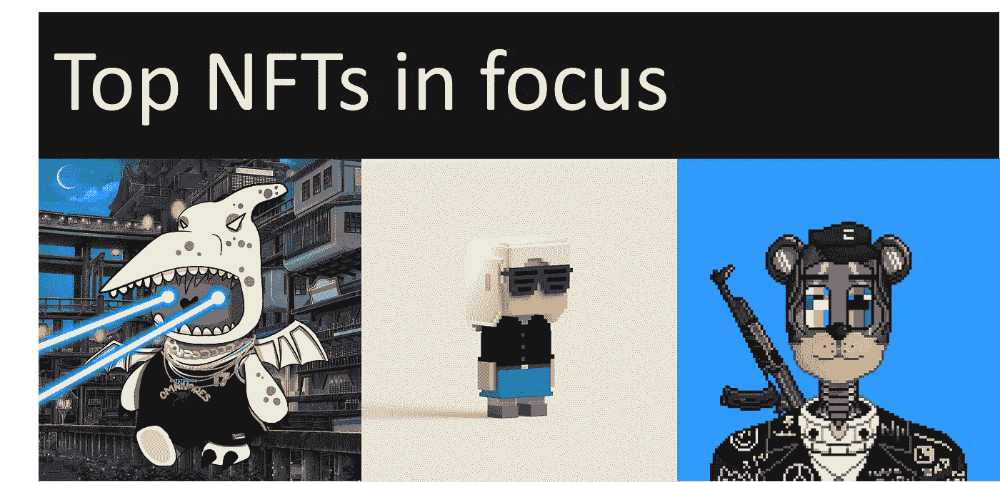
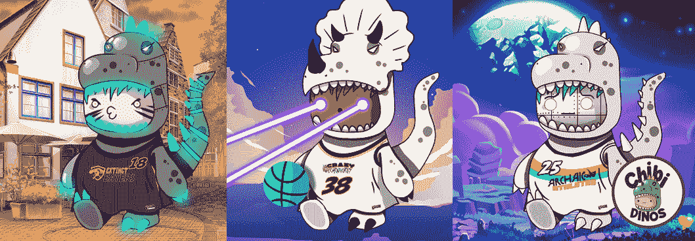
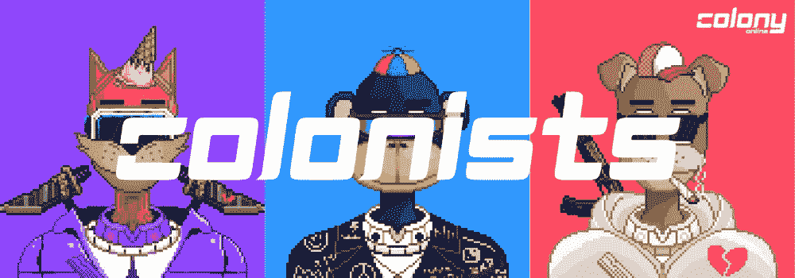

# NFT 社区密切关注这三个项目，为什么？—“效用作为 Defi 的游戏内化身”

> 原文：<https://medium.com/coinmonks/most-focused-top-3-nft-projects-621d2f23c18e?source=collection_archive---------1----------------------->

自从疫情开始以来，人们已经接受了虚拟生活。视频游戏是这种转变的主要受益者，尤其是人们用来消磨时间和娱乐的在线游戏。这些游戏，其中许多是免费的，通过让玩家购买额外的游戏内虚拟资产如“皮肤”(他们化身的服装)或升级特定的能力或体验来赚钱。

## **面临的挑战:**

许多游戏中的购买是暂时的，或者是通过赢得几个挑战来创造稀缺和增加他们的感知价值。在很大程度上，购买它们的玩家并不合法拥有它们。

《T4》在线游戏的另一个问题是它们在很大程度上仍然是集中的。这种集中化非常容易受到攻击和中断。对于这些游戏的集中式服务器结构来说，DDOS 攻击是经常发生的。例如，《魔兽世界》的创作者暴雪娱乐公司就是最近几天此类攻击的目标。

## **区块链和 NFTs:**

因此，正如 CITI 风险投资公司在他们的观点报告中所表达的那样，非功能性贸易似乎是一种天然的匹配。一个成功的例子是最近在首轮融资中筹集了 5000 万美元的虚拟足球交易卡游戏。也有一些公司专注于开发游戏 NFT 空间。

就像在现实世界中，没有两项资产可以表现出相似的特征或价值，同样，区块链上的每项[令牌化资产(NFT)都具有独特的特征。由于这些数字资产彼此不同，它们不可互换，因此被称为不可替代的令牌。就像有所有权证书的真实资产一样，NFT 代币在区块链上维护所有权记录和真实性证明。](https://www.theverge.com/22310188/nft-explainer-what-is-blockchain-crypto-art-faq)

## **游戏资产的 NFTs 收藏:**

过去，NFT 收藏品的价值主要是由投机和其他人愿意支付的价格驱动的。因此，驱动价格的是需求，而不是基本面、技术或经济指标，这些指标通常会影响股价，至少通常会构成投资决策的基础。

**转向基本面:**如今，新一波的 NFT 项目正在为他们的 NFT 收藏品带来独特的效用，例如用作可玩的化身或元宇宙体验和 Defi 机会(游戏赚钱、游戏经济和即时流动性)。

**以下是计划在未来将 NFTs 整合到游戏/元宇宙中的最著名的项目。**(根据游戏开发的进步、社区选择和概念独特性进行选择)

# **#社区选择**

**赤壁恐龙:**

[赤壁恐龙](https://www.chibidinos.io/)是 10，000 个穿着恐龙服的不同赤壁的可爱 NFT，它们是基于 262 种不同的资产以编程方式生成的:头部、恐龙、嘴巴、眼睛、背景、配件、面部纹身、头发以及 10 个不同篮球队的球衣。

该项目于 2021 年 8 月初宣布，迅速赢得了声誉，并已发展成为 NFT 最大的跟风项目之一。薄荷于 2021 年 8 月 21 日上市，不到 20 分钟就销售一空。

目前拥有超过 2200 个独特的所有者，并且随着时间的推移而增加，每个赤壁恐龙都是完全独特的，具有永久的能量水平，当 NFT 在不久的将来融入游戏(元宇宙篮球)时，可以提供特定的体验。

# **#高级开发**

**VOX:**

VOX 是多功能的伴侣，可以制作动画、3D 打印、用于增强现实等等。8888 VOX 的第一个系列于 2021 年 8 月 10 日铸造，目前已经拥有 3000 多名独特的持有者。由 Gala Games 构建的每个 VOX 都将通过以各种方式与 Gala Games 生态系统互动来产生未来的游戏赚取奖励。

在 mint 之后不久(两天内)，该团队推出了 VOX 元宇宙的 alpha 版本，持有人可以在他们的 NFT 头像中漫游，聚集并通过语音聊天与其他 VOX 所有者社交。

Credit: VOX community sharing game experience

# **#概念:《MMO》**

[**殖民地在线**](https://www.colony.online/) **:**

殖民者(殖民地在线)是 NFT 的 5 个不同物种的集合，每个物种有 5000 个上限，通过编程生成，可以在即将到来的区块链上的[殖民地在线 MMO](https://www.colony.online/) 中兑换他们在游戏中的可玩角色和装饰物品，同时支持数千名玩家。

自疫情开始以来，千禧一代和许多人越来越倾向于接受主要是数字的在线生活，人们聚集在一起不仅是为了玩游戏，也是为了社交，更多的人预测 MMO 游戏市场规模到 2026 年将达到 117.5 亿美元，2021-2026 年 CAGR 为 8.2%。

区块链上的 MMO 游戏不多，这让这个项目备受关注。游戏发生在一个替代现实的月球殖民地，在那里随机产生的太空动物(称为[殖民者](https://www.colony.online/))已经殖民了月球，并将其变成了他们自己的社交游乐场，用于时髦的物质主义、派对生活方式和月球采矿。

## **结束语:**

千禧一代在线游戏的增长趋势为视频游戏玩家创造了一个虚拟世界，他们可以在其中处理虚拟经济、货币、贸易环境和实时场景。消费者形象的这种转变并没有被忽视。许多游戏开发商正在采用区块链技术来保护玩家在游戏中的资产所有权(NFT)，并将游戏中的行为货币化以推动现实生活中的交易(游戏内经济)。

> 加入 [Coinmonks 电报频道](https://t.me/coincodecap)，了解加密交易和投资

 [## 最佳加密交易所| 2021 年十大加密货币交易所

### 加密货币交易所的加密交易需要了解市场，这可以帮助你获得利润…

blog.coincodecap.com](https://blog.coincodecap.com/crypto-exchange)  [## 2021 年 9 大最佳加密借贷平台

### 当谈到加密货币贷款时，大量因素等同于良好的收入状况。此外，借款的一部分…

blog.coincodecap.com](https://blog.coincodecap.com/crypto-lending)  [## 2021 年最佳加密交易机器人(免费和付费)

### 2021 年币安、比特币基地、库币和其他密码交易所的最佳密码交易机器人。四进制，位间隙…

medium.com](/coinmonks/crypto-trading-bot-c2ffce8acb2a)