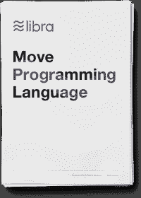

# 移动:一种新的编程语言

> 原文：<https://medium.com/coinmonks/move-a-new-programming-language-3f6d0c0bc1cc?source=collection_archive---------0----------------------->

**本周报价-**

> 当你不创造东西时，你会被你的品味而不是能力所定义。你的品味只是狭隘的&排斥人。所以创造吧。—乔纳森·吉列

**移动编程语言**

This article is for techies who like to deep dive into the world of 0 and 1\. [李婷婷 Lee Ting Ting](https://medium.com/u/f939717fd7fb?source=post_page-----3f6d0c0bc1cc--------------------------------) analyzed the move white paper and provide a quick overview and highlights of the paper for everyone curious about this new language. She is an Ethereum developer, and you can follow her on [Twitter](https://twitter.com/tinaaaaalee).

[***在此阅读全文...***](/coinmonks/whitepaper-deep-dive-move-facebook-libra-blockchains-new-programming-language-7dbd5b242c2b)

> [直接在您的收件箱中获取最佳软件交易](https://coincodecap.com/?utm_source=coinmonks)

在[发推给我@coinmonks](https://twitter.com/coinmonks) 或者在 gaurav@coincodecap.com 发邮件给我

> “我们是一份非宣传和非盈利的教育出版物。如果您喜欢阅读《造币僧》，[您也可以向我们捐款](/coinmonks/monks-need-your-help-7440418d67ec)”

***就这样吧，送我❤️，直到下次。***