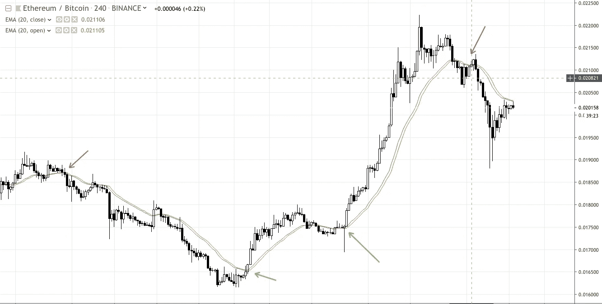

# 为什么均线不是你的均线指标？

> 原文：<https://medium.com/coinmonks/moving-average-isnt-your-average-indicator-671bbc6a014f?source=collection_archive---------0----------------------->

从标题可以明显看出，这篇文章是关于移动平均线的，以及它是一个最强大的(但大多数被忽视的)指标。

这不仅仅是对均线工作原理的另一种解读。

我想强调掌握一项技能并完善它的核心原则。即使作为交易者，这也适用于移动平均线指标。

> 掌握一个指标总比只知道几个半途而废好。

所以讨论中的指标是均线。有许多类型的移动平均线，如指数，加权，简单等等。在这篇文章中，我们将只关注简单和指数移动平均线。

SMA(简单移动平均线)和 EMA(指数移动平均线)关注一个关键的东西，**价格的变化率。**

> 如果价格是**速度**，那么移动平均线就是**加速度**。

就像比赛有曲线和急转弯一样，交易也有起伏。这就是为什么在比赛中加速通常比最高速度要好。

在这篇文章中，我们将特别关注使用均线的两种新方法。

# **打开-关闭交叉:**

画两根你喜欢长度的均线或均线，我个人喜欢 20 的长度。

然后将一个的来源改为收盘价，另一个改为开盘价。下面的截图是均线(平仓)和均线(平仓)，都是 20 的长度。

Green-line is EMA(Close,20) and Red-line is EMA(Open,20)

我相信你已经注意到，每次均线(收盘)交叉均线(开盘)时，价格都会上涨，反之，价格就会下跌。直截了当地说，我要你集中注意力，明白为什么！

EMA(平仓)交叉 EMA(平仓)是什么意思？在上面的例子中，这意味着过去 20 根蜡烛线的平均收盘价大于平均开盘价。(在 EMA 中，最近值的权重更大)

下面是 SMA(关闭)和 SMA(打开)的类似例子。

Green-line is SMA(close) & Red-line is SMA(open)

SMA 和 EMA 的主要区别是 EMA 更动态，对最近的价格波动反应更快。因为他们在计算中更重视最近的价格，因此在许多情况下他们更喜欢最近的价格。

所以概括一下，当收盘价的均线或均线与开盘价的均线或均线交叉时，价格往往会上涨的原因是什么？……….

答案是

> 收盘价的加速比开盘价的加速快。因此，收盘价可能会在一段时间内继续高于开盘价，这意味着价格上涨，反之亦然。

使用移动平均线的第二种方法。

# **EMA-SMA 交叉:**

正如我上面提到的，EMA 更动态，因为他们的计算给了最近的价格更多的权重或价值。

画出相同长度和相同来源的均线和均线。在下面的截图，长度是 20 和来源是接近的价格。

Green-line is EMA(close) & Red-line is SMA(close)

这种交叉有一些独特的优点，交叉的信号比之前的均线交叉 SMA 方法提前了一点，由于这个事实，我们关注的是相同的收盘价，但是由于均线，我们对最近的价格变化更加敏感。

这种对价格变化的额外敏感就是均线的属性。

> 与简单移动平均线的价格加速相比，EMA 更敏感，因为它代表了最近价格变化的加速。

请随意尝试以上两个例子，并让我知道你的结果。

那么如何提高均线的使用呢？

我用 MACD 交叉来帮助我过滤次要的噪音，只关注大动作。

所以，继续测试上面建议的想法，自己去看看吧。

*   分别以收盘和开盘为源，绘制 20 根均线，并用不同的颜色标出。
*   用不同的颜色绘制相同长度和来源的均线和均线。

希望你喜欢你所看到的。

请注意做你自己的研究，我个人用这些来帮助我进入。我的退出主要是基于风险:回报和资金管理，包括严格的止损。

最大的问题是，我如何知道哪个加密的均线(收盘)穿越了均线(开盘),或者哪个加密的均线(收盘)穿越了 SMA(收盘),同时显示有 MACD 穿越。

我明白了，在一个多蜡烛的时间段内 24/7 监控一个交易所的所有硬币是不可能的。别担心，

> 这就是我们致力于建立一个[贸易计划](http://Tradeplan.co)的原因，当这样的机会出现时，它会通知你。

查看 https://tradeplan.co[了解更多信息。](https://tradeplan.co/)

要了解更多并与我联系，请给我发消息 [@shakks](https://twitter.com/shakks)

> [直接在您的收件箱中获得最佳软件交易](https://coincodecap.com/?utm_source=coinmonks)

