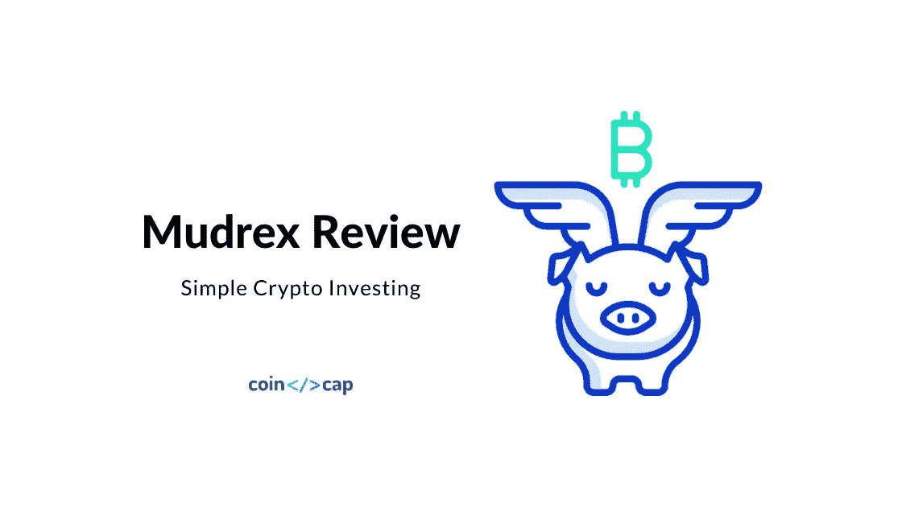
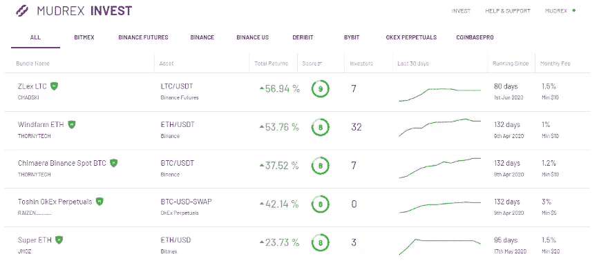
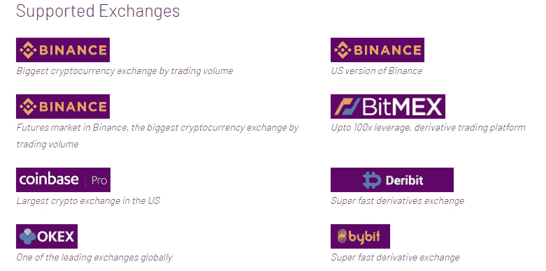
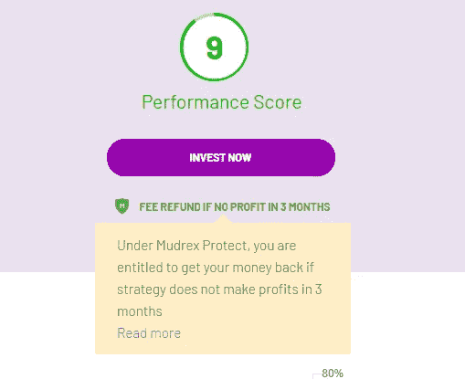
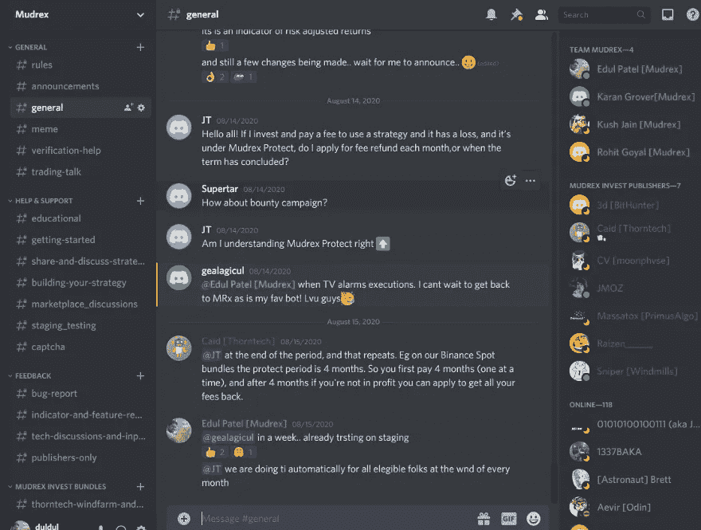
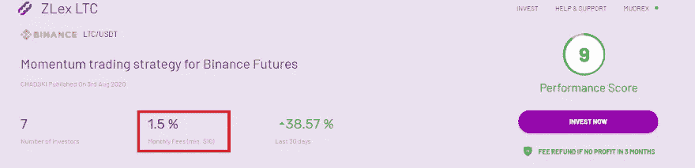

# mudrex Invest——投资密码的简单方法

> 原文：<https://medium.com/coinmonks/mudrex-invest-an-easy-way-to-invest-in-a-crypto-670dd4deb2b3?source=collection_archive---------0----------------------->

从市场中赚钱真的真的很难。96%的散户亏钱。

在花了无数时间在图表前试图寻找“好的切入点”后，我可以证明这一点。这个问题在加密中被进一步放大，因为有 1000 个加密市场，每个市场都是 24*7 的。

不是每个人都注定要成为交易者，也不是每个人都应该去尝试。这就是为什么我认为我们大多数人应该专注于投资，而算法和机器人是存放你的钱的最好地方之一。话虽如此，找到合适的平台、人员和机器人进行投资同样具有挑战性。

**当我挑选要投资的机器人时，寻找**

*   信息透明度
*   稳定可预测的回报
*   相对于预期回报的低成本

但令人惊讶的是，即使在 2020 年，加密市场也充满了骗局，效率低下，跟踪信号组和狗信号市场很痛苦。

这就是[穆德雷克斯](https://mudrex.com/auth/signup/?referral_code=COIN3566&utm_source=medium&utm_medium=article&utm_term=coinmonks)脱颖而出的地方。Mudrex 让投资加密交易机器人像投资共同基金一样简单。他们对自己的信息非常透明，拥有基于我们风险偏好的各种交易机器人，以及迄今为止我所见过的最好的定价模型。

如果你正在寻找一个可以投资你的密码的平台，那么 [Mudrex](https://mudrex.com/auth/signup/?referral_code=COIN3566&utm_source=medium&utm_medium=article&utm_term=coinmonks) 可能就是它！

# 利弊

Mudrex 看起来是所有交易者的一个很好的平台！它有一个简单，直观，易于使用的用户界面。投资的容易程度是我们从未见过的。

## 赞成的意见

*   简单直观的设计和超级易用。
*   基于投资者投资额而不是固定费用的更好的定价模式
*   有了他们的 Mudrex Protect 功能，如果你的投资没有回报，你就可以拿回你的钱
*   API 基于键的投资。随时投入，随时退出。不收退场费！

## 骗局

*   下订单时没有通知(还没有)
*   用户界面有时会有点慢

# Mudrex 特征

## 使得决定投资哪个机器人变得容易

当决定在哪里投资时，最重要的是

*   找出哪个机器人是好的，哪个是坏的
*   选择一个风险和回报都符合你胃口的地方

Mudrex 创建了一个名为“绩效得分”的专有指标，以帮助投资者做出明智的选择！绩效分数是一个从 0 到 10 的数字。数字越大，策略的风险与回报越好。任何数字<=4 can be considered as poor, 5–7 can be thought of as average, and > =8 都可以认为是好的。

除此之外，他们的 bot 列表页面可以很容易地检查重要的指标，如回报，自生存以来的天数，费用等。他们还可以选择排序和过滤，这使得挑选机器人变得简单。

## 无需通过基于 API 的集成转移资金

在加密领域，很难信任第三方，这就是为什么要求你向他们存款的人是一个大禁忌。Mudrex 在与币安、Bitmex、Bybit、比特币基地等一系列顶级交易所的整合方面做得很好。你所需要做的就是连接你的 API 密匙库

## 不盈利就不交钱！

投资任何产品都不能保证有回报。在很多情况下，用户最终会付费，即使他们投入资金的机器人最终亏损。这就是 Mudrex 保护 T2 的地方。

这个想法很简单，如果机器人为你赚钱，你就付钱，如果不是，你就得到退款！退款是自动进行的，不会问任何问题！

## “投资者至上”的方法

现在我知道这不是一个单一的功能，但我们真正喜欢的是平台上的一切如何聚集在一起，解决像我们这样的普通投资者面临的基本问题。真正赢得我们的心和[钱包](https://coincodecap.com/category/wallets)的是更简单的事情，比如，支持多种支付选项、基于 API 密钥的集成、确保用户不会负担随机费用等等！

## 活跃的社区和快速支持

与其他交易平台不同，Mudrex 拥有一个庞大而繁荣的不和谐交易者和投资者社区。他们还将不和谐作为客户支持和快速解决问题的主要渠道。当需要帮助时，创始团队的成员和平台的其他专门用户总是在附近。

Mudrex 的创始人为任何需要的用户提供一对一的演示。它所需要的只是一个简短的[表格填写！](https://calendly.com/mudrex/mudrex-demo?month=2020-08)

# 定价

价格可能是 Mudrex 最大的差异化因素，是革命性的。大多数 bot 平台都收取高额的固定费用，而不管你作为投资者的投资额。这对机器人的创造者和使用者都是不公平的。在 Mudrex 上，机器人创建者根据投资者的投资额来决定%的费用，而不是固定费用。

**例如**:假设你决定投资一个月利率为 2%的机器人。如果你在这个机器人上投资 200 美元，你的费用将只有 4 美元！同样，如果你投资 2000 美元，你的费用将只有 40 美元。

这种民主的定价方式使 Mudrex 成为对交易者和投资者都非常有吸引力的平台！

# 与其他产品的比较

当谈到投资机器人时，有几种不同的产品。3commas、Cryptohopper 和 Zignally 这三家公司都提供了某种信号市场。

类似 Mudrex 的平台 Kryll，选择非常有限。其他像 Haas，Gunbot，TradeSanta 等对于初学者来说有点复杂。而且一刀切，都是小贵！

与同行相比，Mudrex 似乎领先数年。产品质量、专注于让客户的生活变得轻松以及广泛的选择范围，使其成为最好的投资平台之一。

# 它是如何工作

*   去 [Mudrex](https://mudrex.com/invest) Invest，决定你想投资哪些策略
*   在 Mudrex.com 注册(此处为推荐代码)
*   连接您的 exchange API 密钥
*   使用 Mudrex Balance 添加卡或预付
*   去直播！

在 Mudrex 上注册非常简单，整个过程只需要 5 分钟。注册后，您可以快速测试策略并投入使用。

这里有一个很好的演示，是由另一个 Mudrex 用户提供的，你应该看看！

# 性能和安全性

与实际的加密货币交易所不同，Mudrex 不会持有您的资产。这些资产都存储在您已连接到 Mudrex(比特币基地、航海家、北海巨妖、币安等)的现有 exchange 帐户中。).您只需连接您的 API 键就可以开始了。

[在他们的支持文章](https://support.mudrex.com/hc/en-us/articles/360002051692-How-does-Mudrex-keep-my-information-secure-)中，Mudrex 声称，所有重要的个人信息都是使用银行级 AES-256 加密和加法存储的，所有 API 流量都是安全的，并通过 SSL 和使用 TLS 1.2 来防止第三方窃听您的连接。

对于支付，Mudrex 表示，他们使用 Stripe 作为支付合作伙伴，因此信用卡信息等都存储在 Stripe 中。

# 结论

当交易所忙于花更多的时间推出新的代币和资产以增加交易量时，Mudrex 等平台实际上正在解决正确的问题，并确保交易者最终真正赚到一些钱！

总的来说，我们很高兴试用该产品。这个领域还处于早期，但 Mudrex 正在迅速发展，成为所有资产类别的交易者在不久的将来都想去的地方。

# Mudrex 替代品

1.  [3commas](https://3commas.io/?c=tc252152) 是一个在线平台，面向对使用自动化机器人进行[交易](https://blog.coincodecap.com/tag/trading/)加密货币感兴趣的人。对于没有金融技术背景或没有丰富股市经验的人来说，这尤其具有吸引力。另外，请阅读我们的[3 商业评论](/coinmonks/3commas-review-an-excellent-crypto-trading-bot-2020-1313a58bec92)。
2.  [Bitsgap](https://bitsgap.com/?ref=2cb1231&utm_source=coincodecap&utm_medium=article&utm_campaign=promo) ，一个满足您所有交易需求的一站式加密交易平台。它允许用户将他们所有的密码交易账户放在同一个屋檐下，通过一个集成的界面进行交易。另外，请阅读我们的 [Bitsgap 评论](/coinmonks/bitsgap-review-a-crypto-trading-bot-that-makes-easy-money-a5d88a336df2)。
3.  [Quadency](https://quadency.com/?r=ea20aa360c45d1f5ad47a19a) ，2018 年推出的密码交易自动化平台。它给你带来了一个更聪明的方式来交易和管理你的密码。另外，请阅读我们的[季度回顾](https://blog.coincodecap.com/quadency-review-a-crypto-trading-automation-platform)。

*原载于 2020 年 8 月 27 日 https://blog.coincodecap.com***。**

## *另外，阅读*

*   *最好的[密码交易机器人](/coinmonks/crypto-trading-bot-c2ffce8acb2a)*
*   *[密码本交易平台](/coinmonks/top-10-crypto-copy-trading-platforms-for-beginners-d0c37c7d698c)*
*   *最好的[加密税务软件](/coinmonks/best-crypto-tax-tool-for-my-money-72d4b430816b)*
*   *[最佳加密交易平台](/coinmonks/the-best-crypto-trading-platforms-in-2020-the-definitive-guide-updated-c72f8b874555)*
*   *最佳[加密贷款平台](/coinmonks/top-5-crypto-lending-platforms-in-2020-that-you-need-to-know-a1b675cec3fa)*
*   *[最佳区块链分析工具](https://bitquery.io/blog/best-blockchain-analysis-tools-and-software)*
*   *[加密套利](/coinmonks/crypto-arbitrage-guide-how-to-make-money-as-a-beginner-62bfe5c868f6)指南:新手如何赚钱*
*   *最佳[加密制图工具](/coinmonks/what-are-the-best-charting-platforms-for-cryptocurrency-trading-85aade584d80)*
*   *[莱杰 vs 特雷佐](/coinmonks/ledger-vs-trezor-best-hardware-wallet-to-secure-cryptocurrency-22c7a3fd391e)*
*   *了解比特币最好的[书籍有哪些？](/coinmonks/what-are-the-best-books-to-learn-bitcoin-409aeb9aff4b)*
*   *[3 商业评论](/coinmonks/3commas-review-an-excellent-crypto-trading-bot-2020-1313a58bec92)*
*   *[AAX 交易所评论](/coinmonks/aax-exchange-review-2021-67c5ea09330c) |推荐代码、交易费用、利弊*
*   *[Deribit 审查](/coinmonks/deribit-review-options-fees-apis-and-testnet-2ca16c4bbdb2) |选项、费用、API 和 Testnet*
*   *[FTX 密码交易所评论](/coinmonks/ftx-crypto-exchange-review-53664ac1198f)*
*   *[零审核](/coinmonks/ngrave-zero-review-c465cf8307fc)*
*   *[Bybit 交换审查](/coinmonks/bybit-exchange-review-dbd570019b71)*
*   *[3Commas vs Cryptohopper](/coinmonks/cryptohopper-vs-3commas-vs-shrimpy-a2c16095b8fe)*
*   *最好的比特币[硬件钱包](/coinmonks/the-best-cryptocurrency-hardware-wallets-of-2020-e28b1c124069?source=friends_link&sk=324dd9ff8556ab578d71e7ad7658ad7c)*
*   *最佳 [monero 钱包](https://blog.coincodecap.com/best-monero-wallets)*
*   *[莱杰 nano s vs x](https://blog.coincodecap.com/ledger-nano-s-vs-x)*
*   *[bits gap vs 3 commas vs quad ency](https://blog.coincodecap.com/bitsgap-3commas-quadency)*
*   *[莱杰 Nano S vs 特雷佐 one vs 特雷佐 T vs 莱杰 Nano X](https://blog.coincodecap.com/ledger-nano-s-vs-trezor-one-ledger-nano-x-trezor-t)*
*   *[block fi vs Celsius](/coinmonks/blockfi-vs-celsius-vs-hodlnaut-8a1cc8c26630)vs Hodlnaut*
*   *Bitsgap 评论——一个轻松赚钱的加密交易机器人*
*   *[Quadency Review](/coinmonks/quadency-review-a-crypto-trading-automation-platform-3068eaa374e1) -为专业人士打造的加密交易机器人*
*   *[PrimeXBT 评论](/coinmonks/primexbt-review-88e0815be858) |杠杆交易、费用和交易*
*   *[埃利帕尔泰坦评论](/coinmonks/ellipal-titan-review-85e9071dd029)*
*   *[SecuX Stone 评论](https://blog.coincodecap.com/secux-stone-hardware-wallet-review)*
*   *[BlockFi 评论](/coinmonks/blockfi-review-53096053c097) |从您的密码中赚取高达 8.6%的利息*