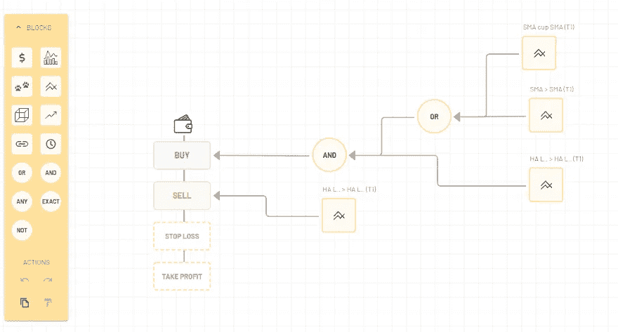
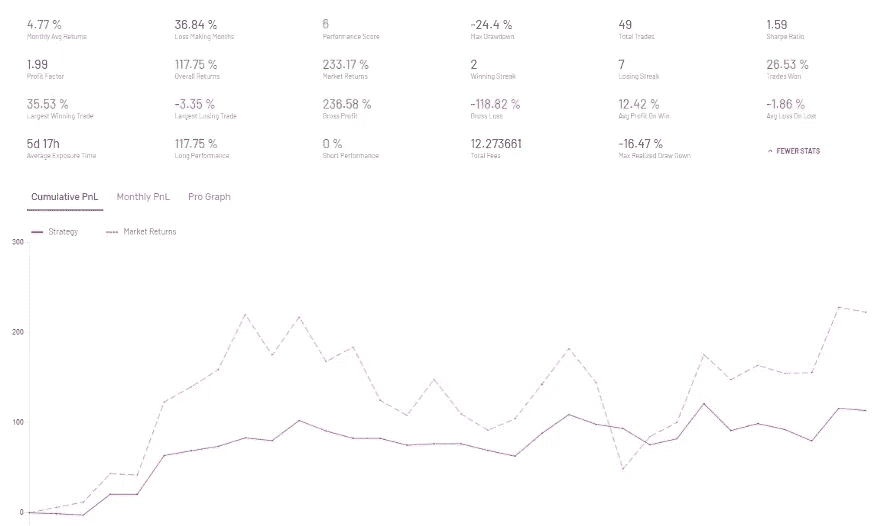
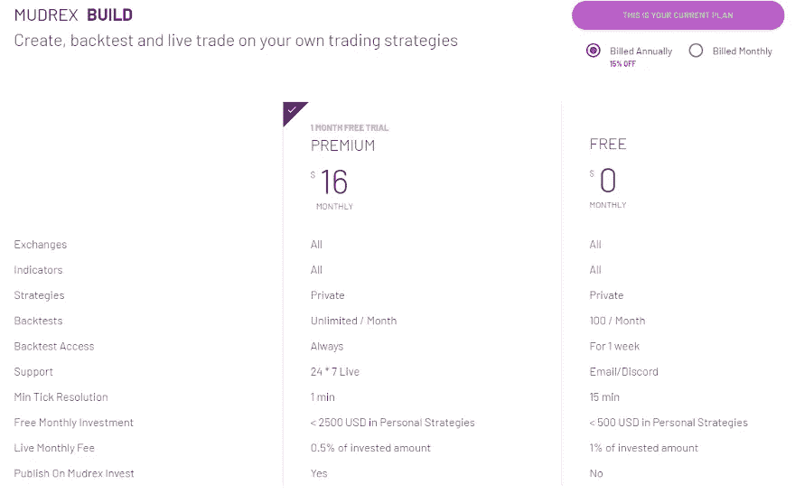

# Mudrex 战略建设者审查-自动化您的密码交易从未如此简单

> 原文：<https://medium.com/coinmonks/mudrex-strategy-builder-review-automating-your-crypto-trading-was-never-easier-3e0e99ee12e8?source=collection_archive---------0----------------------->

从市场中赚钱真的真的很难。96%的散户亏钱。在花了无数时间在图表前试图寻找“好的切入点”后，我可以证明这一点。

交易是艰苦的。擅长 T2 交易需要时间、耐心和纪律，这些都是人类不擅长的。这个问题在加密领域被进一步放大了，因为有 1000 个加密市场，每个市场都是 24*7 的。

因此，要成功，每个交易者需要两样东西。

[Y-combinator 支持的 Mudrex](https://www.forbes.com/sites/ktorpey/2019/02/22/y-combinator-backed-mudrex-helps-non-coders-create-crypto-trading-bots/#533c0cd17a4b) ，已经创建了一个最先进的简单的可视化策略生成器，现在被世界上一些最好的交易者用来建立他们的交易策略。用户无需编写一行代码就可以开始使用。一旦交易者开发了他们的策略，他们可以自己上线，或者在 Mudrex Invest 上发布，当其他用户投资策略时，他们就可以赚取费用！

如果你正在寻找一个平台来帮助你成为一个更好的交易者， [**Mudrex**](https://mudrex.com/signup?referral_code=COIN3566) 可能就是它！

# 利弊

对于所有交易者来说，Mudrex 看起来是一个极好的平台！它有一个简单，直观，易于使用的用户界面。创建交易策略的灵活性是我们从未见过的。但是一如既往，还有改进的余地！

**优点:**

*   不需要编码。你只需使用可视化策略生成器来构建你的[交易系统](https://coincodecap.com/category/trading-automation)
*   闪电般快速的回溯测试和实时交易
*   一个由 1000 多名交易者组成的非常活跃的社区
*   与币安、Bitmex、比特币基地等顶级交易所的 API 密钥集成
*   收费低！

**缺点**

*   没有能力添加自定义指标(还没有)
*   移动网站上的有限功能

# 特征

## 无代码，基于拖放的策略生成器

这是该平台最酷、最具创新性的特性之一。从历史上看，要实现交易自动化，大多数交易者需要学习代码，并使用 Pine、Python 或 r 等语言构建交易系统。这不仅需要 3-6 个月的学习时间，而且如果你真的想构建它，最终可能会花费超过 10，000 美元。

另一方面，Mudrex 提供的可视化构建器是一个简单的工具！不需要什么特别的知识或者学习经验。就像任何其他工具一样，构建器需要 5-10 分钟才能完成。但是一旦你在那里，行动变得超级容易！

重要的是，他们甚至想到了更小的事情，如版本控制、在策略和编辑器之间轻松切换、命名、编辑和添加注释等。

## 详细的测试基础设施

不经测试就采用交易策略无异于搬起石头砸自己的脚。测试需要两件事，准确可靠的历史数据和非常灵活的快速基础设施。穆德雷克斯两样都有！

Mudrex 让您能够根据来自 8 个交易所和 2000 多个资产的可靠历史数据来测试您的策略。Mudrex 上的大多数回溯测试都在几秒钟内完成。我们确实发现，在某些情况下，回溯测试需要 1 分钟以上才能完成，但这对我们来说并不重要。快速运行多个回溯测试也是一个优秀的特性插件。

他们还提供了深入的统计数据和详细的图表，以帮助您评估该策略在哪里有效，在哪里无效。

## 活跃的社区和快速支持

与其他交易平台不同，Mudrex 拥有一个庞大而繁荣的不和谐交易者和投资者社区。他们还将 Discord 作为客户支持和快速解决问题的主要渠道。当需要帮助时，创始团队的成员和平台的其他专门用户总是在附近。

Mudrex 的创始人为任何需要的用户提供一对一的演示。它所需要的只是一个简短的[表格填写！](https://calendly.com/mudrex/mudrex-demo?month=2020-08)

# Mudrex 是怎么工作的？

*   创建您的交易策略或检查现有的策略
*   连接您的 exchange API 密钥
*   使用 Mudrex Balance 添加卡或预付
*   去直播！

在 Mudrex 上注册非常简单，整个过程只需要 5 分钟。注册后，您可以快速开始构建和测试。正如我们之前提到的，学习如何构建需要一些时间，但是他们的[支持文档](https://support.mudrex.com/hc/en-us)和 [Youtube 视频](https://www.youtube.com/c/mudrex)对于开始非常有用。

这里有一个由另一个 Mudrex 用户提供的精彩演示，你应该看看！

# 性能和安全性

与真实的[加密货币交易](https://blog.coincodecap.com/convert-bitcoin-best-crypto-exchange-services)不同，Mudrex 不持有你的资产。这些资产都存储在您已连接到 Mudrex(比特币基地、航海家、北海巨妖、币安等)的现有 exchange 帐户中。).您只需连接您的 API 键就可以开始了。

在他们的支持文章中，Mudrex 声称所有重要的个人信息都是使用银行级 AES-256 加密技术存储的。此外，所有 API 流量都是安全的，通过 SSL 并使用 TLS 1.2 来防止第三方窃听您的连接。

对于支付，Mudrex 表示，他们使用 Stripe 作为支付合作伙伴，因此信用卡信息等都存储在 Stripe 中。

# 定价

Mudrex 有简单的基于费米能级的定价模型。免费计划给你足够的机会来构建和测试你想要的任何东西。只要你在测试，Mudrex 实际上对你是免费的！

唯一的情况下，你需要转移到溢价计划，如果你想做广泛的测试或想投资大量的资本在您的交易策略。在这种情况下，您可能希望获得每月 19 美元的保费计划。使用 premium 计划，您可以免费试用前几个月，并且可以随时取消！

Mudrex 接受[信用卡、PayPal 或 crypto](https://support.mudrex.com/hc/en-us/articles/360028770871-What-payment-methods-are-accepted-on-Mudrex-) 支付，因此支付费用既快捷又简单！

# 与其他产品的比较

过去有一些平台，如 HaaS、Gunbot、Cryptohopper 和 3commas，试图帮助交易者实现自动化。但他们的用户界面和 UX 要么太局限，要么太混乱，这导致大多数交易者仍然手动交易。

从 UI 构建策略的角度来看，Kryll 是一个接近 Mudrex 的平台。但是 kryll 上的特性和功能非常有限，因此我们无法构建任何有意义的东西。

Mudrex 打造的产品是真正独一无二的，在过去的一年中，我们从未见过任何产品能与之媲美。strategy builder 为用户提供了难以置信的灵活性来创建他们想要的东西，测试引擎强大而快速，Mudrex Invest 通过轮询资本帮助交易者将他们的知识产权货币化。

所有其他平台每月收费 29-49 美元不等。高级计划的价格为 19 美元，Mudrex 也比其他产品便宜至少 3 倍。

# 结论

当交易所忙于花更多的时间推出新的代币和资产以增加交易量时，Mudrex 等平台实际上正在解决正确的问题，并确保交易者最终真正赚到一些钱！

总的来说，我们对产品很满意。它仍然处于这个领域的早期，但 Mudrex 正在迅速发展，成为所有资产类别的交易者在不久的将来都想去的地方。

## Mudrex 交易机器人替代品

1.  [3commas](https://3commas.io/?c=tc252152) 是一个在线平台，面向对使用自动化机器人进行[交易](https://blog.coincodecap.com/tag/trading/)加密货币感兴趣的人。对于没有金融技术背景或没有丰富股市经验的人来说，这尤其具有吸引力。另外，请阅读我们的[3 商业评论](/coinmonks/3commas-review-an-excellent-crypto-trading-bot-2020-1313a58bec92)。
2.  [Bitsgap](https://bitsgap.com/?ref=2cb1231&utm_source=coincodecap&utm_medium=article&utm_campaign=promo) ，一个满足您所有交易需求的一站式加密交易平台。它允许用户将他们所有的密码交易账户放在同一个屋檐下，通过一个集成的界面进行交易。另外，请阅读我们的 [Bitsgap 评论](/coinmonks/bitsgap-review-a-crypto-trading-bot-that-makes-easy-money-a5d88a336df2)。
3.  [Quadency](https://quadency.com/?r=ea20aa360c45d1f5ad47a19a) ，2018 年推出的密码交易自动化平台。它给你带来了一个更聪明的方式来交易和管理你的密码。另外，请阅读我们的[季度回顾](https://blog.coincodecap.com/quadency-review-a-crypto-trading-automation-platform)。

## 另外，阅读

*   最好的[密码交易机器人](/coinmonks/crypto-trading-bot-c2ffce8acb2a)
*   [密码本交易平台](/coinmonks/top-10-crypto-copy-trading-platforms-for-beginners-d0c37c7d698c)
*   最好的[加密税务软件](/coinmonks/best-crypto-tax-tool-for-my-money-72d4b430816b)
*   [最佳加密交易平台](/coinmonks/the-best-crypto-trading-platforms-in-2020-the-definitive-guide-updated-c72f8b874555)
*   最佳[加密贷款平台](/coinmonks/top-5-crypto-lending-platforms-in-2020-that-you-need-to-know-a1b675cec3fa)
*   [最佳区块链分析工具](https://bitquery.io/blog/best-blockchain-analysis-tools-and-software)
*   [加密套利](/coinmonks/crypto-arbitrage-guide-how-to-make-money-as-a-beginner-62bfe5c868f6)指南:新手如何赚钱
*   最佳[加密制图工具](/coinmonks/what-are-the-best-charting-platforms-for-cryptocurrency-trading-85aade584d80)
*   [莱杰 vs 特雷佐](/coinmonks/ledger-vs-trezor-best-hardware-wallet-to-secure-cryptocurrency-22c7a3fd391e)
*   了解比特币的[最佳书籍有哪些？](/coinmonks/what-are-the-best-books-to-learn-bitcoin-409aeb9aff4b)
*   [3 商业评论](/coinmonks/3commas-review-an-excellent-crypto-trading-bot-2020-1313a58bec92)
*   [AAX 交易所评论](/coinmonks/aax-exchange-review-2021-67c5ea09330c) |推荐代码、交易费用、利弊
*   [Deribit 审查](/coinmonks/deribit-review-options-fees-apis-and-testnet-2ca16c4bbdb2) |选项、费用、API 和 Testnet
*   [FTX 密码交易所评论](/coinmonks/ftx-crypto-exchange-review-53664ac1198f)
*   [n 零审核](/coinmonks/ngrave-zero-review-c465cf8307fc)
*   [Bybit 交换审查](/coinmonks/bybit-exchange-review-dbd570019b71)
*   [3Commas vs Cryptohopper](/coinmonks/cryptohopper-vs-3commas-vs-shrimpy-a2c16095b8fe)
*   最好的比特币[硬件钱包](/coinmonks/the-best-cryptocurrency-hardware-wallets-of-2020-e28b1c124069?source=friends_link&sk=324dd9ff8556ab578d71e7ad7658ad7c)
*   最佳 [monero 钱包](https://blog.coincodecap.com/best-monero-wallets)
*   [莱杰纳诺 s vs x](https://blog.coincodecap.com/ledger-nano-s-vs-x)
*   [bits gap vs 3 commas vs quad ency](https://blog.coincodecap.com/bitsgap-3commas-quadency)
*   [莱杰纳米 S vs 特雷佐 one vs 特雷佐 T vs 莱杰纳米 X](https://blog.coincodecap.com/ledger-nano-s-vs-trezor-one-ledger-nano-x-trezor-t)
*   [block fi vs Celsius](/coinmonks/blockfi-vs-celsius-vs-hodlnaut-8a1cc8c26630)vs Hodlnaut
*   Bitsgap 评论——一个轻松赚钱的加密交易机器人
*   为专业人士设计的加密交易机器人
*   [PrimeXBT 审查](/coinmonks/primexbt-review-88e0815be858) |杠杆交易、费用和交易
*   [埃利帕尔泰坦评论](/coinmonks/ellipal-titan-review-85e9071dd029)
*   [赛克斯·斯通评论](https://blog.coincodecap.com/secux-stone-hardware-wallet-review)
*   [BlockFi 评论](/coinmonks/blockfi-review-53096053c097) |从您的密码中赚取高达 8.6%的利息

*原载于 2020 年 8 月 20 日*[*【https://blog.coincodecap.com】*](https://blog.coincodecap.com/mudrex-strategy-builder-review)*。*