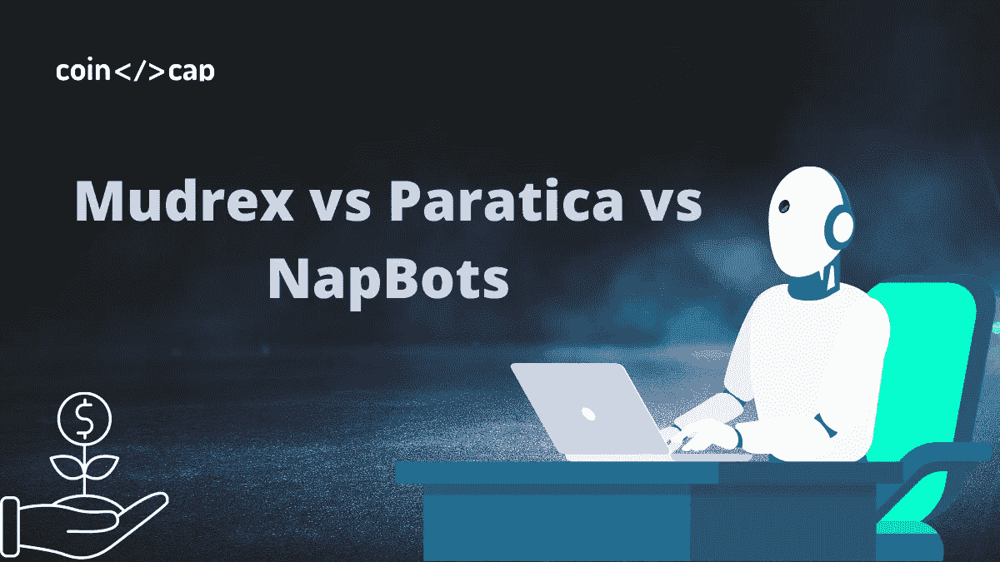
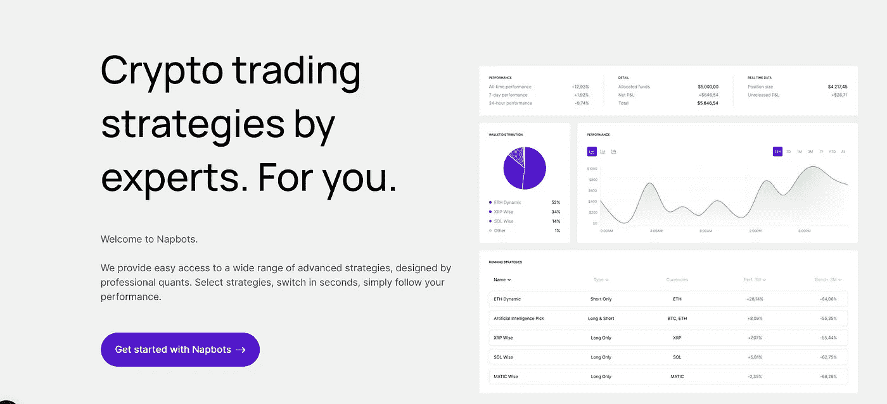
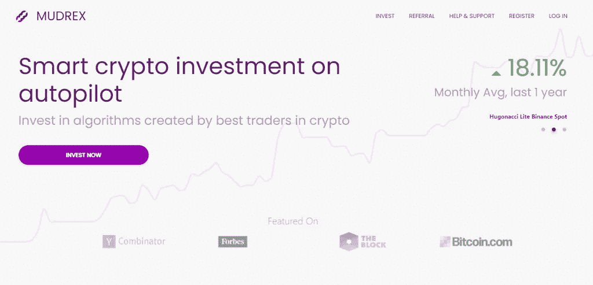
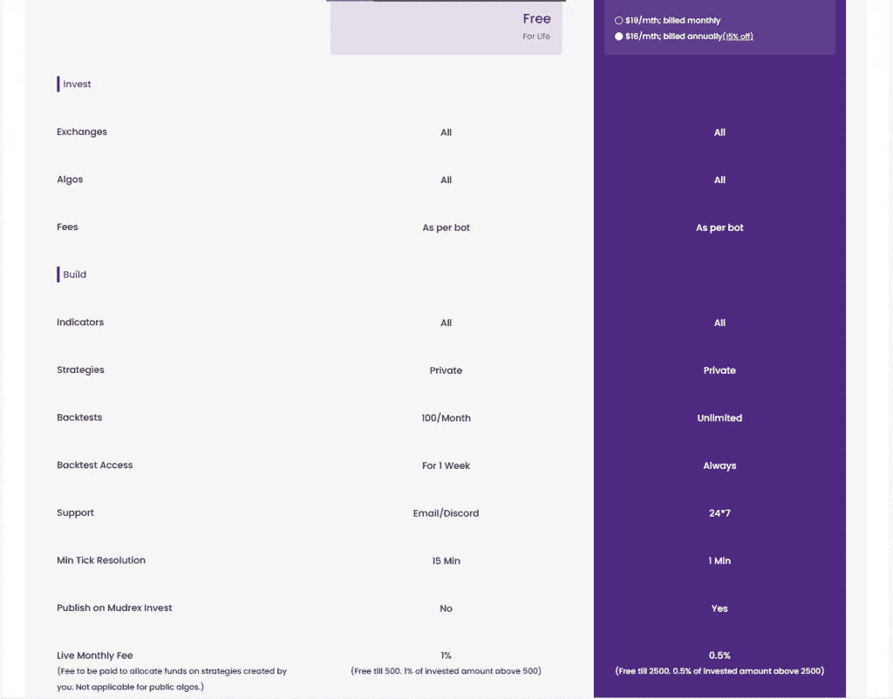

# Mudrex vs Paratica vs NapBots

> 原文：<https://medium.com/coinmonks/mudrex-vs-paratica-vs-napbots-c926b0ad3108?source=collection_archive---------7----------------------->

随着加密市场永不停息，加密交易机器人正成为一种必需品。因此，本文将讨论三个最流行的密码交易机器人提供商，**[**Paratica**](https://blog.coincodecap.com/go/paratica)和[**nap bot**](https://blog.coincodecap.com/go/napbots)。**

# **总结(TL；博士)**

*   **您可以使用 [Napbots](https://blog.coincodecap.com/go/napbots) 的交易机器人服务来增加收益，同时减少损失。**
*   **Mudrex 是一个加密交易平台，试图让更多的人更好地使用加密交易。**
*   **[Paratica](https://blog.coincodecap.com/go/paratica) 是一个社交交易平台，让用户能够独立创建投资策略或跟随有经验的投资者。**
*   **所有这三个平台都使用 API 密匙连接到你的[加密交换](https://blog.coincodecap.com/crypto-exchange)，因此可以安全使用。**

# **什么是加密交易机器人？**

**近年来，加密领域呈爆炸式增长，这可能是所有主要加密资产最重要的一年。特别值得注意的是 2020 年，这一年对比特币来说可能比往年更有希望。在动荡的市场中，手工交易难以为继。**

**现在，手动观察价格走势、交易股票并持续获利几乎是不可能的。自动化交易系统，如提供一系列工具帮助交易者的 T21，因此变得越来越受欢迎。或者，用户可以通过使用[复制交易](https://blog.coincodecap.com/copy-trading)方法在这些平台上创建自己的交易策略或遵循专业交易者的交易策略。**

# **什么是 NapBots？**

**NapBots 成立于 2018 年，设置简单明了。欧洲最大的数字投资公司 CoinShares 于 2021 年 12 月收购了拿破仑集团。除了自动化交易，[**nap bots**](https://blog.coincodecap.com/go/napbots)‘交易机器人服务让客户提高利润率，将损失降到最低。Napbots 将根据市场价格的变动执行活动。你可以从[币安](https://blog.coincodecap.com/go/binance)、 [BitMEX](https://blog.coincodecap.com/go/bitmex) 、 [Bitfinex](https://blog.coincodecap.com/go/bitfinex) 、 [Okex](https://blog.coincodecap.com/go/okex) 、 [Phemex](https://blog.coincodecap.com/go/phemex) 、[北海巨妖](https://blog.coincodecap.com/go/kraken)和 [Bitpanda](https://blog.coincodecap.com/go/bitpanda) 中选择一个交易所开始使用这个机器人。**

****

**由于算法方法使用了如此多样的一套交易所，因此有大量的流动性可用。然后你可以选择你最喜欢的加密策略，最后，坐下来让机器人为你工作。**

**要了解更多信息，请阅读[nap bot 评论](https://blog.coincodecap.com/napbots-review-crypto-trading-on-autopilot)。**

# **什么是 Mudrex？**

**[**Mudrex**](https://blog.coincodecap.com/go/mudrex)**是一款自动化的基于云的加密投资工具，旨在帮助普通大众进行加密货币交易。该平台允许用户要么使用预先制作的交易方法，要么自行开发和投资。****

****如果你想要一个自动交易机器人系统来管理你的策略，你可以在 Mudrex Invest 获得。这些机器人是全自动的，可以在许多交易平台上使用，包括[比特币基地 Pro](https://blog.coincodecap.com/go/coinbase) 、[币安](https://blog.coincodecap.com/go/binance)、 [Bybit](https://blog.coincodecap.com/go/bybit) 、 [OKEx](https://blog.coincodecap.com/go/okex) 、 [Deribit](https://blog.coincodecap.com/go/deribit) 和 [BitMEX](https://blog.coincodecap.com/go/bitmex) 。****

********

****Mudrex 的美妙之处在于，它使你能够通过使用创新的交易模块来开发、回溯测试，然后发布你的交易方法。****

****要了解更多信息，请阅读 [Mudrex 策略生成器](https://blog.coincodecap.com/mudrex-strategy-builder-review)。****

# ****什么是帕拉蒂卡？****

****[**Paratica**](https://blog.coincodecap.com/go/paratica)**是一个[社交交易平台](/coinmonks/top-10-crypto-copy-trading-platforms-for-beginners-d0c37c7d698c)，允许用户手动创建交易策略或跟随专业交易员。此外，该平台有一个简单的用户界面，允许用户在想要手动交易时更改机器人设置。******

******此外,“专家”标签列出了使用各种策略进行投资的所有专业交易者，使跨货币和交易所投资变得简单。在 [Paratica](https://blog.coincodecap.com/go/paratica) 的用户可以通过四个交易所进行交易，分别是 [Huobi](https://blog.coincodecap.com/go/huobi) 、[币安](https://blog.coincodecap.com/go/binance)、 [OKEx](https://blog.coincodecap.com/go/okex) 和 Chiliz。******

******要了解更多信息，请阅读 [Paratica 评论](https://blog.coincodecap.com/paratica-review)。******

************

# ******Mudrex vs Paratica vs NapBots:定价******

******当谈到加密货币交易时，必须考虑几项费用。对于一次性费用、每月会员费或利润分成，一些组织征收持续费用。******

******虽然 Practika、Mudrex 和 Napbots 对交易所账户的交易成本没有直接影响，但当您通过它们进行交易时，它们可以间接影响向您的账户收取的费用。尽管没有交易成本或佣金，他们还是对他们的[加密交易机器人](/coinmonks/crypto-trading-bot-c2ffce8acb2a)收取注册费。******

# ******NapBot 定价******

******[NapBot](https://blog.coincodecap.com/go/napbots) 的定价套餐有三种不同的方案，每月花费在 7 到 99 欧元之间。******

*   ******一个银订阅，每月只需 7€，为您提供每周交易机器人的使用，预算上限为 1000 欧元。******
*   ******黄金计划每月花费€39 英镑，为会员提供每周和每天的策略，如杠杆，以及重要的附加功能，如配置定制。此外，最高消费限额为 3000 欧元。******
*   ******白金计划每月花费€99 英镑，允许你使用所有可用的交易机器人和平台的所有功能。******

************

# ******Mudrex 定价******

******与其他大型自动化交易平台一样，投资者在 [**Mudrex**](https://blog.coincodecap.com/go/mudrex) 使用该服务无需支付费用。然而，价格取决于机器人，从 5 美元到 10 美元不等。首次投资者可以在该网站上注册投资，最低投资额为 150 美元。(不包括费用)。此外，使用 [Mudrex Protect](https://support.mudrex.com/hc/en-us/articles/360041088492-What-is-Mudrex-Protect-) ，如果客户的订阅计划在一个月内没有盈利，他们将获得全额退款。******

****Mudrex 构建平台可用于创建和运行您的策略。免费版本提供了一些基本功能，让您可以开始使用。在高级会员层，用户可以进行任意多的回溯测试，所有的技术指标，需要时优先支持，并在 Mudrex 上发布他们的策略供其他用户交易。****

********

# ****Paratica 定价****

****Paratica 的用户可以选择三种不同的计划。首先，白银溢价(9.9 美元/月)套餐包括每天 5 个位置，每月 150 个位置和 50 个配对，以及其他福利。****

****其次，黄金高级计划(14.9 美元/月)每天提供 10 个职位，每月 300 个职位，20 个并发角色，比白银计划多得多。最后，白金高级计划(19.9 美元/月)是最贵的，为客户提供无限头寸、50 个并发头寸、无限配对等等。****

****然而，没有免费的计划，交易者可以利用 7 天的免费试用期，在支付费用之前不需要信用卡。在 [Paratica](https://blog.coincodecap.com/go/paratica) ，没有最低投资金额，用户可以在交易所允许的范围内少投资。****

********

# ****Mudrex vs Paratica vs NapBots:交易****

****如果你打算创建你的 [Mudrex](https://blog.coincodecap.com/go/mudrex) 机器人，了解如何交易是必要的。如果你想使用 Napbots、Pratica 或 Mudrex 的预设机器人，你应该知道选择哪个机器人。因此，你应该学会利用他们的最大潜力，并尽量减少你的损失。****

****尽管如此，参与 [Napbot](https://blog.coincodecap.com/go/napbots) 交易不需要对市场有技术上的了解，因为这对新手交易者来说足够简单。此外，它是市场上唯一的 BTC 战略组合机器人。****

****最终，根据市场价格的变化，Napbots 会从事与用户类似的活动。****

# ****Mudrex vs Paratica vs NapBots:可靠性****

# ****Napbots****

****AMF 监管拿破仑集团，其姊妹品牌 Napbots 提供人工智能和基于云的解决方案，使任何不在金融行业工作的人都能进行加密货币交易。****

****因此，根据从一系列可用策略中选择的加密策略，可以为您进行交易。这些技术是由经验丰富的量化交易者设计的，他们在一些顶级金融机构工作了超过 15 年。****

# ****穆德雷克斯****

****仅仅一年多时间， [**Mudrex**](https://blog.coincodecap.com/go/mudrex) 就吸引了投资者的大量资金。来自旧金山的 Mudrex 拥有超过 10，000 名投资者和 5 亿美元的交易总额，并得到了 Y-Combinator 的支持。****

****平台提供 2FA，API 无撤回权限，快速客服帮助。****

# ****帕拉蒂卡****

****[**帕拉蒂卡**](https://blog.coincodecap.com/go/paratica) 位于土耳其伊斯坦布尔，成立于 2018 年。该平台拥有超过 5200 名用户，月交易额超过 2100 万美元，订单超过 300 万份。在其网站上，它标榜自己是世界上最复杂的比特币自动交易解决方案。然而，在向 Paratica 添加 API 凭证之前，用户必须首先启用 2FA。此外，API 凭证具有最小的权限，这消除了任何撤销的可能性。****

****值得信赖的平台对每个投资者来说都是必要的，因为它允许用户无限制地投资，并选择最佳投资。因此，我们认为 NapBots 和 Mudrex 在安全性和开放性方面是最可靠的。****

# ****Mudrex vs Paratica vs NapBots:结论****

****根据这篇评论，虽然没有一个交易机器人对所有人都是完美的，[**nap bot**](https://blog.coincodecap.com/go/napbots)**是加密交易者最好的自动化交易平台。Napbots 为各个层次的交易者提供了一个易于投资的平台，拥有出色的用户体验和安全的平台。******

******NapBots 加密交易程序的独特之处在于它包括:******

1.  ******独一无二的交易算法，代表你分析市场数据。******
2.  ******一个独一无二的加密交易机器人库，允许您混合和匹配交易方法。******
3.  ******自动驾驶模式允许你一周七天，一天 24 小时交易。******
4.  ******一个易于使用的界面，允许你模仿 NapBots 的成熟技术进行有利可图的交易。******

******毫无疑问，Napbots 是目前最强大的自动交易平台。******

*   ******最好的[密码交易机器人](/coinmonks/crypto-trading-bot-c2ffce8acb2a)******
*   ******[2021 年帕拉蒂卡评论|加密交易策略](https://blog.coincodecap.com/paratica-review)******
*   ******[Mudrex 战略制定者审查](https://blog.coincodecap.com/mudrex-strategy-builder-review)******
*   ******Mudrex Invest——投资密码的简单方法******
*   ******[Napbots 评论 2021 |提高加密回报的简单方法](https://blog.coincodecap.com/napbots-review-crypto-trading-on-autopilot)******

*********包括附属链接********

*****原载于 2021 年 6 月 20 日*[*【https://blog.coincodecap.com】*](https://blog.coincodecap.com/mudrex-vs-paratica-vs-napbots)*。*****