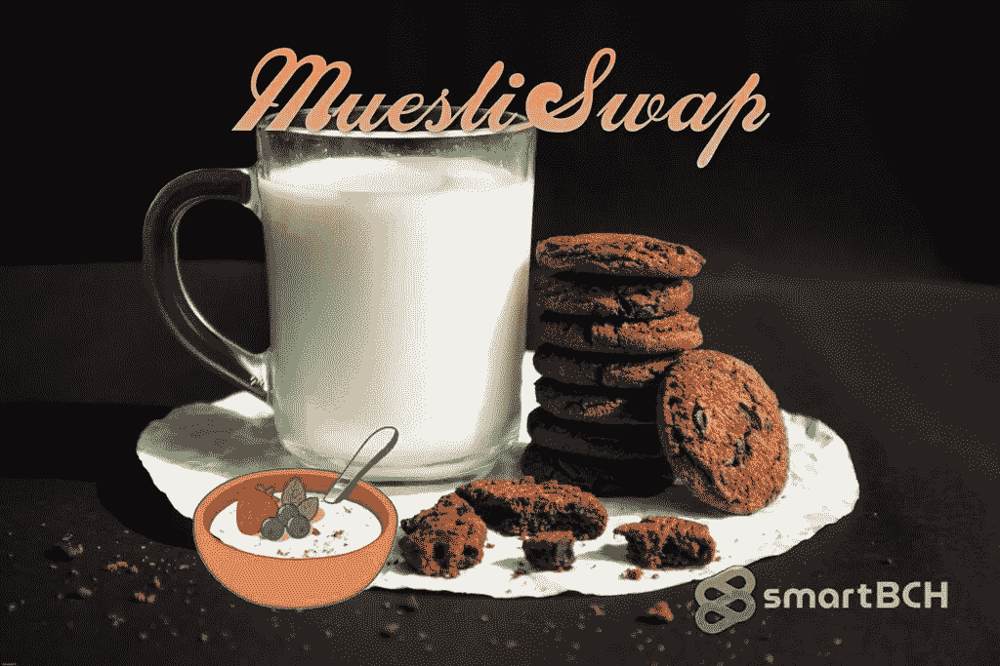

# MuesliSwap smart BCH DeFi:5 天内 100%盈利！

> 原文：<https://medium.com/coinmonks/muesliswap-smartbch-defi-100-profit-in-5-days-6293d2633acd?source=collection_archive---------4----------------------->

*Image from:* [*Unsplash*](https://unsplash.com/photos/wF_kS5Yo7jE)*, by* [*Mirza Mustofa*](https://unsplash.com/@miruza) *(modified)*

[编辑:在 SmartBCH 版本中，Muesli 平台已更名为 CowSwap。该公司仍在运营，但其竞争力不如卡尔达诺公司。本文介绍了 SmartBCH 上的平台，该平台目前的 DeFi 容量和市场份额有限]

以太坊收费太高？BSC 收益率太低？