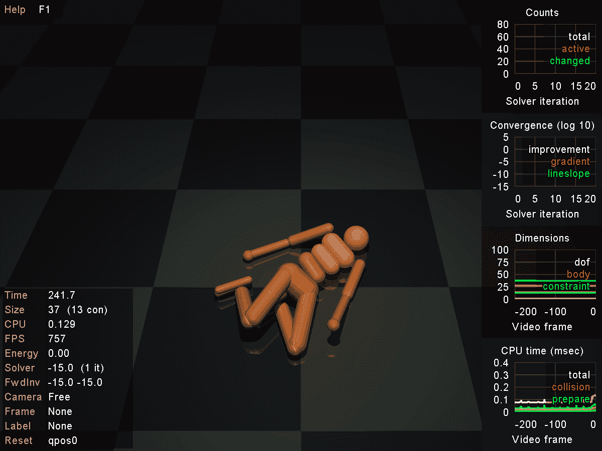
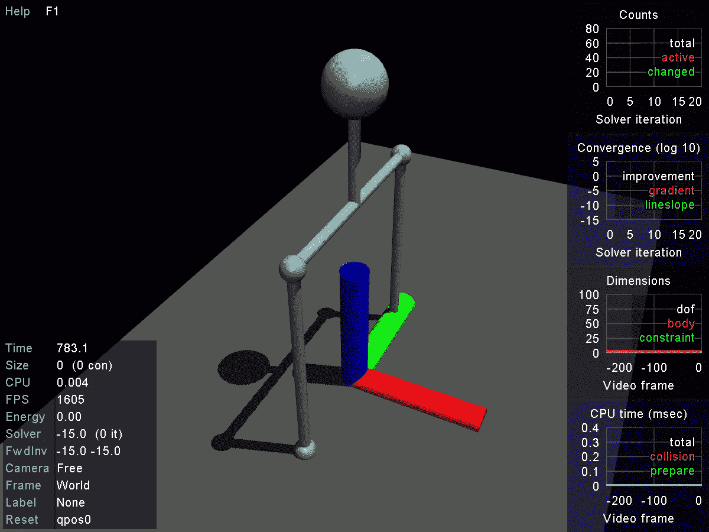
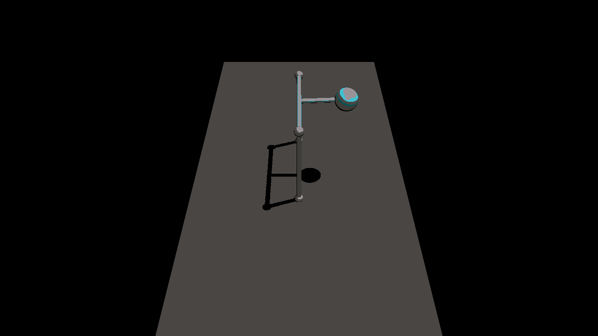

# 麻省理工学院欠驱动机器人的 MuJoCo 教程—第 0 部分

> 原文：<https://medium.com/coinmonks/mujoco-tutorial-on-mits-underactuated-robotics-in-c-part-0-2cbd259f6adc?source=collection_archive---------1----------------------->



2019 年 10 月更新:我已经在我的网页[这里](https://atabakd.github.io/blog/2019/MuJoCo-1/)发布了第二个模块。

我想开始学习 [MuJoCo](http://www.mujoco.org/) 已经有一段时间了，在他们宣布[对学生免费发放许可证](https://www.roboti.us/agreement/PersonalStudentSLA.pdf)后，我真的没有借口了。另外，我本人是一个 Python 爱好者，但我认为让机器人专家了解 C 和 C++是公平的，最后，自从[麻省理工学院 edx](https://www.edx.org/course/underactuated-robotics-mitx-6-832x-0) 的欠驱动机器人(U-AR)课程以来，我一直想尝试一下。

所以我就想，为什么不把这三个都混在一起，跟着 [2018 版 Russ Tedrake 的惊艳课程](https://www.youtube.com/channel/UChfUOAhz7ynELF-s_1LPpWg/videos)学 C++的 MuJoCo。

问题是我找不到任何有用的关于如何开始使用 MuJoCo 的教程。它有[丰富的文档](http://www.mujoco.org/book/index.html)，良好的[样本代码](http://www.mujoco.org/book/programming.html#Sample)，托多洛夫教授在[论坛](http://www.mujoco.org/forum/index.php)上也非常有帮助，但是，我仍然在努力寻找一个合适的起点。

因此，尽管我不是这三个科目中任何一个科目的专家，但我通常很擅长自己摸索，我决定记录我自己的学习曲线，希望它能帮助其他人开始使用 MuJoCo。我的计划是实现我在 MuJoCo 的 U-AR 中学到的不同的控制器，但是第一个模块仅仅是关于模拟环境的。这里是 [GitHub 库](https://github.com/atabakd/MuJoCo-Tutorials.git)，事不宜迟，我们开始吧。

# 模拟倒立摆

MuJoCo 中的建模是通过一个名为 MJCF 的 XML 格式文件完成的。[根据文档](http://mujoco.org/book/modeling.html#Introduction)，广泛使用的统一机器人描述格式(URDF)文件也是允许的，但不鼓励使用。这是倒立摆的点质量近似模型。

大多数选项和标志都是不言自明的。地面和横梁上的位置通过肌腱连接在一起，这让人想起了我使用的原始 MJCF，它模拟了类似于球和横梁的东西。完整免责声明[此处](https://github.com/atabakd/MuJoCo-Tutorials/blob/master/models/invertedPendulum.xml)。如果你用 MuJoCo 下载的 simulate 应用程序加载这个模型，它应该是这样的:



您可能看不到 RGB 帧轴，但它在这里不太相关。以下是模型的主要组成部分:

```
<body name="beam" pos="0 0 .5">
  <geom name="rod" type="cylinder" pos="0 0 0.0" size=".01 .1" density="100"/>
  <geom pos="0 0 -.1" type="capsule" size=".01 .2" euler="1.57 0 0"/>
  <joint name="pivot" pos="0 0 -0.1" axis="0 1 0" limited="false" damping=".05"/>
  <site name="rBeam" pos="0 -.2 -.1"/>
  <site name="lBeam" pos="0 .2 -.1"/>
  <body name="ballbody" pos="0 0 0.1">
    <geom name="ballgeom" type="sphere" size=".05"/>
  </body>
</body>
```

每个关节，例如`"pivot"`在一个物体和它的父物体之间增加一个自由度，或者在本例中为`worldbody`。这是一个`hinge`类型的关节，增加了沿 y 轴(绿色)的旋转自由度，从这个角度来看，顺时针运动增加了角度。`euler`属性定义了几何图形的起始方向。

一些几何体和几何体有名字，这在 MuJoCo 中是不鼓励的，因为你可以加载几个 MJCFs，如果一些几何体或几何体有确切的名字，MuJoCo 会报错冲突。但是，我认为它们对于教程是有用的。

默认情况下，MuJoCo 中的每个 geom 都有水的密度，大约是[1000](https://en.wikipedia.org/wiki/Density#Water)。因此，我降低了连接球和枢轴到`100`的杆的密度，以更好地近似点质量公式。

最后，我添加了一个`motor`致动器，它在所需的关节处产生一个力，该关节的角度将由编码器`sensor`读取。

# PD 控制器

当你和一个真正的机器人打交道时，有无数的事情你应该考虑。通常，传感器会定期且很可能异步报告测量结果，每个传感器都有非线性噪声模型。然后是一个控制环路，很可能以固定的频率，使用最新的测量值更新控制器的信号。

这些测量是如此不可靠，以至于经常需要某种状态估计(我最喜欢的，[无迹滤波器](https://towardsdatascience.com/the-unscented-kalman-filter-anything-ekf-can-do-i-can-do-it-better-ce7c773cf88d))来从中获得一些有意义的东西。在本模块中，我将实现传感器噪声和定期控制环路更新，但在未来的模块中我将忽略它们，因为它们会稀释我们的控制汁。

要安装控制器，只需设置模型的控件回调即可:

```
mjcb_control = mycontroller;
```

每当您执行`mj_step(m,d);`时，函数`mycontroller`都会被调用，但是，为了模拟一个控制循环，我人为地只周期性地更新控制信号，这是一个简单的 PD:

```
**if** (d->time - last_update > 1.0/ctrl_update_freq)
{
    mjtNum vel = (d->sensordata[0] - position_history)/(d->time-previous_time);
    ctrl = 3.5*(-vel-10.0*d->sensordata[0]);
    last_update = d->time;
    position_history = d->sensordata[0];
    previous_time = d->time;
}
d->ctrl[0] = ctrl;
```

请注意，我忽略了所有适当的过滤器，以获得正确的速度！这可能是估计速度的最差方法，因为通过对噪声信号求导，会增加噪声的影响，如果稍微改变 MJCF 文件中传感器噪声模型的标准偏差，控制器就会失效。然而，对于较小的噪声值，ta-da:



这个简单的 PD 工作得很好，并带有一点控制工程的直觉(比训练一个神经网络少得多😝)你可以调整参数，简单来说速度系数通常通过减慢你的系统来控制振荡。在没有干扰的情况下(例如风，如果你正在控制四旋翼飞行器)，通常不需要积分器。

这种简单是福也是祸。太棒了，因为你甚至不需要知道你的模型！几次尝试和错误，它工作得很好。对动态系统建模是困难的。[不仅仅是买尺子的问题](https://youtu.be/BkekflWqXrE?t=1h22m20s)！它需要动态系统专业知识和耗时费力的工作。

另一方面，这个控制器没有利用动力学的优点。如果我设置更严格的控制限制，它不会理解通过对状态的相反符号施加力来将能量输入系统，并做一个摆动。

不幸的是，我们的下一任总监 LQR 也是如此愚蠢😉但是我们很快就会接触到更智能的控制器。

在那之前，敬请期待。