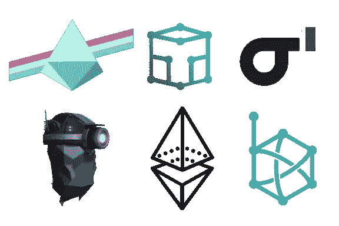

# 多客户端以太坊网络

> 原文：<https://medium.com/coinmonks/multi-client-ethereum-networks-dcebb34d41f7?source=collection_archive---------4----------------------->

[kotal](https://kotal.co/) 是一个开源*多客户端* *云不可知*区块链 Kubernetes 运营商，它可以轻松地在任何云上部署*高度可用的自我管理自我修复*区块链基础设施(网络、节点、存储集群……)。

换句话说，Kotal 是非洲学校😎在 Docker 容器中管理您的区块链网络和节点。

# 多客户

> 以太网没有足够的客户端多样性。因此，影响 Geth 或 Prysm 客户端的关键共识错误或其他拒绝服务攻击可能会严重影响网络的平稳运行。— [来源](/ethereum-cat-herders/the-state-of-client-diversity-in-ethereum-2ca915a3d768)。

**Kotal** 目前支持 [Hyperledger Besu](https://besu.hyperledger.org/en/stable/) 、 [Go Ethereum](https://geth.ethereum.org/) (Geth)和[Parity](https://openethereum.github.io/wiki/index)(OpenEthereum)ether eum 1 客户端🚀而[幽冥](https://nethermind.io/client)即将到来[即将到来](https://github.com/kotalco/kotal)

使用上面的客户机创建一个包含 3 个节点的集群来同步 Rinkeby 测试网络就像部署这个清单一样简单

如果您想知道如何定制上述网络，即:启用 RPC、启用 GraphQL、更改端口、跨区域或可用性区域分散节点等，[请阅读文档](https://kotal.co/docs/)。

使用 Kotal，你可以使用不同的共识算法，比如工作证明(ETHash)、权威证明(Clique)和 IBFT2，来创建客户多样化的私有和公共网络。

# 🌈多客户端以太坊 2.0

我们正在努力支持以太坊 2.0 客户端的广泛范围:[灯塔](https://sigmaprime.io)、[库特](https://docs.teku.pegasys.tech/en/latest/)、[光轮](https://nimbus.team/)和 [Prysm](https://prylabs.net/) 。在不久的将来，节点运营商将能够创建多客户端高度可用的信标链节点和验证器节点，而没有削减的风险。

# ❤️支持

如果您想支持我们，您可以:

*   给 [Kotal](https://kotal.co) 一个尝试！
*   分享这篇中型文章
*   星科塔尔 [GitHub 资源库](https://github.com/kotalco/kotal)
*   捐赠给 Kotal [Gitcoin grant](https://gitcoin.co/grants/1070/kotal-multi-client-cloud-agnostic-blockchain-infra)

## 另外，阅读

*   最好的[密码交易机器人](/coinmonks/crypto-trading-bot-c2ffce8acb2a)
*   [加密复制交易平台](/coinmonks/top-10-crypto-copy-trading-platforms-for-beginners-d0c37c7d698c)
*   最好的[加密税务软件](/coinmonks/best-crypto-tax-tool-for-my-money-72d4b430816b)
*   [最佳加密交易平台](/coinmonks/the-best-crypto-trading-platforms-in-2020-the-definitive-guide-updated-c72f8b874555)
*   最佳[加密贷款平台](/coinmonks/top-5-crypto-lending-platforms-in-2020-that-you-need-to-know-a1b675cec3fa)
*   [最佳区块链分析工具](https://bitquery.io/blog/best-blockchain-analysis-tools-and-software)
*   [加密套利](/coinmonks/crypto-arbitrage-guide-how-to-make-money-as-a-beginner-62bfe5c868f6)指南:新手如何赚钱
*   最佳加密制图工具
*   [莱杰 vs 特雷佐](/coinmonks/ledger-vs-trezor-best-hardware-wallet-to-secure-cryptocurrency-22c7a3fd391e)
*   了解比特币的[最佳书籍有哪些？](/coinmonks/what-are-the-best-books-to-learn-bitcoin-409aeb9aff4b)
*   [3 商业评论](/coinmonks/3commas-review-an-excellent-crypto-trading-bot-2020-1313a58bec92)
*   [AAX 交易所评论](/coinmonks/aax-exchange-review-2021-67c5ea09330c) |推荐代码、交易费用、利弊
*   [Deribit 审查](/coinmonks/deribit-review-options-fees-apis-and-testnet-2ca16c4bbdb2) |选项、费用、API 和 Testnet
*   [FTX 密码交易所评论](/coinmonks/ftx-crypto-exchange-review-53664ac1198f)
*   [n 零审核](/coinmonks/ngrave-zero-review-c465cf8307fc)
*   [Bybit 交换审查](/coinmonks/bybit-exchange-review-dbd570019b71)
*   [3Commas vs Cryptohopper](/coinmonks/cryptohopper-vs-3commas-vs-shrimpy-a2c16095b8fe)
*   最好的比特币[硬件钱包](/coinmonks/the-best-cryptocurrency-hardware-wallets-of-2020-e28b1c124069?source=friends_link&sk=324dd9ff8556ab578d71e7ad7658ad7c)
*   最佳 [monero 钱包](https://blog.coincodecap.com/best-monero-wallets)
*   [莱杰 nano s vs x](https://blog.coincodecap.com/ledger-nano-s-vs-x)
*   [Bitsgap vs 3 commas vs quad ency](https://blog.coincodecap.com/bitsgap-3commas-quadency)
*   [莱杰 Nano S vs 特雷佐 one vs 特雷佐 T vs 莱杰 Nano X](https://blog.coincodecap.com/ledger-nano-s-vs-trezor-one-ledger-nano-x-trezor-t)
*   [block fi vs Celsius](/coinmonks/blockfi-vs-celsius-vs-hodlnaut-8a1cc8c26630)vs Hodlnaut
*   [bits gap review](/coinmonks/bitsgap-review-a-crypto-trading-bot-that-makes-easy-money-a5d88a336df2)——一个轻松赚钱的加密交易机器人
*   为专业人士设计的加密交易机器人
*   [PrimeXBT 审查](/coinmonks/primexbt-review-88e0815be858) |杠杆交易、费用和交易
*   [埃利帕尔泰坦评论](/coinmonks/ellipal-titan-review-85e9071dd029)
*   [赛克斯·斯通评论](https://blog.coincodecap.com/secux-stone-hardware-wallet-review)
*   [BlockFi 评论](/coinmonks/blockfi-review-53096053c097) |赚取高达 8.6%的加密利息