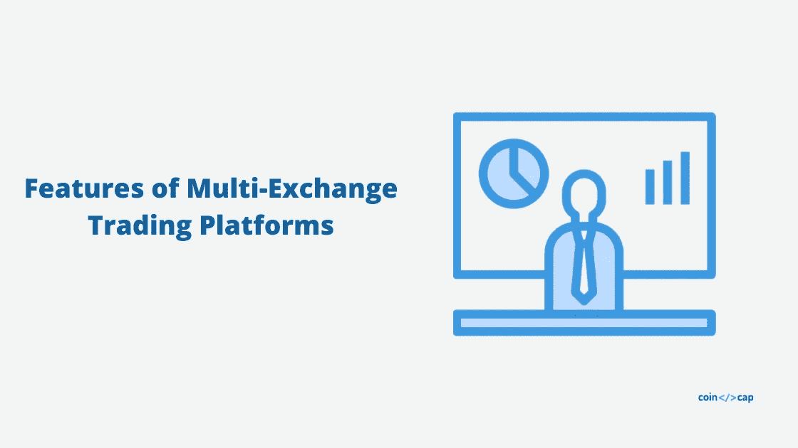

# 多交易所加密交易平台功能

> 原文：<https://medium.com/coinmonks/multi-exchange-crypto-trading-platforms-features-c9a7484ffd20?source=collection_archive---------0----------------------->

Features of Multi-Exchange Trading Platforms

为专业交易者建立的多交易所加密交易平台。在本文中，我们将讨论多交易所交易平台的特点。

# 1.统一界面

考虑到市场的波动性，交易者需要不断检查多个交易所，以利用价格差异。

然而，这是一项艰巨的任务，理解不同交易所的不同 UI/UX 确实令人沮丧。

因此，统一的界面是从一个平台执行所有[加密交易](https://blog.coincodecap.com/tag/crypto-trading/)活动的最大优势，而不是从一个交易所跳到另一个交易所。

> 查看 [**多交易所加密交易平台**](https://coincodecap.com/category/multi-exchange-trading) 的完整列表。

# 2.套利

套利加密交易只不过是以较低的价格从一个加密平台购买加密货币，然后以较高的价格在另一个加密平台出售，并通过差价赚取利润。

多交易所加密交易平台分析市场，帮助交易者发现套利机会。

# 3.交易机器人

加密交易机器人是一种计算机程序，即使在你离线时，它也会根据你选择的设置自动代表你执行交易。

多交平台提供[交易机器人](https://blog.coincodecap.com/tag/trading-bots/)，是最受交易者欢迎的产品之一。

# 4.精明的交易

顾名思义，智能交易是一种智能工具，可以同时“止损”和“获利”订单。

因此，这一工具不仅为您的资金提供了额外的安全保障，而且在硬币价格开始下跌时代表您终止订单。这是一个很好的工具来获得利润和减少损失。

# 5.蔓延的

追踪加密交易只不过是一种网格策略，可以帮助机器人在预先确定的价格范围内(或固定的上限和下限)自动购买或出售加密货币。

此外，这种算法可以让每笔交易获得最大利润，这在市场波动时非常有价值。

# 6.高级图表

加密图表有助于评估特定资产的未来市场波动。一个具有优秀图表界面的加密交易平台可以帮助指示加密市场中可能的盈利资产。

# 7.投资组合管理

交易组合也许是使用多交易所加密交易平台的最大优势。

它在一个方便的界面上浓缩并跟踪你的交易信息，这样你就可以实时浏览你的交易历史和表现。

# 8.加密交易信号

由交易者或机器人生成的加密交易信号有助于交易者确定何时以及以什么价格买卖特定的加密货币。

一个好的交易平台持续监控市场活动，并对最有可能带来更高利润的硬币提出建议。

# 9.回溯测试

回溯测试是用历史市场数据测试你的交易策略。换句话说，这就像，你不是直接跳入水中，而是先把一只脚放入池中，检查它的实际温度。回溯测试是多交换平台提供的一个重要特性。

# 10.新闻和研究

多交易所加密交易平台汇集了来自各种来源的研究、新闻和分析、社会指标。它有助于交易者跟上生态系统，避免噪音。

## 包扎

正如我们提到的，多交易所交易平台是为专业交易而建立的。然而，这些平台通常收取最低的费用，所以如果你经常交易加密货币，你应该尝试这些平台之一。

如果我们错过了多交易所交易平台的任何功能，请在评论区告诉我们。

**归属**

> 以上文章由 [**Bitsgap**](https://bitsgap.com/?utm_source=coincodecap) 供稿。如果你想尝试一个多交易所交易平台，请登录 Bitsgap，因为他们有 14 天的免费试用期。另外可以在 CoinCodecap 上阅读 [Bitsgap 评论](https://coincodecap.com/product/bitsgap-1)。

**另外，了解一下**

*   [**加密组合的再平衡策略**](https://blog.coincodecap.com/crypto-portfolio-rebalancing/)
*   [**不同类型的密码交易机器人**](https://blog.coincodecap.com/different-types-of-crypto-trading-bots/)
*   [**五款最佳加密交易机器人**](https://blog.coincodecap.com/five-best-crypto-trading-bots/)

> [直接在您的收件箱中获得最佳软件交易](https://coincodecap.com/?utm_source=coinmonks)

