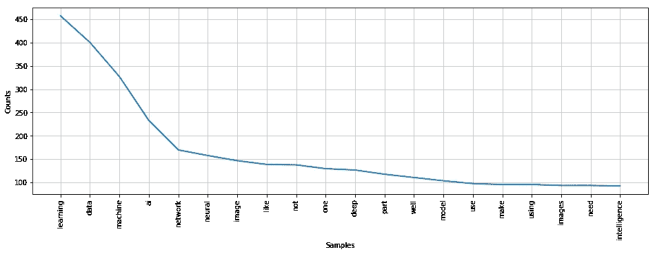

# 使用自然语言处理的多标签分类(博客标签预测)

> 原文：<https://medium.com/coinmonks/multi-label-classification-blog-tags-prediction-using-nlp-b0b5ee6686fc?source=collection_archive---------0----------------------->

# 多类分类和多标签分类的区别？

多类分类是指在 Y 轴或目标变量中有多个相关的类别，但每一行数据都属于一个类别。

其中在多标签分类中，多个类别与相同的数据相关联。简单地说，每一行可能有多个分类值。

This is a binary classification problem

看到上面的数据集，我们的分类值基本上是“传奇”→它有一个二进制值(真或假)

现在让我们看看我们将要处理的数据:

This is a multi-label dataset

看这个数据集，每一行都有多个相关的值。

# 工作流程是这样的。

1.  从网上抓取数据
2.  清理和预处理
3.  设想
4.  分类

# 目标:

在这个项目中，我们将从媒体中抓取数据，识别给定的标签，并以 OneHotEncoding 格式制作一个数据帧，然后。将哪些博客文章归入哪些标签。

# 让我们开始吧:

> 好的，我正在从介质本身收集数据:

> 从 bs4 导入 BeautifulSoup 组
> 导入 urllib3

导入所需的库 ***熊猫*** 用于数据帧，导入所需的库 ***urllib3*** 用于连接网络和获取数据。 ***美*** ***汤*** 是一个解析 HTML 和 XML 文档的 Python 包。它为解析过的页面创建了一个解析树，可以用来从 HTML 中提取数据，这对 web 抓取很有用。

> http=urllib3。PoolManager()
> 从熊猫导入 DataFrame
> column=['Title '，' Body ']
> dfBA = data frame(columns = column)
> dfT = data frame(columns =[0，1，2，3，4])

为标题和正文创建空数据帧 **column=['Title '，' Body ']dfBA = data frame(columns = column)**

还有一个标签 **dfT=DataFrame(columns=[0，1，2，3，4])**

> ***def spider(link):***
> print(link)
> blog data = http . request(' GET '，link)
> soup = beautiful soup(blog data . data，' html . parser ')
> for soup . find _ all(' div '，{ ' class ':' post article-read more ' })中的链接:
> link=links.find('a ')。get(' href ')
> CrawlAndFrame(link)

蜘蛛功能将进入网页，并获得网页中所有帖子的链接。

## 注意:由于 urllib3 不擅长动态抓取，它每页只能抓取 7 篇文章。使用硒进行动态刮痧

> ***def CrawlAndFrame(link)****:*
> **try:**
> print(link)
> blog data = http . request(' GET '，link)
> soup = beautiful soup(blog data . data，' html . parser ')
> article = ' '
> tags =[]
> heading = soup . find(' h1 ')。text
> for para in soup . find _ all(' p '):
> p = para . text
> p = p . strip(' \ u ')
> article = article+' '+p
> for mtags in soup . find _ all(' a '，{ ' class ':' link u-base color—link ' }):
> tags . append(mtags . text)
> # CreateDataFrame(list())
> someList =[heading，article，tuple(

***CrawlAndFrame()***函数进入蜘蛛收集的每一个链接，并从那里收集带有博客中涉及的 ***标签*** 的博客的所有博客 ***文章*** 和 ***标题*** 并传递它们***CreateDataFrame(someList)***为 head 和

> **def CreateDataFrame(some list):**
> t = { }
> d = { ' Title ':[some list[0]，' Body]:[some list[1]]}
> for n in range(5):
> if len(some list[2])>n:
> t[n]=[some list[2][n]]
> else:
> t[n]=[' 0 ']
> toDf

***CreateDataFrame()***分别为(标题和正文)和(标签)创建 **dfDA** 和 **dfT** 的数据帧

dfBA

dfT

查看 **dfT** 您可能会发现这不是标记数据的最佳方式。因此，我们需要将其转换为 OneHotEncoding 格式( ***)，这基本上是创建一个由 0 和 1 组成的稀疏矩阵，其中 1 表示索引标签存在，0 表示它不存在*** )

让我们开始吧:

> ok list =[]
> for cl in dfT . columns:
> for n in dfT[cl]:
> ok list . append(n)
> ok list = list(set(ok list))
> del(ok list[ok list . index(' 0 ')))
> newDF = data frame(columns = ok list)
> for x in range(dfT . count()[0]):
> someDict = { }
> for d in ok

> 简而言之，我在这里所做的只是获取列表中所有唯一的标签，并将它们作为我的数据帧的列，如果该标签存在于行中，则放置 1，如果不存在，则放置 0

We thus got a OneHotEncoded Data frame from the tags

现在我们的数据已经准备好了，让我们开始预处理它

> 从 nltk.corpus 导入 stop words
> stop words list = stop words . words(' English ')
> stop wordlist . remove(' no ')
> stop wordlist . remove(' not ')
> **def remove tags(data):**
> soup = beautiful soup(data，' html . parser ')
> text = soup . get _ text()
> return text
> 导入 unicodedata

> 这将删除每个 html 标签。如果有的话。有时，即使刮擦后，一些标签仍然存在。我们正在移除它。

> **def removeAscendingChar(data):**
> data = unicode data . normalize(' NFKD '，data)。编码(' ascii '，' ignore ')。decode('utf-8 '，' ignore')
> 返回数据

> 这个函数将所有带重音的字符转换成正常的英语。

Accented characters

> **def removechardigit(text):**
> str='`1234567890-=~@#$%^&*()_+[！{;>:\ '<。,/?" }]'
> for w in text:
> if w in str:
> text = text . replace(w，' ')
> return text
> from nltk . stem . wordnet import wordnet lemmatizer
> from nltk . tokenize import ToktokTokenizer
> lemma = wordnet lemmatizer()
> token = ToktokTokenizer()

> 删除所有特殊字符和数字

> **def lemitize words(text):** words = token . token ize(text)
> list lemma =[]
> for w in words:
> x = lemma . lemma tize(w，' v ')
> list lemma . append(x)
> return text
> def stopwodes remove(text):
> word list =[x . lower()。strip()for x in token . tokenize(text)]
> removed list =[x for x in word list if not x in stop wordList]
> text = ' '。join(removedList)
> 返回文本

> 出于语法原因，文档将使用一个单词的不同形式，如*组织*、*组织*、*组织*。此外，还有具有相似含义的衍生相关词族，如*民主*、*民主*和*民主化*。在许多情况下，似乎搜索这些单词中的一个会返回包含集合中另一个单词的文档。
> 
> 词干化和词尾化的目标都是将一个词的屈折形式，有时还有派生相关形式简化为一个共同的基本形式。例如:
> 
> *am，are，is →be
> car，cars，cars，cars →car*

 [## 词干化和词汇化

### 词干化和词汇化

词干和 lemmatizationnlp.stanford.edu](https://nlp.stanford.edu/IR-book/html/htmledition/stemming-and-lemmatization-1.html) 

> **def 预处理(text):**
> text = remove tags(text)
> text = removeCharDigit(text)
> text = removeAscendingChar(text)
> text = lemitizeWords(text)
> text = stopwordremove(text)
> return(text)
> 
> 导入 re
> **def clean _ text(text):**
> text = text . lower()
> text = re . sub(r " what ' s "，" what is "，text)
> text = re . sub(r " \ s "，" text)
> text = re . sub(r " \ ve "，" have "，text)
> text = re.sub(r "不能"，"不能"，text)
> text = re.sub(r"n't "，"不是"，text) 【T】 text)
> text = re sub(r " \ ' scuse "，" excuse "，text)
> text = re sub(' \ W '，' '，text)
> text = re sub(' \ s+'，' '，text)
> text = text . strip(')
> 返回文本

> 现在让我们把像**我是**这样的词改成**我是**或**什么是**什么是**什么是**，这正是 clean_text 正在做的事情。

更多检查:

 [## 使用 Scikit-Learn 进行多标签文本分类

### 多类分类是指具有两个以上类的分类任务；每个标签都是互斥的…

towardsdatascience.com](https://towardsdatascience.com/multi-label-text-classification-with-scikit-learn-30714b7819c5) 

> df['正文'] = df['正文']。map(lambda com:clean _ text(com))
> df[' Body ']= df[' Body ']。map(lambda com:预处理(com))

## 让我们想象一下:

> total text = ' '
> for x in df[' Body ']:
> PS =预处理(x)
> total text = total text+" "+PS
> from word cloud 导入 word cloud
> WC = word cloud(background _ color = ' black '，max_font_size=50)。generate(total text)
> PLT . figure(figsize =(16，12))
> plt.imshow(wc，interpolation= "双线性")

World cloud Representaion

## 单词的频率呢？

> 从 nltk.tokenize 导入 nltk
> toktokentizer
> x = nltk。FreqDist(ToktokTokenizer()。tokenize(total text))
> PLT . figure(figsize =(16，5))
> x.plot(20)

Word frequency Plot

> 正如你所看到的，文章中最常见的词是学习、数据、机器、人工智能等等

## 分类(训练和测试模型):

> #使用二进制相关性
> 从 skmultillearn . problem _ transform 导入二进制相关性
> 从 sklearn.naive_bayes 导入 GaussianNB
> 
> #初始化二进制相关性多标签分类器
> #用基于高斯朴素贝叶斯分类器
> 分类器=二进制相关性(GaussianNB())
> 
> # train
> classifier.fit(x，y)
> 
> # predict
> predictions = classifier . predict(x)
> print(predictions . to array())
> print(accuracy _ score(y，predictions))

***什么是二元关联？？***

这是最简单的技术，它基本上将每个标签视为一个单独的单个类分类问题。

假设我们有 **x** 作为自变量，y1，y2，y3 作为因变量的标签。所以 ***二元相关性*** 所做的是，考虑到自变量，它将每个自变量作为一个单独的类。

所以它映射了

> **x →y1 和 x →y2 和 x →y3**

> #使用来自 skmultillearn . problem _ transform 的分类器链
> 导入来自 sklearn.naive _ bayes 的分类器链
> 导入高斯链
> 导入来自 sklearn.tree 的决策树分类器
> 
> #初始化分类器链多标签分类器
> #使用基于高斯朴素贝叶斯的分类器如果您愿意可以使用任何其他分类器
> #分类器=分类器链(GaussianNB())
> 分类器=分类器链(DecisionTreeClassifier())
> #训练
> 分类器. fit(x，y)
> 
> # predict
> 预测= classifier.predict(x)
> 
> 准确度 _ 得分(y，预测值)

## 什么是分类器链？？

在这种情况下，仅在输入数据上训练第一个分类器，然后在输入空间和链中所有先前的分类器上训练每个下一个分类器。

假设我们有 **x** 作为自变量，y1，y2，y3 作为因变量的标签。所以我们基本上有 3 个分类子集

> x →y1 和 x →y1，y2 和 x →y1，y2，y3

> #使用来自 skmultillearn . problem _ transform 的 Label Powerset
> 导入来自 sklearn.naive_bayes 的 LabelPowerset
> 导入高斯
> 
> #初始化 Label Powerset 多标签分类器
> #用高斯朴素贝叶斯基分类器
> 分类器= Label Powerset(GaussianNB())
> #或
> #分类器= classifier chain(decision tree classifier())
> # train
> 分类器. fit(x，y)
> 
> # predict
> 预测= classifier.predict(x)
> 
> 准确度 _ 得分(y，预测值)

## 什么是标签 Powerset？？

在这种情况下，我们将问题转化为多类问题，一个多类分类器在训练数据中找到的所有唯一标签组合上进行训练。

> 从 skmultilearn.adapt 导入 MLkNN
> 
> 分类器= MLkNN(k=20)
> 
> classifier.fit(x，y)
> 
> # predict
> predictions = classifier . predict(x)
> print(predictions . toarray())
> print(y)
> accuracy _ score(y，predictions)
> from sk learn . metrics 导入 f1_score
> print(f1_score(y，predictions，average='micro ')

## MLkNN:

适配算法，顾名思义，适配算法直接进行多标签分类，而不是将问题转化为不同的问题子集。

例如，多标签版本的 kNN 由 MLkNN 表示。

## 最后但同样重要的是，我们有一个分类器

也称为一对一，这种策略包括为每个类安装一个分类器。对于每个分类器，该类与所有其他类相匹配。除了其计算效率之外

> 从 sklearn.naive_bayes 导入多项式 inb
> 从 sklearn.multiclass 导入 OneVsRestClassifier
> 从 sklearn.metrics 导入 accuracy_score
> 
> clf = OneVsRestClassifier(MultinomialNB())
> 
> clf.fit(x，y)
> 
> pred=clf.predict(x)
> 
> 准确度 _ 得分(y，预测)

# 在这里下载完整的代码

 [## neelindresh/NeelBlog

### 包含代码和 csv 从我的博客。通过在…上创建帐户，为 neelindresh/NeelBlog 的发展做出贡献

github.com](https://github.com/neelindresh/NeelBlog/blob/master/%5BProject%20Complete%20Tag%20Prediction%20%5DtagLabelprediction.ipynb)  [## 解决多标签分类问题(包括案例研究)

### 由于某种原因，回归和分类问题最终在机器中占据了大部分注意力…

www.analyticsvidhya.com](https://www.analyticsvidhya.com/blog/2017/08/introduction-to-multi-label-classification/)  [## sk learn . multi class . onevsrestclassifier-sci kit-learn 0 . 19 . 1 文档

### 也称为一对一，这种策略包括为每个类安装一个分类器。对于每个分类器，类是…

scikit-learn.org](http://scikit-learn.org/stable/modules/generated/sklearn.multiclass.OneVsRestClassifier.html)  [## 选择多标签分类器- scikit-multilearn 0.0.5 文档

### 算法自适应方法基于适用于多标签分类的单标签分类方法

scikit.ml](http://scikit.ml/api/classify.html) 

更多信息请关注我的博客:

 [## 面向所有人的数据科学

### 这篇文章是关于支持向量回归的。从事机器学习或数据科学的人非常熟悉…

dataneel.wordpress.com](https://dataneel.wordpress.com) 

> 加入 Coinmonks [电报频道](https://t.me/coincodecap)和 [Youtube 频道](https://www.youtube.com/c/coinmonks/videos)获取每日[加密新闻](http://coincodecap.com/)

## 另外，阅读

*   [复制交易](/coinmonks/top-10-crypto-copy-trading-platforms-for-beginners-d0c37c7d698c) | [加密税务软件](/coinmonks/crypto-tax-software-ed4b4810e338)
*   [网格交易](https://coincodecap.com/grid-trading) | [加密硬件钱包](/coinmonks/the-best-cryptocurrency-hardware-wallets-of-2020-e28b1c124069)
*   [最佳加密交易所](/coinmonks/crypto-exchange-dd2f9d6f3769) | [印度最佳加密交易所](/coinmonks/bitcoin-exchange-in-india-7f1fe79715c9)
*   [开发人员的最佳加密 API](/coinmonks/best-crypto-apis-for-developers-5efe3a597a9f)
*   [密码电报信号](http://Top 4 Telegram Channels for Crypto Traders) | [密码交易机器人](/coinmonks/crypto-trading-bot-c2ffce8acb2a)
*   最佳[密码借贷平台](/coinmonks/top-5-crypto-lending-platforms-in-2020-that-you-need-to-know-a1b675cec3fa)
*   杠杆代币的终极指南
*   [加密交易的最佳 VPN](https://coincodecap.com/best-vpns-for-crypto-trading)
*   [用于 Huobi 的加密交易信号](https://coincodecap.com/huobi-crypto-trading-signals) | [HitBTC 审查](/coinmonks/hitbtc-review-c5143c5d53c2)
*   [贸易战回顾](https://coincodecap.com/traderwagon-review) | [北海巨妖对双子座对比特场](https://coincodecap.com/kraken-vs-gemini-vs-bityard)
*   [如何在 FTX 交易所交易期货](https://coincodecap.com/ftx-futures-trading)
*   [OKEx vs KuCoin](https://coincodecap.com/okex-kucoin) | [摄氏度替代品](https://coincodecap.com/celsius-alternatives) | [如何购买 VeChain](https://coincodecap.com/buy-vechain)
*   [3 commas vs Pionex vs Cryptohopper](https://coincodecap.com/3commas-vs-pionex-vs-cryptohopper)
*   [如何使用康沃尔交易机器人](https://coincodecap.com/cornix-trading-bot)
*   [Bitget Review](https://coincodecap.com/bitget-review)|[Gemini vs BlockFi](https://coincodecap.com/gemini-vs-blockfi)cmd |[OKEx 期货交易](https://coincodecap.com/okex-futures-trading)
*   [购买信用卡加密的 10 大最佳地点](https://coincodecap.com/buy-crypto-with-credit-card)