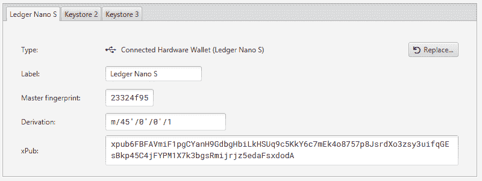

# 用 Sparrow 进行多重签名地址验证

> 原文：<https://medium.com/coinmonks/multi-sig-address-verification-with-sparrow-335410494adb?source=collection_archive---------1----------------------->

## XPubs，手表钱包，还有派生路径，天啊！

作者@ vicario sdrama 649169–649173

# 摘要

麻雀钱包是一个越来越受欢迎的 T2 比特币钱包服务商。据该网站称，这是为那些重视财务自主、强调透明度和可用性的人准备的钱包。这款钱包可以在 Mac、Windows 和 Linux 上从[下载](https://www.sparrowwallet.com/download/)页面下载。

这篇文章是我之前写的标题为“[为未上锁的金库更改密钥时的地址验证”](/coinmonks/address-verification-when-changing-keys-for-unchained-capital-vaults-268005e7563e)的后续文章。目的是提供设置手表钱包的类似步骤，为验证地址提供另一种选择。

# 用 XPubs 制作手表钱包

与 [Electrum](https://electrum.org/) 类似，如果您有联署人的 xpubs，您可以在 Sparrow 中创建一个手表钱包，用于监控钱包。

为了保持一致性，这个示例将使用我之前引用的相同的 xpub 值

xpub 6 fbfammi f1 pgcyanh 9 gdbghbilkhsuq 9 C5 kky 6 c 7 MEK 4 o 8757 p 8 jsrdxo 3 zsy 3 uifqgesbkp 45 C4 jfypm 1 x 7 k3bgsrmijrjz 5 edafsxdoda

xpub 6 ekqhce 3 w 9 f 6 qycazxw 5 VH 87 b 969 wiki UAB 6 nnycjcsulzpeecknsfjhpfhp 2 hkm 6 jeatrdoripgbj 3 f 72t 6n 4 psx 4 gveyhpsritdo 7 ykkj

xpub 6 edyklbc 5 er x7 wreobyaca 2 altfzklku 9 rdupci 2 mkf 4 ybna 4 PGF 7 zvzrqgjrdjk 33 aej 2k 6 QR 2 qfrz 64 eikayekpbdkmoedf 16 smsacjb

打开 Sparrow 后，从菜单栏中选择**文件**，然后选择**新钱包**。给钱包起个名字。在我的设置中，我选择了**麻雀样本 XPub 手表**。最初，视图将默认为单个签名钱包，并支付见证私钥哈希。

将其更改为多重签名，脚本类型为 P2SH，M/N 个连署人设置为 2 / 3。对于不同的钱包，您可以使用不同的脚本类型。我选择了 P2SH，因为我在一个未上锁的金库中设置了钱包后对其进行了建模。

接下来，需要设置代表共同签名者的三个密钥库。请注意，密钥库选项卡的每个标题都显示为红色，表示它们需要更多信息。

选择 XPUB /仅观看钱包选项。

在 xPub 字段中，复制并粘贴其中一个 xPub 值。

这样做后，**主指纹**和**派生**字段将用红色轮廓进行颜色编码，表示它们需要一个值。对于主指纹，只需输入 8 个零。为了推导，提供值 **m/**

对其他两个选项卡和 xpubs 重复此过程

最后，点击**应用**按钮。将出现一个对话框，提示您是否要向钱包添加密码。我把它留空，点击按钮**无密码**继续。

现在导航到 Addresses 视图，查看所有可用的接收地址。所描述的地址受与 xpubs 相关联的私钥的控制。我之前在一个未上锁的金库里设置了这个钱包，需要一种方法来验证我控制了一个特定的地址。

# 使用设备创建常规钱包

在这个例子中，我将设置一个多签名钱包，其中两个共同签名者来自我控制的硬件设备，第三个共同签名者是 xpub。这类似于 Unchained Capital 和 Casa 的典型设置，其中合作托管提供商持有一个密钥。

设备 1 的派生路径为 m/45'/0'/0'/1

设备 2 的派生路径为 m/45'/0'/2'/0

来自提供者的 xpub 是

xpub 6 edyklbc 5 er x7 wreobyaca 2 altfzklku 9 rdupci 2 mkf 4 ybna 4 PGF 7 zvzrqgjrdjk 33 aej 2k 6 QR 2 qfrz 64 eikayekpbdkmoedf 16 smsacjb

从 Sparrow 的菜单栏中选择**文件**，然后选择**新钱包**。给钱包起个名字。在我的设置中，我选择了**麻雀样本硬件设备**。最初，视图将默认为单个签名钱包，并支付见证私钥哈希。

将其更改为多重签名，脚本类型为 P2SH，M/N 个连署人设置为 2 / 3。对于不同的钱包，您可以使用不同的脚本类型。我选择了 P2SH，因为我在一个未上锁的金库中设置了钱包后对其进行了建模。

接下来，需要设置代表共同签名者的三个密钥库。请注意，密钥库选项卡的每个标题都显示为红色，表示它们需要更多信息。

点击**连接的硬件钱包**。将打开一个新对话框，用于连接硬件钱包。点击**扫描**按钮。

对于 Ledger Nano，我单击显示推导…链接展开。

将值更改为我的派生路径 m/45'/0'/0'/1，然后单击**导入**。xpub 由主密钥确定，并填充在输入字段中。为了方便起见，标签也被更新，以反映这是一个分类纳米 S

对于第二个密钥库，我重复这个过程，但是对于那个设备，我使用派生路径 m/45'/0'/2'/0

对于第三个密钥库，指定 XPUB，派生路径为 m/

最后，点击**应用**按钮。将出现一个对话框，提示您是否要向钱包添加密码。我把它留空，然后点击**按钮**继续。

现在导航到 Addresses 视图，查看所有可用的接收地址。有了这个钱包，我可以使用我的硬件设备来签署我创建的任何交易，以及验证接收地址

# 结论

麻雀钱包是一个易于设置和透明的[比特币](https://blog.coincodecap.com/a-candid-explanation-of-bitcoin)钱包，用于多签名。我的多重签名钱包显示的地址与我之前在 Caravan 和 Electrum 中看到的地址相同。

我希望你能自己证实这一点。如果您还没有尝试过 Sparrow Wallet，请尝试使用提供的 xpubs 设置相同的手表钱包。您应该会看到相同的地址和交易。

不要相信。验证。