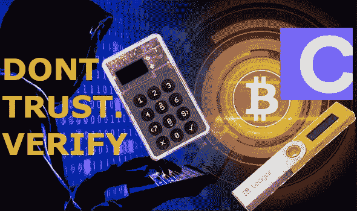
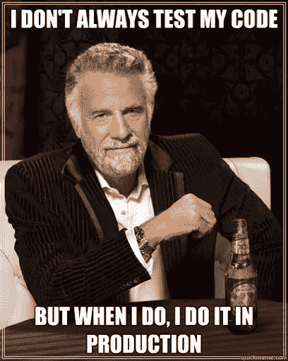
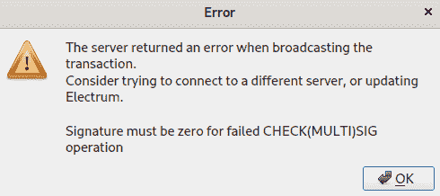

# 使用 Casa Keymaster 的多签名比特币

> 原文：<https://medium.com/coinmonks/multi-signature-bitcoin-with-casa-keymaster-4d6943edc284?source=collection_archive---------0----------------------->

## 不要相信。验证。服务能力和注意事项。作者@ vicario sdrama 640679–644340

# 介绍

[Casa Keymaster](https://keys.casa/) 是一项自 2018 年开始提供的托管服务，旨在帮助您控制您的比特币，最大限度地提高安全性。从本质上说，这是一个 multisig 产品，无论您使用的是他们的黄金 2/3 计划、白金 3/5 计划还是钻石 3/6 计划，您都可以完全控制除一把钥匙之外的所有钥匙。他们保管的钥匙是一把应急钥匙，如果你丢失了一把钥匙，或者在某些情况下丢失了多把钥匙，它可以帮助你恢复安全。

如果你还没有读过 WizardofAus 以前的文章，题为“[不是你的钥匙，不是你的比特币](https://www.citadel21.com/not-your-keys-not-your-bitcoin)”和“[提高你的比特币安全性](https://www.citadel21.com/level-up-your-bitcoin-security)”，你可能想先看看这些文章，因为它们提供了关于你的比特币安全性的极好的入门知识。自 2012 年以来，比特币的一项功能 Multisig 将这一功能推向了一个新的高度。要从 multisig 钱包中的地址消费硬币，需要指定数量的连署人来签署在设置钱包时建立的交易。

Casa 提供了很好的文档和 YouTube 视频，介绍他们服务的好处。我的意图不是重复这些内容，也不是让这篇文章成为一个广告，而是让人们关注如何测试和验证他们的产品。本文通过使用基本的三分之二黄金计划来检验这一点，您可以免费试用 30 天，然后再决定下一步该怎么做。

在中，您将看到已验证功能的✔️指标，以及提醒您在选择使用 Casa 时应注意的方面的⚠️。

# 试验台

对于我的测试，我只使用了黄金计划。如果存在与服务相关的已知差异，我会在下面提到。

***安卓手机***——我最初选择的硬件是安卓手机。Android 和 iPhone 之间的应用程序在外观和功能上应该非常相似。通过测试，我遇到了一个问题，Casa 的工作人员表示他们的应用程序的 iPhone 版本已经修复了这个问题，但总体来说没有出现任何问题。

***硬件钱包****——*虽然 Casa 支持 Ledger Nano S、Ledger Nano X、Trezor One、Trezor Model T 和 Coldcard，但除非明确指出，否则我迄今为止的所有测试都是针对 cold card，目的只是为了完全 airgap 签署交易。

***电子邮件****——*大部分电子邮件互动我都过渡到使用电子邮件，并在我的主要电脑上创建网站。然而，如果你只有一个移动设备，以及合适的硬件来连接硬件钱包和这样的设备，这也是可行的。

# 网站注册和隐私问题

使用 Casa Keymaster 的第一件事是在网站上注册一个帐户。当[注册 30 天免费试用的黄金计划](https://app.keys.casa/trial/gold)时，您仍然需要提供

*   你的名字，或被称为
*   电子邮件地址
*   创建密码
*   指定三个安全问题的答案
*   信用卡号，有效期，我想还有邮政编码

需要注意的是，电子邮件地址必须是“真实”的，并且是一个你将来可以持续访问的地址。托管服务与应用程序的电子邮件特别多。在与 Casa 的关键人员的讨论中，有人表示您可以使用更私人的电子邮件地址，如 protonmail，甚至可以用[比特币](https://blog.coincodecap.com/a-candid-explanation-of-bitcoin)而不是信用卡支付。

您的密码和安全问题的答案可以是容易记住的，也可以是自动生成的。我通常把安全问题当作另一种凭证，不使用真实答案。这里应该考虑是否要为安全问题答案自动生成随机值并像跟踪密码一样跟踪它们，或者是否应该使用将来需要时容易记住的属性。

如果你认为这有助于保密，那么你应该记住以下几点

*   对于整个服务，交互遵循以下模式:在应用程序上启动->接收电子邮件->执行步骤的网页->返回移动应用程序
*   Casa 的⚠️分类页面或站点还引用了 zdassets.com、calendly.com、typeform.com、w3.org、googleapis.com、cloudflare.com、amazonaws.com。虽然范围很小，但你应该意识到这一点。
*   ⚠️设置 protonmail 需要一部电话(考虑一下一次性的)或捐赠，这可能会增加身份隐私问题
*   ⚠️由于 Casa 需要设备的 xpubs 来帮助创建交易和派生密钥，因此它们可以看到与钱包相关联的所有交易。

为了下面列出的测试目的，我没有设置一个不同的电子邮件帐户或使用任何类似 t or 的东西。

**底线:**如果你需要绝对的隐私，那么我会推荐遵循 Glacier 协议的 DIY，并适当使用 Tor 和严格的网络控制。考虑多个地址，包括其他地区的邮政信箱、寄信人和代理，以方便文书工作、设备采购和存储。对于 99.9%的用户来说，接触到 Casa 的信息是合理的。

# Casa Keymaster 应用程序基础

从 [Apple AppStore](https://apps.apple.com/us/app/casa-keymaster/id1314586706) 或 [Google Play](https://play.google.com/store/apps/details?id=casa.keymaster&hl=en_US) 下载 Casa Keymaster 应用程序后，您将使用之前创建的凭证登录。

如果没有黄金计划，你只会看到单键模式，钱包的行为就像任何其他典型的比特币钱包一样，只是有一些额外的好处。该应用程序以加密格式将您的私钥保存到您的 Google Drive 或 Apple iCloud，如果您删除了该应用程序，您可以恢复它。此外，还有一个健康检查功能，以及检查备份的能力。我核实了发送一些比特币到显示的地址确实出现在那个账户中。

有了金卡计划，除了单键模式之外，您现在还可以使用基本的 Multisig 钱包。我用手机和 Coldcard 设置了这个钱包。这样做的过程需要在手机上启动添加新硬件钱包的操作，并收到一封带有链接的电子邮件。在页面上，您可以选择是使用分类帐、Trezor 还是 Coldcard，因为说明会有所不同。我选择了 Coldcard，它指导我如何从 Coldcard 导出 XPubs，然后将文件上传回网站。完成后，我手机上的应用程序显示添加了硬件设备。

> 侧注:我在安装过程中使用的 Coldcard 实际上有一个缺陷，取消(X)按钮不起作用。硬件钱包可能并且确实会变坏，这强调了 multisig 解决方案的另一个好处。如果这是一个 singlesig 设置，其中我没有种子短语，我可能会丢失与钱包相关的资金。

✔️从外部比特币融资单一密钥

✔️使用电话+coldcard 设置基本 Multisig

✔️从外部比特币资助基本的 Multisig

✔️从基本的 Multisig 发送到单键(现在有 2 个 utxos)

✔️从单键发送到基本多信令，选择使用 UTXO

✔️从单个密钥发送到外部地址

✔️核实收到主权恢复指示

⚠️对费用的控制在应用程序中是有限的。无论是单键还是基本多键，这些选项都与选择交易速度的选项相关联。默认为 30 分钟内的“正常”目标。其他选项包括快速(10 分钟)、慢速(约 1 小时)和最便宜(约 24 小时)。显示每一个的 sats 字节，但是不提供控制来调整特定的费用值。

⚠️所有交易都通过 Casa 服务器广播。这又回到了上面的隐私考虑。目前，没有选项可以通过您自己的节点广播事务，也没有选项可以通过导出来广播事务。当我问 Casa 这个问题时，他们的回答是这是他们想添加的高级用户功能之一，但只会为一小部分用户提供服务，还没有优先考虑。给出了需要涵盖的不同故障场景的详细理由。

⚠️最小交易量是 0001 btc 或 10000 satoshis (sats)。当我向 Casa 询问这个问题时，理由是它避免了非常小的事务从节点内存中被丢弃的问题。随着比特币价格上涨，人们发送的金额减少，他们总是可以提高比特币的价格。

⚠️目前不支持多输出或控制事务中的更改地址。事务只能有一个输出，并自动设置更改地址。

⚠️目前不支持在 sat 中显示比特币的数量，或者强制显示到小数点后 8 位。当我就此事联系 Casa 时，他们表示将在未来的路线图中添加这一内容。

# 执行健康检查

定期健康检查是验证一切正常的好方法。就像定期的牙科、医疗和视力检查一样，你应该检查你的硬件钱包是否按预期运行。Casa 应用程序有助于您使用它来控制按键，并记录上次检查设备的时间以及最近一次执行备份的时间。

对于单键，可通过点击单键天平，然后选择“执行健康检查”来访问。你也可以检查备份。

✔️单键健康检查

✔️验证的应用程序显示上次执行健康检查的时间

✔️执行检查备份

对于基本 Multisig，可以单独检查每个器件。对硬件 wallet 执行健康检查的过程如下。

*   在应用程序中启动设备运行状况检查
*   收到电子邮件
*   按照链接，并按照步骤签署邮件
*   将结果上传到网页

✔️硬件钱包运行状况检查

⚠️您可以保存健康检查结果并重新提交它们。我提请 Casa 注意这一点，他们表示这是因为健康检查链接在一段时间内有效。所以邮件里的链接只在一定时期内有效。

✔️验证较旧的运行状况检查结果不被较新的运行状况检查接受

⚠️提交已更改的签名邮件不会导致用户界面反馈。如果您上传的已签名邮件在响应运行状况检查时被篡改，网站用户界面将不会显示发生了错误。这是一种边缘情况，只有通过直接修改、浏览器扩展中的恶意软件或其他 MITM 攻击才有可能。

✔️验证的应用程序仅确认成功完成的运行状况检查

# 签署交易

在应用程序中准备好多签名交易后，您需要对其进行签名。当您开始签署交易时，对于基本 Multisig，默认设置从以下两项中选择

*   电话
*   硬件钱包
*   Casa 恢复密钥

✔️验证了用电话签名的能力

✔️验证了用硬件钱包签名的能力

对于不使用电话，而是使用两个硬件钱包的设置，选项有

*   硬件钱包
*   Casa 恢复密钥

对于硬件钱包，这将启动一封电子邮件，您可以通过一个链接完成签名步骤。您可以选择登录所用的设备类型。对于 Coldcard，下载 PSBT 文件，传输到设备，选择准备签名，验证目的地和更改地址的金额是否符合预期，然后选择确定。已创建更新的 PSBT，并且在网页上单击“下一步”后可以上传。一个确认页面显示它是成功还是失败。硬件设备需要多少签名者，就重复这些步骤。

✔️验证接受已签署的交易

✔️验证了非密钥集成员不能签名

✔️验证了取消待定交易的能力

对于使用 2 个硬件钱包的设置，Casa 会检测哪个设备与家庭设备和安全设备相关联，并在应用程序中指示哪个设备对其进行了签名。

✔️验证应用程序正确识别家庭设备

✔️验证应用程序正确识别安全设备

如果您没有自己的设备(由于丢失、毁坏、泄露等)，可以使用 Casa 恢复密钥。对于黄金级别的帐户，您需要回答您的安全问题，一旦完成，开始 7 天倒计时，然后密钥将用于签名。每天都会发送一封电子邮件，并且可以随时取消请求。这 7 天是为了给用户时间来注意是否有人试图恶意请求恢复密钥。根据 Casa，在钻石和白金级别，他们在 48 小时内签字，这一过程包括视频验证电话，以确保客户没有受到胁迫。

✔️验证了 Casa 恢复密钥 7 天等待黄金计划

✔️证实了卡萨不会轻易被强迫缩短我的测试时间

⚠️对 Casa 恢复密钥的使用不仅需要 7 天倒计时，而且在签名发生之前还需要额外的一天。为此做好 8 天的计划。在这 8 天内，费用可能会发生巨大变化，对多 sig 交易的一个警告是，费用在开始时就已确定，不能更改。

# 更改密钥集

有时，您可能会发现您的某个设备不再工作，或者丢失了。这是 multisig 的一个好处，尤其是围绕 Casa 服务提供的无核概念。使用三分之二黄金计划，您可以丢失一台设备，但仍然能够恢复。同样，对于白金 3/5 计划，可能会丢失多达 2 台设备。同样，对于基本 Multisig，从基本电话+硬件钱包更改为双硬件钱包设置时，也遵循此流程。

每当在 Casa 帐户上创建新的密钥集时，派生路径就会递增，Casa 服务会引导您完成建立新密钥集的步骤，并将资金从旧密钥集转移到新的钱包。

其过程是将密钥标记为泄露。然后，应用程序会将此显示为未链接，并继续基本的 Multisig 设置。然后，您可以使用新设备按照之前的步骤进行操作。

✔️验证了将设备标记为受损的能力

✔️验证了添加新设备的能力

✔️核实收到更新的主权恢复指示

✔️验证了更改为 2 个硬件钱包设置的能力

✔️验证了更改为使用莱杰纳米的能力

✔️验证了将以前使用的设备重新用于 Coldcard 的能力

⚠️在撰写本文时，您可以像最初一样在 Coldcard 的情况下通过重新加载相同的 public.txt 来重新添加受损的设备。当我就此事联系 Casa 时，他们表示这似乎是 Coldcard 的特定问题，Trezor 和 Ledger 无法采取此类行动。他们的开发团队正在调查此事。

一旦创建了新的密钥集，该应用程序将引导您完成将资金从旧钱包转移到新钱包的步骤。

✔️验证了将资金转移到新钱包的能力，使用标记为受损/被替换的设备进行签名

✔️验证了转移资金到新钱包的能力，用 Casa 恢复密钥签名

⚠️在撰写本文时，Android 应用程序可能还不太清楚应该使用哪种设备来签署交易。您需要使用当前可以访问旧地址的设备进行签名，而不是替换设备。

⚠️在撰写本文时，当开始资金转移时，显示的金额将少于资产选项卡上显示的金额。这在下一个屏幕中解释为费用(预先计算)。没有设置费用阈值的选项。使用 Coldcard 签名时，除了网络费用之外，还会显示 2 个地址。从应用程序中没有办法验证这两个地址都在新帐户上。这只能通过使用独占恢复信息在 Electrum 或其他客户端中设置手表钱包来实现。小武器问题协调行动内部正在努力解决这一问题。

# 设置手表钱包

鉴于前一节中的严重关切，我觉得有必要指出，在 [Electrum](https://www.electrum.org/#home) 设置手表钱包相当简单。Casa 的 Hector 实际上准备了一篇很棒的文章，标题是[创造纯手表钱包](https://support.keys.casa/hc/en-us/articles/360045032452-Creating-Watch-Only-Wallets)。

您将需要可以从设备导出的公钥，或者您可以从 Casa 应用程序中查找。如果你从 xpubs 开始，并且知道派生路径，那么你可以使用 Jameson Lopp 写的关于[如何检查 Coldcard Ypub](https://support.keys.casa/hc/en-us/articles/360045430991-How-to-Check-the-Coldcard-Ypub) 的指南，该指南引用了 [Ian Colemans BIP 39 工具](https://iancoleman.io/bip39/)来从 XPub 和派生路径获得 BIP 32 扩展公钥，然后使用 [Jameson Lopp 的 xpub-converter](https://jlopp.github.io/xpub-converter/) 来转换成 Ypub。

✔️验证了设置手表钱包的能力

✔️验证地址匹配新的钱包被资助

我强烈建议任何使用 Casa 的人设置一个手表钱包，并将 Electrum 与他们自己的完整节点和 Electrum 运行实例集成起来，以便进行监控和验证。每当您更改键集时，都应该这样做。

# 主权复苏

作为基本 Multisig 计划初始注册的一部分，每当您更改密钥集中的一个设备时，Casa 都会发送一封带有独占恢复说明的模板化电子邮件。发生变化且需要维护的主要信息是**硬件钱包派生路径**和**恢复设备密钥**的 Ypub。对于 testnet，类似的信息作为 Upub 包括在内。我建议打印这封邮件，并保存好你的重要文件。有关说明的示例，请参见[钱包回收网站](https://walletsrecovery.org/recovery-docs/casa-recovery.html)。

步骤实际上类似于设置手表钱包。

⚠️在撰写本文时，我实际上无法从 multisig 账户中清除资金，因为这些指令是用 Coldcard 固件 3.1.9、比特币 0.20.1 和 Electrum 4.0.2 的设置编写的。

当在 Electrum 中设置时，如果我创建了通过 USB 物理连接 Coldcards 的 wallet，我只能设置派生路径。这在很大程度上否定了被气隙所追求的好处。

使用 Electrum 中的 wallet 设置，您可以看到所有以前的交易，这有助于确保您设置了正确的衍生路径。可以为硬件设备创建交易，将其导出为 PSBT 文件，并由每个 Coldcards 签名。随后，这些经过签名的部分可以在事务中加载和组合，Electrum 指示消息已经过签名，可以广播了。但是，一旦广播，就会收到一个错误，指示它无效。通过进一步的诊断，似乎在 Electrum 当前如何准备与导出的 PSBT 中的 bip32 派生路径相关的交易方面存在问题。

⚠️:实际上，我能筹集资金的唯一方法是在设置 coldcards 时保留种子词，并在 Electrum 中创建 wallet 时使用该信息以及派生路径和恢复设备密钥。

# 网站账户管理

如果您忘记了 Casa 的密码，或者您的帐户凭据被泄露，或者您只想更改密码，您会发现没有自动“单击此处”并按照您可能在其他服务上习惯的步骤来更改密码。相反，根据 [FAQ 文章](https://support.keys.casa/hc/en-us/articles/360045488951-Resetting-Your-Casa-Password)，您向 support@team.casa 发送电子邮件请求。然后他们会发送一封电子邮件，其中包含一个必须在一段时间内关注的链接

✔️验证了更改我的帐户密码的能力

✔️验证了使用新凭据在网站和应用程序上注销/登录的能力

⚠️计划最多一天的时间来更改您的帐户密码

支持选项是 Zendesk 驱动的，但将文章扩展到 support.keys.casa。该页面上的登录选项不是针对 casa 帐户的，而是发布到[https://casahodl.zendesk.com/access/login](https://casahodl.zendesk.com/access/login)

[在线 Casa 应用](https://app.keys.casa/overview)显示您的账户状态，并提供下载交易历史的功能。这包括以下字段

*   以 UTC 表示的时间戳
*   硬币类型(除 BTC 外，大概也适用于 TBTC)
*   密钥集类型(电话或基本 Multisig，作为区分符)
*   金额(Satoshi)
*   解决
*   交易 ID
*   费用(Satoshi)
*   费率(sat/kb)
*   更改地址路径(从 1 开始)
*   Casa 交易 ID
*   Casa 钱包帐户 ID
*   发起交易的用户的 Casa ID
*   原始交易数据

✔️下载了 CSV 格式的交易历史记录

✔️验证交易符合预期

设置允许检查您的付款方式，添加新的付款方式，并取消会员资格。除了查看显示的信息，这里没有测试任何选项

✔️验证的支付信息没有显示完整的卡号

✔️验证了查看我的订阅何时续订的能力。

# 结论

Casa 有一个很好的开端，让所有技术水平的用户都能以合理的服务费用轻松使用 multisig 钱包。

我建议任何考虑 Casa 的人，或现有的 Casa 用户，在测试设置时做好自己的尽职调查，并定期重新验证，因为应用和服务可能会随着时间的推移而更新。

对于 sovereignty 来说，最重要的是，在确认 seedless 可以在使用的硬件设备上运行之前，用户不应该接受它。

再次重申，不要相信我在这篇文章中写的东西。

**自己验证一下吧！**

使用您认为合适的信息作为出发点，根据您的个人威胁模型来运行您自己的场景。