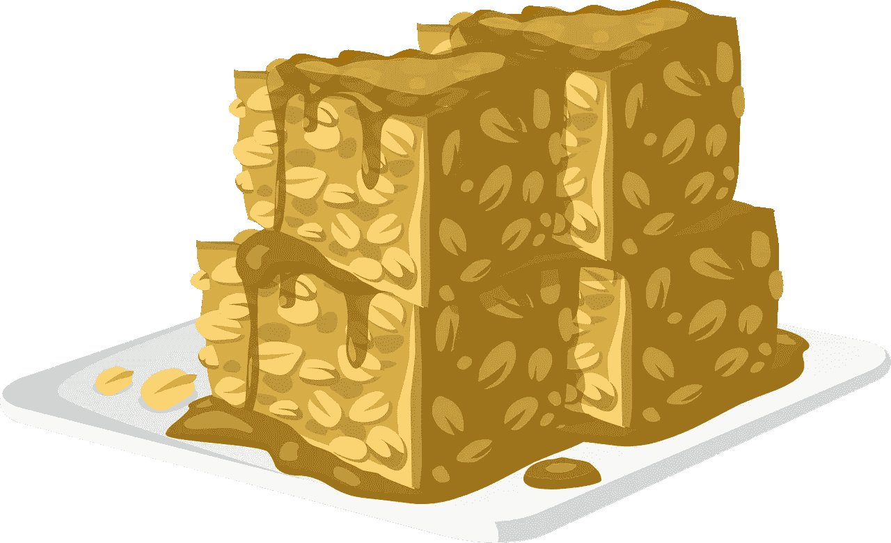

# 多链分散投资组合——像……帕卡一样甜蜜？

> 原文：<https://medium.com/coinmonks/multichain-decentralized-portfolio-as-sweet-as-pa%C3%A7oca-36b6226ac3b7?source=collection_archive---------3----------------------->

Paçoca is a Brazilian Peanut Candy dessert. It is also a decentralized exchange and yield farm aggregator with some unique features.

虽然我喜欢甜食，但这篇文章不是关于巴西花生糖的。相反，我将向您介绍一个名为 Paç oca 的独特的农场和交易所聚合器，它可以跨多个平台和网络跟踪持有量和赌注回报。

paoca 将自己描述为多链 portforlio 管理器、自动化产量农业和分散交换…