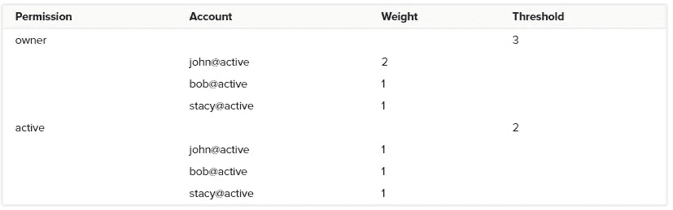

# EOS 上的多重签名账户:它们是如何工作的？

> 原文：<https://medium.com/coinmonks/multisignature-accounts-on-eos-how-do-they-work-84318d72972?source=collection_archive---------0----------------------->

需要两个或更多密钥来签署交易的账户(需要一定的许可)，通常被称为**多签名账户**，通常用于安全地存储资金，毫无疑问是一个非常令人兴奋的 EOS 功能。但是多重签名账户是如何工作的，你如何用不同的密钥签署交易，以及你如何自己建立一个多重签名账户？我们将在本文中解释 EOS 上多重签名账户的所有方面。

# 默认 EOS 帐户的结构

在我们开始解释多重签名账户之前，首先理解默认 EOS 账户(的结构)是很重要的。如果你想全面了解 EOS 账户，请阅读我们的综合指南[这里](https://hackernoon.com/the-ultimate-guide-to-understanding-eos-accounts-a44b58ba5601)。如果你只想了解 EOS 账户的默认结构，请阅读下面的解释。

每个用户在 EOS 区块链上有一个或多个帐户。EOS 账户是存储在区块链上的可读标识符，需要将任何(有效)交易推送到 EOS 区块链。

EOS 帐户长度为 12 个字符，可以包含字母 a-z 和数字 1-5。这些帐户名称取代了大多数加密货币中使用的又长又笨拙的钱包地址。

此外，每个 EOS 帐户都有权限。许可可以被看作是为了使事务通过而需要满足的要求。每个权限都有与之相关联的特定操作。默认的 EOS 帐户有两个本机权限:

*   *所有者*:显示账户的所有权，需要修改账户所有权。这个权限的密钥最好(安全地)保持脱机，因为在 EOS 网络上做大多数事情都不需要它。
*   *活动*:用于转账、制作人投票等高层账户变更。

除了这两个本地权限之外，您还可以创建新的自定义权限来满足您的需求。

每个权限都有一个与之关联的密钥。与权限相关联的每个键都具有某个**权重**，并且每个权限都具有某个权重**阈值**，需要在要求该权限的事务被接受之前满足该阈值。

Visualization of a default permissions structure. (Source: [EOSIO Developer Portal](https://developers.eos.io/eosio-nodeos/docs/accounts-and-permissions#section-__-multisig-account-authorities-__))

为了帮助您理解所有这些信息，我们提供了上面的图像，它可视化了默认 EOS 帐户的权限结构。如您所见，*所有者*权限的默认**阈值**为 1，并且有一个键的**权重**为 1。这同样适用于*活动*权限，其默认**阈值**为 1，1 个键的**权重**为 1。这意味着只需要与*所有者*或*激活*权限相关联的(私有)密钥来执行任何需要*所有者*或*激活*权限的交易。

与*所有者*权限相关联的(私有)密钥通常被称为*所有者*密钥，而与*活动*权限相关联的(私有)密钥通常被称为*活动*密钥。

# 多重签名 EOS 帐户如何工作

现在你已经熟悉了默认的 EOS 账户(的结构)，是时候学习多签名 EOS 账户了。多重签名 EOS 帐户的功能类似于默认 EOS 帐户，两者之间的主要区别是权限结构。在默认的 EOS 帐户中，所有权限的**阈值**都为 1，并且只有 1 个键的**权重**为 1，而多签名 EOS 帐户中的权限的**阈值**为 2 或更高，并且有多个键的**权重**可能变化。这也意味着多个密钥必须签署来自多重签名 EOS 账户的任何交易。

Visualization of a multisignature permissions structure. (Adapted from: [EOSIO Developer Portal](https://developers.eos.io/eosio-nodeos/docs/accounts-and-permissions#section-__-multisig-account-authorities-__))

上图显示了多签名 EOS 帐户中可能的权限结构示例。就像前面描述的默认账号一样，这个账号同时拥有*所有者*和*活动*权限。

然而，这个多签名帐户中的*所有者*权限的**阈值**为 3，并且有 3 个与之相关联的密钥:来自 John 帐户的*活动*密钥，其**权重**为 2；来自 Bob 帐户的*活动*密钥，其**权重**为 1；以及来自 Stacy 帐户的*活动*密钥，其也有一个这意味着，要执行任何需要*所有者*许可的事务，John 的*活动*密钥和 Bob 或 Stacy 的*活动*密钥都必须在事务执行前对其进行签名。

该多签名帐户中的*活动*权限的**阈值**为 2，并且有 3 个相关联的密钥。来自约翰账户的*活动*键，其权重**为 1；来自鲍勃账户的*活动*键，其权重**为 1；以及来自斯泰西账户的*活动*键，其权重**为 1。这意味着，要执行任何需要 2 个*有效*键的*有效*许可(任何组合)的交易，必须在交易执行前签署交易。******

# 创建多重签名 EOS 帐户

现在你已经熟悉了多签名账户，是时候学习如何自己创建一个多签名账户了。在您能够创建多签名帐户之前，您需要先创建一个默认的 EOS 帐户，然后您将把它转换为多签名帐户。如果你还没有账户，你可以在这里按照我们的指导创建一个账户。一旦你有一个帐户，你可以继续。

请记住，更改您帐户的权限结构可能会导致您的帐户无法访问和恢复，请谨慎操作。

在本例中，我们将创建一个可以与朋友共享的帐户。它将具有以下权限结构:

Permissions structure of our example account. (Adapted from: [EOSIO Developer Portal](https://developers.eos.io/eosio-nodeos/docs/accounts-and-permissions#section-__-multisig-account-authorities-__))

在本例中，*所有者* 权限的**阈值**为 2，并且有两个键**权重**为 1 与之相关联，即您自己帐户的*活动*键和您朋友帐户的*活动*键。这意味着，为了执行任何需要*所有者*许可的交易，您和您的朋友都必须在交易执行前使用*有效*密钥签署交易。

*活动*权限的**阈值**为 1，并且有 2 个权重为 1 的键与之相关联。自己账户的*激活*键和朋友账户的*激活*键。这意味着，为了执行任何需要*活动*许可的交易，您或您的朋友必须在交易执行前用*活动*密钥签署交易。

让我们开始更新权限结构，将此帐户转换为多签名帐户。在本教程中，我们将使用 [EOSToolkit](https://eostoolkit.io/account/advanced) 。导航到“高级权限”页面，您可以在这里找到。然后通过点击左上方的“附加帐户”来连接您要更新的帐户，并使用散点验证连接。

Updating the active permission

我们将首先更新*活动*权限，使用正确的信息填写空白处，然后点击“更新”，然后使用散点图签署交易。您可以随意使用任何您喜欢的权限结构，只要确保您非常小心。

Updating the *owner* permission

完成更新*活动*权限后，是时候更新*所有者*权限了。再次填写正确信息，点击“更新”。

为了验证一切正常，你可以通过进入你的账户页面的“密钥”部分，在块浏览器中查看你的账户的权限结构，如 [bloks.io](https://bloks.io/) 。

# 创建、签名和推送多签名交易记录

现在您已经成功创建了一个多签名帐户，您可以开始创建、签名和推送您的第一个多签名交易。我们将解释整个过程。要开始，请转到 [EOSToolkit](https://eostoolkit.io/home) ，确保您的帐户已连接，并通过点击左侧菜单中的“单签名模式”按钮切换到“多签名模式”。

## 创建多重签名交易

在本例中，我们将创建一个令牌转移交易。为此，请转到左侧菜单中的[“转移代币”选项卡](https://eostoolkit.io/transfer)。

The first step of creating a multisignature transaction

在空白处填写正确的信息，然后点击“发送”。将自动填写发件人帐户。点击“发送”后，系统会自动提示您进入“创建交易”页面，我们将在此创建交易。

Creating the multisignature transaction

在空白处填入正确的信息。您必须使用*激活的*权限，因为转移操作需要*激活的*权限。填写完信息后，点击“创建 JSON”，签署交易并下载 JSON 文件。

## 签署多重签名交易

成功创建交易后，就该用所需的帐户签名了。进入[“签署交易”页面](https://eostoolkit.io/multisig/sign)，确保正确的分散账户已连接，并加载您刚刚创建的交易 JSON 文件。完成后，点击“签署交易”，签署交易并下载签名 JSON 文件。

Signing the multisignature transaction

在您签署交易后，确保所有其他(必要的)方签署交易并收集签名。为此，向他们发送事务的 JSON 文件(不是您刚刚下载的签名 JSON 文件。在本例中，当满足了*活动*权限的**阈值**时，您可以立即推送交易，但通常其他人必须先签署交易。

## 推动多重签名交易

在每个人都签署了交易之后，是时候收集签名并将交易提交给网络了。为此，请转至[“推送交易”页面](https://eostoolkit.io/multisig/push)。

Pushing a multisignature transaction

首先加载事务 JSON 文件，然后添加所有签名文件。完成后，点击“推送交易”并验证提交。

如果一切顺利，交易将会成功，您已经创建、签署并推送了您的第一个多签名交易，祝贺您！

## 关于我们

EOS mainnet 的基础模块生产商。BOS mainnet 的块生成器。蜡像公会候选人。欧洲连锁姐妹连锁店的合作伙伴。区块链项目的投资者。治理、跨文化合作和安全专家。可以在这里找到我们:
EOS Block 制作人姓名:eosamsterdam
BOS Block 制作人姓名:amsterdambos
WAX 公会名称:amsterdamwax
[网站](https://eosamsterdam.net/?source=post_page---------------------------)
[Twitter](https://twitter.com/eosamsterdam?source=post_page---------------------------)
[Youtube](https://www.youtube.com/channel/UCHCrTf4Nbqz8S017kgs4vjA?source=post_page---------------------------)
[电报](https://t.me/EOS_Amsterdam?source=post_page---------------------------)
[微信](https://eosamsterdam.net/wp-content/uploads/image/x-png/medium.png?source=post_page---------------------------)

*由* [撰写*亚尼克·斯兰特*](https://www.linkedin.com/in/yannick-slenter/) *为* [*EOS 阿姆斯特丹*](https://eosamsterdam.net/)