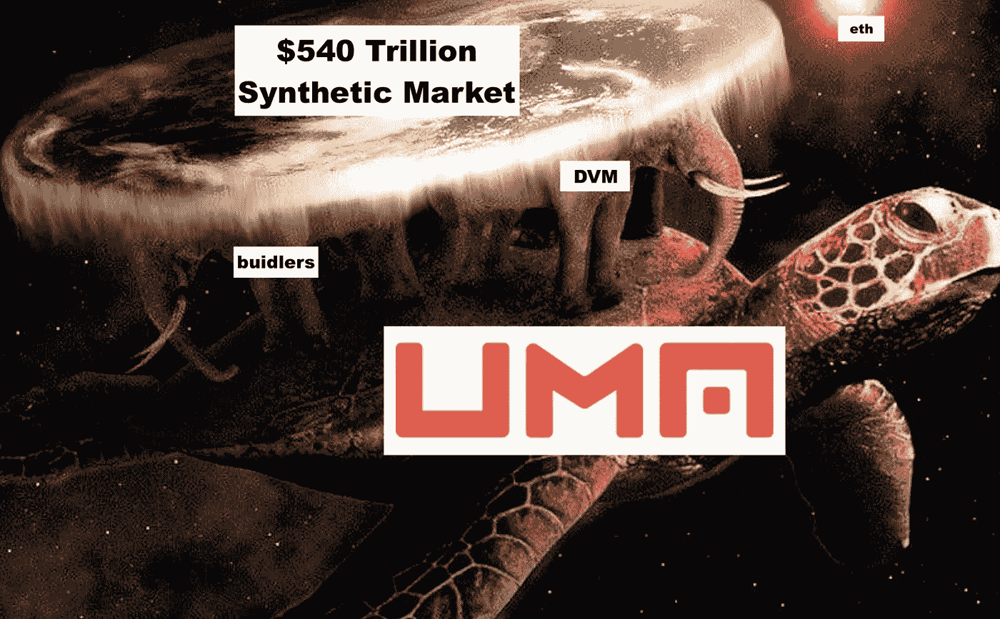

# 思考 UMA: DeFi 基础设施

> 原文：<https://medium.com/coinmonks/musing-on-uma-defi-infrastructure-c14d77290138?source=collection_archive---------1----------------------->

老实说，现在看着 UMA 网站上充斥着大量的解释者和文档，赞美他们开放的合成资产基础设施所带来的广阔设计空间，很容易认为他们是一个跳上火车的年轻 DeFi 新贵。没有产品界面，没有市场指标仪表板，甚至没有功能演示。当然，具有讽刺意味的是，UMA(普遍市场准入)比任何有这种想法的人都早得多——那么为什么没有 dapp 呢？

考虑到由 Compound、Synthetix、Uniswap、Aave 等公司开创的既定 DeFi 剧本，这是一个有效的问题——所有项目都与 UMA 本身在同一个前寒武纪 DeFi 时代构思。对于这些项目，路线图基本上是以下内容的变体:

1.选择传统金融系统的一个功能

2.编写一套智能合同，以一种不可信的、分散的方式服务于该功能

3.为用户构建一个访问该功能的界面

4.鼓励开发人员在该功能的基础上进行构建和集成

这显然是一个有效的策略:先做产品，再做赚钱的乐高。

UMA 选择只作为乐高存在，为最大的金融原始体建立开放的金融基础设施，在通常定制的 OTC 交易中占了超过 540 万亿美元:合成合同。

有大量的资源可以了解 UMA 协议的基础，所以我将非常简要地总结:**UMA 协议由一个开放式框架组成，用于跟踪交易对手、保证金账户、经济条款、合同交互和 oracle 机制的合成资产创建。这种甲骨文机制就是 UMA 的 DVM，它由$UMA 持有者提供动力，包括反腐败的经济保证。**

为了理解 UMA 的走向市场战略，一个很好的类比是 if Compound 或 Aave，而不是创建一个成熟的贷款协议和应用程序，而是为其他各方创建具有可定制利率曲线和支持资产的贷款应用程序创建 rails。人们可以想象 Argent 和 Zerion 这样的公司部署他们自己的一套贷款合同，符合 Compound 的规格，并可能以某种方式捆绑在一起，也许是一个统一的保险池。但是贷款协议**没有**走那条路有一个显而易见的原因:流动性断裂。

所有 DeFi money 协议都在竞争尽可能多地锁定合同中的流动性。如果基础设施贷款协议允许针对各种利基用例进行多次迭代，那么流动性将被分割到每个用例中，而不是聚集在几个大池中。问题是，这有那么糟糕吗？

对于 Compound 来说，答案很可能是肯定的，尽管这可能是它自己的假设性辩论。眼下真正的问题是，这对 UMA 的合成合约会有什么影响？

有两个关键的影响是显而易见的:有限的风险敞口和有限的流动性。有限敞口的想法与 Synthetix 截然不同，Synthetix 有一个 SNX 流动性的赌注池，为他们的整个合成生态系统提供资金。这种单一池系统使铸币商面临复杂的债务风险，其中你的铸币债务相对于整个池的债务余额波动，即。如果你铸造并持有 sUSD，sETH 和 sBTC 升值，你的债务就会增加。在 UMA 的合约特定系统中，当你铸造一个合成代币时，你的风险敞口和债务仅限于该代币和合约，使得对冲和抵押维护简单得多。

有限流动性更明显的含义也与 Synthetix 形成了对比，因为它与交易有关。Synthetix 提供本地交易所，提供零滑动，价格由 Chainlink oracle 设定，UMA 的合成令牌是“无价的”，这实际上意味着要靠市场来找到与固定资产价格的平衡。正如我们过去几个月在戴身上看到的那样，一种综合挂钩的资产在公开市场上不一定保持其挂钩状态。**对于 UMA 来说，这意味着几周内 synth 流动性开采的曙光可能会推动对合成资产的需求。**

最终，这不是一个主要问题，因为做市商受到激励铸造更多的合成品以捕捉套利，UMA 合约有一个象征性的到期日，届时它们将可兑换为其真实价值，由 DVM 强制执行。然而，这种细分的流动性确实使这些合成令牌更容易被操纵，这可能会限制 Aave 等系统中的 synth 可组合性。这种风险在设法获得足够流动性的合成器中明显减轻。

显然，UMA 提供了一个合成系统，在某些用例中，它比 Synthetix 有一些优势，但很难击败 SNX 的那些泵。幸运的是，乌玛有一些锦囊妙计。

UMA 的甲骨文系统由 UMA 的股东提供支持，它不仅是合约结算的仲裁者，还内置了防止操纵的经济保障。DVM 的合同衡量腐败利润(PfC)和腐败成本(CoC ),前者通过合计合同中的股份价值计算得出，后者通过获得 51% UMA 美元投票代币的成本计算得出。如果 PfC 超过 CoC，**协议将收取基础金融合约费用，以购买和燃烧$UMA，从而提高$UMA 的价格和 CoC。**

虽然我们当然喜欢经济安全的模式，但 DeFi 已经表明自己更关注令牌经济学——这一系统极大地有利于$UMA 持有者。DVM 的逻辑要求$UMA 的价格随着其金融合同中锁定的价值金额而上涨。这意味着投资者可以根据合约中当前锁定的价值金额计算出 UMA 的价格下限，并根据锁定价值的增长来估计未来价值。目前 UMA 的价格为 2.20 美元，流通供应量为 5300 万，目前的 CoC 约为 5900 万美元，肯定超过了 UMA yCOMP 和 yETHBTC 合成器中现有的 25 万美元。**但是随着最近的流动性开采爆炸，不难想象一个场景，其中$UMA 奖励激励额外合成器的创造，锁定价值超过当前的 CoC，这必然导致$UMA 价格的上涨。**

DeFiPulse Top Ten DeFi Protocols by TVL

虽然采用这种开放的基础设施方法和创建定制的 oracle 是独特的战略，但 UMA 战略的最大赌注之一似乎是缺乏用户界面。这很大程度上保证了用户和 TVL 的缓慢增长，并限制了曝光率。出于一定的监管原因，在他们的第一个 synth，yETHBTC 首次推出后的几周内，你只能通过 Etherscan 与 UMA financial contracts 进行真正的互动。

然而，社区似乎已经准备好了。从我开始这篇文章到发布这段时间，在 [usynth.xyz](https://usynth.xyz/) 已经创建了一个设计良好的极简 UI。此外，两个有才华的团队目前正在使用 UMA 协议构建定制产品。[魔药实验室](https://potion.finance/)将使用 AMM 系统和布莱克-斯科尔斯定价来建立一个期权协议，允许用户在各种资产上创建定制的执行价格——提供 Hegic 更广泛的资产和更严格的技术系统的灵活性，这要归功于 UMA 的长期发展和广泛的审计。

此外，大肆宣传的 Jarvis Network 目前正在基于 UMA 协议构建他们的合成交易所，这是他们正在发展的 DeFi 生态系统的一部分，除了合成交易所之外，该生态系统还包括保证金交易和钱包接口。

总而言之，UMA 建立了一个非常灵活的协议，可以定制以满足估计价值 540 万亿美元的合成衍生品市场的需求，创建了一个独特的 oracle 机制，由 UMA 持有人管理，具有强大的经济担保，拥有一个积极的建设者社区，并将在未来几周内启动流动性挖掘。尽管他们的路线非常规，但他们的近期前景非常光明，但未来会怎样呢？

虽然 UMA 金融合同的开放性是一个很大的特点，但 DVM 的开放性将允许 UMA 为 DeFi 带来显著的象征性。一种思考方式是预测，但它与比预测市场更复杂的金融合约有关。这开启了几乎无限的可能性，例如由黑客金钱团队建立的名人期货协议，用户可以做多和做空名人的受欢迎程度。

只要$UMA 持有者有能力确定挂钩价值，DVM 就可以成为任何事情的先知。

例如，忘记复制合成，让我们叉 CeFi。FTX 有一些非常有趣的产品。一些拥有 FTX 账户的有事业心的个人可以提交 umip(UMA 改进建议),将 FTX 复制的合成金融合约添加到 DVM 中，铸造 FTX 合成代币，对 FTX 本身进行对冲，并向用户提供通过 Uniswap 在 FTX 获得的相同敞口。

最终，从长远来看，这是 UMA 击败 Synthetix 的地方。虽然你不能否认 SNX 泵，单一的抵押品池和对 Chainlink 神谕的依赖，只是限制了传统系统中基于定制化场外交易的市场的设计空间。许多合成资产市场需要这种灵活性。

不要担心，SNX 斯巴达人，这里会有一个以上的玩家空间，但 UMA 实验建立的基础设施，这些球员将使用肯定是一个值得关注的。

> [*在您的收件箱中直接获得最佳软件交易*](https://coincodecap.com/?utm_source=coinmonks)

