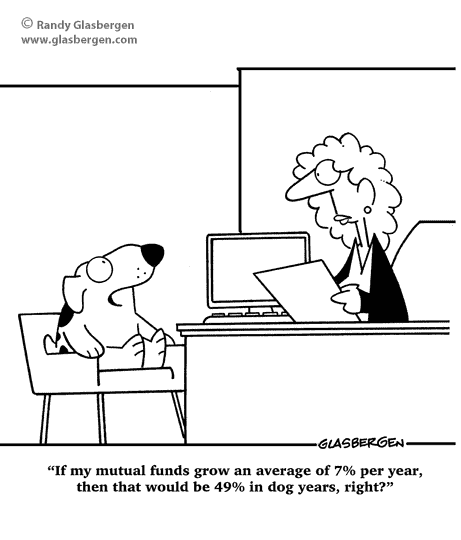
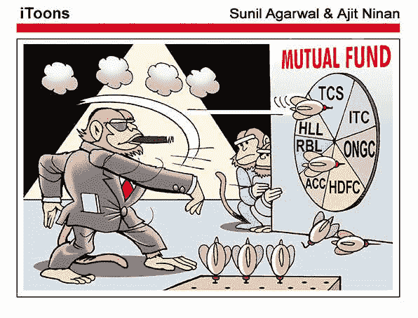

# 共同基金(MF)——互惠互利？？？？

> 原文：<https://medium.com/coinmonks/mutual-funds-mf-mutually-beneficial-ea4ab31e08a0?source=collection_archive---------9----------------------->

嘿，伙计们，很高兴能回来讨论不同的资产类别——“共同基金”。我已经收到了许多建议和要求，以涵盖这一投资工具。但这真的不同于投资股票或债券市场吗？让我们来看看……...我敢肯定，如果你住在印度，你至少曾经在电视或报纸上看到过一个广告，说**共同基金 Sahi Hai** ………..绝对正确的说法，前提是你已经根据你的**财务状况**、**目标**、**贪婪**和**风险偏好** ……选择了基金。这些术语听起来是不是很熟悉，可能是你的财务顾问用过的？？其中一些甚至在广告中重复出现。如果到目前为止被这些冠冕堂皇的术语吓到了，你一直在别人的建议下投资于共同基金(MF ),并且对其表现或回报不满意，或许这是你掌握控制权的时候了。正如我常说的，知识和意识是做出明智决策的关键，尤其是在有负面影响的投资领域。每一个正确的答案都会奖励你，但每一个错误的答案也会大大减少你的财富。在别人的建议下，你可能会幸运一两次，但从长远来看…..如果你的目标是获得财务自由，你必须更深入地选择最适合你的投资工具。

回到广告，共同基金萨西海……..但是对谁来说这是正确的选择……你见过像 Rakesh Jhunjhunwala、Warren Buffet、Vijay Kedia 和 Damani brother 这样的大投资者投资共同基金吗？？大概不会…..对于那些由于繁忙的工作安排而没有足够时间管理投资的人，或者知识和风险有限的人来说，MF 是一个安全的选择。对许多人来说，恐惧是选择 MF 的一个令人信服的理由，因为许多人觉得它是由业内最好的人管理的。但是，永远记住投资的黄金法则:低风险-低收益和高风险-高收益。因此，专业管理的基金保证低风险，肯定会是低收益品种。对于像我这样想要获得财务自由的人来说，我们别无选择，只能选择高收益工具，同时将相关风险降至最低。**所以，我们先投资知识，再投资 MFs** 。

首先，什么是共同基金？为了简单起见，让我们通过一个例子来理解。想象一下，如果你们中的一些人想投资以增加储蓄，但不确定股票、债券、货币市场工具或其他证券中哪一个是最好的选择。此外，你们每个人都有不同的金额，从低至 500 卢比不等。现在，想一想，仅仅用 500 卢比投资蓝筹股或大盘股是可能的吗？当然不可能，你可能连一股都买不到。但是，如果你们集中资源，指定一个在投资领域有经验的人来管理你们所有的资金，并给予公平的回报，那会怎么样呢？这正是共同基金的概念，每个投资者根据自己的经济能力和需求，为一个特定的基金筹集资金。基金经理是一位表现卓越的专业人士，然后将这笔钱投资于各种股票、债券等以获取利润。在扣除他的费用和支出(通常被称为**负载**)后，他将剩余的利润按照投资比例作为股息进行分配。一般来说，**负荷**大约在**1%到 2%** 之间，平均回报率为 10%到 15%，因此让每个人都满意。(负载是选择 MF 的一个非常重要的参数，我们将在后面讨论。从数学角度来说，我建议计算一下，如果 1000 卢比投资于一个计划，每年收取 2%的负荷，持续 5 年，总负荷将收取多少费用。)

**共有多少种共同基金**？我觉得这部分最难回答。想象一下，有人问你用糖可以做出多少种菜肴……会有答案吗…哈…哈…哈。如果问题是，有多少种甜味剂…..我们可以尝试根据使用的原材料或制作过程进行分类。共同基金也是如此……甜蜜的对比不是吗？？？

现在严肃地说，共同基金本质上是由资产管理公司(AMC)提供的金融产品，因此在本质和精神上可以有无数种类型。然而，这曾让投资者感到困惑，因为很多时候，资产管理公司使用模糊的名称来吸引容易受骗的可怜投资者。因此，SEBI(印度证券交易委员会)介入，对共有 36 类共同基金计划进行了分类……哦，上帝…..这有帮助吗？？值得庆幸的是，它还将 MFs 分为五类:股票基金(T0)、债券基金(T1)、债券基金(T3)、混合基金(T5)、解决方案导向基金(T6)、其他基金(T9)。让我们在今天的帖子中发现股票基金，并在随后的帖子中发现。

股票基金——这是我最喜欢的，因为它通常在所有类别中提供最好的回报。顾名思义，该基金将主要投资于股票或股份，如果目的是创造财富，建议长期投资。这 10 个子类别是大型股基金、大型中型股基金、中型股基金、小型股基金、多仓基金、股息收益率基金、价值基金、对冲基金、聚焦基金、部门/主题基金和 ELSS。我相信，这里的常客在辨别他们之间不会有任何困难，但是，对于那些可能是最近加入的人，让我们快速复习一下。

**大盘股**指市值超过 20，000 亿卢比，**中盘股**指市值从 5，000 亿卢比到 20，000 亿卢比，**小盘股**指市值低于 5，000 亿卢比，因此根据基金类型选择股票。

**股息率基金**将超过 65%的资金投资于分红公司，而价值型基金则投资于价值被低估的公司。

对冲共同基金逆市场趋势投资，购买目前表现不佳的股票，而专注基金投资于有限的行业和股票。

**部门基金**投资于特定的部门或行业，如银行、制药、IT、房地产、能源等，而**主题基金**投资于围绕特定机会明确定义的股票，如基础设施的提升将意味着水泥、钢铁和建筑业务公司的增长。

现在， **ELSS** 或**股票挂钩储蓄计划-** 这些都是节税基金，涵盖在所得税法第 80C 条下。强制锁定期为 3 年，是所有节税工具中最短的。

我希望，我能让你们的兴趣持续到最后……伙计们，**共同基金是创造财富的零努力工具**，我们至少可以做的是阅读并知道最适合我们的事业以最大化我们的回报。即使是短期投资，到期日的收益差异，要么让你喜，要么让你哭。因此，请继续登录四到五个帖子的整个系列，以彻底了解这个被广泛使用但很少被了解的投资领域。

朋友们，请把这篇文章转发给尽可能多的人，甚至是没有投资经验的人。这种被动的有纪律的储蓄和投资方式可能会让人们的生活变得更好，向他们展示一种获得财务自由、追求梦想的方式。**如果你喜欢这篇文章，请点击屏幕左下角的**按钮，如果你最近才加入，请不要忘记**点击右上角的**按钮。

> 加入 Coinmonks [电报频道](https://t.me/coincodecap)和 [Youtube 频道](https://www.youtube.com/c/coinmonks/videos)了解加密交易和投资

## 另外，阅读

*   [OKEx 回顾](/coinmonks/okex-review-6b369304110f) | [Kucoin 交易机器人](/coinmonks/kucoin-trading-bot-automate-your-trades-8cf0ca2138e0) | [期货交易机器人](/coinmonks/futures-trading-bots-5a282ccee3f5)
*   [AscendEx Staking](https://blog.coincodecap.com/ascendex-staking)|[Bot Ocean Review](https://blog.coincodecap.com/bot-ocean-review)|[最佳比特币钱包](https://blog.coincodecap.com/bitcoin-wallets-india)
*   [霍比评论](https://blog.coincodecap.com/huobi-review) | [OKEx 保证金交易](https://blog.coincodecap.com/okex-margin-trading) | [期货交易](https://blog.coincodecap.com/futures-trading)
*   [Godex.io 审核](/coinmonks/godex-io-review-7366086519fb) | [邀请审核](/coinmonks/invity-review-70f3030c0502) | [BitForex 审核](https://blog.coincodecap.com/bitforex-review)
*   [Crypto.com 费用](/coinmonks/binance-fees-8588ec17965) | [僵尸加密审查](/coinmonks/botcrypto-review-2021-build-your-own-trading-bot-coincodecap-6b8332d736c7) | [替代品](https://blog.coincodecap.com/crypto-com-alternatives)
*   [有哪些交易信号？](https://blog.coincodecap.com/trading-signal) | [Bitstamp vs 比特币基地](https://blog.coincodecap.com/bitstamp-coinbase) | [买索拉纳](https://blog.coincodecap.com/buy-solana)
*   [ProfitFarmers 回顾](https://blog.coincodecap.com/profitfarmers-review) | [如何使用 Cornix Trading Bot](https://blog.coincodecap.com/cornix-trading-bot)
*   [MXC 交易所评论](/coinmonks/mxc-exchange-review-3af0ec1cba8c) | [Pionex vs 币安](https://blog.coincodecap.com/pionex-vs-binance) | [Pionex 套利机器人](https://blog.coincodecap.com/pionex-arbitrage-bot)
*   [我的加密副本交易经历](/coinmonks/my-experience-with-crypto-copy-trading-d6feb2ce3ac5) | [比特币基地评论](/coinmonks/coinbase-review-6ef4e0f56064)
*   [CoinFLEX 评论](https://blog.coincodecap.com/coinflex-review) | [AEX 交易所评论](https://blog.coincodecap.com/aex-exchange-review) | [UPbit 评论](https://blog.coincodecap.com/upbit-review)
*   [AscendEx 保证金交易](https://blog.coincodecap.com/ascendex-margin-trading) | [Bitfinex 赌注](https://blog.coincodecap.com/bitfinex-staking) | [bitFlyer 点评](https://blog.coincodecap.com/bitflyer-review)
*   [麻雀交换评论](https://blog.coincodecap.com/sparrow-exchange-review) | [纳什交换评论](https://blog.coincodecap.com/nash-exchange-review)
*   [支持卡审核](https://blog.coincodecap.com/uphold-card-review) | [信任钱包 vs 元掩码](https://blog.coincodecap.com/trust-wallet-vs-metamask)
*   [Exness 回顾](https://blog.coincodecap.com/exness-review)|[moon xbt Vs bit get Vs Bingbon](https://blog.coincodecap.com/bingbon-vs-bitget-vs-moonxbt)
*   [如何开始通过加密贷款赚取被动收入](https://blog.coincodecap.com/passive-income-crypto-lending)
*   [加密货币储蓄账户](/coinmonks/cryptocurrency-savings-accounts-be3bc0feffbf) | [加密交易机器人](https://blog.coincodecap.com/best-crypto-trading-bots)
*   [BigONE 交易所评论](/coinmonks/bigone-exchange-review-64705d85a1d4) | [CEX。IO 审查](https://blog.coincodecap.com/cex-io-review) | [交换区审查](/coinmonks/swapzone-review-crypto-exchange-data-aggregator-e0ad78e55ed7)