# MEXC 全球(前 MXC)审查:骗局或合法？

> 原文：<https://medium.com/coinmonks/mxc-exchange-review-3af0ec1cba8c?source=collection_archive---------2----------------------->

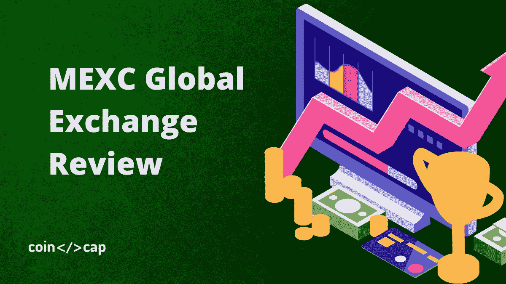

加密货币在互联网上引发了很多好奇。它被嘲讽，被威胁，逐渐被拥抱，成为我们生活的一部分。今天我就来详细回顾一下 [**MEXC 全球交易所**](https://blog.coincodecap.com/go/mxc) ，讨论一下加密货币在这个平台上的存取款。

# 什么是 MEXC Global？

[MEXC 全球交易所](https://blog.coincodecap.com/go/mxc)，成立于 2018 年 4 月，是[全球领先的数字资产交易平台](https://blog.coincodecap.com/crypto-exchange)之一。团队的主要成员来自世界一流的企业和投资公司，他们在区块链和金融领域拥有丰富的专业知识。

可以为用户提供现货、[保证金交易](https://blog.coincodecap.com/margin-trading)、杠杆 ETF、合约交易等数字资产一站式服务，以及 PoS 跑马圈地。它不仅组建了一支优秀的安全团队，还与顶级安全公司合作，确保用户资产的完整性。

自成立以来，MEXC Global 已在五个国家申请执法许可，即瑞士、加拿大、澳大利亚和美国。英语、俄语、韩语、葡萄牙语、土耳其语、越南语、印地语、马来语、印度语、非洲语和其他语言地区或国家都有用户。

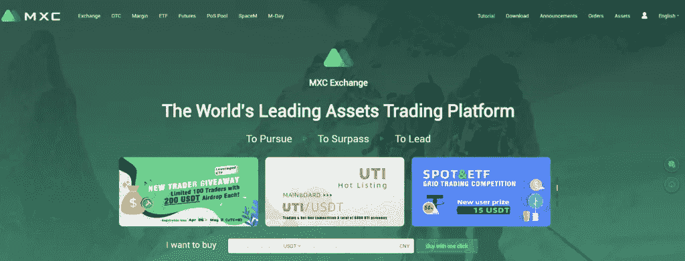

# 摘要

*   它拥有一支由区块链业界资深人士和来自欧美的专家组成的坚实的创始团队。
*   对社会的贡献:MX 持有者将获得 60%的交易费作为奖金，剩下的 40%用于每月回购和焚烧自己的原生 MX 令牌。
*   用户友好: **MX token** 持有者将投票决定团队如何运行以及 **MEXC Global** 团队成员。

# MEXC 全球评论:交易经验

各种交易所有不同的交易特点。如果你决定哪种交易观点最适合你，那会有所帮助。所有视图的共同点在于，它们都呈现订单簿、订单簿的一部分、所选加密货币的价格图表以及订购背景。他们通常还要购买和出售箱子。在你选择一个交易所之前，请查看交易视图，以确保它对你来说是好的。下图描述了 [MEXC Global](https://blog.coincodecap.com/go/mxc) 在“技术模式”下的交易视图:

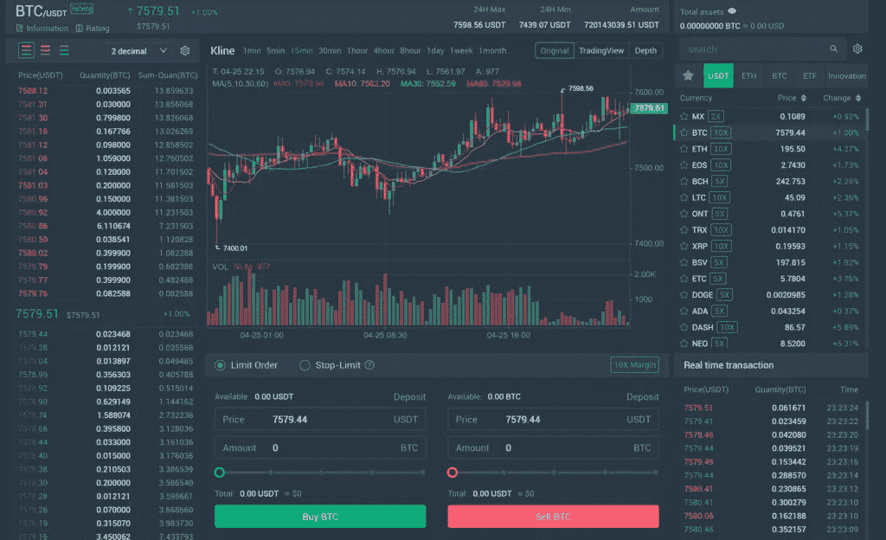

在我看来，MEXC Global 的交易界面干净、简单易用。明确显示了买卖订单，但没有提供其他细节，如实时交易、订单簿或地图。我喜欢提供的两个图表显示:常规和[交易视图](https://blog.coincodecap.com/go/tradingview)，后者增加了高级交易策略的图表功能。

对该交易所的一个小抱怨是，他们的电子邮件标题都是中文的，可能是因为该交易所在中国仍然非常成功，并且针对的是当地受众。尽管如此，这些电子邮件可能会让不会说中文的人有些困惑。

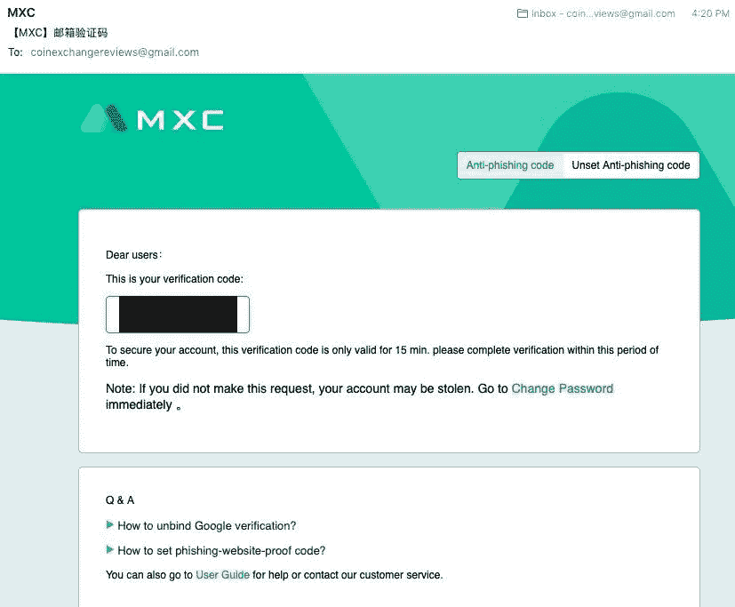

# MEXC 全球评论:支持的货币和付款方式

[**MEXC Global**](https://blog.coincodecap.com/go/mxc) 支持以下类型的加密货币购买支付:银行转账、支付宝和信用卡，如 Visa 或 Mastercard。交易所接受以下法定货币:越南盾、人民币、澳元、欧元、英镑、比索(MXN)、欧元和美元。此外，MEXC Global Exchange 仅接受加密货币购买:BTC、USDT、瑞士联邦理工学院、XRP、EOS、LTC、BCH 和 TRX。

# MEXC 全球费用

## 交易费用

它有几个交换费率，即从接受者那里收取的接受者费用和从制造商那里收取的制造者费用。主要选择是收取“统一”费用。固定费用意味着对于接受者和制造商来说，交换的成本是相同的。

该交易所对每笔交易收取 0.20%的统一费率。与全球行业平均水平(可以说是 0.25%)相比，这个数字略低。因此，就交易价格而言， [**MEXC Global**](https://blog.coincodecap.com/go/mxc) 因其具有竞争力的报价而具有优势。

## 取款费

当决定在哪个交易所交易时，必须考虑它的取款费。无论提取的加密货币单位数量是多少，提取费用都是固定的。它不同于加密货币。该交易所对 BTC 取款收取 0.0005 BTC 的手续费。这也略低于行业平均水平。全球行业的平均 BTC 提款费约为 0.0008 BTC。

# [MEXC Global](https://blog.coincodecap.com/go/mxc) 审查:存款方式

MEXC Global 接受电汇作为存款形式，但不接受信用卡。如果你出于某种原因选择通过信用卡付款，这可能会有问题。即便如此，由于 MEXC Global 接受法定货币存款，它与几家只允许加密货币存款的交易所保持了距离。

交易者按付款的 0.2%支付交易佣金。

这里是[链接](https://www.mexc.com/fee)到不同硬币/货币的汇率:

# MEXC 全球评论:受支持的加密货币和分散金融(DeFi)

[**MEXC Global**](https://blog.coincodecap.com/go/mxc) 接受 242 个硬币，拥有 374 个交易对。与其他现货交易交易所相比，Coingecko 目前在资金最多的加密货币方面排名第七。

最值得注意的是，MEXC Global 站在了[去中心化金融(DeFi)](https://blog.coincodecap.com/the-ultimate-guide-to-defi-decentralized-finance) 浪潮的最前沿，支持定期使用 DeFi 硬币。ChainLink ($LINK)、Synthetix Network Token($ term)、Maker($ term)、Aave ($LEND)、Compound ($COMP)、DAI ($DAI)、0x ($ZRX)、Ampleforth ($AMPR)、UMA ($UMA)、Kyber Network ($KNC)、Loopring Coin ($LRC)、REN ($REN)、yearn.finance ($YFI)、Bancor Network Token ($BNT)、Thorchain ($RUNE)目前可供交易。

不仅如此，MEXC Global 还支持以下常见的 DeFi 币:TrustSwap ($SWAP)、Keep ($KEEP)、UMA ($UMA)、DMM: Governance ($DMG)、Balancer ($BAL)、Orion Protocol ($ORN)、bZx Protocol ($BZRX)、

因此，如果你正在寻找这些 DeFi 硬币，并通过各种投资最大化你的利润，你需要检查墨西哥全球交易所。

# 墨西哥湾环球评论:安全性和合规性

为了保证存放在交易所的资金安全， **MEXC Global** 有高端[冷藏钱包](https://blog.coincodecap.com/how-to-secure-your-crypto-wallet#Cold_storage)。这些钱包管理着大约 5 亿美元的加密货币存款。到目前为止，还没有关于 [**MEXC 全球交易所**](https://blog.coincodecap.com/go/mxc) 安全违规的报告。总的来说，我们给予历史悠久的交易所较高的安全评级，因为它们经受住了时间的考验。

MEXC Global 拥有任何交易所都有的标准安全功能。例如，在中注册时，您必须输入发送到您电子邮件地址的确认码。交易所进一步推广双因素认证的使用，要么通过手机，要么通过谷歌认证器。对于新用户，会有一个弹出窗口提醒他们启用安全功能。

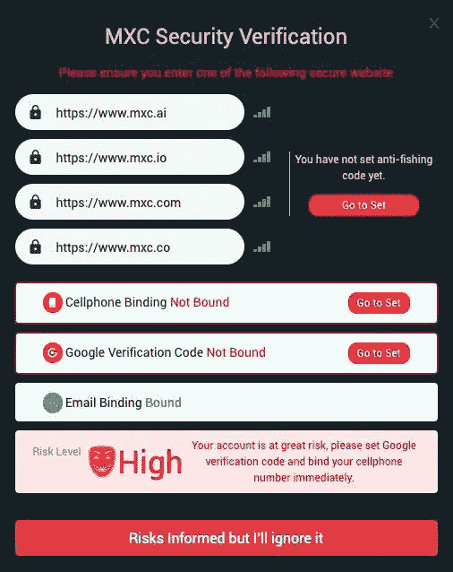

# MEXC 全球流动性交易所

Coinmarketcap 将该交易所列为 21 大交易所之一。人们发现，在流动性研究中，以太坊和比特币等重要的加密货币具有很高的流动性。然而，其他基金，如$PCX 和$ZVC，分布更广。实际上，对于更为次要的知名加密货币，超过 1000 美元的订单会出现大幅价格下滑。

MEXC Global 一直处于几起涉及虚假音量争议的核心。一些论坛，如 [BitcoinTalk](https://bitcointalk.org/) ，指责 MEXC Global 夸大记录的重要性，以吸引潜在会员加入该平台。

# MEXC 全球交易所评论:绩效

MEXC Global 提供高性能交易引擎，由具有银行从业经验的开发人员开发。仅交易所就提供了每秒 140 万次交易的可靠性，以及额外的性能改进。服务器集群位于新加坡和韩国。

# 如何在 MEXC 全球交易所存取加密货币？

要在[**MEXC Global Exchange**](https://blog.coincodecap.com/go/mxc)上存放加密货币，请点击顶部栏中的“资产”进入资产摘要页面。

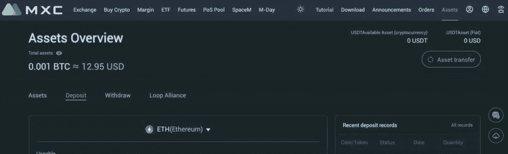

从下拉屏幕中，选择您想要存放的加密货币。在这种情况下，我们选择了以太坊，以便它可以将您的 ETH 存款地址显示为 QR 码和地址，以方便您的使用。然后输入您想要提交加密货币的地址。之后，[MEXC Global](https://blog.coincodecap.com/go/mxc)[Exchange](https://blog.coincodecap.com/go/mxc)会显示您的存款待定。

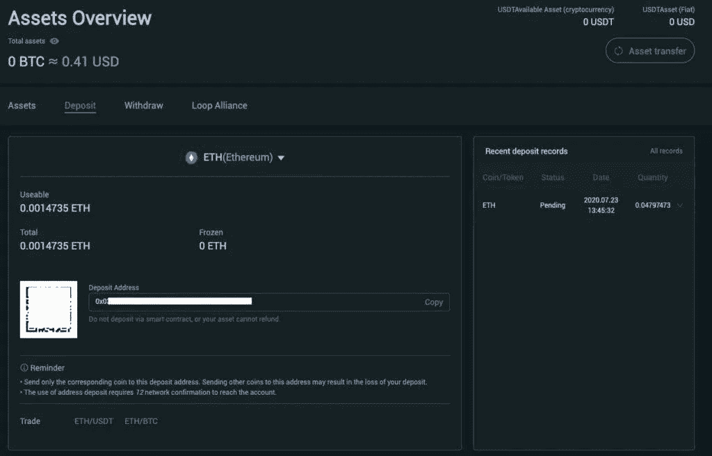

然后你必须等待你的存款出现在你的 MEXC 全球账户上。一旦出现，你的存款记录就会显示“成功”你可以通过各种因素来确定速度，包括你愿意支付的汽油量以及它是否有拥挤的网络。

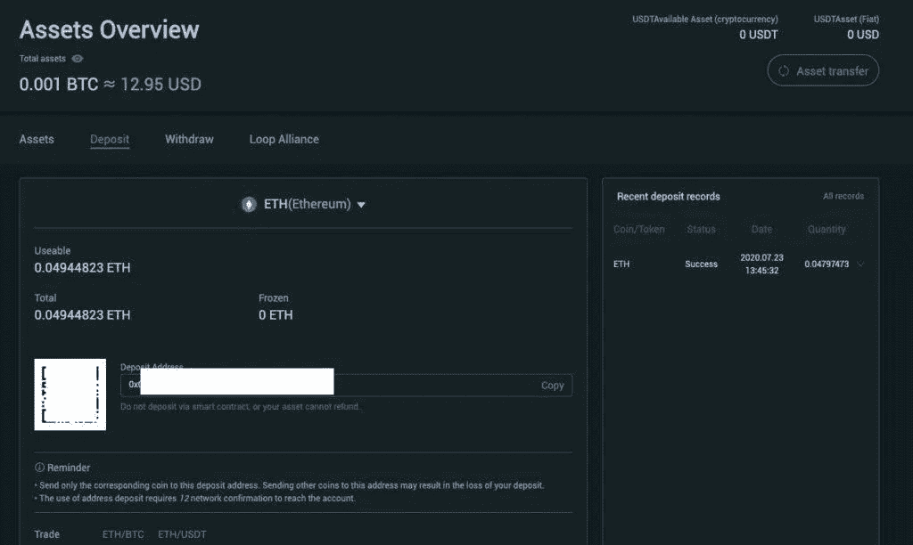

# 在 MEXC 全球交易所撤回加密货币

作为一项保护措施，[**MEXC Global Exchange**](https://blog.coincodecap.com/go/mxc)仅在您通过将您的手机号码与您的账户关联或激活 Google Authenticator 启用了双重认证的情况下才允许提款，因此您必须先这样做。要提取您的加密货币，请前往顶部栏并选择“资产”从资产概览列表中选择“撤销”。在这里，您可以在点击“发送”之前输入您的取款地址和号码记住，MEXC 全球交易所收取 0.005 ETH 的服务费。

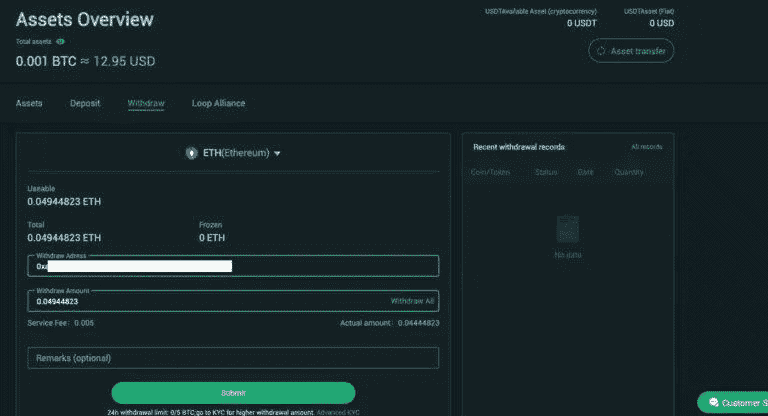

然后，您将被要求通过输入发送到您的电子邮件的代码并使用您首选的 2FA 表格，如 SMS(如果您已将您的电话号码与您的帐户关联)或 Google Authenticator 来确认取款。请记住，您只有 60 秒的时间来完成整个验证过程，所以要快！

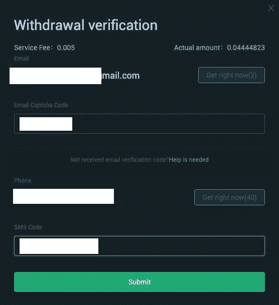

如果您已经发送了您的取款验证，交易所将验证您的订单，并且您可以通过点击“跟随取款单”来查看您的发送状态以下是图片。

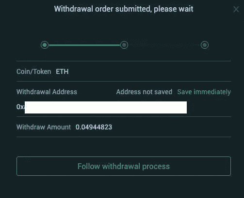

以下是 [**MEXC 全球交易所**](https://blog.coincodecap.com/go/mxc) 成功提取加密货币的图片。整个过程不到十分钟。

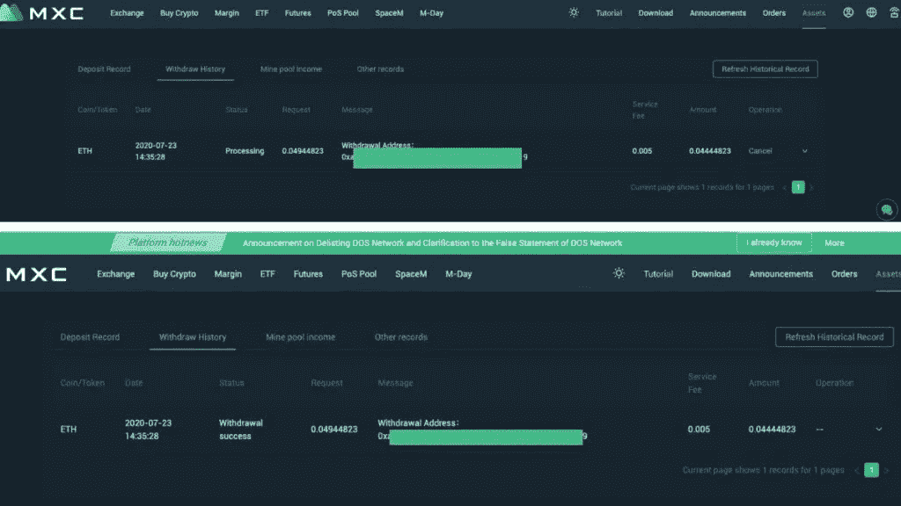

# MEXC 全球交易所的优势

这种交流有许多好处，应该提倡。我喜欢这个平台，因为它明确提倡这三个好处:高性能、超级节点和高级安全防御。本能地，所有投资者都需要高性能的交易引擎。还提供高级安全保障。超级节点功能可能对所有潜在的平台用户没有同等的吸引力。这对那些熟悉使用超节点的人来说很有吸引力。

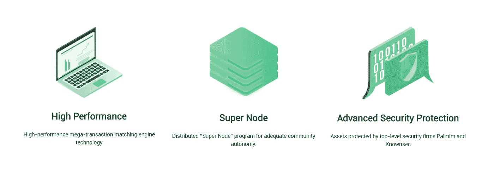

# 我不喜欢 MEXC 全球交易所的什么？

我认为 MEXC Global exchange 缺乏的就是这种合作关系。它可以与其他工具协作，如 [3Commas](https://blog.coincodecap.com/go/3commas) 和 Koinly，以便用户可以使用第三方交易终端、[交易机器人](https://blog.coincodecap.com/best-crypto-trading-bots)、[加密税务应用](https://blog.coincodecap.com/crypto-tax-software)和其他功能。我认为营销团队可以通过这些著名的第三方加密交易工具和服务使 MEXC Global 可用。

这不仅会给墨西哥全球交易所带来更多的知名度，还会让该交易所获得更多的流动性。

另一件可能产生更大影响的事情是，如果创始团队更多地与公众接触，并组织更多的网络研讨会和现场活动。这将增加对平台的信心和声誉。

# 常见问题(FAQ)

MEXC 全球交易所需要 KYC 吗？

MEXC Global 目前不需要了解您的客户(KYC)的提款情况。MEXC Global for exchanges 要求用户的护照和地址证明的图像在 KYC 的上下文中。MEXC 全球交易所没有 KYC 程序，尽管已知有 30 多次 BTC 提款会导致手动 KYC。在人工 KYC 过程中，MEXC Global 将在提供身份证明之前冻结账户提款。该交易所已经宣布，它将很快开始一个全交易所的 KYC。

**MEXC 全球交易所是骗局吗？**

由于对虚假集团成员和过度交易量的指控，MEXC Global 素有争议的名声。

【MEXC Global 有 VIP 计划吗？

对于交易金额超过 30 BTC 的交易者，该交易所提供 VIP 服务。作为 VIP 计划的一部分，消费者可以获得较低的交易价格和其他优惠。

【MEXC Global 可以冻结我的存款并阻止我提取资金吗？

不，请查看我们关于在交易所存入和提取加密货币的部分，了解更多详细信息。不到 10 分钟，我就能取出我们的加密货币。但是，为了安全起见，在交易所允许您提取加密货币之前，您必须在您的 MEXC Global 帐户上激活双因素身份验证。

*   [2021 年如何在币安购买比特币？](https://blog.coincodecap.com/buy-bitcoin-binance)
*   [如何在印度购买比特币 2021？【先看这个】](https://blog.coincodecap.com/buy-bitcoin-india)
*   [DeFi(分散金融)初学者指南](https://blog.coincodecap.com/a-beginner-guide-to-defi-decentralized-finance)
*   [最佳比特币会计和加密税务软件【2021】](https://blog.coincodecap.com/crypto-tax-bitcoin-accounting-softwares)
*   [如何在印度购买以太坊？【手机和网站 2021】](https://blog.coincodecap.com/buy-ethereum-in-india)

*原载于 2021 年 4 月 5 日 https://blog.coincodecap.com**T21*[。](https://blog.coincodecap.com/mxc-exchange-review)