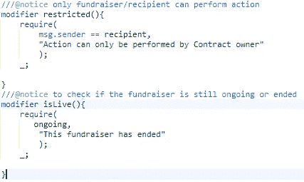
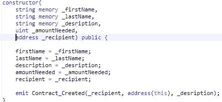
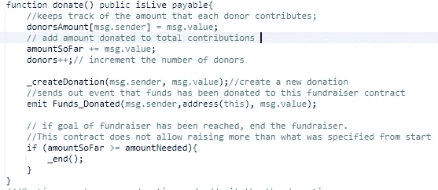
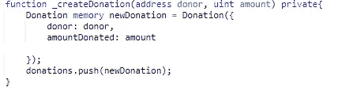
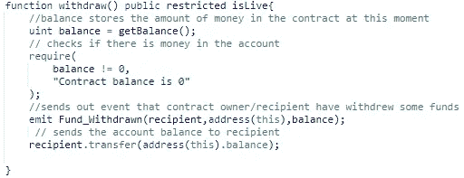
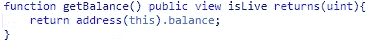
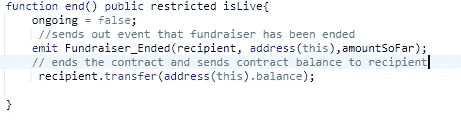
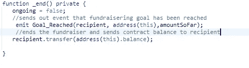

# 我在以太坊区块链上构建 GoFundMe 版本的尝试第 1 部分

> 原文：<https://medium.com/coinmonks/my-attempt-to-build-a-gofundme-version-on-the-ethereum-blockchain-part-1-501024653138?source=collection_archive---------5----------------------->

几个月来，我一直在学习成为一名区块链开发者，感谢 Reddit、Medium、GitHub、YouTube 和 Udemy 上的一些免费资源，我现在可以自信地说，我不再是一名初学者，但绝对不是专家。还有更多需要学习的地方，尤其是这个领域正在快速变化。

区块链有许多使用案例，这是一个很好的案例，有些人可能会争论为什么我们需要一个 Dapp 来做这件事，所以为了便于讨论，这只是为了学习。构建 Dapp 有很多部分，但是编写可靠性契约是一个很好的起点。现在让我们进入合同。

Photo by [rawpixel](https://unsplash.com/@rawpixel?utm_source=medium&utm_medium=referral) on [Unsplash](https://unsplash.com?utm_source=medium&utm_medium=referral)

注意:这篇文章是针对初学者的，所以我将详细介绍智能合同逻辑

## **以下是合同中的公共变量**

**地址公开收件人；**

*这是筹款人的地址。他们将是合同的签署者。*

**字符串公共描述；**

这是对资金用途的描述，所以我们可以在区块链的募捐活动中保留这些信息。

**字符串公共名；**

*试图筹款的人的名字。*

**字符串公共姓氏；**

*筹款人姓名。*

注意:我知道人们可以用任何名字创建基金，但身份验证不是本合同的重点

**uit 公共金额需求；**

*这是魏*需要筹集的资金数额。

**mapping(address =>uint)public donorsAmount；**

*这将把每个捐赠者捐赠的钱数映射到捐赠者的地址*

**uint 公共捐助者；**

这是为了记录合同中捐赠者的数量。前端应用的好帮手

**uint public amount sofar；**

*这将记录到目前为止筹款活动中捐赠的金额。该合同允许接收方，即合同创建者能够随时提取资金，因此我们需要一种方法来跟踪已经捐赠给该合同的资金，以了解我们何时达到目标。*

**捐赠【公众捐赠】；**

我们用它来跟踪所有对此合同的捐赠。这是一个 struct 对象，是前端应用程序的一个很好的帮助方法，但它并不是真正需要的，因为我们已经有了 donorsAmount 映射。

**Bool public 正在进行= true**

这有助于我们了解募捐活动是否仍在进行。开始时设置为 true。

## 我们将需要一些事件，将广播到区块链时，一些重要的事情发生在我们的合同。

**event Contract_Created(地址索引 _from，地址索引 _contract，string)；**

*创建合同时的事件。显示业主地址、合同地址和募捐者描述*

**活动资金 _ 捐赠(地址索引 _from，地址索引 _contract，uint _ value)；**

捐款时的事件。显示捐赠人地址、募捐者合同地址和捐赠价值

**事件目标 _ 达成(地址索引 _from，地址索引 _contract，uint _ value)；**

*筹款目标达成时的事件。显示收款人地址、合同地址和金额*

**事件募捐 _ 结束(地址索引 _from，地址索引 _contract，uint _ value)；**

*收款人/合同所有人结束筹款活动的事件。显示业主地址、合同地址和筹集金额*

**event Fund _ extracted(address indexed _ from，address indexed _contract，uint _ value)；**

*收款人从募集资金合同中提款的事件。显示业主地址、合同地址和提取金额*

## 我们还需要一些修改，这将有助于我们在合同中的一些限制。

*受限修改量将只允许接收方(即合同创建者)调用合同中的某些功能。*

当目标达到时，或者当接受者决定不管目标是否达到都要结束募捐时，isLive 修饰符将帮助我们结束募捐。

我想在目标达成后销毁合同，但这样做会删除合同的所有信息。这样，即使筹款活动结束了，我们仍然可以获得关于这份合同的信息。

我们正在初始化合同。使用名、姓、描述、需求金额和收件人。然后我们发出一个事件 Contract_created。

现在我们可以开始处理函数了

*捐赠函数被设置为公共函数，因此任何人都可以捐赠，isLive 修饰符用于检查筹款活动是否仍在进行，我们是否有应付款，这允许契约在被调用时接受资金。*

所以在这个函数中，我们将发送者的地址映射到捐赠的金额。我们随着捐赠的数量增加。增加了一个捐赠者。我们创建了一个新的捐赠，我们还没有创建这个函数。我们还发布了“捐赠基金”事件。

我们还添加了当我们达到目标时将结束合同的逻辑，基本上，如果我们得到了所需的金额，我们应该调用私有函数 _end()，我们稍后将创建它。

**我们的下一个函数是 _ 创建捐赠**

*这是一个私有函数，它获取捐赠者的地址和捐赠的金额，创建一个新的捐赠，并将其添加到我们前面声明的捐赠数组中。每当有人向募捐者捐款时，它就会被调用。*

**下一个函数是 withdraw()。**

*这个函数被设置为 public，它是受限制的，所以只有接收者可以调用它，并检查筹款活动是否仍在进行——当筹款活动结束时，没有必要试图提取资金。因此，在这里，我们通过调用一个助手函数 getBalance(我们将在后面创建)来获得契约的余额，并将其保存到一个名为 balance 的 uint 中。我们检查余额是否不为 0，然后我们发出事件 Fund _ retracted。最后，我们将合同的余额转移给接收方。*

**让我们创建 getBalance 函数，非常简单**

*它是公共的，设置为查看，因为它没有修改任何数据，只是读取，我们也在检查筹款活动是否是实时的，我想这是没有必要的，所以你不必在这里使用它。我们只是返回一个包含余额的单元。*

**下一个函数是 end()**

*这是一个受限制的公共功能，即只有接收者可以调用它，并且只能在运行时调用。当接收者出于某种原因决定结束募捐时，应该调用这个函数。首先，我们将正在进行的设置为 false。随后发出事件 Fundraiser_Ended。然后我们把合同的余额寄给收件人。*

我们还有另一个结束函数，但是这个函数是私有的，由契约调用。还记得前面在捐赠函数中我们调用 _end()的时候吗？

*这里的逻辑与另一个 end 函数相同，只是它是私有的，并发出事件 Goal_Reached。*

完整智能合同的链接在这里

 [## Gbenro/FundMe

### 以太坊区块链上的一个 GoFundMe 版本。通过在…上创建帐户，为 Gbenro/FundMe 的发展做出贡献

github.com](https://github.com/Gbenro/FundMe/blob/master/ethereum/contracts/fundme.sol) 

所以，伙计们，这是我们的 FundMe 合同的结尾，是吗？

嗯，我们肯定可以做一些事情来增加我们合同的安全性，并做一些优化来节省汽油。但是现在这样很好。

我的下一篇文章将是关于编译和部署的，这样我们就可以用 mocha 进行一些测试。

在以后的文章中，我会做一个智能合同审计，我们可以看看哪些地方可以改进。

这是第二部分的链接

[**Click to read today’s top story**](http://bit.ly/2G71Sp7)