# 我在以太坊区块链上构建 GoFundMe 版本的尝试第 2 部分

> 原文：<https://medium.com/coinmonks/my-attempt-to-build-a-gofundme-version-on-the-ethereum-blockchain-part-2-50bb7b886953?source=collection_archive---------0----------------------->

这是在以太坊区块链上构建类似于 gofundme 的去中心化应用程序的第二部分。

第一部分的链接是[这里是](/coinmonks/my-attempt-to-build-a-gofundme-version-on-the-ethereum-blockchain-part-1-501024653138)

Photo by [José Alejandro Cuffia](https://unsplash.com/@alecuffia?utm_source=medium&utm_medium=referral) on [Unsplash](https://unsplash.com?utm_source=medium&utm_medium=referral)

## **FundMe 合同的附加代码。**

我们将添加一个 fundmeFactory 合同。这将负责生产的 FundMe 合同，是的，工厂给了它。这是它的代码。

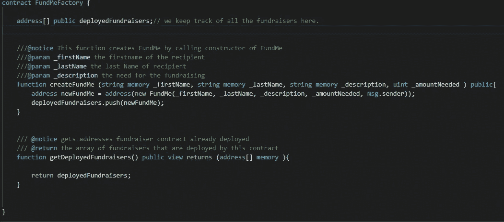

*如你所见，这是一份非常简单的合同。我们创建了一个名为 deployedFundraisers 的地址数组。创建了一个名为 createFundMe 的函数，它接受名字、姓氏、描述和所需金额，这个函数调用 FundMe 合同的构造函数，将所有这些参数传递给它，包括 msg.sender。我们得到一个地址，这是我们在创建合同时得到的。我们将新创建的合同地址保存在 newFundMe 中，然后将其推送到 deployedFundraisers 数组。*

*第二个函数 getDeployedFundraisers 只返回 DeployedFundraisers 数组。当 solidity 自动允许我们像调用函数一样调用公共变量(即 deployedFundraisers)时，我们为什么还需要这个函数？很好，你问了。为数组自由创建的函数将只允许我们一次访问一个项目，但我们希望在调用数组时访问所有项目，因此，我们创建了 getDeployedFundraisers。*

我们已经在[第一部分写好了合同，](/coinmonks/my-attempt-to-build-a-gofundme-version-on-the-ethereum-blockchain-part-1-501024653138)添加了一份工厂合同，是时候测试一下了。但在此之前，我们需要整理我们的合同。为此，我们需要下载一些依赖项。

我们需要 Solc 来编辑我们的合同。使用 **npm 安装 solc**

我们需要 fs-extra，一个构建文件路径的节点模块。使用 **npm 安装 fs-extra**

我假设您熟悉节点包管理器和节点 js。如果没有，您可以下载 [Nodejs](https://nodejs.org/en/) ，在命令行上导航到您的项目目录，然后运行命令 **npm init。**

## 收集

创建一个名为 compile.js 的新文件，并向其中添加以下代码。

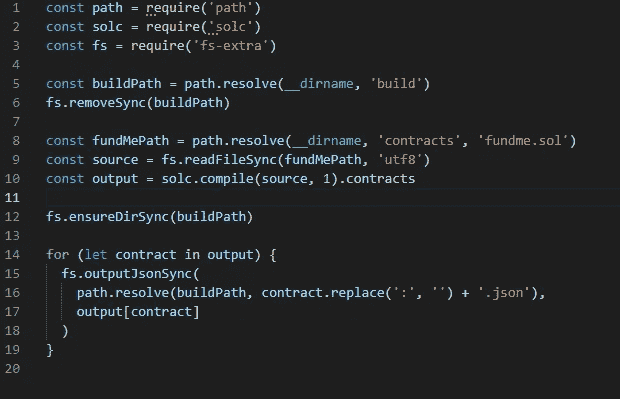

**注意:**我把我的 fundme.sol 文件放在一个名为 contracts 的文件夹中，你也可以这样做

在您的终端上运行命令**节点 compile.js** 确保您位于终端上 compile.js 文件所在的相同目录中。如果你的代码编译了，你会看到一个编译文件夹出现在你的项目中，里面有两个文件，FundMe.json 和 FundMeFactory.json，这是 json 格式的 ABI。当我们将合同部署到区块链时，我们将用它来与合同沟通

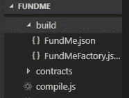

如果您在构建文件夹中看到这两个编译好的契约，那么恭喜您，您已经准备好享用主菜了。

## 测试

现在是有趣的部分了。我已经为这个智能合约编写了 10 个测试。编写一个全面且健壮的测试非常重要，尤其是对于智能合约。如果你到现在还不知道为什么，你真的不应该写智能合同，但只是提到几个原因，这是由于它们的不变性，以及我们可能在处理金钱或其他贵重物品的事实。一旦部署，我们不能改变它，这变得更糟，如果一个恶意用户发现了合同的漏洞。因此，我们必须确保我们的合同发挥其应有的作用。

添加以下依赖项开始。

我们需要摩卡来测试。使用 **npm 安装摩卡。**

我们需要 Web3 与我们的合同沟通。使用 **npm 安装 web 3 @ 1 . 0 . 0-beta 26**。这是我正在使用的 web3 版本。

我们需要 ganache-cli 在我们的计算机上创建本地区块链环境，请使用 **npm 安装 ganache-cli。**

在 package.json 文件中添加脚本**“test”:“mocha”。**

创建名为 FundMe.test.js 的新文件

在顶部需要以下内容

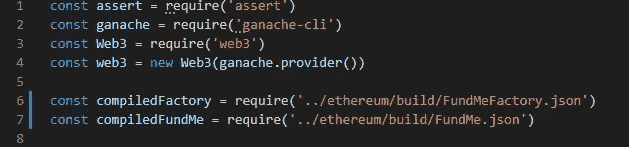

对于 compiledFactory 和 compiledFundMe，请记住它们在您的构建文件夹中，请确保您导航到正确的目录，因为我的目录与您的不同。

我们将需要以下变量

**让账目**。*加纳切的账户列表*

**让工厂**。*资金工厂合同实例*

让我们尽情享受吧。 *资金合同地址*

**让 fundMe** 。*基金合同的实例*

*在我们的 beforeEach 中，我们将从 web3 获取所有帐户的列表，将 FundMe 工厂合同部署到区块链，然后我们调用 createFundMe 函数来创建新的 FundMe 合同，获取新创建的 FundMe 合同的地址。然后，我们访问新创建的合同。不要忘记将 beforeEach 标记为 async，因为我们正在处理需要承诺的区块链。如果你不知道那是什么意思，不要担心。这只是意味着我们想要执行的动作不会立即发生，所以我们需要等待一段时间。*

这是上面的代码。

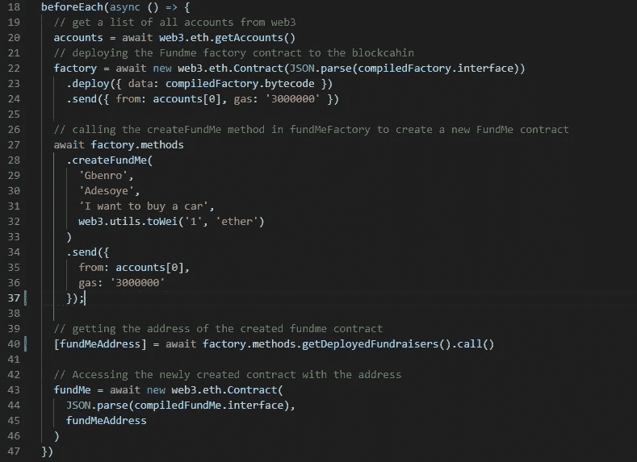

## 现在我们可以开始测试了。

创建一个描述，我称之为 mine FundMe，带有一个回调函数，把…我会展示给你看

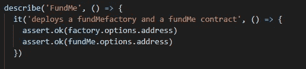

因此，在这里，我们正在测试我们是否已经成功部署了这两个合同。然后，如果我们创建的工厂契约实例中有地址，我们断言. ok。我们为 fundME 做了同样的事情。

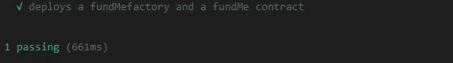

我们的测试通过了。干得好，我们已经成功部署了我们的合同。

**注意:**将每个测试放入 describe 中，并在终端中输入 **npm 运行测试**每次你想测试的时候

**测试 2**

我们将添加第二个“it ”,以确保合同将合同调用方标记为接收方。

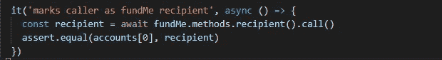

*这里我们调用的是由 solidity 自由创建的方法，recipient()，注意我们添加了。调用()。这是因为我们只是在读取数据，并没有改变契约的状态。所以这个操作是免费的。我们将它保存在 recipient 中，然后断言. equal account[0]与 recipient 相同。请记住，我们在 beforeEach 中从帐户[0]部署了我们的合同。*

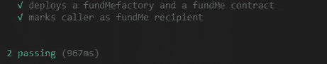

我们的测试通过了。

测试 3

我们将测试我们的合同是否允许人们捐款，并检查是否有人捐了钱。

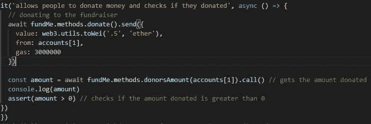

*我们调用了 donate()，这一次我们将改变合同的状态，这将耗费一些汽油。该值从以太转换为 wei (0.5 以太，我们的合同只接受 wei)，并且提供者是 accounts[1]。因此，我们如何检查他们是否真的捐了款，我们可以检查目前的金额或检查合同的余额，但这里我们使用的是 donorsAmount，它显示每个地址向募捐者捐了多少钱*。我们现在可以断言，看看金额是否大于 0。

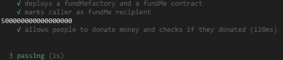

我们的测试通过了。你可以在 wei 中看到这个值，它是 17 个 0，我给你数过了。

**测试 4**

我们在这里测试合同是否允许接收者从合同中取钱。

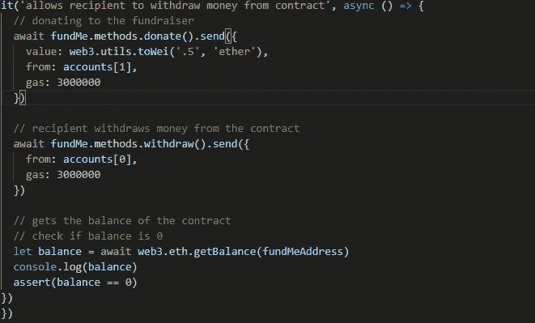

我们首先捐赠。然后，我们通过调用 accounts[0]来提取资金，accounts[0]是创建合同的帐户，也就是我们的接收方。为了确认钱确实被取走了，我们获取了合同的余额，并断言余额是否为 0。

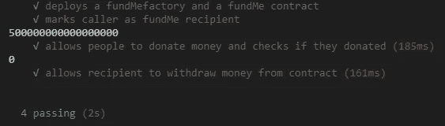

我们的测试通过了。

**测试 5。**

我们将测试接受者是否可以结束募捐。

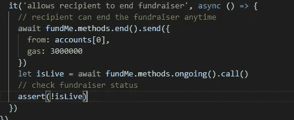

这里我们调用方法 end from acounts[0]。为了确认这次募捐已经结束，我们调用了正在进行的方法，该方法返回一个布尔值并保存在 isLive 中，应该是 false。我们断言(！isLive)。！应该否定假，使断言为真。

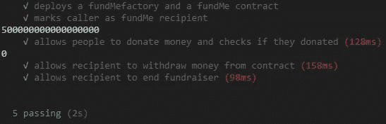

我们的测试通过了。我们已经成功了一半，对于一些程序员来说，测试并不有趣，但是作为一名区块链开发者，你必须热爱测试，所以现在就去习惯它吧。

**测试 6**

我们将测试筹款活动是否会在目标达成时结束。

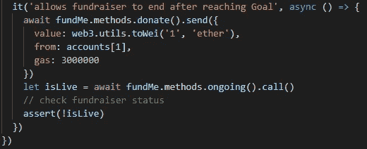

在这里，我们从账户[1]中捐款，并且捐得比需要的多，这应该结束募捐。确认是和上面一样的逻辑。

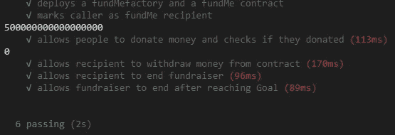

我们的测试通过了。

**测试 7**

这个测试会有一点不同，我们会让我们的操作失败，尝试用一个不是收款人的地址取款。

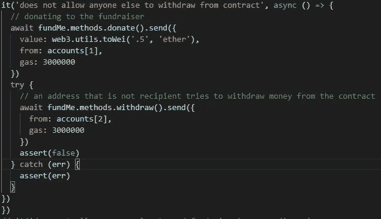

在这里，我们对契约进行了捐赠，然后我们添加了一个 try catch，因为我们想要执行的操作将会失败。我们尝试从帐户[2]中退出，这显然会失败。在 catch 中，我们断言 err 来确认存在错误。

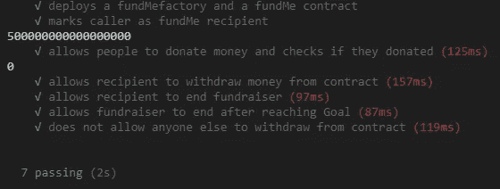

**测试 8**

我们将做一些类似于上面的事情，这里我们将检查我们的合同不允许其他任何人终止合同。

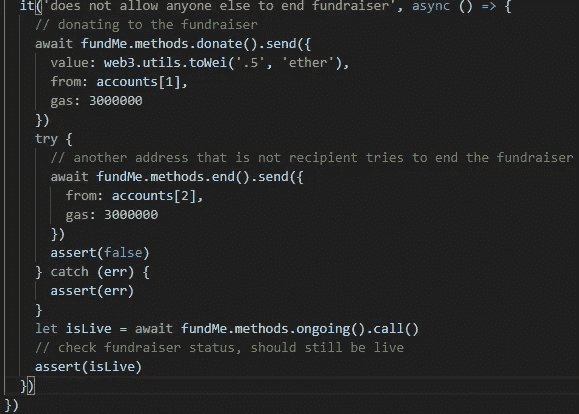

在这里，我们向募捐者捐款，然后在我们的尝试中，我们从 accounts[2]调用 end 函数，这显然会失败。为了确认我们的筹款活动仍然在进行，我们像在测试 5 和 6 中那样调用了正在进行的()，但是这次我们检查筹款活动是否仍然在进行。

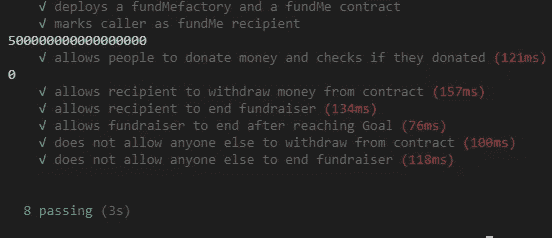

**测试 9**

我们想测试一下，在募捐活动结束后，合同没有收集捐款

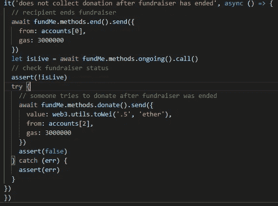

在这里，接收者结束募捐，我们检查募捐是否仍在进行，以确认它是否已经结束。然后我们把我们的逻辑放在一个尝试中，我们试图从帐户[2]中捐赠，这应该会失败。我们断言 catch 中是否有错误，以确认捐赠失败。

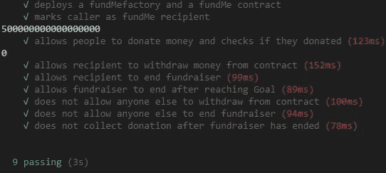

**测试 10**

终于，我们到了最后的考验。在这里，我们将做一个端到端的测试，即试图模拟一个筹款活动的流程。流程将是这样的:

该合同需要两笔捐款。

检查是否有两个人捐赠了。

接收方提取余额，使合同余额为 0。

募捐活动应该还在进行。

合同需要第三次捐赠。

第三次捐赠应该会触发募捐的结束。

检查现在是否有 3 个捐赠者

检查合同余额是否为 0

检查目标是否达到

检查收款人的余额是否大于初始余额

检查筹款活动是否已经结束

合同不允许更多的捐赠

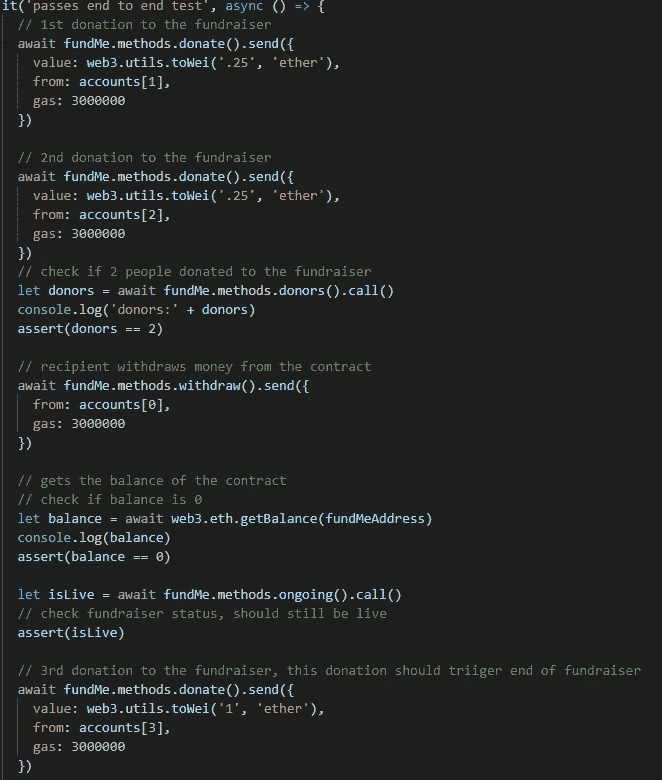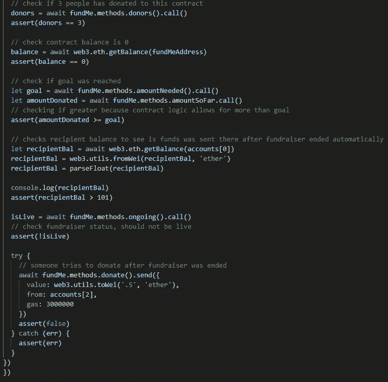

是的，最后一次测试要长得多。但是我们终于结束了。

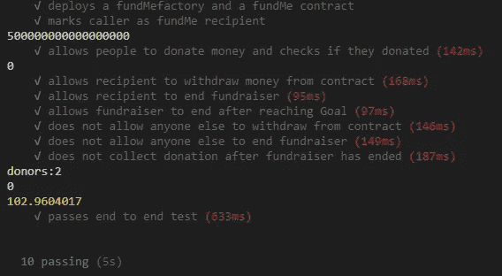

**注**:每个账户的原始余额为 100 以太。如我们所见，帐户[0]余额现在为 102.96 英镑。

 [## Gbenro/FundMe

### 以太坊区块链上的一个 GoFundMe 版本。通过在…上创建帐户，为 Gbenro/FundMe 的发展做出贡献

github.com](https://github.com/Gbenro/FundMe/blob/master/test/FundMe.test.js) 

测试的链接在上面。

感谢您完成这个测试，对于许多初学者来说，这可能会有压力，但开始习惯测试是一个好主意。

我确信我们还可以测试其他的东西。想出一个我们可以编写的测试，并在评论中告诉我。

我们现在有了与我们的合同进行通信的所有逻辑，并且可以轻松地为这个智能合同创建一个前端。

接下来我将写一份智能合同审计。审计您的合同总是很重要的，只是为了增加额外的安全性，并确保您的智能合同中没有漏洞。让外部区块链专家做审计是至关重要的，因为他们用他们新鲜的眼睛和专业知识，他们可能会发现你错过了什么。在这次审计中。我会尝试从一个新的角度来做这件事。

> [在您的收件箱中直接获得最佳软件交易](https://coincodecap.com/?utm_source=coinmonks)

[**Click to read today’s top story**](http://bit.ly/2G71Sp7)