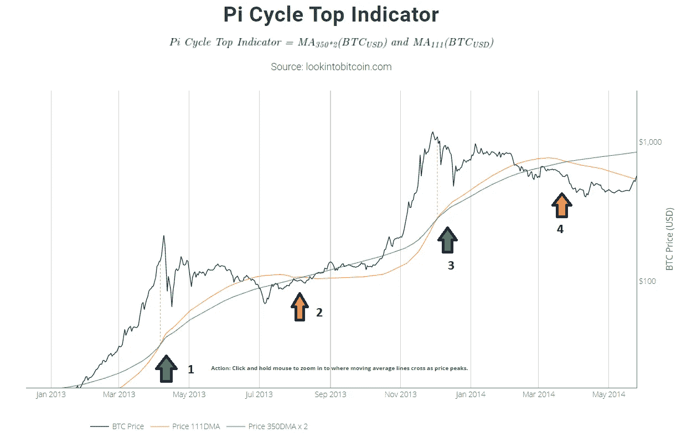
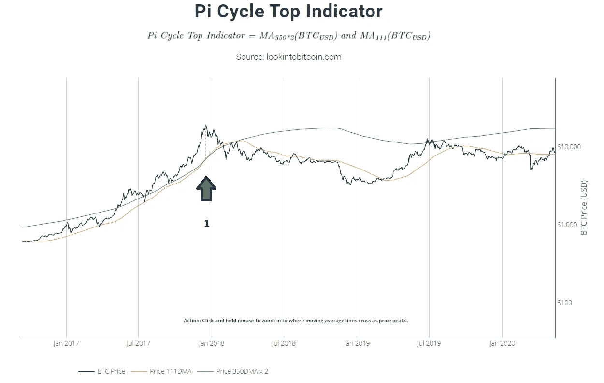
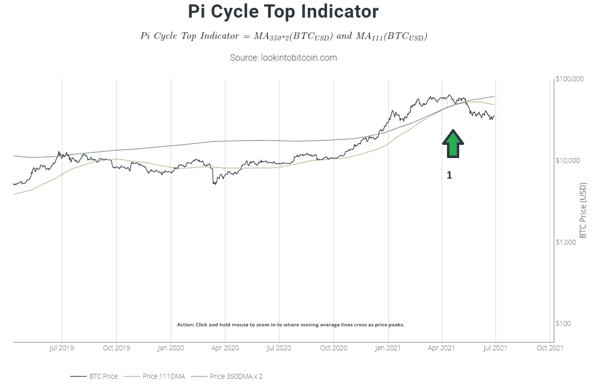
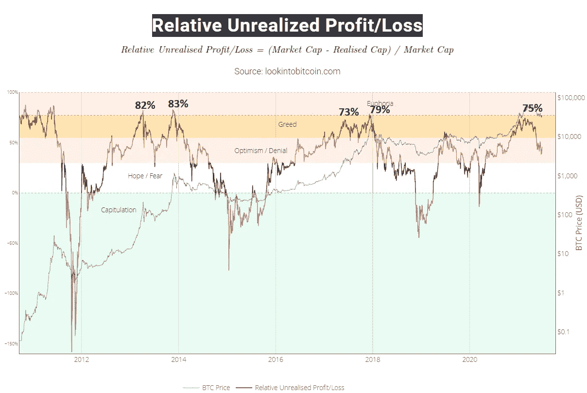
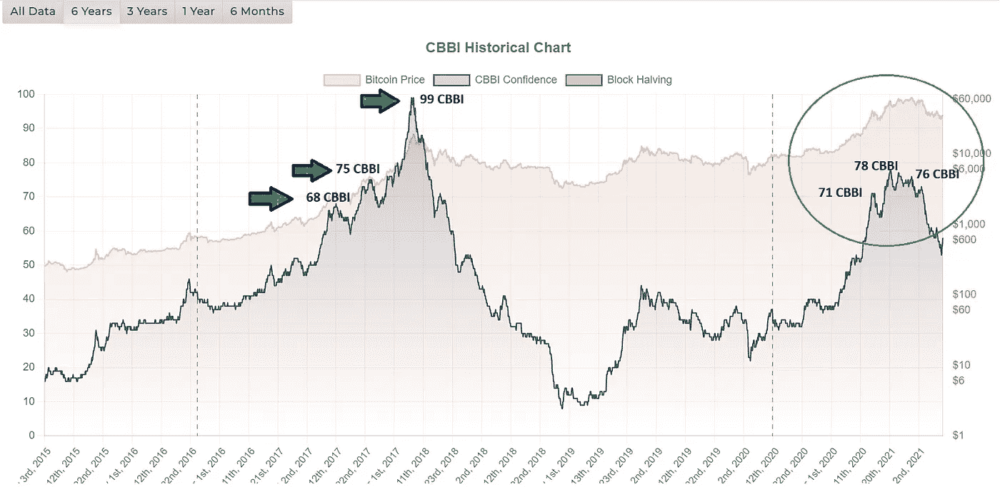

# 我未来 6 个月的比特币和 Alts 套现计划(至 2021 年 12 月)

> 原文：<https://medium.com/coinmonks/my-bitcoin-and-alts-cash-out-plan-for-next-6-months-till-dec-2021-19c4a0a79770?source=collection_archive---------3----------------------->

这篇文章会提醒我自己，所以我是在对自己说。

如果计划有任何变化，我应该也将会更新这篇文章，因为如果一切顺利的话，这将是我坚实的路线图。

**提醒自己**

1.  比特币的价格决定了市场的走向。
2.  Altcoins 跟随比特币的价格轨迹。
3.  不是所有的 alt 都会同时出现，但大多数硬币最终会赶上
4.  在牛市中，会有修正，在修正前拿走一些利润总是有助于我们在下跌时买入更多。
5.  把握市场时机。之前的修正也许不可能一直进行，但是利用很少的指标，我们可以用一些相近的时间
6.  目标是尽可能多的赚钱。

## **比特币提现计划**

请观看 Chico Crypto 的视频了解它。那里有好东西。

观看请点击 [**点击这里**](https://www.youtube.com/watch?v=_cDc1iOWTD0)

## **Altcoin 提现计划**

告诉自己，

比特币很快达到了 64k，修正是不可避免的。

**在牛市期间，我很少关注小额套现的技术指标**

## **Pi 周期顶部指示器**

从历史上来说，这个指标**在预测牛市顶部时并不准确**,但是，我们可以用这个指标在 **ALTS** 兑现利润

*下面我的分析*

在上面的片段(2013-14)中，考虑到牛市开始和结束之间的时间线。

**绿色箭头(1)**所指的十字，如果在这里套现一些利润，流动性将在整个盘整阶段帮助逢低买入**橙色箭头(2)**

由**绿色箭头(3)** 和**橙色箭头(4)** 指出的下两个十字也是如此

请记住

1.  在**绿色箭头(3)**处，牛市结束，这是确认的顶部，并得到其他指标的补充，在这种情况下，不需要在**橙色箭头(4)**处积累，而是等待熊市的后期积累
2.  **Pi 周期**顶部指标，只会用于了解顶部和套现利润，这个不会也不应该用于累计。

## **2017 年牛市实例**

## **2020 年牛市示例**

## **2。相对未实现利润/损失**

恐惧和贪婪指数

*下面我的分析*

坦率地说，我们无法准确把握市场时机，但我们可以足够接近。

看上面的图表，这三次牛市，任何时候相对指数(红线)**高于 70 %** 都是止盈。

## **3。CBBI 指示灯**

每当 CBBI 分数大于 **68 CBBI 时，**比特币**的价格就会大幅下跌，这一点被 CBBI 准确地概括了出来**

CBBI 分数将是我观察市场动向和做出决策的另一个最佳指标

alt 跟随比特币，CBBI 分数代表比特币的不同方面，因此我将有足够的时间来分析我的 Alts 并做出适当的决定。

## **结论**

我个人认为，我们正处于牛市的中间，这是最后一次欢呼！！！就在眼前。

记住，没有人通过获利而获利。

保持乐观。

***作者* : Eth！c@l Aka Kumar**

***邮件*:**[【IfWorldGoneCrypto@gmail.com】T21](mailto:IfWorldGoneCrypto@gmail.com)

***电报*:**[**https://t.me/IfWorldGoneCrypto**](https://t.me/IfWorldGoneCrypto)

***同行评审*:臭 Linky**

**PS** :这既不是付费文章，也不是理财建议。记录下来的是我自己的研究发现，这是出于对这个隐秘领域的热情

如果你想表达一些爱，请捐赠并帮助我们继续做我们正在做的事情

**ERC 20:0x 867 ca 4 af 0 EB 86d 48014 D8 ce 344d 096 c 01348 a163**

**来源**

[www。CBBI 信息](http://www.CBBI.Info)

[调查比特币](https://www.lookintobitcoin.com/)