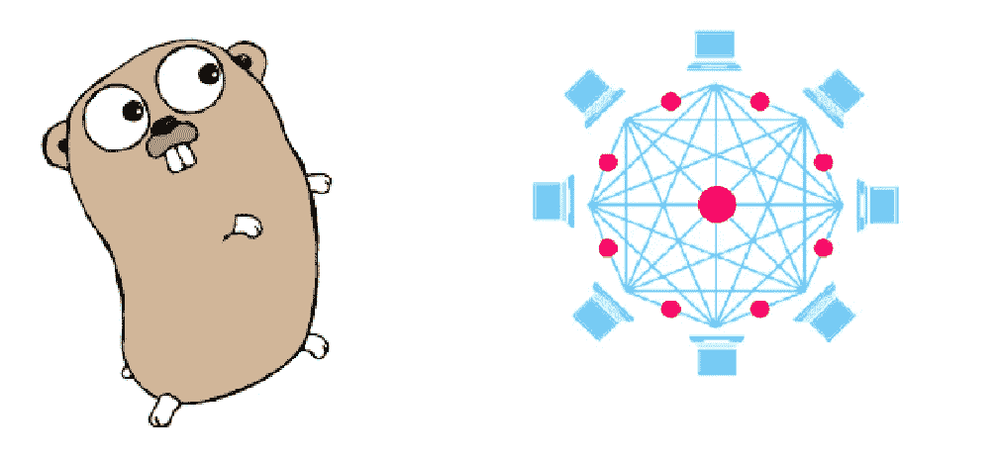

# 我的区块链在 Go

> 原文：<https://medium.com/coinmonks/my-blockchain-in-go-8e2d1a853a84?source=collection_archive---------2----------------------->

# TL；DR；

这篇文章是一篇个人笔记，解释了我是如何在 Golang 中实现与上一篇文章相同的区块链的。尽管如此，它也可以被其他想获得更多关于在 Go 中开发区块链的知识的人使用。