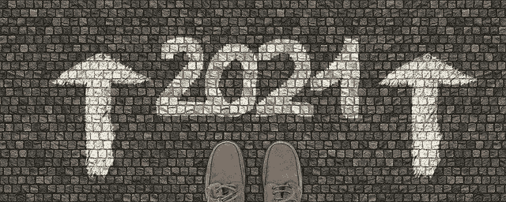
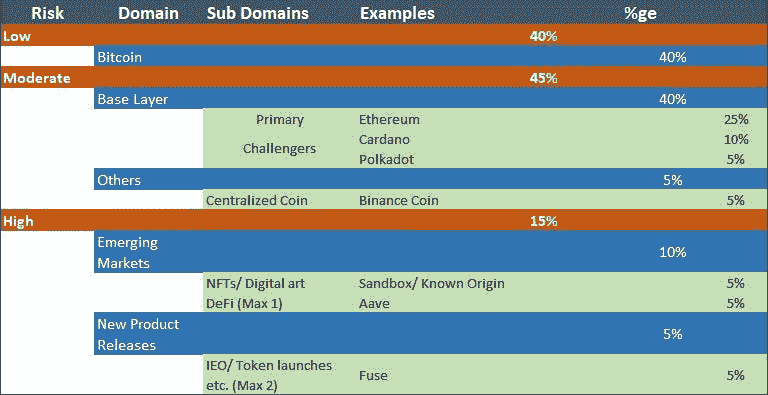

# 我的加密投资:第三部分——2021 年我的加密资产

> 原文：<https://medium.com/coinmonks/my-crypto-investments-part-3-my-crypto-holdings-in-2021-f4b33ab256b3?source=collection_archive---------4----------------------->

在[语音](https://www.voice.com/post/@tulip/my-crypto-investments-part-3-my-crypto-holdings-in-2021-1608452242-737588049)阅读我的原创文章。

**欢迎来到我的加密投资系列的另一集。在我之前的文章中，** [**【我的加密投资:第二部分——构建平衡的加密投资组合**](/coinmonks/building-a-balanced-crypto-portfolio-2a384492b1c) **，我谈到了我如何使用简单的帕累托(80–20)原则来创建平衡的投资组合。目的是以最小的风险获得最大的回报。这也意味着你可能得不到最高的奖励，但也不会损失太多。**

通过使用这种技术，我看到了在熊市期间，随着平行买入的发生，资金从高市值股票流向低市值股票。或者，在牛市中，资金从我的低仓位流向高仓位。这并不意味着我所持股份的总价值保持不变。这意味着我所有的持有量都以一种精心策划的同步方式增长。管理这样的同步总是不容易的，你需要根据市场调整你的持股。

## **几个基本规则:**

1.所有产品都应该有一个用例

2.所有的产品都应该为行业增加一些独特的价值

3.我应该能使用它们(差不多)

4.没有信息也没有炒作

基于我目前的风险偏好，我对风险百分比做了一点改变(来自第二部分[和](/coinmonks/building-a-balanced-crypto-portfolio-2a384492b1c))。

## **低风险(40%)**

*   **比特币(40%):** 比特币仍然是重中之重。请记住，如果机构投资者开始进入加密领域，他们将首先投资比特币。我们已经看到许多这样的投资者加入了这股潮流。Microstrategy 和 Mass Mutual 是最近的几个例子。虽然比特币作为支付模式的效用仍有待观察，但它作为价值储存手段的价值不可低估。

## **中等风险(45%)**

*   **以太坊(25%):** 以太坊仍然是我唯一以不信任方式使用的区块链。每天都有越来越多的以太坊被锁定在赌注合同中。这减少了循环供给。以太坊最近价格上涨，但仍有潜力制造多个 x。以太坊火箭还没有正常出发。
*   **卡尔达诺(10%):** 卡尔达诺是我冒过的风险。如果有一个可行的产品，EOS 可以很容易地取代 Cardano。然而，EOS 的某些方面我还没有完全理解。Cardano 在没有智能合约层的情况下仍然履行了承诺。它的节点由 102k 个代理运行。产品运行的正式验证和整体方法让我兴奋。我一直在使用 Catalyst Governance 应用程序，Yoroi 应用程序，它们就像一股新鲜空气。还有它与 Wolfram Research 的合作关系。因此，Nervos，Bondly 和 SingularityNet 让我兴奋。
*   **波尔卡多特(5%):** 我最近一直在使用波尔卡多特，主要是在 Testnet 中。虽然有一些项目正在积极开发，但大多数项目将在 2021 年中或晚些时候启动。尽管如此，这个项目看起来非常有前途。存在同步缓慢和代理削减的问题，但是，该项目仍处于学习阶段，应该会做得很好。
*   **币安币(5%):** 我几乎从第一天开始就在用币安，几乎没用过另一家交易所(除了风险缓解)。我现在已经开始使用币安智能链进行面包店交换等项目。最让我兴奋的是币安跳马的特色。我已经押上了我的 BNB，并在 BNB 和其他硬币(巴黎圣日耳曼和尤文图斯球迷的代币)中获得了被动收入。我的点是赚取 33%的回报在币安锁定赌注

点击这里阅读我关于币安金库[的文章。](/coinmonks/bnb-vault-why-is-it-so-important-for-binance-43e3581087ca)

## **高风险(15%)**

*   **沙盒/ Knownorigin (5%):** 我还不确定我将如何处置我在沙盒中购买的土地。然而，我确信在几年内我应该能够在它的基础上建立一些东西并将其货币化。我不想错过这个机会，因为我已经错过了分散的土地。我也从 KnownOrigin 买了一些艺术品。然而，我无法转售它。没人买账。在这方面要小心，不是所有的艺术品都会被卖掉。
*   AAVE (5%): 我知道你会问，为什么是 AAVE，为什么不是 UNI。答案很简单，从埃瑟伦时代起，我就是 AAVE 的支持者。事实上我的 ETHLend 被空投了。另外，调查 AAVE v2。你会对他们带来的功能感到惊讶。

然而，Defi 仍然是我需要重新平衡和增加持股比例的一个领域。

*   **导火索(5%):** 听说过导火索吗？Fuse 是对之前名为 Colu 的项目的升级，旨在通过形成社区令牌将加密货币带给大众，并将其用作支付方式。此外，我已经获得了 80-90%的赌注奖励。

我错过了**图表、链环和θ**的船。然而，我正在寻找机会，尤其是进入图表。

**阅读我的加密投资系列**

1.[我的秘密投资:第一部分——定义——7 大投资技巧](/coinmonks/defi-top-7-investment-tips-9999d1679da2)

2.[我的加密投资:第二部分——构建平衡的加密投资组合](/coinmonks/building-a-balanced-crypto-portfolio-2a384492b1c)

**加入**

[Crypto.com](https://binance.com/en/register?ref=E8PCD3AF)——[币安](https://platinum.crypto.com/r/sut3pd9bzn)

**跟我来**

**👉** [推特](https://twitter.com/rumadas123)

**👉** [领英](https://www.linkedin.com/in/ruma-das-a1439320/)

## 另外，阅读

*   [学习以太坊和 Web3 开发](http://blog.coincodecap.com/go/learn)
*   最好的[密码交易机器人](/coinmonks/crypto-trading-bot-c2ffce8acb2a)
*   [3 商业评论](/coinmonks/3commas-review-an-excellent-crypto-trading-bot-2020-1313a58bec92)
*   [Pionex 审查](/coinmonks/pionex-review-exchange-with-crypto-trading-bot-1e459d0191ea)
*   [AAX 交易所评论](/coinmonks/aax-exchange-review-2021-67c5ea09330c) |推荐代码、交易费用、利弊
*   [Deribit 审查](/coinmonks/deribit-review-options-fees-apis-and-testnet-2ca16c4bbdb2) |选项、费用、API 和 Testnet
*   [FTX 密码交易所评论](/coinmonks/ftx-crypto-exchange-review-53664ac1198f)
*   [n 零审核](/coinmonks/ngrave-zero-review-c465cf8307fc)
*   [逐位交换审查](/coinmonks/bybit-exchange-review-dbd570019b71)
*   [3Commas vs Cryptohopper](/coinmonks/3commas-vs-pionex-vs-cryptohopper-best-crypto-bot-6a98d2baa203)
*   最好的比特币[硬件钱包](/coinmonks/the-best-cryptocurrency-hardware-wallets-of-2020-e28b1c124069?source=friends_link&sk=324dd9ff8556ab578d71e7ad7658ad7c)
*   [密码本交易平台](/coinmonks/top-10-crypto-copy-trading-platforms-for-beginners-d0c37c7d698c)
*   最佳 [monero 钱包](https://blog.coincodecap.com/best-monero-wallets)
*   [莱杰纳米 s vs x](https://blog.coincodecap.com/ledger-nano-s-vs-x)
*   [bits gap vs 3 commas vs quad ency](https://blog.coincodecap.com/bitsgap-3commas-quadency)
*   最好的[加密税务软件](/coinmonks/best-crypto-tax-tool-for-my-money-72d4b430816b)
*   [最佳加密交易平台](/coinmonks/the-best-crypto-trading-platforms-in-2020-the-definitive-guide-updated-c72f8b874555)
*   最佳[密码借贷平台](/coinmonks/top-5-crypto-lending-platforms-in-2020-that-you-need-to-know-a1b675cec3fa)
*   [莱杰 Nano S vs 特雷佐 one vs 特雷佐 T vs 莱杰 Nano X](https://blog.coincodecap.com/ledger-nano-s-vs-trezor-one-ledger-nano-x-trezor-t)
*   [block fi vs Celsius](/coinmonks/blockfi-vs-celsius-vs-hodlnaut-8a1cc8c26630)vs Hodlnaut
*   [bits gap review](/coinmonks/bitsgap-review-a-crypto-trading-bot-that-makes-easy-money-a5d88a336df2)——一个轻松赚钱的加密交易机器人
*   为专业人士设计的加密交易机器人
*   [共同追踪审查](/coinmonks/cointracking-review-a-reliable-cryptocurrency-tax-software-5114e3eb5737)
*   [优霍德勒评论](/coinmonks/youhodler-4-easy-ways-to-make-money-98969b9689f2)
*   [埃利帕尔泰坦评论](/coinmonks/ellipal-titan-review-85e9071dd029)
*   [赛克斯石评论](https://blog.coincodecap.com/secux-stone-hardware-wallet-review)
*   [BlockFi 评论](/coinmonks/blockfi-review-53096053c097) |从您的密码中赚取高达 8.6%的利息
*   [Coinrule 评论](https://blog.coincodecap.com/coinrule-review-a-perfect-trading-bot)
*   [最佳区块链分析工具](https://bitquery.io/blog/best-blockchain-analysis-tools-and-software)
*   [加密套利](/coinmonks/crypto-arbitrage-guide-how-to-make-money-as-a-beginner-62bfe5c868f6)指南:新手如何赚钱
*   最佳[加密制图工具](/coinmonks/what-are-the-best-charting-platforms-for-cryptocurrency-trading-85aade584d80)
*   了解比特币最好的[书籍有哪些？](/coinmonks/what-are-the-best-books-to-learn-bitcoin-409aeb9aff4b)

> [直接在您的收件箱中获得最佳软件交易](/coinmonks/newsletters/coinmonks)

