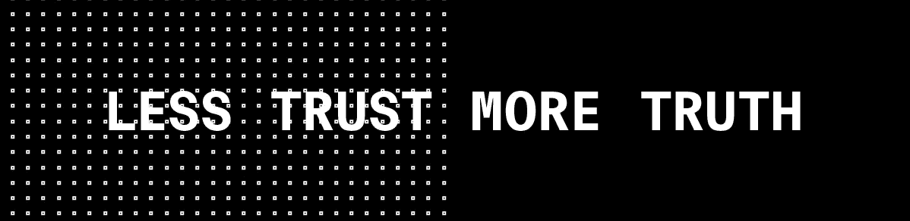

# 我的秘密之旅，更多的真相和更少的信任

> 原文：<https://medium.com/coinmonks/my-crypto-journey-of-more-truth-and-less-trust-6b6c92d3d8f0?source=collection_archive---------12----------------------->

~dwulf

## **我初涉密码**

到目前为止，我已经认真研究了大约 3 年的 crypto。和许多人一样，我希望自己能早点进去，在比特币和以太坊里买个够，这样我就可以过一辈子了。但和许多人一样，我来晚了，我发现自己争先恐后地深入研究，学习历史以衡量未来，学习代码库以更容易接受的方式设计它，并最终一劳永逸地将自己与旧世界金融体系和统治它的政府的暴政脱钩。

在我的旅程中，我从零开始，了解最初的区块链比特币，主要是在安德烈亚斯·m·安东诺普洛斯(Andreas M. Antonopoulos)的指导下，他专门解释和撰写了比特币。我如饥似渴地阅读了他所有的内容，读了他所有的书，看了他所有的视频，所以我能很好地理解这个主题。这对我来说很重要，因为我非常害怕问任何人，因为他们可能会利用我的知识匮乏以某种方式欺骗我，操纵我交出我的助记词、密码或任何可以让我获得小 BTC 的东西，并从我的钱包里拿走它。

我尽可能多地学习，如果我有问题，我会重新阅读或重新观看原始资料，或者在 reddit 或其他论坛上匿名提问。

我最终在 Raspberry Pi 上构建了一个 Lightning 第二层解决方案，使用 MyNode 软件，仔细记录我的进展，包括我的失败和最终的成功。

我觉得那是我旅程的基石，但它不会就此结束。

## **以太坊和维塔利·德米特里耶维奇的王国**

我承认，当我第一次了解以太坊时，我只知道 Vitalik Buterin 这个名字，他是第一个吸引我的书呆子俄罗斯程序员。后来，我很快就了解了加文·伍德博士和查尔斯·霍金森，但直到很久以后，我才真正知道他们为什么会与以太坊闹翻。当我这样做的时候，我更好地理解了密码动力学。

以太坊，从比特币停止的地方捡起来，以太坊事实上是智能合约形式的可编程货币，这是一个可怕的名字，因为它们既不是智能的，也不是合约，归根结底是一个可编程的软件。坚固性是运行 EVM 以太坊虚拟机的环境，有了它，人们就可以构建可编程的区块链。

不像比特币，它的可编程性仅限于 opt 码，而且不是图灵完全的。以太坊是图灵完全的，可以执行完整的图灵执行，这导致了管理循环执行的问题，特别是无限循环，它可能会束缚和缠绕区块链系统。从某种意义上来说，这可以通过合并天然气成本来解决，这将对使用以太币的一部分(称为 gwei)的处理执行征税。这将通过增加代码的执行成本来防止不必要的膨胀执行失控。这个想法是让创建智能合同变得过于昂贵，智能合同做得太多，阻塞了区块链，从而影响每秒传输的 TPS。

当时以太坊是工作的证明，就像今天的比特币一样，但这不会扩展，所以人们努力让以太坊成为利益的证明，并加入了一个允许更好扩展的分片机制。分叉代码库被提出，并通过 ETC，以太坊经典版实现，但这涉及到人们选择停止使用 ETH 区块链，而开始使用 ETC 区块链的要求，对于任何知道当你依赖用户更新他们的软件或使用其他东西时会发生什么的人来说，这总是一个争论点。

因此以太坊 2.0 版被提出，它将无缝地改造以太坊 1.0 版，而用户无需做任何事情。

## **裂痕中的裂痕，加文·伍德博士和查尔斯·霍金森分道扬镳**

没过多久，原来的几个混混就决定脱离以太坊项目了。老实说，我不清楚细节，我搜索并阅读了论坛，但我没有发现比他们留下的更多细节，以引领他们自己的区块链解决方案。

我所发现的很少，主要是关于金钱、项目管理的争论，以及对扩展解决方案的怀疑。

这是故事变得模糊的地方，但我会尽我所能以最好的方式讲述它。

## **查尔斯·霍金森，阿达和卡尔达诺**

据我所知，Charles 脱离 Gavin Wood 博士的主要原因是为了实现更好的扩展解决方案。查尔斯对商业和监管者更友好一些，但不完全信任监管者，这使他进入了不同的圈子，以更好地采用加密货币。

作为一名学者和美国公民，他能够与民族国家(包括非洲和美国)的企业和监管机构建立更好的关系，这使他的 Cardano 网络在美国交易所更容易被接受，并向更多美国公民开放。

虽然这允许更多的采用，并且利益机制和规划的证明是经过深思熟虑的，但它就像大多数有条不紊和官僚性质的东西一样，经过了很长时间，没有被无政府主义开发者很好地采用，这些无政府主义开发者会在加文博士的阵营或维塔利克的原始阵营中更快地实施，所以很难找到开发者来建立智能合同或在卡尔达诺区块链上进行开发。迄今为止，Cardano 正在根据其路线图慢慢建设，并找到愿意学习 Haskel 语言的开发人员来实现，但它完全不像 Gavin Wood 博士的 Kusama 和 Polakdot，它期待混乱快速和愤怒。

## **善良的伍德博士，KSM 期待混乱，还有 DOT。**

Gavin Wood 博士的故事有点不同，在我个人看来，这是更好的工程解决方案。他创建了 Substrate，即构建草间弥生和波尔卡多特的开发环境。它是用 Rust 编写的，这是一种非常容错的语言，几乎消除了大多数传统的编程错误，如内存泄漏、分段错误或悬空指针，并被编译为 WASM (Web Assembly)，它提供了无叉升级和软件托盘，可以根据需要添加或删除。

采取双管齐下的方法，自下而上地重新设计解决扩展问题。创建一个名为 Kusama 的真实测试网络，真实的意思是，真实的价值被放在真实的世界中(不仅仅是一个带有游戏币的测试网络)，Kusama 是煤矿方法中的一只字面上的金丝雀，在那里实施将会生存或死亡，混乱预计会很快出现，如果他们通过了这个石蕊测试，将会升级到更成熟的 Polkadot 区块链，这将是向企业和监管机构展示的旗舰产品。

草间弥生和波尔卡多特对大多数无政府主义开发者有广泛的吸引力，并且因为合理的编程方法选择吸引了顶尖人才。桥梁、中继链和对位链/线是区块链的核心焦点，将为另一个区块链提供桥梁。验证者和提名者的机制提供了赌注奖励，以验证区块链上的区块，激励用户锁定他们的 KSM 和 DOT，以赚取奖励和收入。

在撰写本文时，草间弥生区块链的可用链槽的众筹拍卖正在进行中，这些项目看起来非常有前途，我希望这些项目将提高 KSM 和 DOT 的价格，以及各个项目的流动性硬币令牌。

就我个人而言，我全心全意。我 95%的个人财富都绑在密码上了，只剩下 5%在菲亚特谈判我不能只和密码谈判的事情。我积极开发 Substrate，为高水平的公司执行安全审计和 DevOps，特别是处理 Substrate、Kusama 和 Polkadot 的公司，拥有数百万的加密资本并支持区块链。

我个人觉得这是一场革命，将给世界和个人财富带来自由。在这个新的世界里，信任越来越少，真相越来越多，政府教会和个人财富的状态真正分离。

以及所有的专制政府、监管者和税务当局，愿你们在你们为奴役人类而创造的地狱中燃烧。历史上第一次轮到你向人民屈膝，因为法典就是法律。

> 加入 Coinmonks [电报频道](https://t.me/coincodecap)和 [Youtube 频道](https://www.youtube.com/c/coinmonks/videos)了解加密交易和投资

## 另外，阅读

*   [Bitget 点评](https://blog.coincodecap.com/bitget-review) | [双子星 vs BlockFi](https://blog.coincodecap.com/gemini-vs-blockfi) | [OKEx 期货交易](https://blog.coincodecap.com/okex-futures-trading)
*   [美国最佳加密交易机器人](https://blog.coincodecap.com/crypto-trading-bots-in-the-us) | [经常性回顾](https://blog.coincodecap.com/changelly-review)
*   [在印度利用加密套利赚取被动收入](https://blog.coincodecap.com/crypto-arbitrage-in-india)
*   [霍比评论](https://blog.coincodecap.com/huobi-review) | [OKEx 保证金交易](https://blog.coincodecap.com/okex-margin-trading) | [期货交易](https://blog.coincodecap.com/futures-trading)
*   [麻雀交换评论](https://blog.coincodecap.com/sparrow-exchange-review) | [纳什交换评论](https://blog.coincodecap.com/nash-exchange-review)
*   最好的[加密税务软件](/coinmonks/best-crypto-tax-tool-for-my-money-72d4b430816b) | [硬币追踪评论](/coinmonks/cointracking-review-a-reliable-cryptocurrency-tax-software-5114e3eb5737)
*   [Stackedinvest 评论](https://blog.coincodecap.com/stackedinvest-review) | [北海巨妖评论](/coinmonks/kraken-review-6165fc1056ac) | [bitFlyer 评论](https://blog.coincodecap.com/bitflyer-review)
*   最佳[加密借贷平台](/coinmonks/top-5-crypto-lending-platforms-in-2020-that-you-need-to-know-a1b675cec3fa) | [杠杆令牌](/coinmonks/leveraged-token-3f5257808b22)
*   最佳[加密制图工具](/coinmonks/what-are-the-best-charting-platforms-for-cryptocurrency-trading-85aade584d80) | [最佳加密交易所](/coinmonks/crypto-exchange-dd2f9d6f3769)
*   [比特币基地僵尸工具](/coinmonks/coinbase-bots-ac6359e897f3) | [AscendEX 审查](/coinmonks/ascendex-review-53e829cf75fa) | [OKEx 交易僵尸工具](/coinmonks/okex-trading-bots-234920f61e60)
*   [如何在印度购买比特币？](/coinmonks/buy-bitcoin-in-india-feb50ddfef94) | [瓦济克斯评论](/coinmonks/wazirx-review-5c811b074f5b)
*   [隐翅虫替代品](/coinmonks/cryptohopper-alternatives-d67287b16d27) | [HitBTC 审查](/coinmonks/hitbtc-review-c5143c5d53c2)
*   [折叠 App 审核](https://blog.coincodecap.com/fold-app-review) | [Kucoin 交易机器人](/coinmonks/kucoin-trading-bot-automate-your-trades-8cf0ca2138e0) | [Probit 审核](https://blog.coincodecap.com/probit-review)
*   [如何匿名购买比特币](https://blog.coincodecap.com/buy-bitcoin-anonymously) | [比特币现金钱包](https://blog.coincodecap.com/bitcoin-cash-wallets)
*   [币安 vs FTX](https://blog.coincodecap.com/binance-vs-ftx) | [最佳(SOL)索拉纳钱包](https://blog.coincodecap.com/solana-wallets)
*   [如何在 Uniswap 上交换加密？](https://blog.coincodecap.com/swap-crypto-on-uniswap) | [A-Ads 评论](https://blog.coincodecap.com/a-ads-review)
*   [WazirX vs coin dcx vs bit bns](/coinmonks/wazirx-vs-coindcx-vs-bitbns-149f4f19a2f1)|[block fi vs coin loan vs Nexo](/coinmonks/blockfi-vs-coinloan-vs-nexo-cb624635230d)