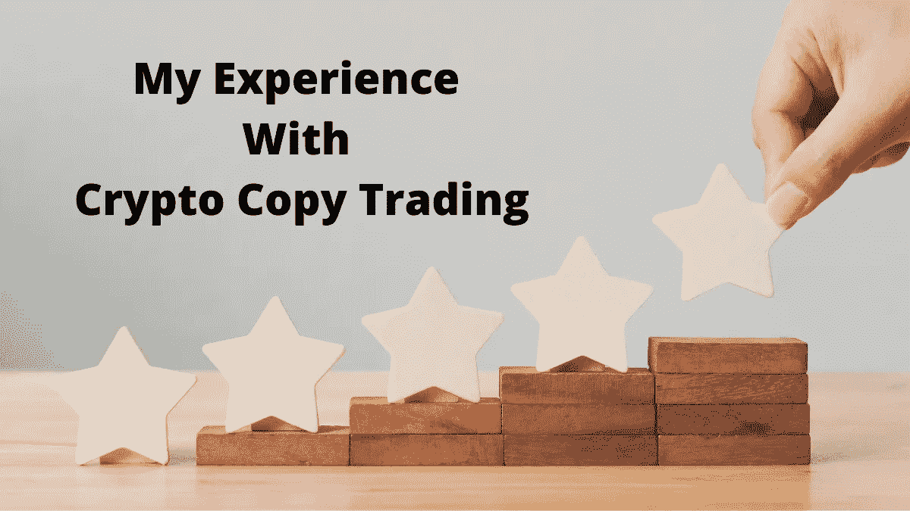
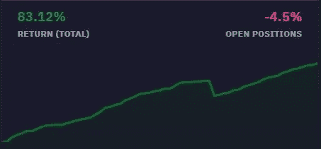
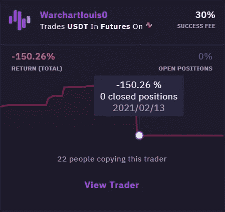
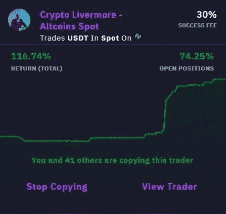

# 我的加密副本交易经验

> 原文：<https://medium.com/coinmonks/my-experience-with-crypto-copy-trading-d6feb2ce3ac5?source=collection_archive---------0----------------------->

## 以及我是如何从痛苦的教训中吸取教训，让你不必如此

2020 年是疯狂的一年，原因有好有坏，但肯定对 crypto 有利。它就像一个充电了两年左右的线圈，最终爆炸了，带走了所有与它有关的加密信息。

我们看到 BTC 每隔一天就创造一个新的 ATH，仿佛这是 2017 年的又一次，但在类固醇的作用下，华尔街一些最传统、最受尊敬的对冲基金，以及一些大的公众人物(有人是埃隆·马斯克吗？)，突然成为最大的加密支持者，DeFi 去月球，NFTs 卖到了[荒谬的钱](https://www.theverge.com/2021/3/11/22325054/beeple-christies-nft-sale-cost-everydays-69-million)。

在所有这一切中，其他一些东西也逐渐找到了自己的路，可能是我个人发现最有趣的事情之一，那就是不同的[密码副本交易平台](/coinmonks/top-10-crypto-copy-trading-platforms-for-beginners-d0c37c7d698c)的激增。最终能够产生一些真正的被动收入，而不用承担我不太明白的巨大风险(即 [DeFi Yield farming](https://blog.coincodecap.com/defi-yield-farming-and-liquidity-mining) )，或者做一些只工作很短时间的事情(即采矿)的想法对我有很大的吸引力，所以我决定尝试一下。

## TL；速度三角形定位法(dead reckoning)

> 我闹着玩复制交易，尝试不同的专业交易者，但最终用他的 [**BTC 期货**](https://blog.coincodecap.com/go/btc-futures-cryptolivermore) 和 [**替代硬币现货**](https://blog.coincodecap.com/go/altcoins-spot-cryptolivermore) 策略解决了 CryptoLivermore。

# 选择正确的平台

当然，并非所有这些平台都很有趣(还有一些直接的骗局)，但是经过长时间的研究，我不会进行太深入的研究，因为它们超出了本文的范围，我终于找到了我的前三名入围者，即: [Cryptohopper](http://blog.coincodecap.com/go/cryptohopper) 、 [3Commas](http://blog.coincodecap.com/go/3commas) 和 Zignaly。

> *……“我终于找到了我的前三名入围者，分别是:*[3 commas](http://blog.coincodecap.com/go/3commas)和 Zignaly。*”。*

3Commas 几乎立即被排除在外，因为它只提供基于月订阅费的(非常昂贵的)帐户，这需要很高的初始投资，并且需要预先支付固定成本，即使遵循的策略最终没有为我赚到任何钱。

第二个选择是共同投资，这已经好得多了，因为它在复印机(我自己)和交易者之间提供了成比例的成功费，这更接近于我实际寻找的东西，但我不喜欢整个平台基于他们自己的交易所的事实，这也是托管的。

所以最终我决定选择 Zignaly，事实上，由于他们新推出的利润分享模式(于 2020 年 11 月推出)，他们提供了类似于 Cryptohopper 的东西，但更好的是，因为没有最低投资金额，这使我可以在实际投资前先试探一下。对我来说同样重要的是，它们是非托管的，因为整个平台是基于**的，这是 Zignaly 上交易的所有资产的实际托管，这给了我更多尝试的信心。**

**现在平台已经选好了，我只需要决定模仿哪个交易者。简单的任务，对吧？嗯，那不是…**

# **选择正确的交易者**

## ***开局不利***

**随着时间的推移，我终于在 Zignaly 上有了自己的 USDT 账户，我准备开始模仿一些交易者，开始赚钱。所以我进入了利润分享市场，但不知道下一步该做什么。当时，大约有 50 个不同的交易者在平台上提供利润分享，我被这个提议淹没了(或者说，我真的被这个想法淹没了，我必须做功课才能知道应该跟随谁)。**

**我当时不知道的一件事是，虽然这个新概念(利润分享)为被动收入提供了难以置信的机会，如果你设法跟随正确的交易者，在开始时，你仍然必须弄清楚**谁**是正确的交易者，因为这可能比你想象的要困难得多，因为让你在市场上亏损的所有相同的伎俩也在这里发挥作用， 我指的是我们用来玩自己的所有那些好的老方法，FOMO，自欺欺人，缺乏耐心，你头脑中的那个小声音在说“看这有多疯狂！ 肯定马上就要登上月球了，跳上去，你就要发财了！!"。**

> ***……“你脑袋里有个小小的声音在说:看这有多猛！肯定马上就要登上月球了，跳上去，你就要发财了！!"***

**正是根据这个小小的声音，我决定跟踪我的第一个交易者，当时最热门的交易者， **Warchartlouis0** 。**

**Warchartlouis 是账户增长最快的交易者之一，吸引了最多的炒作，所以我也决定搭上这趟火车。答:1 月初，我记得他的供应商在交易几周后的利润约为+50%，我特别喜欢 45 度股权曲线，对我来说这看起来很安全(这肯定不是一个好迹象，但这是我后来才知道的……)。**

****

**A good example of the infamous 45° equity curve — common with mean reversion strategies**

**在模仿这个交易者仅仅一个星期后，我的账户已经上涨了+50%(而他的提供商现在上涨了 100%)，我感觉很好，非常自信 Warchartlouis0 会让我立刻变得富有。当奇怪的事情发生时，我已经在考虑在哪里买我的私人岛屿了。**

**这个交易者使用的交易策略(我后来才知道)被称为 [*均值回归*](/auquan/mean-reversion-simple-trading-strategies-part-1-a18a87c1196a) *，*这可以通过上面提到的漂亮的上升 45°股票曲线来识别，基本上是平均降低亏损头寸，通常是杠杆和无止损，以降低平均进场价格，并等待头寸恢复平衡，或最终盈利，然后平仓。现在，这种策略的问题(我后来明白这基本上是灾难的原因)是，虽然这种策略产生了稳定的回报和账户中明显的低波动性，但这种策略一直有效，直到它失败，当它失败时，所发生的事情正是 Warchartlouis0 所发生的事情。**

**这个人抓住这个不断下跌的亏损头寸不放，同时不断加仓，希望它最终会好转。这不仅意味着他在这个亏损的头寸中杠杆过高，而且也意味着他没有资本来建立其他潜在盈利的头寸，他已经弹尽粮绝了。**

****

**What I woke up to on that day of February**

**这种情况持续了几个星期，直到 2 月的那个早晨，一切都结束了，Warchartlouis0 的追加保证金通知到达了。市场搞垮了他的供应商，也搞垮了我的账户。**

## ***吸取教训***

**Warchartlouis0 爆炸不是一件容易接受的事情，这对于损失本身来说并不算什么(至少在开始时，我已经发现从少量开始测试是一个好主意，所以幸运的是我的损失并不是一场彻底的灾难)，但更多的是因为它给我带来的感受。
我做了一个错误的选择，这就是结果；如果下次我想获得不同的结果，我必须认真对待我的资金分配，把时间和精力投入到一些适当的研究中。**

**所以我从零开始我的交易者的研究，检查每一个交易者在 [Zignaly Discord 服务器](https://discord.gg/r5qRXDJ)上的频道，或者交易者的私人频道，如果它们可用的话，寻找更多关于他们风格的信息，可能还有他们为什么做他们正在做的事情的细节(在概念层面上)，以及他们为什么会得到他们正在得到的结果。**

**正是如此，在这项研究的进展中，我发现自己在 Zignaly Discord 的 CryptoLivermore 频道上。这个家伙没有任何网站，但他写了一些非常详细的媒体指南，专门介绍他在 Zignaly 上提供的交易系统，在交易者中被提及，随后在他的每月被动收入文章中被提及，最后但并非最不重要的是，他有一个受欢迎的 Twitter 帐户，后面是一系列加密传说，从山姆·班克曼-弗里德到 FTX，从首席执行官到首席执行官**

> ***“…这家伙自 2016 年以来从未在加密领域亏损过，仅在 2018 年熊市期间，他就赚了+80%，所以也许他对交易略知一二…”***

**一旦我开始深入研究[的中期指南](https://crypto-livermore.medium.com/is-crypto-copy-trading-a-scam-b54c32c471ba)，我发现这个家伙自 2016 年以来从未在 crypto 中亏损过一年，而且他在熊市期间仅 2018 年就赚了+80%，所以也许他对交易略知一二，但最重要的是，他把重点放在管理风险上，通过削减输家，让赢家跑，并在交易中保持长期视野，这两件事在我之前的经历后与我产生了很好的共鸣。事实上，在阅读一本 CryptoLivermore 指南时，我突然有了一个*啊哈时刻*，并意识到 Warchartlouis0 在哪里有 f*#% &了。他没有管理好自己的风险；他没有做空亏损的股票，让盈利的股票跑了，而是反其道而行之，增加亏损的股票，一旦盈利就卖出盈利的股票。**

> **“…我突然灵光一现，意识到 Warchartlouis0 在哪里出了 f*#% & up。他没有管理好自己的风险；他没有打断输家，让赢家跑了…”**

**除此之外，我还记得来自 Zignaly 市场的**；事实上，当我在 Warchartlouis0 中处于亏损状态时，CryptoLivermore 的一个账户和我的 FOMO 都在飙升(在 BTC 的一次非常强劲的波动之后)，所以在我确保这次考虑了所有的选项并做了适当的功课后，我决定在他的两个供应商之间分配我的资金(BTC 期货 和替代硬币现货 ，正如交易者自己建议的那样，作为两种策略****

********

****其中一个 CryptoLivermore 账户具有典型的“阶梯形”权益曲线，这是良好风险管理的标志。****

****那是在战争爆发后不久发生的。快进到一个月多一点，我的 [**替代币现货账户**](https://blog.coincodecap.com/go/altcoins-spot-cryptolivermore) 现在上涨了超过 150%，而 [**BTC 期货账户**](https://blog.coincodecap.com/go/btc-futures-cryptolivermore) 在过去几个月里基本持平，因为 BTC(在撰写本文时)在达到 60，000 美元后没有出现特别强劲的波动。然而，到目前为止，BTC 账户管理也给了我更多的信心，因为一些头寸以一种很好的方式开立和管理(尽管他们没有变成赢家，当然不是所有的交易都是)，这让我感到足够舒服，最终决定分配我的全部头寸，考虑中长期范围，并对利润进行再投资，以便让复利效应也为我工作。****

# ****正在总结…****

****找到一个合适的被动收入来源从来都不是一件容易的事情，任何曾经尝试过的人都非常清楚，但我相信**【复制交易，特别是像 Zignaly 上目前提供的利润分享模式，将被证明是真正的革命性的，并在适当的时候肯定会占据加密市场的很大一部分。******

******然而，如上所述，在这种情况下，为您找到正确的解决方案可能不是一件容易的事情，需要您进行一些尽职调查，这是我们在 crypto 中经常发现的事情，随着时间的推移，我开始意识到这一点，因为我们在这一领域享有的巨大自由也意味着我们需要对自己负责。******

******当然，这里报道的只是我的经历，我并不是说对我有利的事情一定对你也有利，但我希望我的故事，尤其是我的错误，能帮助你为自己做出最好的选择。******

********全披露:**我在文章里加了附属链接，多被动收入，啊！哈！******

**** [## 加密交易机器人|最佳 16 款比特币交易机器人

### 2021 年币安、比特币基地、库币和其他密码交易所的最佳密码交易机器人。四进制，位间隙…

medium.com](/coinmonks/crypto-trading-bot-c2ffce8acb2a)  [## 最佳 6 个加密交易信号电报通道

### 这是乏味的找到正确的加密交易信号提供商。因此，在本文中，我们将讨论最好的…

medium.com](/coinmonks/best-crypto-signals-telegram-5785cdbc4b2b)****