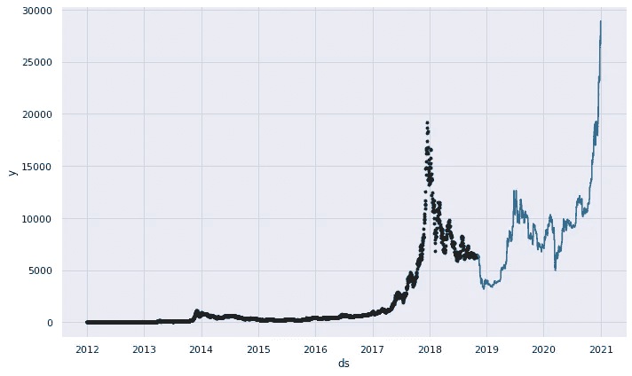
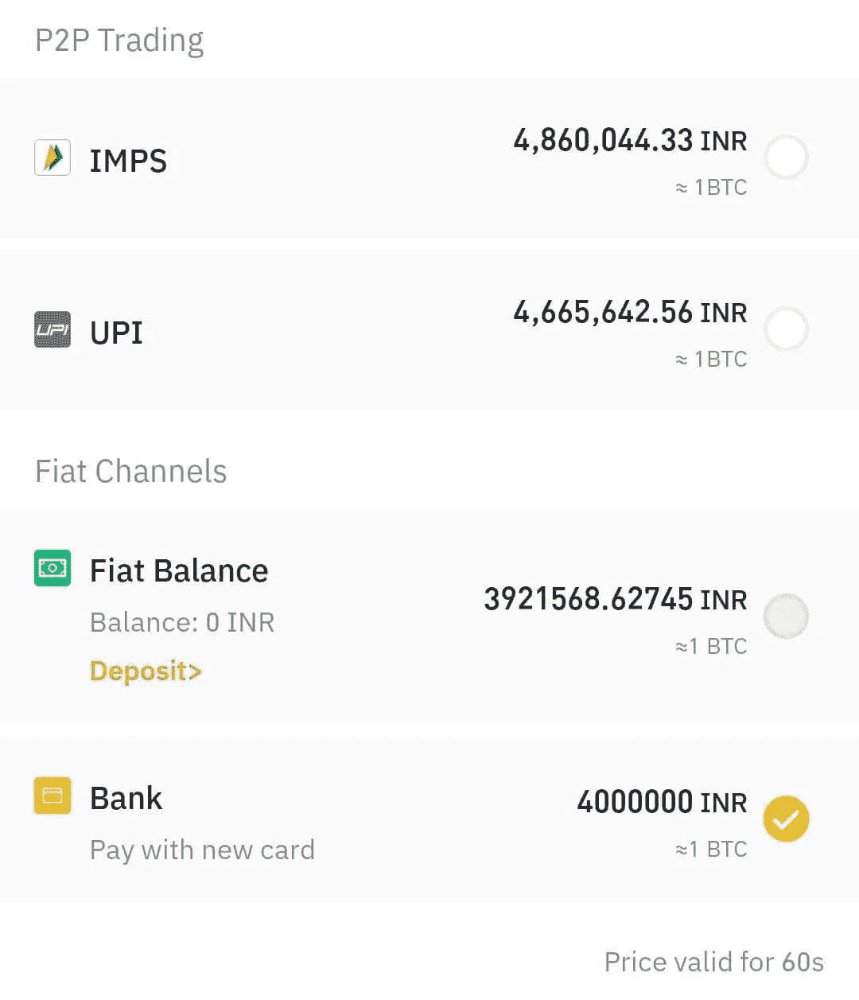
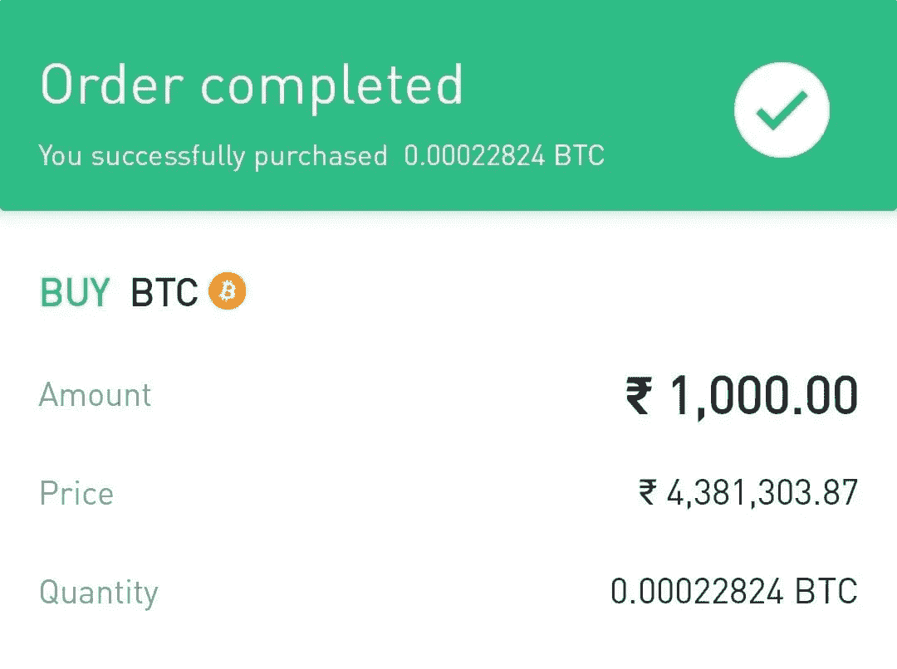
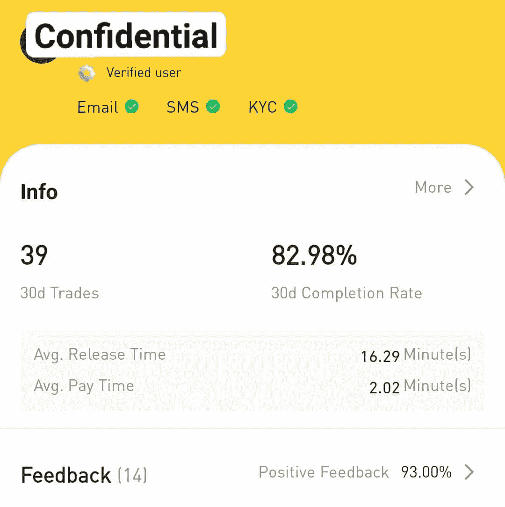
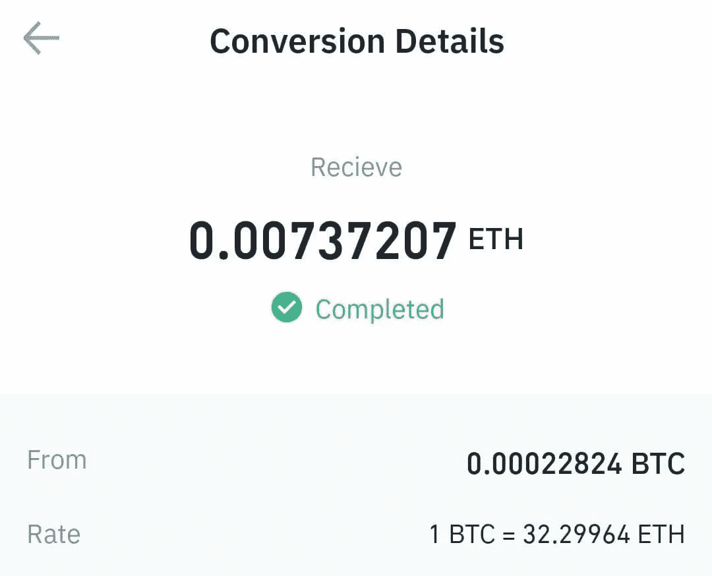
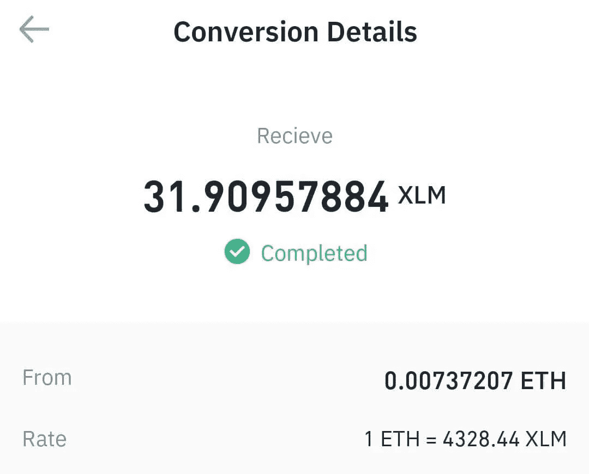
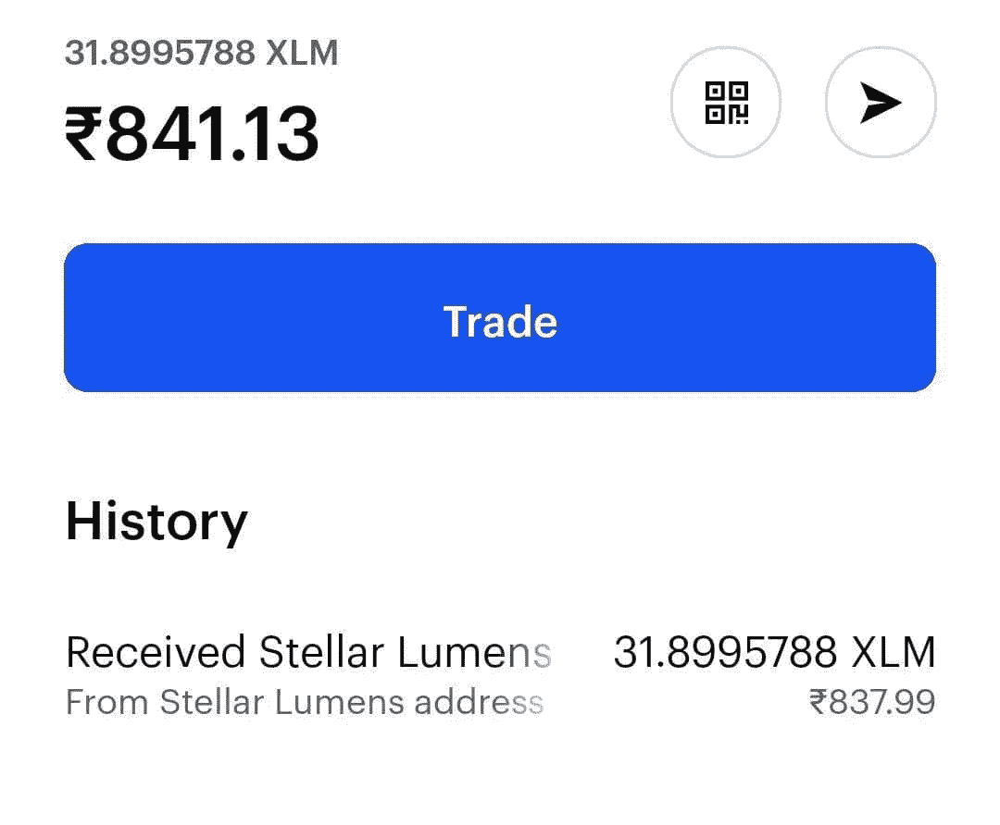

# 我对加密货币的体验

> 原文：<https://medium.com/coinmonks/my-experience-with-cryptocurrency-4a5b3ff29c96?source=collection_archive---------1----------------------->

Time Series Forecasting of Bitcoin Prices. Chart from my independent project.

几天前，我决定购买一些加密货币。在你告诉我我已经来不及赶上[比特币浪潮](https://www.coindesk.com/price/bitcoin)之前，我想强调一个事实，我对加密货币的功能方面以及人们应该如何进行交易更感兴趣。

通过四处学习，我能够拥有加密货币，但这是有代价的。在一头扎进去之前，你需要记住一些调整。在这里，我将展示我是如何购买加密货币的，以及在购买过程中需要注意的地方。

我选择币安是因为它是被广泛使用的 T2，并且支持许多加密货币。要在币安上开户，您只需创建一个帐户，并使用 PAN 和驾驶执照进行验证。购买加密货币有两种选择。一种是通过 P2P 交易，另一种是第三方支付。

我选择了 P2P 交易，因为它很方便，而且我没有任何像 Wazirx 这样的第三方支付账户，我也不想创建一个。我想用合众国际社购买，所以我选择了这个选项。

这里有一点需要注意，用 fiat INR，你只能在币安上购买比特币。其他加密货币需要更复杂的货币，如美元、欧元。但是可以购买比特币，转换成其他加密货币。稍后会详细介绍。

Bitcoin Transaction Prices. These values were determined by Binance.

这里需要注意的一点是，用 IMPS 或 UPI 购买时，比特币的估值高于市场价。其他加密货币也是如此。实际上是为了方便交易。因为我不想透露我的银行信息，所以我选择了 UPI 选项。

我给₹1000.买了 0.00022824 个比特币这些加密货币的价值是~₹850，因为我是以溢价购买的。币安对每笔交易收取 0.75%的费用，但也有小额交易不收取费用。

首先，我必须在交易所下购买订单，它为我匹配了一个想出售比特币的卖家。出售确认将在 60 秒内完成。之后，交易将在接下来的 15 分钟内完成。卖方事先声明其各自持有的加密货币，币安从卖方账户中锁定将要交易的加密货币的数量。付款是通过合众国际社的应用程序外部完成。我用 Google Pay 支付，并将收据发送给应用程序中的卖家。之后，在界面上有一个上诉按钮，点击它，币安释放比特币到我的钱包。这里我不能分享截图，因为信息是保密的，但过程是直截了当的。

After purchase. The Price is quoted by the seller.

你可以选择从哪个卖家那里购买加密货币。每个卖家都有这样的简介。简档上的因素可用于评估卖方的可靠性。

My seller

这里主要的事情开始了。现在我在币安的钱包里有大约 0.0002 个比特币。但如果让我交易的话，交易的比特币最低金额应该在 0.002 以上。此外，如果我不得不提取到外部钱包，我需要支付的交易费大于比特币的交易量，实际上接收 0 个比特币。

我不想把我的比特币存在我的币安账户里。所以我研究了一下，发现了一个[想法](https://qr.ae/pG7w7P)。首先我把我的 0.00022824 比特币转换成以太坊。但提现事件与比特币类似；费用高于交易量。尽管如此，我还是把我的比特币兑换成以太坊只是为了实验。坦率地说，这是一个不必要的举动。在那之后，我把我的比特币兑换成了 XLM 恒星流明。XLM 在费用方面比 T2 更方便。

这里要注意的另一点是在以太坊的情况下，[三种类型](https://community.trustwallet.com/t/bep2-bep20-or-erc20/85141)的网络(BEP2，BEP20 (BSC)，ERC20)是可以撤销的。就比特币而言，有四种类型(BEP2、BEP20 (BSC)、BTC、ERC20)。BEP2 和 BEP20 用于[币安智能链钱包](https://academy.binance.com/en/articles/how-to-get-started-with-binance-smart-chain-bsc)。向任何钱包取款时，请确保该钱包支持您取款的网络类型。

为简化起见，提取比特币时选择 BTC，提取以太坊时选择 ERC20。大多数其他加密货币都有一个专用的独特网络。

From Bitcoin to Ethereum

From Ethereum to Stellar Lumens

在这之后，过程就相当简单了。我首选的加密货币[热储钱包](https://coinmarketcap.com/alexandria/article/hot-wallets-vs-cold-wallets-whats-the-difference)是[比特币基地](https://www.coinbase.com/)。在印度用比特币基地购买加密货币还不可能，但交易是可能的。它的界面和 UX 是我最喜欢的。总之，我在比特币基地上创建了自己的账户。我点击了币安应用程序中的撤销按钮，添加了我的比特币基地钱包地址，用于 Stellar Lumens 和 XLM 备忘录。

XLM 交易需要钱包地址和交易备忘录。确保正确添加这些内容，否则交易可能会被遗忘。我基本上是把 0.00022824 BTC 转换成 0.00737207 瑞士法郎，再转换成 31.90957884 XLM 法郎。

几分钟后，恒星流明是在我的帐户成功。如果我想，我可以转换 XLM 到 BTC 在任何时候 0.50%的费用。在这个过程中，我损失了一些₹s，但这让我意识到，在尝试投资之前，尽职调查是多么重要。我很快就会把我的加密货币放入冷库，但现在，我很高兴我学会了如何操作加密货币。

*如果您有任何问题，如果您希望我解释这一过程中的任何步骤，请随时发表评论，或者您可以通过我的* [*Twitter*](https://twitter.com/ashtamkarj) *联系我。我将感谢您的反馈。玩得开心！*

> *所有的投资策略和投资都涉及损失的风险。本文中的任何内容都不应被理解为投资建议。这篇文章是专为教育而写的。对一项投资的过去或潜在表现的任何参考都不是，也不应被解释为对任何特定结果或利润的建议或保证。*

> 加入 coin monks[Telegram group](https://t.me/joinchat/Trz8jaxd6xEsBI4p)学习加密交易和投资

## 另外，阅读

*   [什么是融资融券交易](https://blog.coincodecap.com/margin-trading)
*   最好的[密码交易机器人](/coinmonks/crypto-trading-bot-c2ffce8acb2a) | [网格交易](https://blog.coincodecap.com/grid-trading)
*   [3 商业评论](/coinmonks/3commas-review-an-excellent-crypto-trading-bot-2020-1313a58bec92) | [Pionex 评论](/coinmonks/pionex-review-exchange-with-crypto-trading-bot-1e459d0191ea) | [Coinrule 评论](/coinmonks/coinrule-review-2021-a-beginner-friendly-crypto-trading-bot-daf0504848ba)
*   [AAX 交易所评论](/coinmonks/aax-exchange-review-2021-67c5ea09330c) | [德里比特评论](/coinmonks/deribit-review-options-fees-apis-and-testnet-2ca16c4bbdb2) | [FTX 交易所评论](/coinmonks/ftx-crypto-exchange-review-53664ac1198f)
*   [n rave 零点回顾](/coinmonks/ngrave-zero-review-c465cf8307fc) | [Phemex 回顾](/coinmonks/phemex-review-4cfba0b49e28) | [PrimeXBT 回顾](/coinmonks/primexbt-review-88e0815be858)
*   [Bybit Exchange 审查](/coinmonks/bybit-exchange-review-dbd570019b71) | [Bityard 审查](/coinmonks/bityard-review-7d104239be35) | [CoinSpot 审查](https://blog.coincodecap.com/coinspot-review)
*   [3 commas vs crypto hopper](/coinmonks/3commas-vs-pionex-vs-cryptohopper-best-crypto-bot-6a98d2baa203)|[赚取加密利息](/coinmonks/earn-crypto-interest-b10b810fdda3)
*   最好的比特币[硬件钱包](/coinmonks/the-best-cryptocurrency-hardware-wallets-of-2020-e28b1c124069?source=friends_link&sk=324dd9ff8556ab578d71e7ad7658ad7c) | [BitBox02 回顾](/coinmonks/bitbox02-review-your-swiss-bitcoin-hardware-wallet-c36c88fff29)
*   [莱杰 vs n 格拉夫](/coinmonks/ledger-vs-ngrave-zero-7e40f0c1d694) | [莱杰纳米 s vs x](/coinmonks/ledger-nano-s-vs-x-battery-hardware-price-storage-59a6663fe3b0)
*   [加密复制交易平台](/coinmonks/top-10-crypto-copy-trading-platforms-for-beginners-d0c37c7d698c) | [Coinmama 评论](/coinmonks/coinmama-review-ace5641bde6e)
*   [CoinLoan 审查](/coinmonks/coinloan-review-18128b9badc4) | [YouHodler 审查](/coinmonks/youhodler-4-easy-ways-to-make-money-98969b9689f2) | [BlockFi 审查](/coinmonks/blockfi-review-53096053c097)
*   最好的[加密税务软件](/coinmonks/best-crypto-tax-tool-for-my-money-72d4b430816b) | [硬币追踪评论](/coinmonks/cointracking-review-a-reliable-cryptocurrency-tax-software-5114e3eb5737)
*   最佳[密码借贷平台](/coinmonks/top-5-crypto-lending-platforms-in-2020-that-you-need-to-know-a1b675cec3fa) | [杠杆令牌](/coinmonks/leveraged-token-3f5257808b22)
*   [BlockFi vs 摄氏](/coinmonks/blockfi-vs-celsius-vs-hodlnaut-8a1cc8c26630) | [霍德瑙特评论](/coinmonks/hodlnaut-review-best-way-to-hodl-is-to-earn-interest-on-your-bitcoin-6658a8c19edf)
*   [Bitsgap 评审](/coinmonks/bitsgap-review-a-crypto-trading-bot-that-makes-easy-money-a5d88a336df2) | [Quadency 评审](/coinmonks/quadency-review-a-crypto-trading-automation-platform-3068eaa374e1) | [Bitbns 评审](/coinmonks/bitbns-review-38256a07e161)
*   [埃利帕尔泰坦评论](/coinmonks/ellipal-titan-review-85e9071dd029) | [赛克斯斯通评论](/coinmonks/secux-stone-hardware-wallet-review-15-discount-coupon-2020-7577032faa6e)
*   [本地比特币评论](/coinmonks/localbitcoins-review-6cc001c6ed56) | [加密货币储蓄账户](https://blog.coincodecap.com/cryptocurrency-savings-accounts)
*   最佳[区块链分析](https://bitquery.io/blog/best-blockchain-analysis-tools-and-software)工具| [赚比特币](/coinmonks/earn-bitcoin-6e8bd3c592d9)
*   [加密套利](/coinmonks/crypto-arbitrage-guide-how-to-make-money-as-a-beginner-62bfe5c868f6)指南| [如何做空比特币](/coinmonks/how-to-short-bitcoin-568a2d0b4ae5)
*   最佳[加密制图工具](/coinmonks/what-are-the-best-charting-platforms-for-cryptocurrency-trading-85aade584d80) | [最佳加密交易所](/coinmonks/crypto-exchange-dd2f9d6f3769)
*   [如何在印度购买比特币？](/coinmonks/buy-bitcoin-in-india-feb50ddfef94) | [瓦济克斯审查](/coinmonks/wazirx-review-5c811b074f5b)
*   [印度比特币交易所](/coinmonks/bitcoin-exchange-in-india-7f1fe79715c9) | [比特币储蓄账户](/coinmonks/bitcoin-savings-account-e65b13f92451)
*   [CoinDCX 评论](/coinmonks/coindcx-review-8444db3621a2) | [加密保证金交易交易所](https://blog.coincodecap.com/crypto-margin-trading-exchanges)