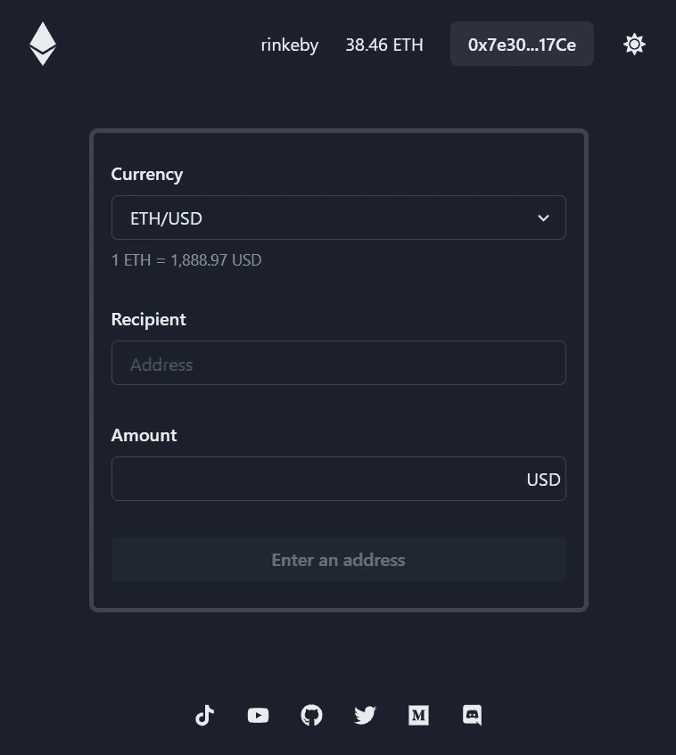
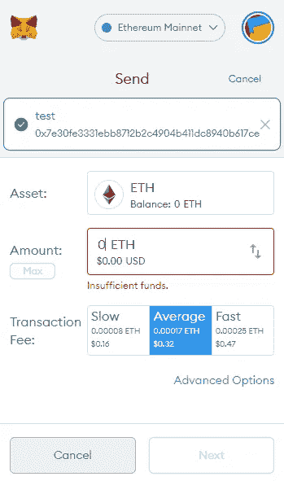
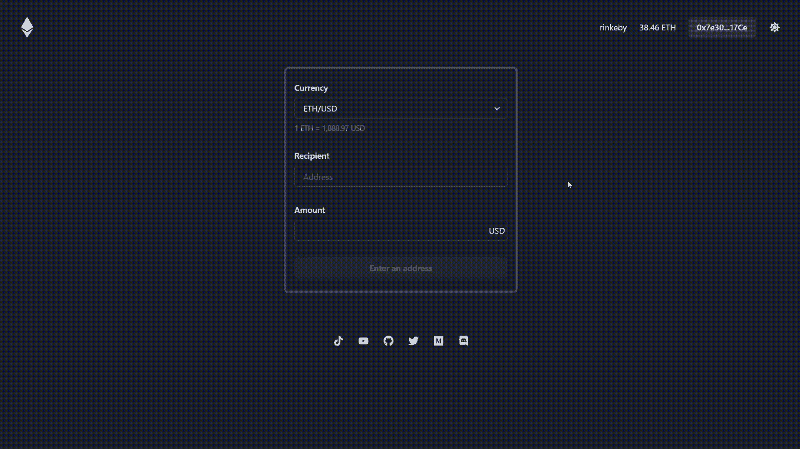

# 我第一次使用 Chanlink Price Feed

> 原文：<https://medium.com/coinmonks/my-first-dapp-using-chanlink-price-feed-6a29e9856a2e?source=collection_archive---------0----------------------->

## 我已经学习 solidity 三个月了，最后，我建立了我的第一个 Dapp。

Home

# 动机

几周前，2021 年春季 Chainlink 虚拟黑客马拉松的获胜者[让我深受鼓舞。](https://blog.chain.link/chainlink-hackathon-winners-spring-2021/)他们都围绕 Chiainlink oracle 系统构建了非常有创意的 Dapps。他们真实地展示了智能合约和 Oracle chain link 的潜力。

那时我开始对 Chainlink 价格反馈感兴趣，并想使用它。

## 什么是链接价格饲料

它允许您在智能合约中访问多种最新和历史价格数据，因此当您想要了解任何资产的当前市场价格时，它非常有用。

> Chainlink 价格馈送是将您的智能合约与资产的真实市场价格联系起来的最快方式。它们使智能合约能够在一次调用中检索资产的最新价格。

 [## 价格源介绍| Chainlink 文档

### Chainlink 价格馈送是将您的智能合约与资产的真实市场价格联系起来的最快方式…

doc . chain . link](https://docs.chain.link/docs/using-chainlink-reference-contracts/) 

# Dapp 想法

有时，人们希望用相同价值的乙醚作为一定数量的法定货币来支付类似的费用。

比方说，您想发送价值 500 美元的乙醚，然后您意识到您无法在 Metamask 中设置相当于特定美元金额的乙醚数量。

它显示了你的以太值多少美元，但就像你不能设置 500 美元的以太值。

这就是我的 Dapp 的用武之地。你可以发送基于法定货币的乙醚量。

# 它是如何工作的

demo

很简单。

1.  选择法定货币、收款人和法定货币的金额。
2.  点击“发送乙醚”和“确认”。

它会在您使用 Chainlink Price Feeds 输入数量后立即计算乙醚的数量。

好的一面是，获得最新价格不需要花费任何成本，因为合同是一个视图功能。

# 智能合同

下面是我为这个 Dapp 使用的智能合约代码。这在 Kovan testnet 上有效。如果你想让它在 mainnnet 或 rinkeby 上工作，那么你所要做的就是改变`AggregatorV3Interface`上的地址(第 22~26 行)。这里是以太网上每个地址的[链接](https://docs.chain.link/docs/ethereum-addresses/)。

# 问题

问题是它违反了干燥原则。最后 5 个函数用不同的变量做同样的事情。

理想情况下，我可以将最后 5 个函数组合在一起，并添加一个指定货币对的新参数。

## 可能的解决方案

如果使用 feed registry，可以获得任意一对价格数据，而不必记住每个地址。但是，它仍然处于 alpha 版本，所以您不能在生产中使用。事实上，目前有些对并不真的工作。

 [## 订阅源注册表|链接文档

### 链接提要注册表是资产到提要的链上映射。它允许用户和 DeFi 协议查询…

doc . chain . link](https://docs.chain.link/docs/feed-registry/) 

下面是使用 feed registry 的示例代码。

希望这有所帮助。感谢您的阅读😁

[推特](https://twitter.com/FF1KAaniyz7Tc3N) / [GitHub](https://github.com/yuichiroaoki)

## 参考

*   【https://docs.chain.link/docs/ethereum-addresses/ 
*   [https://docs.chain.link/docs/feed-registry/](https://docs.chain.link/docs/feed-registry/)
*   [https://docs . chain . link/docs/using-chain link-reference-contracts/](https://docs.chain.link/docs/using-chainlink-reference-contracts/)

## 另外，阅读

 [## 最佳免费加密交易机器人——前 16 名比特币交易机器人[2021]

### 2021 年币安、比特币基地、库币和其他密码交易所的最佳密码交易机器人。四进制，位间隙…

medium.com](/coinmonks/crypto-trading-bot-c2ffce8acb2a)  [## 最佳 6 个加密交易信号电报通道

### 这是乏味的找到正确的加密交易信号提供商。因此，在本文中，我们将讨论最好的…

medium.com](/coinmonks/best-crypto-signals-telegram-5785cdbc4b2b)  [## BlockFi 评论 2021 —通过您的加密获得 8.6%的利率

### 让你的密码发挥作用，获得比特币和其他加密货币的最佳利率

medium.com](/coinmonks/blockfi-review-53096053c097) 

> 加入 [Coinmonks 电报频道](https://t.me/coincodecap)，了解加密交易和投资

## 另外，阅读

*   [什么是融资融券交易](https://blog.coincodecap.com/margin-trading) | [成本平均法](https://blog.coincodecap.com/dca)
*   [BigONE 交易所评论](/coinmonks/bigone-exchange-review-64705d85a1d4) | [电网交易机器人](https://blog.coincodecap.com/grid-trading)
*   [3 商业评论](/coinmonks/3commas-review-an-excellent-crypto-trading-bot-2020-1313a58bec92) | [Pionex 评论](/coinmonks/pionex-review-exchange-with-crypto-trading-bot-1e459d0191ea) | [Coinrule 评论](/coinmonks/coinrule-review-2021-a-beginner-friendly-crypto-trading-bot-daf0504848ba)
*   [莱杰 vs n rave](/coinmonks/ledger-vs-ngrave-zero-7e40f0c1d694)|[莱杰 nano s vs x](/coinmonks/ledger-nano-s-vs-x-battery-hardware-price-storage-59a6663fe3b0) | [币安评论](/coinmonks/binance-review-ee10d3bf3b6e)
*   [Bybit 交易所评论](/coinmonks/bybit-exchange-review-dbd570019b71) | [Bityard 评论](/coinmonks/bityard-review-7d104239be35) | [CoinSpot 评论](https://blog.coincodecap.com/coinspot-review)
*   [3 commas vs crypto hopper](/coinmonks/3commas-vs-pionex-vs-cryptohopper-best-crypto-bot-6a98d2baa203)|[赚取加密利息](/coinmonks/earn-crypto-interest-b10b810fdda3)
*   最好的比特币[硬件钱包](/coinmonks/the-best-cryptocurrency-hardware-wallets-of-2020-e28b1c124069?source=friends_link&sk=324dd9ff8556ab578d71e7ad7658ad7c) | [BitBox02 回顾](/coinmonks/bitbox02-review-your-swiss-bitcoin-hardware-wallet-c36c88fff29)
*   [n rave ZERO Review](/coinmonks/ngrave-zero-review-c465cf8307fc)|[phe MEX Review](/coinmonks/phemex-review-4cfba0b49e28)|[PrimeXBT Review](/coinmonks/primexbt-review-88e0815be858)
*   最佳[区块链分析](https://bitquery.io/blog/best-blockchain-analysis-tools-and-software)工具| [赚比特币](/coinmonks/earn-bitcoin-6e8bd3c592d9) | [Swapzone 评论](/coinmonks/swapzone-review-crypto-exchange-data-aggregator-e0ad78e55ed7)
*   [加密套利](/coinmonks/crypto-arbitrage-guide-how-to-make-money-as-a-beginner-62bfe5c868f6)指南| [如何做空比特币](/coinmonks/how-to-short-bitcoin-568a2d0b4ae5) | [Prokey 回顾](/coinmonks/prokey-review-26611173c13c)
*   [币安交易机器人](/coinmonks/binance-trading-bots-d0d57bb62c4c) | [OKEx 审查](/coinmonks/okex-review-6b369304110f) | [Atani 审查](https://blog.coincodecap.com/atani-review)
*   [最佳加密交易信号电报](/coinmonks/best-crypto-signals-telegram-5785cdbc4b2b) | [MoonXBT 评论](/coinmonks/moonxbt-review-6e4ab26d037)
*   [Godex.io 审核](/coinmonks/godex-io-review-7366086519fb) | [邀请审核](/coinmonks/invity-review-70f3030c0502) | [BitForex 审核](/coinmonks/bitforex-review-c4bb28d9e271)