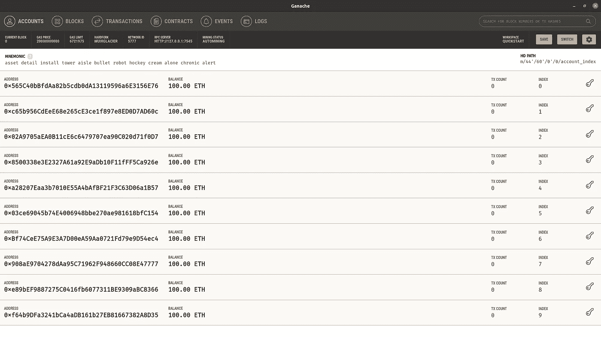
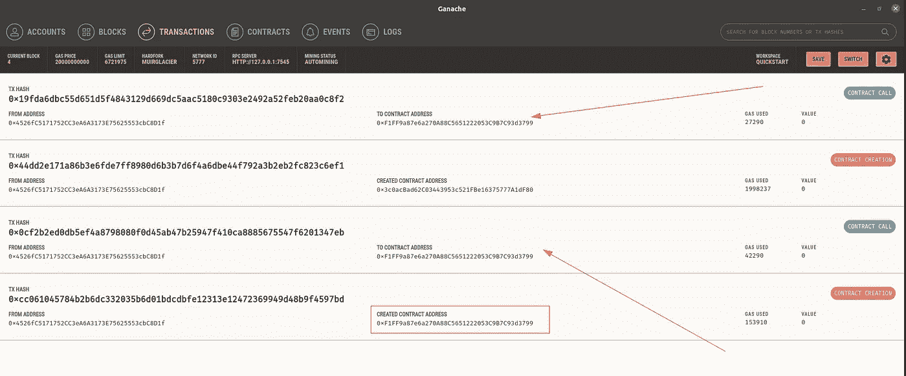

# 我的第一个 20 元代币

> 原文：<https://medium.com/coinmonks/my-first-erc20-token-7d5d16632818?source=collection_archive---------2----------------------->

# 介绍

我开发的令牌是一个名为$MTK 的 ERC20 令牌，实现了 EIP-20 令牌标准:[https://eips.ethereum.org/EIPS/eip-20.](https://eips.ethereum.org/EIPS/eip-20.)

我们可以说 ERC20 是以太坊改进提案 EIP-20 的标准实现，但是这个定义在形式上可能不正确。

无论如何，重要的是，ERC20 标准可能是以太坊上最常用的可替换令牌标准，以太坊区块链上开发的大多数令牌都是 ERC20 令牌(例如$LINK、$USDT、$SHIB、$BAT 等等)。

世界“可替换”意味着任何$MTK 代币与任何其他$MTK 代币具有相同的价值。这与标准法定货币的情况相同，例如 1 欧元硬币与流通中的所有 1 欧元硬币具有相同的价值。

在接下来的部分中，我将分析智能合约的源代码，这些智能合约实现了 ERC20 令牌$MTK 的所有功能。智能合同是用 Solidity 编程语言编写的，几乎所有的功能都继承自 OpenZeppelin 库，因此将对该库的源代码进行分析。

OpenZeppelin 网站:【https://openzeppelin.com/ 

最后，我们将在本地区块链上部署智能合约进行测试，并从一个钱包到另一个钱包进行$MTK 的交易。

令牌源代码可以在 Github Repo 上找到:【https://github.com/lucadidomenico/myERC20Token 

# ERC20.sol 和 IERC20.sol

ERC20 令牌标准的实现包含在 OpenZeppelin 的 ERC20.sol 和 IERC20.sol 源文件中。

具体来说，IERC20.sol 接口定义了 ERC20 函数，而 ERC20.sol 实现了这些函数。

IERC20.sol:

```
pragma solidity ^0.8.0;interface IERC20 {
    // returns the amount of token in circulation.
    function totalSupply() external view returns (uint256); //returns the balance of an account, i.e. the amount of token the account owns.
    function balanceOf(address account) external view returns (uint256); //send amount of token to the recipient address
    function transfer(address recipient, uint256 amount) external returns (bool); //returns how much the owner of the token has allowed another account to transfer the token he owns. (ignore for now)
    function allowance(address owner, address spender) external view returns (uint256); //the owner of tokens allows another account to transfer the token he owns by amount (ignore for now)
    function approve(address spender, uint256 amount) external returns (bool); //transfer token from one account to another. The owner of the token is not the calling address (ignore for now)
    function transferFrom(address sender, address recipient, uint256 amount) external returns (bool); // event emitted during a transfer (ignore for now)
    event Transfer(address indexed from, address indexed to, uint256 value);

    // event emitted during an approval (ignore for now)
    event Approval(address indexed owner, address indexed spender, uint256 value);}
```

ERC20.sol:

```
// SPDX-License-Identifier: MIT
pragma solidity ^0.8.0;
import "./IERC20.sol";
import "./extensions/IERC20Metadata.sol";
import "../../utils/Context.sol";contract ERC20 is Context, IERC20, IERC20Metadata {[ . . . ]
```

以下三个函数也是 ERC20 的一部分，但没有在 IERC20.sol 中声明:

```
// returns the name of the token i.e. MyToken
function name() public view virtual override returns (string memory);// return the symbol of the token i.e. MTK
function symbol() public view virtual override returns (string memory);// Returns the number of decimals used to get its user representation (see below).
function decimals() public view virtual override returns (uint8);
```

我不知道为什么 OpenZeppelin 决定不在 IERC20.sol 中声明这 3 个函数，而是直接在 ERC20.sol 智能契约中定义它们的具体原因。

您可以在这里找到源代码:

*   ierc 20 . sol:[https://github . com/lucadidomenico/myer C20 token/blob/master/node _ modules/% 40 open zeppelin/contracts/token/ERC 20/ierc 20 . sol # L1](https://github.com/lucadidomenico/myERC20Token/blob/master/node_modules/%40openzeppelin/contracts/token/ERC20/IERC20.sol#L1)
*   ERC 20 . sol:[https://github . com/lucadidomenico/myer C20 token/blob/master/node _ modules/% 40 open zeppelin/contracts/token/ERC 20/ERC 20 . sol # L1](https://github.com/lucadidomenico/myERC20Token/blob/master/node_modules/%40openzeppelin/contracts/token/ERC20/ERC20.sol#L1)

## 铸造。

_mint()函数是在 ERC20.sol 的第 251 行定义的。

```
function _mint(address account, uint256 amount) internal virtual {
[ . . . ]
    _totalSupply += amount;
    _balances[account] += amount;
[ . . . ]
}
```

_mint 函数创建新的代币“数量”,并增加总供应量。它将新令牌分配给调用该函数的“帐户”。此功能有助于保持总供应量与铸币账户余额(按金额增加)之间的同步，并且在增加 ERC20 代币的总金额时应始终使用。

## 燃烧。

在 ERC20.sol 的第 274 行定义了 _burn()函数。

```
function _burn(address account, uint256 amount) internal virtual {
[ . . . ]
    uint256 accountBalance = _balances[account];
    unchecked {
        _balances[account] = accountBalance - amount;
    }
    _totalSupply -= amount;
[ . . . ]
}
```

_burn()函数与 _mint()函数正好相反。事实上，这是为了减少代币的总供应量。代币金额将从帐户余额中扣除。当开发人员执行此操作时，通常会导致剩余令牌的价格上涨。铸币则相反，通常会降低代币的价格。

## 在账户之间转移代币。

值得注意的是，当在账户之间转移代币时，在区块链上发生的唯一交易是合约调用。事实上，当将令牌从一个帐户转移到另一个帐户时(通过使用 transfer()或 transferFrom())，令牌合约所做的只是更新其自己的内部变量“_balances”，该变量包含每个帐户拥有的令牌数量。这显示在下面的代码片段中。

ERC20.sol:35

```
mapping(address => uint256) private _balances;
```

“_balances”变量包含每个地址拥有的令牌数量，以无符号整数表示。

ERC20 smartcontract 的 transfer()函数更新了这种映射，如以下代码所示。

```
function _transfer(address sender, address recipient, uint256 amount    ) internal virtual {
[ . . . ]
    uint256 senderBalance = _balances[sender];
    require(senderBalance >= amount, "ERC20: transfer amount exceeds balance");
    unchecked {
        _balances[sender] = senderBalance - amount;
    }
    _balances[recipient] += amount;
[ . . . ]
```

这是在 ERC20.sol 的第 220 行实现的 transfer()函数。

## 关于小数的一个注记。

您可能已经注意到了 ERC20.sol 中定义的以下函数:

```
function decimals() public view virtual override returns (uint8) {
    return 18;
}
```

它的目的是什么？

不幸的是，solidity 语言和 EVM 不支持浮点数数据类型:这意味着智能合约中的所有算术运算都发生在整数类型之间。但是如果要转 1.5 token 呢？这在可靠性上是不可能的，因此 EIP-20 令牌标准提供了小数属性，该属性定义了令牌必须考虑多少个 0。

例如，假设一个 EOA 人想向另一个 EOA 人转让 1.5 个代币。在钱包的用户界面中，它指定 1.5 个代币作为要转移的金额，但实际上转移的代币金额是 1.5 *小数。为了能够转移 1.5 代币，小数必须至少为 1，因为该数字只有一个小数位。

在 OpenZeppelin 中，小数默认设置为 18，因此在传输 1.5 令牌时，实际上计算是在 1.5*10 ⁸ = 15000000000000000 上进行的。

更多信息:(https://docs . open zeppelin . com/contracts/4 . x/ERC 20 # a-note-on-decimals)

# OpenZeppelin 扩展。

在部署智能合约之后，扩展为令牌管理提供了有用的实用工具。扩展是用 Solidity 语言实现的智能契约，是 OpenZeppein 库的一部分。我使用了这些扩展来为我的令牌提供以下功能:

*   动态铸造新代币；
*   疯狂燃烧的令牌；
*   动态暂停所有令牌的操作。

除了暂停，铸造和刻录功能已经在 ERC20.sol 智能合约中实现，那么为什么要在另一个合约中实现它们呢？因为 ERC20.sol 中的函数是*内部的*，所以在部署契约后不能调用它们。为了让一个函数被一个事务调用，这个函数必须被声明为 *public* 。

## 铸造

ERC 20 preset inter pauser . sol 契约提供了 public mint()函数，角色为 MINTER_ROLE 的帐户可以调用该函数来增加令牌的总供应量。

ERC 20 presetmentimpauser . sol:51

```
function mint(address to, uint256 amount) public virtual {
    require(hasRole(MINTER_ROLE, _msgSender()), "ERC20PresetMinterPauser: must have minter role to mint");
    _mint(to, amount);
}
```

网址:[https://github . com/lucadidomenico/myerc 20 token/blob/master/contracts/mytokenerc 20 . sol # L1](https://github.com/lucadidomenico/myERC20Token/blob/master/contracts/MyTokenERC20.sol#L1)

public mint()函数调用 ERC20.sol 的 internal _mint()函数。

## 燃烧的

ERC20Burnable.sol 契约提供了 public burn()函数，角色为 BURNER_ROLE 的帐户可以调用该函数，以减少令牌的总供应量。

ERC20Burnable.sol:19

```
function burn(uint256 amount) public virtual {
    _burn(_msgSender(), amount);
}
```

URL:[https://github . com/lucadidomenico/myer C20 token/blob/master/node _ modules/% 40 open zeppelin/contracts/token/er C20/extensions/er C20 burnable . sol # L1](https://github.com/lucadidomenico/myERC20Token/blob/master/node_modules/%40openzeppelin/contracts/token/ERC20/extensions/ERC20Burnable.sol#L1)

## 暂停

通过从 ERC20Pausable.sol 继承，ERC 20 preset inter pauser . sol 契约提供了暂停所有令牌传输的 pause()函数，直到调用 unpause()为止。这对于在评估期结束前阻止交易，或者在出现重大错误时使用紧急开关冻结所有令牌传输等情况非常有用。

ERC 20 presetmentimpauser . sol:65

```
function pause() public virtual {
    require(hasRole(PAUSER_ROLE, _msgSender()), "ERC20PresetMinterPauser: must have pauser role to pause");
    _pause();
}
```

ERC 20 presetmentimpauser . sol:79

```
function unpause() public virtual {
    require(hasRole(PAUSER_ROLE, _msgSender()), "ERC20PresetMinterPauser: must have pauser role to unpause");
    _unpause();
}
```

契约 Pausable.sol 定义了 _pause 变量:

```
bool private _paused;
```

它最初在构造函数中被设置为“false”。

```
constructor() {
    _paused = false;
}
```

并通过调用公共函数“pause()”和“unpause()”进行更新。

Pausable.sol:74

```
function _pause() internal virtual whenNotPaused {
    _paused = true;
    emit Paused(_msgSender());
}
```

Pausable.sol:86

```
function _unpause() internal virtual whenPaused {
    _paused = false;
    emit Unpaused(_msgSender());
}
```

# 访问控制

在 myERC20Token 中，使用 OpenZeppelin 库的 AccessControl.sol 智能契约实现了基于角色的访问控制机制([https://en.wikipedia.org/wiki/Role-based_access_control](https://en.wikipedia.org/wiki/Role-based_access_control))。

角色授权帐户调用令牌智能合约中的特定功能。帐户可以有 0 个或多个角色。

## 定义角色。

MyTokenERC20 实现中定义了三个角色:

*   燃烧器角色
*   Minter 角色
*   Pauser 角色

在 ERC 20 preset inter Pauser . sol 智能契约的第 26 行和第 27 行定义了 Minter 和 Pauser 角色。

```
bytes32 public constant MINTER_ROLE = keccak256("MINTER_ROLE");
bytes32 public constant PAUSER_ROLE = keccak256("PAUSER_ROLE");
```

Burner 角色在 MyTokenERC20.sol 智能契约的第 9 行定义。

```
bytes32 public constant BURNER_ROLE = keccak256("BURNER_ROLE");
```

## 使用角色。

使用第 49–54 行定义的“_roles”映射和“RoleData”结构将角色保存在 AccessControl.sol 智能协定中。

```
[ . . . ]
abstract contract AccessControl is Context, IAccessControl, ERC165 {
    struct RoleData {
        mapping(address => bool) members;
        bytes32 adminRole;
    }
    mapping(bytes32 => RoleData) private _roles;
[ . . . ]
```

在上面的代码中，“RoleData”结构包含一个地址和一个布尔值之间的映射。AccessControl 智能协定的“_roles”成员是角色和拥有该角色的帐户之间的映射。给定一个帐户和一个角色，您可以通过查看“RoleData”的“members”字段来测试该帐户是否具有该角色。这就是“hasRole”函数在 AccessControl.sol 的第 83 行所做的事情。

```
function hasRole(bytes32 role, address account) public view override returns (bool) {
    return _roles[role].members[account];
}
```

最后，“RoleData”中的字段“adminRole”包含该角色的管理角色。事实上，在 OpenZeppelin 的访问控制机制实现中，对于每个角色都有一个 admin 角色:具有 admin 角色的帐户拥有向所有帐户授予或撤销该角色的权限。

例如:假设 BURNER_ROLE 角色的管理角色称为 BURNER_ADMIN_ROLE。帐户 A 具有 BURNER_ADMIN_ROLE 角色。因此，帐户 A 可以向令牌的任何帐户授予和撤销 BURNER_ROLE 角色，包括他自己。

## 授予和撤销角色。

在上一节中，我们已经遇到了 AccessControl.sol 的函数 grantRole()和 revokeRole()。顾名思义，这些函数分别用于向帐户授予角色和撤销角色。请记住，只有该角色的管理员角色才能授予或撤销其他帐户的角色。然而，也可以在智能合同创建期间分配角色，即在构建器中；在这种情况下，使用了 internal : _setupRole()函数。

```
constructor(string memory name, string memory symbol) ERC20(name, symbol) {
    _setupRole(DEFAULT_ADMIN_ROLE, _msgSender());
    _setupRole(MINTER_ROLE, _msgSender());
    _setupRole(PAUSER_ROLE, _msgSender());
}
```

ERC 20 preset inter PAUSER 智能合同的构建者将 DEFAULT_ADMIN_ROLE、MINTER_ROLE 和 PAUSER_ROLE 分配给合同的创建者。然后调用 AccessControl.sol 的 _setupRole()函数

```
function _setupRole(bytes32 role, address account) internal virtual {
    _grantRole(role, account);
}
```

该函数又调用 internal _grantRole()函数。

```
function _grantRole(bytes32 role, address account) private {
    if (!hasRole(role, account)) {
        _roles[role].members[account] = true;
        emit RoleGranted(role, account, _msgSender());
    }
}
```

## 检查帐户的角色以授权 smart contract 上的操作。

为了检查帐户是否具有执行特定操作的角色，使用了 require()函数。它有两种用途:

*   通过在特权函数的函数体内直接调用 require()；
*   通过在修饰符中定义 require()语句并在特权函数中包含修饰符。

我更喜欢“修饰”的方式，因为我认为这样更不容易出错。

MyTokenERC20.sol:16

```
function burn(uint256 value) public onlyRole(BURNER_ROLE) override {
    super._burn(msg.sender, value);
}
```

在 OpenZeppelin 库中，两种方法都被使用。具体来说，ERC 20 preset inter pauser . sol 使用第一种方法，而 AccessControl.sol 使用第二种方法，如下面的代码片段所示。

ERC 20 presetmentimpauser . sol:51

```
function mint(address to, uint256 amount) public virtual {
    require(hasRole(MINTER_ROLE, _msgSender()), "ERC20PresetMinterPauser: must have minter role to mint");
    _mint(to, amount);
}
```

ERC 20 presetmentimpauser . sol:65

```
function pause() public virtual {
    require(hasRole(PAUSER_ROLE, _msgSender()), "ERC20PresetMinterPauser: must have pauser role to pause");
    _pause();
}
```

ERC 20 presetmentimpauser . sol:79

```
function unpause() public virtual {
    require(hasRole(PAUSER_ROLE, _msgSender()), "ERC20PresetMinterPauser: must have pauser role to unpause");
    _unpause();
}
```

访问控制. sol:129

```
function grantRole(bytes32 role, address account) public virtual override onlyRole(getRoleAdmin(role)) {
    _grantRole(role, account);
}
```

访问控制. sol:142

```
function revokeRole(bytes32 role, address account) public virtual override onlyRole(getRoleAdmin(role)) {
    _revokeRole(role, account);
}
```

## 关于 TimeLock 的注意事项。

请注意，OpenZeppelin 还提供了一种时间锁机制来执行安全策略，特别是可以使用这种机制来防止管理员执行恶意任务。但是我没有在 myERC20Token 中实现这个机制，因为…

例如，合法项目可以使用 timelock 安全机制来防止“拉地毯”骗局。

网址:[https://youtu.be/VlIcoKJsIP8?t=349](https://youtu.be/VlIcoKJsIP8?t=349)

# MyTokenERC20.sol

我个人实现的基础契约是 MyERC20Token.sol，由几行代码组成，因为我们已经看到了所有的功能都是在 OpenZeppelin 库中实现的，该契约包括了这些功能。

具体来说，该文件包括 ERC 20 preset interpauser . sol 协定，该协定又包括 ERC 20 . sol。ERC 20 preset interpauser . sol 还包括 AccessControlEnumerable、ERC20Burnable 和 ERC20Pausable，这些智能协定提供了前面几节中介绍的功能。

下面是 MyTokenERC20.sol 的源代码。

```
// contracts/MyTokenERC20.sol
// SPDX-License-Identifier: MIT
pragma solidity ^0.8.0;import "@openzeppelin/contracts/token/ERC20/presets/ERC20PresetMinterPauser.sol";contract MyTokenERC20 is ERC20PresetMinterPauser { bytes32 public constant BURNER_ROLE = keccak256("BURNER_ROLE");constructor(uint256 initialSupply) ERC20PresetMinterPauser("MyToken", "MTK") {
        _mint(msg.sender, initialSupply);
        grantRole(BURNER_ROLE, msg.sender);
    } function burn(uint256 value) public onlyRole(BURNER_ROLE) override {
        super._burn(msg.sender, value);
    } fallback() external payable { revert(); }
}
```

源代码可以在这里找到:[https://github . com/lucadidomenico/myerc 20 token/blob/master/contracts/mytokenerc 20 . sol](https://github.com/lucadidomenico/myERC20Token/blob/master/contracts/MyTokenERC20.sol)

## 合同分析。

MyERC20Token.sol 在第 9 行定义了 BURNER_ROLE 角色。

```
bytes32 public constant BURNER_ROLE = keccak256("BURNER_ROLE");
```

拥有此角色的帐户可以刻录代币，从而减少流通中的代币总数。

我的令牌的构造者在第 11 行。

```
constructor(uint256 initialSupply) ERC20PresetMinterPauser("MyToken", "MTK") {
    _mint(msg.sender, initialSupply);
    grantRole(BURNER_ROLE, msg.sender);
}
```

我们将部署的令牌称为“MyToken ”,符号为 MTK。构造函数将 BURNER_ROLE 分配给智能合约的创建者(即 msg.sender)。构造函数接受一个参数，这是令牌的总供应量，用 uint256 [表示。](https://docs.openzeppelin.com/contracts/4.x/erc20-supply#fixed-supply).)为了分配初始供应量，使用了合同 ERC20.sol 提供的 _mint()函数。

契约在第 16 行定义了 burn()函数。

```
function burn(uint256 value) public onlyRole(BURNER_ROLE) override {
    super._burn(msg.sender, value);
}
```

具有 BURNER_ROLE 角色的帐户可以“刻录”令牌。为了检查调用函数 burn()的帐户是否具有正确的角色，它使用了“onlyRole”修饰符。帐户从其余额中燃烧令牌，因此当燃烧令牌时，帐户余额必须> =燃烧的令牌数量，并且 ERC20.sol 的 _burn()函数中的第 280 行中的这一行进行检查:

```
require(accountBalance >= amount, "ERC20: burn amount exceeds balance");
```

最后，契约在第 21 行实现了 fallback()函数。

```
// REJECT any incoming ether
fallback() external payable { revert(); }
```

Solidity 中的 fallback()函数是在事务中没有数据或声明的函数名的情况下调用的函数。在这种情况下，我实现了这个函数，以防止在智能契约中永远锁定以太。例如，如果一个帐户要向另一个帐户发送以太网，但错误地在目的地址中插入了合同的地址，以太网将被永远锁定，没有人可以从合同中撤销它们，因为合同不提供任何“撤销”功能。为了防止这种情况，fallback()函数调用 revert()，从而取消事务并保存调用者的乙醚。

## 在区块链以太坊部署 myERC20Token

智能合约可以部署在不同的网络上。主以太网被称为“mainnet ”,在那里你使用真正的以太网，所以是真正的货币。为了测试智能合约，开发者可以使用其他以太坊测试网络。“Ropsten”是以太坊上的主要测试网络，它提供了一个与主区块链工作方式相同的环境。另一个有效的测试方法是使用“ganache”区块链，这是一个运行在本地主机上的以太坊区块链。

出于演示目的，我将在“ganache”上部署 myERC20Token，您可以从以下 URL 下载:

[](https://www.trufflesuite.com/ganache) [## 加纳切|松露套房

### 部署契约，开发您的分散式应用程序(dapps ),并对智能契约进行测试。可作为…

www.trufflesuite.com](https://www.trufflesuite.com/ganache) 

下载完成后，运行 ganache 二进制文件。它显示以下页面:


单击“Quickstart Ethereum”按钮，ganache 将实例化一个新的区块链，它运行在本地主机的 7545 端口上。



在上面的截图中，你可以看到 ganache 创建了 10 个新钱包，每个钱包都有 100 ETH 的余额。

“ganache”软件是“truffle suite”的一部分，后者本质上是一个 node.js 框架，帮助开发人员部署智能合约，并通过使用 web3.js JavaScript 库与它们进行交互。

松露网站:

[](https://www.trufflesuite.com/) [## 智能合约的绝佳工具| Truffle 套件

### 智能合同使 SWEETER 成为世界一流的开发环境、测试框架和资产管道，适用于…

www.trufflesuite.com](https://www.trufflesuite.com/) 

为了部署令牌，从 github repo([https://github.com/lucadidomenico/myERC20Token](https://github.com/lucadidomenico/myERC20Token))克隆令牌源代码，并在 repo 目录中运行以下命令:

```
$ npm install
$ truffle deploy --network ganache
```

truffle 的输出显示了有关事务的信息:

```
Compiling your contracts...
===========================
> Everything is up to date, there is nothing to compile.Starting migrations...
======================
> Network name:    'ganache'
> Network id:      5777
> Block gas limit: 6721975 (0x6691b7)1_initial_migration.js
======================Replacing 'Migrations'
   ----------------------
   > transaction hash:    0xcc061045784b2b6dc332035b6d01bdcdbfe12313e12472369949d48b9f4597bd
   > Blocks: 0            Seconds: 0
   > contract address:    0xF1FF9a87e6a270A88C5651222053C9B7C93d3799
   > block number:        1
   > block timestamp:     1638093841
   > account:             0x4526fC5171752CC3eA6A3173E75625553cbC8D1f
   > balance:             99.9969218
   > gas used:            153910 (0x25936)
   > gas price:           20 gwei
   > value sent:          0 ETH
   > total cost:          0.0030782 ETH> Saving migration to chain.
   > Saving artifacts
   -------------------------------------
   > Total cost:           0.0030782 ETH2_deploy_all.js
===============Replacing 'MyTokenERC20'
   ------------------------
   > transaction hash:    0x44dd2e171a86b3e6fde7ff8980d6b3b7d6f4a6dbe44f792a3b2eb2fc823c6ef1
   > Blocks: 0            Seconds: 0
   > contract address:    0x3c0acBad62C03443953c521FBe16375777A1dF80
   > block number:        3
   > block timestamp:     1638093841
   > account:             0x4526fC5171752CC3eA6A3173E75625553cbC8D1f
   > balance:             99.95611126
   > gas used:            1998237 (0x1e7d9d)
   > gas price:           20 gwei
   > value sent:          0 ETH
   > total cost:          0.03996474 ETH> Saving migration to chain.
   > Saving artifacts
   -------------------------------------
   > Total cost:          0.03996474 ETHSummary
=======
> Total deployments:   2
> Final cost:          0.04304294 ETH
```

两笔交易花费的 ETH 为 0.04304294 ETH。

我们可以看到部署了 2 个合同:迁移和 MyTokenERC20。

迁移是由 truffle 提供的一个智能合约，帮助管理所有其他智能合约的部署。Migrations.sol 智能合同具有以下源代码:

```
// SPDX-License-Identifier: MIT
pragma solidity >=0.4.22 <0.9.0;contract Migrations {
    address public owner = msg.sender;
    uint public last_completed_migration;modifier restricted() {
        require(
        msg.sender == owner,
        "This function is restricted to the contract's owner"
        );
        _;
    }function setCompleted(uint completed) public restricted {
        last_completed_migration = completed;
    }
}
```

有关迁移的更多信息，请参见 truffle 的文档:[https://www . truffle suite . com/docs/truffle/getting-started/running-migrations](https://www.trufflesuite.com/docs/truffle/getting-started/running-migrations)

基本上，当您使用“truffle deploy”命令部署智能合约时，您首先要对迁移智能合约进行事务处理，如上面的屏幕截图所示。



## 与智能合同交互

为了使用 web3.js 与部署的智能合约进行交互，请运行以下命令:

```
$ truffle console --network ganache
```

这将打开一个控制台，您可以在其中使用 web3.js 发布 JavaScript 代码。例如，现在我将从一个帐户(收到 10 ⁸ MyTokenERC20 总供应量的帐户)转移 1000 个令牌到另一个帐户。该帐户在“帐户”数组中可用:

```
truffle(ganache)> accounts
[ '0x4526fC5171752CC3eA6A3173E75625553cbC8D1f',
  '0xB4545da269dF6835507D58B14f10B451885c42Ed',
  '0x8b40A9E295a87b95336dC2426BC6b473FC86884C',
  '0xB33BC04b589F7c3D0d5E70eB3aaC9702e35ca93e',
  '0x59b68A348eb5cF437ef8DDA473bAaD3C1EF6488C',
  '0x8843d4e156e3E30FFa951488A6F918fD3028d1C3',
  '0xEa7d08C13e5041a8fe0A9dce562dA41B1DDC66b7',
  '0xF69eE5d9F65F130fB4805E881014B6E429ca0EAC',
  '0x44936B4aeBc137b1CC4D9fF2389cc15606D2E4D3',
  '0x69A8432E6720d4B4a642b6e7217DaB741F5e0133' ]
```

为了与 MyTokenERC20 智能合约进行交互，我们需要一个实例。

```
truffle(ganache)> var mytoken = await MyTokenERC20.deployed()
undefined
```

如果我们在 mytoken 上调用 balanceOf() ERC20 方法，我们可以看到帐户的余额。

账户余额[0]:

```
truffle(ganache)> mytoken.balanceOf(accounts[0]).then(a => a.toString())
'10000000000000000000000000'
```

帐户余额[1]:

```
truffle(ganache)> mytoken.balanceOf(accounts[1]).then(a => a.toNumber())
'0'
```

现在，我们从帐户[0]向帐户[1]发送 1000 个令牌:

```
truffle(ganache)> mytoken.transfer(accounts[1], 1000)
{ tx:
   '0xc0027840e5b740220e0a4de6f818284a7e9820f2e65701f512e6b605af1d37e7',
  receipt:
   { transactionHash:
      '0xc0027840e5b740220e0a4de6f818284a7e9820f2e65701f512e6b605af1d37e7',
     transactionIndex: 0,
     blockHash:
      '0x98d5711d55ac91d5a1db685f2d42d6b85ada8015d212ad84c05f4ed54ab439c8',
     blockNumber: 5,
     from: '0x4526fc5171752cc3ea6a3173e75625553cbc8d1f',
     to: '0x3c0acbad62c03443953c521fbe16375777a1df80',
     gasUsed: 52354,
     cumulativeGasUsed: 52354,
     contractAddress: null,
     logs: [ [Object] ],
     status: true,
     logsBloom:
      '0x00000000000000000000000000000800000000000000000000000801000000000000000000000000000000000000000000000000000000000000000000000000000000000000000000400008000000000000000000000000000000000000000000000000000000000000000000000000000000000000000000000010000000000000000000000000000000000000000000000000000000000000000000000000000000000000000000000008000000000000000000000000000000000000001000000012000000000000000000000000000000000000000000000000000000000000000000000004000000000000000000000000000000000000004000000000',
     rawLogs: [ [Object] ] },
  logs:
   [ { logIndex: 0,
       transactionIndex: 0,
       transactionHash:
        '0xc0027840e5b740220e0a4de6f818284a7e9820f2e65701f512e6b605af1d37e7',
       blockHash:
        '0x98d5711d55ac91d5a1db685f2d42d6b85ada8015d212ad84c05f4ed54ab439c8',
       blockNumber: 5,
       address: '0x3c0acBad62C03443953c521FBe16375777A1dF80',
       type: 'mined',
       id: 'log_ca948418',
       event: 'Transfer',
       args: [Result] } ] }
```

事务细节在“tx”对象中返回。交易成功，余额现已更新。

账户余额[0]:

```
truffle(ganache)> mytoken.balanceOf(accounts[0]).then(a => a.toString())
'9999999999999999999999000'
```

帐户余额[1]:

```
truffle(ganache)> mytoken.balanceOf(accounts[1]).then(a => a.toString())
'1000'
```

> 加入 Coinmonks [电报频道](https://t.me/coincodecap)和 [Youtube 频道](https://www.youtube.com/c/coinmonks/videos)了解加密交易和投资

## 也阅读

[](/coinmonks/leveraged-token-3f5257808b22) [## 杠杆代币[多头代币]终极指南

### 杠杆化令牌是具有杠杆化风险敞口的 ERC20 令牌，不考虑保证金、要求、管理…

medium.com](/coinmonks/leveraged-token-3f5257808b22) [](https://blog.coincodecap.com/crypto-exchange) [## 最佳加密交易所| 2021 年十大加密货币交易所

### 加密货币交易所的加密交易需要了解市场，这可以帮助你获得利润。之前…

blog.coincodecap.com](https://blog.coincodecap.com/crypto-exchange) [](https://blog.coincodecap.com/best-swap-platforms) [## 2021 年最佳加密交换平台| CoinCodeCap

### 如果我们看看今天的场景，许多加密货币交换平台提供了广泛的功能和深度…

blog.coincodecap.com](https://blog.coincodecap.com/best-swap-platforms) [](/coinmonks/top-5-crypto-lending-platforms-in-2020-that-you-need-to-know-a1b675cec3fa) [## 2021 年最佳加密借贷平台| 6 大比特币借贷平台

### 获得比特币和其他加密货币的最佳贷款利率

medium.com](/coinmonks/top-5-crypto-lending-platforms-in-2020-that-you-need-to-know-a1b675cec3fa) [](/coinmonks/crypto-trading-bot-c2ffce8acb2a) [## 2021 年最佳免费加密交易机器人

### 2021 年币安、比特币基地、库币和其他密码交易所的最佳密码交易机器人。四进制，位间隙…

medium.com](/coinmonks/crypto-trading-bot-c2ffce8acb2a) [](/coinmonks/best-crypto-signals-telegram-5785cdbc4b2b) [## 最佳 4 个加密交易信号电报通道

### 这是乏味的找到正确的加密交易信号提供商。因此，在本文中，我们将讨论最好的…

medium.com](/coinmonks/best-crypto-signals-telegram-5785cdbc4b2b) [](https://blog.coincodecap.com/bitsgap-review) [## 获取信号、交易机器人和套利

### 在本文中，我们将回顾 Bitsgap，这是一个满足您所有交易需求的一站式加密交易平台。它…

blog.coincodecap.com](https://blog.coincodecap.com/bitsgap-review) [](https://blog.coincodecap.com/best-telegram-channels) [## 40 个最佳电报频道，用于加密、电影、表演和演讲| CoinCodeCap

### 随着我们周围无限的信息，我们很难筛选和了解有价值的信息。电报有…

blog.coincodecap.com](https://blog.coincodecap.com/best-telegram-channels)