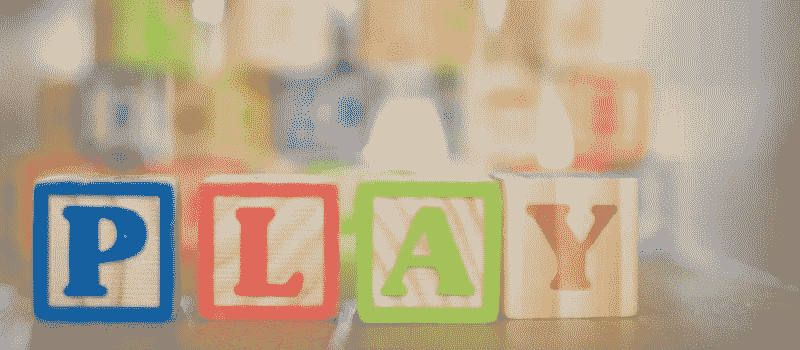
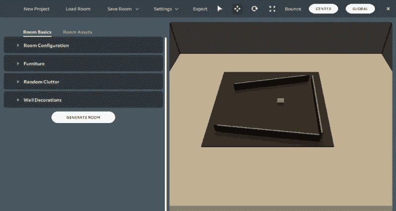
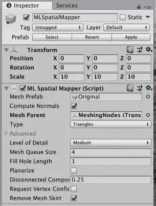
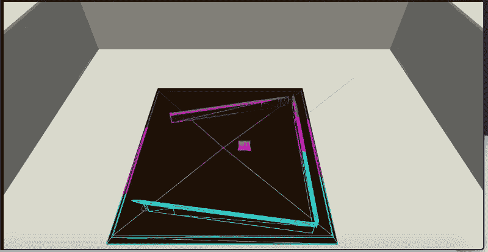

# 我的第一个“真正的”Magic Leap 项目:第 1 部分

> 原文：<https://medium.com/coinmonks/my-first-real-magic-leap-project-part-1-de047aeaa65?source=collection_archive---------5----------------------->

## 探索构建更复杂的 *Magic Leap* ( *Unity* )应用；在这个例子中是一个简单的桌面游戏。

已经编写了许多简单的 *Magic Leap* 应用程序，试图尝试一个利用了许多 *Magic Leap* 特性的更复杂的应用程序；记录我一路上的经历。

**注**:已完成的应用程序可供[下载](https://github.com/larkintuckerllc/bounce/releases/download/0.1.0/Bounce.zip)；在整个系列中，通过 *Git* [存储库](https://github.com/larkintuckerllc/bounce)中的各个分支可以获得代码中的增量变化。该系列中使用的房间可以在下载的*虚拟房间生成器*文件夹中找到。

应用程序将假设(将使用模拟器)用户在一个中间有桌子的房间里。这张桌子将有三块长积木。

使用应用程序…

1.  用户首先将定义建立网格的区域；围着桌子
2.  接下来，用户将在桌子周围走动，以构建桌子和桌子上的项目的完整网格
3.  用户最后将在桌子上放置一个虚拟球，并朝特定方向发射它。我们的目标是让球尽可能多地从木块上弹起。

**先决条件**

在开始构建一个更实际的 *Magic Leap* 项目之前，你需要先了解*Hello Cube；就那个话题写了一篇短文。*

 [## 开箱 Magic Leap 开发(Mac 上的 Unity)

### 随着增强现实(AR)和最近的混合现实(MR)的大肆宣传，我决定投身于…

medium.com](/@johntucker_48673/unboxing-magic-leap-development-unity-on-a-mac-8d8c7d474e3b) 

一个额外的步骤是将 *Magic Leap Unity 包*导入到您的 *Unity* 项目中；我写了一系列文章来描述这一点，并使用了许多 Magic Leap 的特性。

 [## magic Leap(Mac 上的 Unity)示例:第 1 部分

### 我们从一个与 Magic Leap 控制器交互的简单示例开始这个系列。

medium.com](/coinmonks/magic-leap-unity-on-a-mac-by-example-part-1-fc3188f0e964) 

**虚拟房间生成器**

由于我们中的许多人目前还没有 *Magic Leap One* 设备，我们需要使用 [*虚拟房间生成器*](https://creator.magicleap.com/learn/guides/tools-virtual-room-generator) 来设置我们的房间；在这种情况下，我们需要一个有一些积木的桌子。

**注**:我后来把桌子中间的“豆包”去掉了。

观察结果:

*   这将需要一些试验和错误，以产生一个合适的随机房间来建造；想不出如何在不随机生成最大数量*随机杂物*的房间的情况下添加桌上的物品

**啮合**

许多其他的 *Magic Leap* 功能，例如，手势、平面探测等。，只是在名称空间 *UnityEngine 中作为简单的类公开。实验. XR.MagicLeap* 。在尝试了两次解构*神奇跳跃*的例子后，*啮合*看起来更加复杂。

幸运的是， *Magic Leap* 已经提供了关于该主题的教程: [*啮合简介— Unity 版*](https://creator.magicleap.com/learn/tutorials/introduction-to-meshing-unity-r-edition) 。

观察结果:

*   这个教程很大程度上依赖于使用一个预置，*Assets/magic leap/Examples/Prefabs/MLSpatialMapper*；同样，我们将遵循这种方法(即使使用示例代码作为我们应用程序的依赖项会让人感觉不舒服)
*   在幕后，预设依赖于一个复杂的脚本，这是一个低级的 *Unity* 类 *UnityEngine。XR . magic leap . mlspatialmapper*
*   使用 Magic Leap 需要理解的一件重要事情是，颜色的亮度是它的透明度；不使用 Unity 的透明性(解释如下)

> Magic Leap 使用基于光线的加色空间。因为黑色是没有光的，所以它呈现为透明的。如果在其他数字内容前面看到一个黑色对象，它会被认为掩盖了后面的内容。如果你想创造出显示黑色或更深颜色的错觉，你必须用光线包围黑色区域。在小区域中，透明效果不太明显，但是在大区域中，您会注意到透明度。

*—魔法飞跃—* [*颜色*](https://creator.magicleap.com/learn/guides/design-color)

**缺少 MLSpatialMapper API 参考**

虽然 *MLSpatialMapper* 预置是作为示例代码提供的(因此在 *Magic Leap API 参考*中没有记录)，但它显然应该被视为一个 API:

*   无论是 *Magic Leap 的* [*啮合入门— Unity 版*](https://creator.magicleap.com/learn/tutorials/introduction-to-meshing-unity-r-edition) 和 [*啮合示例*](https://creator.magicleap.com/learn/guides/sdk-example-meshing) 都靠它
*   它的底层脚本 *UnityEngine。XR . magic leap . mlspatialmapper*异常复杂(作为一个隐藏库交付)

预设可以通过修改其*变换*和 *ML 空间映射器(脚本)*组件来配置。

最相关的组件设置有:

*   *Transform* 组件定义了一个立方体区域(单位为米),在该区域中，映射器找到(真实世界)对象以映射到网格对象中。因为 *Magic Leap One* 硬件，大概只能映射出对它可见的东西(而且摄像头在前面)；将这个立方体区域设置在 *Magic Leap One* 硬件之前是有意义的
*   启用 *ML 空间映射器*组件可以创建网格对象；同样，禁用它也会禁用创建
*   ML 空间映射器>网格预设属性定义了创建网格对象时使用的预设；例如，可能想要在预设上设置物理材质
*   *ML 空间映射器>网格父对象*属性定义游戏对象，在其中添加网格对象作为子对象

使用 *MLSpatialMapper* prefab 相当于实例化它并创建一个空的游戏对象(并将其分配给实例的 *ML Spatial Mapper* 组件的 *Mesh Parent* 属性)。

**接下来的步骤**

在下一篇文章中， [*我的第一个“真正的”Magic Leap 项目:Part 2*](/@johntucker_48673/my-first-real-magic-leap-project-part-2-571d1017cda2) ，我们将控制啮合过程。