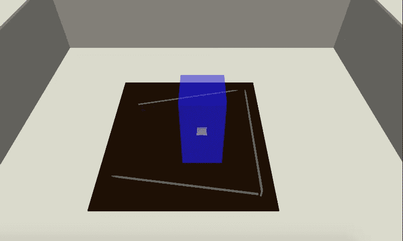
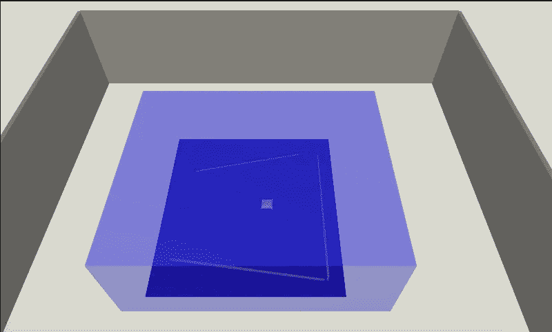
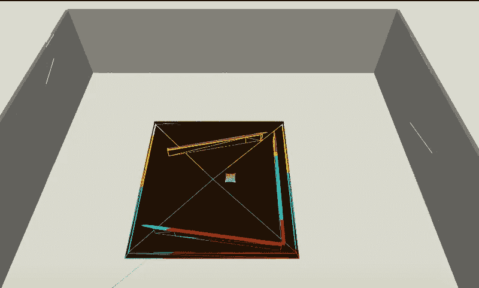

# 我的第一个“真正的”Magic Leap 项目:第 2 部分

> 原文：<https://medium.com/coinmonks/my-first-real-magic-leap-project-part-2-571d1017cda2?source=collection_archive---------5----------------------->

## 我们实现了许多应用程序状态来构建网格。

本文是从我的第一个“真正的”Magic Leap 项目开始的系列文章的一部分:第一部分 。

**构建网格**

当使用 *MLSpatialMapper* 时，可以观察到其*变换*组件定义了网格对象将被构建**和保留**的体积。考虑到这一点，应用程序的第一步是让用户定义这个卷。

应用程序开始时 *MLSpatialMapper* 被禁用，并处于*定位*状态，用户使用控制器(左手)定位半透明的蓝色立方体。

通过用右手给出一个 *Ok* 手姿势，用户将状态改变为*缩放*，其中用户使用控制器(在左手)来缩放立方体。

通过用右手给出一个 *Ok* 手姿势，用户改变状态为*啮合；*隐藏立方体并启用 *MLSpatialMapper。*此时， *MLSpatialMapper* 将开始在体积中建立网格对象。

**注**:在模拟器中，网格对象的构建与用户的视野无关；就硬件而言，我认为它们只有在需要的时候才会被制造出来。

实现这个功能相当于在场景中创建一个半透明的蓝色立方体( *MeshingZone* )，移除不必要的 *Box Collider* 组件，并添加以下组件。

*Assets/Table/meshing zone . cs*

观察结果:

*   将所有的实现放在一个文件中是非常简单的
*   这个文件中的关注点(应用程序状态、输入、hands、立方体和 *MLSpatialMapper* )的数量已经有点多了
*   当我们添加额外的游戏组件时；继续使用这种方法将无法很好地扩展

**状态管理**

在这一点上，很明显，在前进之前实施状态管理策略是至关重要的。

通过一点研究( *Google* )和查看 *Magic Leap 的* [*Dodge*](https://creator.magicleap.com/learn/guides/magickit-dodge-project-files) 例子，一个流行的状态管理策略是使用有限状态机。这里的挑战是，似乎每个人都有自己的实现。

同样，我已经使用从 web 开发中借用的概念实现了一个类似的模式( [*Redux*](https://redux.js.org/) )，并将继续使用这种方法。

 [## Unity:从 Web 开发中借鉴的声明式方法

### 通过示例，我们探讨了编写声明性 Unity 代码的相关问题。最后，我们展示了一个受启发的模式…

medium.com](/@johntucker_48673/unity-declarative-approach-borrowed-from-web-development-5f66ff179217) 

**下一步**

在下一篇文章中， [*我的第一个“真正的”Magic Leap 项目:第 3 部分*](/@johntucker_48673/my-first-real-magic-leap-project-part-3-4691a7fc8329) ，我们使用类似于 *Redux* 的状态管理策略重构当前的实现。