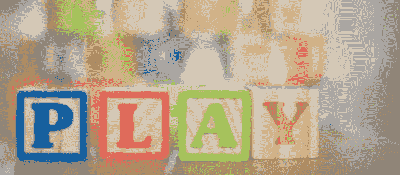

# 我的第一个“真正的”魔术飞跃计划:第 3 部分

> 原文：<https://medium.com/coinmonks/my-first-real-magic-leap-project-part-3-4691a7fc8329?source=collection_archive---------5----------------------->

## 用类似*的状态管理来重构前面的例子。*

本文是多部分系列文章的一部分，从 [*我的第一个“真正的”魔法飞跃计划:第一部分*](/@johntucker_48673/my-first-real-magic-leap-project-part-1-de047aeaa65) 开始。

本文的完整应用程序可从 bounce repository 的 [*part3*](https://github.com/larkintuckerllc/bounce/tree/part3) 分支下载。

**类似还原的状态管理**

我们继续使用状态管理策略重构前面的例子。我们的应用程序强烈借鉴了以下文章。

 [## 统一:更多类似 Redux 的模式

### 探索一种健壮且易于故障诊断的方法来管理整个 Unity 应用程序的应用程序状态。

medium.com](/@johntucker_48673/unity-more-redux-like-patterns-abe7500519f3) 

第一步是捕获我们先前存储在私有字段 *_state* 中的内容，即*定位、缩放、网格划分*等，在全局状态下:

*   *方式*:An*enum；*定位、*定标*或*啮合*之一

此外，因为*网格区域*游戏对象的位置和比例是*空间映射器*游戏对象所需要的，所以我们将它们暴露在全局状态下。

*   *MZPositionX* :游戏对象*网格区域*x 位置的一个*int*；将 x 乘以 100 并截断
*   *MZPositionZ* :网游区游戏对象 z 位置的一个*点*；将 z 乘以 100 并截断
*   *MZScaleX* :一个 *int* 的 x 刻度的*网游区*游戏对象；将 x 乘以 100 并截断
*   *MZScaleZ* :游戏对象的 z 标尺中的一个*int**网格区域*；将 z 乘以 100 并截断

最后，*啮合区*游戏对象需要控制器上触摸板的 x 和 y 位置。

*   *TouchX* :控制器上触摸板 x 位置的一个*int*；将 x 乘以 10 并截断
*   *触摸*:控制器上触摸板 y 位置的一个*int*；将 y 乘以 10 并截断

一旦我们定义了全局状态，我们就把游戏对象连接起来，观察状态相关部分的变化。

**代码**

为了提供必要的结构，添加了相当数量的样板代码；例如，以下文件定义了全局*模式*状态。

*资产/鸭子/模式. cs*

然后我们连线游戏对象来观察状态的变化；例如*啮合区*观察*模式*、*触摸式*、*触摸式*。

*Assets/Table/meshing zone . cs*

与我们之前的例子不同，我们**而不是**维护游戏对象之间的引用；相反，我们通过全球国家分享信息

通过这种方法，我们将单个游戏对象上的代码分散到多个集中的游戏对象上:

*   *InputHandler* :将控制器的触摸 x 和 y 值存入 *TouchX* 和 *TouchY*
*   *KeyPoseHandler* :使用*模式*，根据手势更新*模式*
*   *MLSpatialMapper* :使用*模式，PositionX、PositionZ、ScaleX* 和 *ScaleZ* ，设置其位置、刻度和启用状态。这是对通过提供的 *MLSpatialMapper* 脚本(来自上一篇文章)提供的网格构建功能的补充
*   *MeshingZone* :使用 *Mode* 、 *TouchX* 和 *TouchY* ，更新其位置、比例，并将其位置和比例存入 *PositionX、PositionZ、ScaleX* 和 *ScaleZ*

**下一步**

在下一篇文章 [*中，我的第一个“真正的”Magic Leap 项目:第 4 部分*](/@johntucker_48673/my-first-real-magic-leap-project-part-4-6da95d631acf) 中，我们实现了允许用户识别网格上的一个点(稍后放置一个球)的功能。