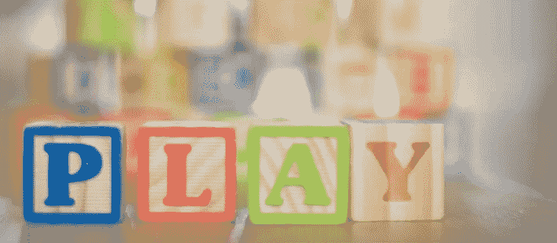
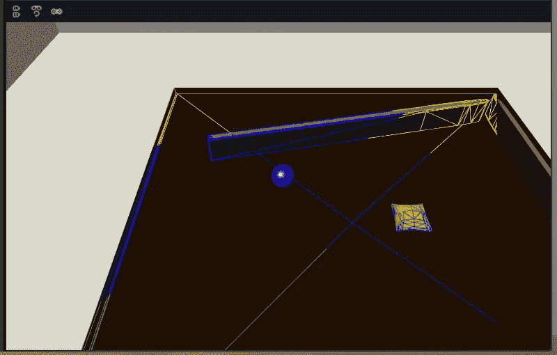
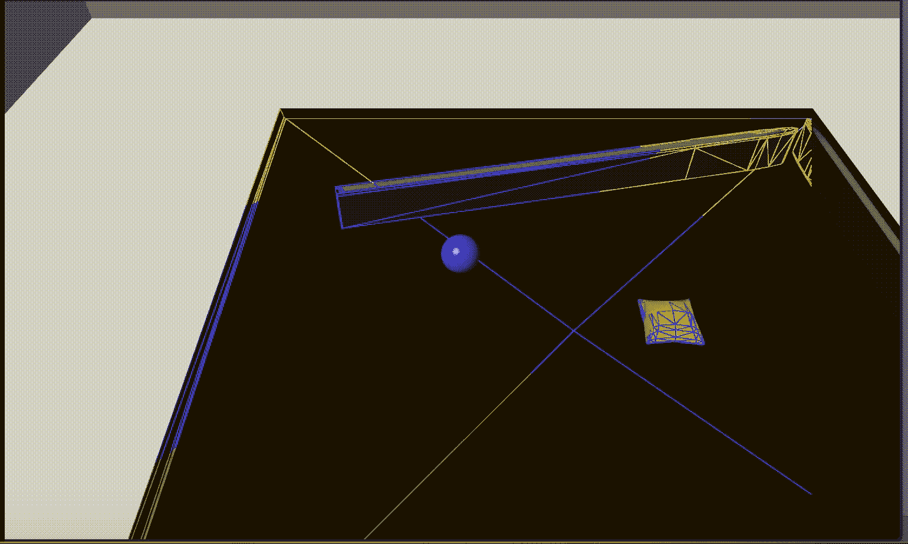

# 我的第一个“真正的”Magic Leap 项目:第 4 部分

> 原文：<https://medium.com/coinmonks/my-first-real-magic-leap-project-part-4-6da95d631acf?source=collection_archive---------7----------------------->

## 我们实现了*放置*模式

本文是从我的第一个“真正的”Magic Leap 项目 [*开始的系列文章的一部分:第 1 部分*](/@johntucker_48673/my-first-real-magic-leap-project-part-1-de047aeaa65) 。

本文的完整应用程序可以从 bounce 资源库的 [*part4*](https://github.com/larkintuckerllc/bounce/tree/part4) 分支下载。

**重新重构**

虽然 *Redux* 模式在(大多数)web 开发情况下工作良好，但我开始重新考虑在 *Unity* 中将它用于**所有**状态。特别是，在最后一个例子中，我们将*网格区域*的位置和比例更新为全局状态。这种方法的问题是这些更新发生得非常快，每秒可达 60 次，我们真的不希望在这些更新中运行大量额外的代码。

因此，在这种情况下，我们可以通过简单地在 *MLSpatialMapper2* 中创建一个对 *MeshingZone* 的引用来使用全局状态。然后我们可以去掉所有与网格区域位置和规模相关的全局状态，例如 *MLPositionX* 。

*Assets/Table/mlspatialmapper 2 . cs*

**放置**

现在我们继续实现下一个模式， *Placement* ，其中用户将一个球放在桌子上(网格)。球的位置基于用户的头部姿势(相机位置和方向)。

当用户移动他们的头时，球会慢慢地跟踪到一个新的位置。

通过用右手给出 *Ok* 手的姿势，球的位置被锁定。

**代码**

新的全局状态包括:

*   *放置*:球放置的位置；存储为三个整数(一个自定义的*三元组*类)。使用整数是因为不能可靠地比较浮点数是否相等
*   *PlacementValid* :布尔型，表示放置位置是否有效，即在桌子(网格)上

头部姿态(*主摄像机*)设置*放置*和*放置有效*全局状态。

*Assets/Table/main camera . cs*

观察结果:

*   球的放置基于 *Unity 物理学。光线投射*；而不是*魔跃*MLWorldRays。这是因为我们已经创建了网格
*   出于性能方面的考虑，我们将强制转换限制为每秒仅发生一次

*球*使用*模式、位置和位置有效*全局状态来控制自身

*Assets / Table / Ball.cs*

观察结果:

*   我们将目标位置存储在私有变量 *_position* 中，并使用*向量 3。向*方法移动，慢慢将球定位
*   下一个模式是*瞄准*；我们从把球扔进锁定位置开始

**下一步**

在本系列的下一篇文章中， [*我的第一个“真正的”Magic Leap 项目:第 5 部分*](/@johntucker_48673/my-first-real-magic-leap-project-part-5-c65f137e7f61) ，我们实现其余的*目标*模式(和*动作*模式)。